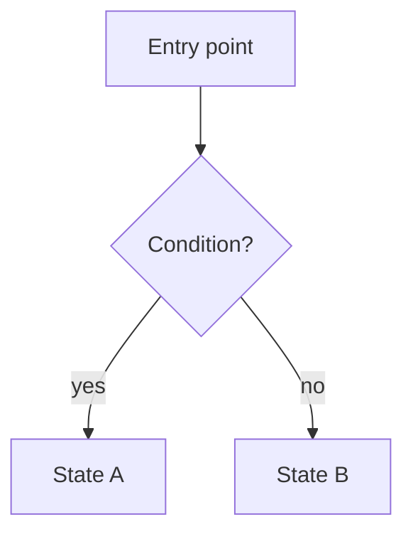

Non-trivial features and aggregates carry a **product spec** as a colocated `README.md`. It describes _what_ the code
does and _why_ — the behaviour a product owner or a new contributor needs to understand — and deliberately leaves out
_how_ it is wired (store names, samples, file maps). The spec is the single source of product truth, kept in the repo so
both people and AI agents find it the moment they open the folder.

## Why specs live next to the code

- **Discoverable.** A `README.md` in the feature folder is the first thing read on navigation — by a reviewer, a new
  teammate, or an AI agent about to change the code. No wiki to hunt through.
- **Reviewed with the change.** When the spec ships in the same PR as the code, reviewers approve behaviour and
  implementation together, and the spec cannot silently drift from reality.
- **A shared contract.** The spec is what the author and the implementer (human or AI) agree on before the code is
  final. It captures intent that the code alone cannot.

## Where it lives

One `README.md` per feature or aggregate folder, colocated with the code:

```
src/renderer/aggregates/<name>/README.md
src/renderer/features/<name>/README.md
```

Worked example: `src/renderer/aggregates/multisig-operation-description/README.md`.

All specs are indexed in the **Feature Map** — `src/renderer/features/README.md` — a curated list of every feature and
aggregate grouped by product area. Documented modules link to their spec; trivial modules are marked
`(no spec planned)`; every spec links back with a `> Part of the [Feature Map](...)` line right after its title. When
adding or renaming a module, or adding a spec, update the map in the same change; `pnpm check:feature-map` verifies the
map is in sync (it also runs in CI) and prints the current coverage.

## When to write or update one

- **New feature / aggregate** with user-visible behaviour or non-obvious rules → write a spec.
- **Materially changing behaviour** of an existing one (new states, new gating, a changed flow) → update its spec in the
  same change.
- **Skip** for trivial, presentation-only, or purely mechanical modules (a styled wrapper, a pure formatter, a rename).
  When in doubt, a short spec beats none.

## The workflow (author ↔ implementer)

The spec is a deliverable, not an afterthought. For AI-assisted work the loop is:

1. **Draft first.** Before or alongside the implementation, draft the spec from the agreed requirements — states,
   scenarios, lifecycle.
2. **Get approval.** Present the draft to the person who owns the feature and confirm it matches intent _before_
   finalizing the code. Disagreements are cheaper to resolve in prose than in code.
3. **Ship together.** Commit the spec with the code change it describes. A behaviour change without a spec update is an
   incomplete change.
4. **Re-read on touch.** When later modifying the feature, read its spec first and reconcile any contradiction between
   spec and code before proceeding.

## What goes in (and what stays out)

**In** — product-level, English, concise:

- **Overview** — what the feature is and the problem it solves.
- **Who / when** — preconditions, permissions, the audience.
- **States & scenarios** — every visible state and the rule that produces it.
- **Lifecycle** — the happy path from entry to outcome, and notable failures.
- **Related** — adjacent flows or backend contracts that shape behaviour.
- **Diagrams** — `mermaid` flowcharts / sequence diagrams render on GitHub and the docs site; use them when a picture
  beats a paragraph.

**Out** — implementation detail that the code already documents: Effector store names, `sample` graphs, file-by-file
maps, import-cycle notes, internal helper signatures. Those belong in code comments, not the spec.

## Template

````markdown
# <Feature name>

> Part of the [Feature Map](../README.md)

## Overview

What this feature is, the problem it solves, and the one-line behaviour summary.

## Who can use it / when it applies

Preconditions, permissions, audience.

## States / scenarios

Each visible state and the rule that triggers it. A decision diagram helps:



| State | When it appears | What the user sees |
| ----- | --------------- | ------------------ |
| ...   | ...             | ...                |

## Lifecycle

The happy path from entry to outcome; notable failure handling.

## Related

Adjacent flows, backend contracts, or constraints that shape the behaviour.
````

Match the depth to the feature — a small feature needs only Overview + States. The backlink path shown is for
`features/<name>/`; from `aggregates/<name>/` it is `../../features/README.md`.
