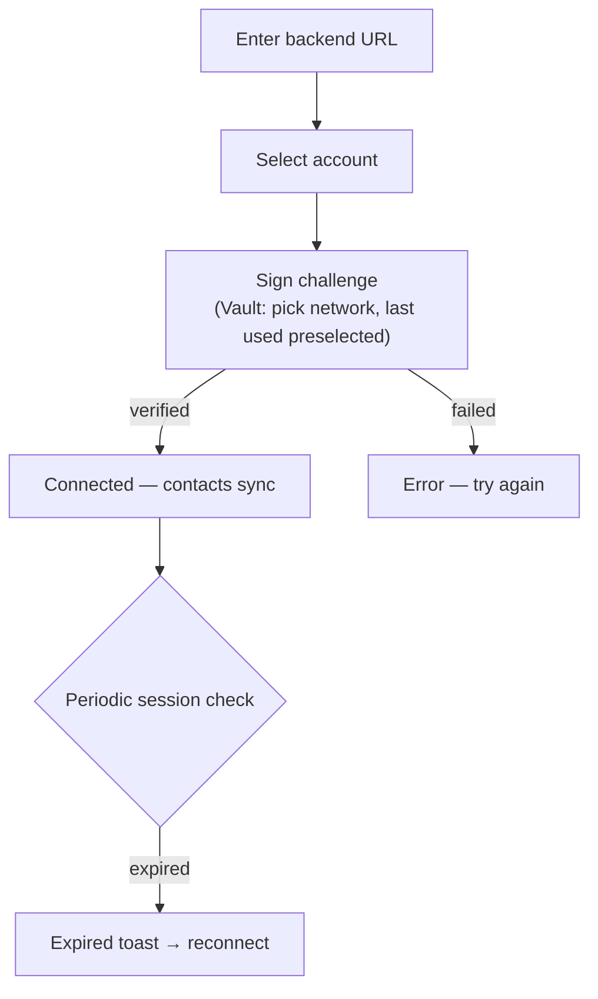

# Address book backend connection & authentication

> Part of the [Feature Map](../../features/README.md) — Last reviewed: 2026-07-28

## Overview

Lets the user connect Nova Spektr to a self-hosted address-book backend and prove account ownership by signing a
challenge. Once authenticated, contacts sync with the backend; the aggregate keeps the session alive and surfaces expiry
or network issues.

## Who can use it / when it applies

- Reached from the address book via the backend configuration modal (add or edit a backend URL).
- Signing requires at least one signable account: a Polkadot browser-extension account or a Polkadot Vault account.

## States / scenarios

| State             | When it appears                                | What the user sees                                                                          |
| ----------------- | ---------------------------------------------- | ------------------------------------------------------------------------------------------- |
| URL entry         | Modal opened with no backend or while editing  | URL input with live reachability probe (checking / reachable / unreachable / wrong backend) |
| Account selection | URL is valid and the user is not yet connected | Account select, preselected with the previously used account when known                     |
| Signing           | Connect pressed                                | Signing flow; for Vault accounts also a network selector (see below)                        |
| Connected         | Session is live and the URL is unchanged       | Connected account with a disconnect action                                                  |
| Error             | Challenge or signature verification failed     | Error alert with a "try again" action                                                       |
| Session expired   | Background health check loses the session      | Toast with a reconnect shortcut                                                             |

### Account preselection

The account select preselects, in order: the currently authenticated account, the account of the last live session, or
the account used for the last successful sign-in on this device.

- The device-level preference survives disconnects and sign-outs — reconnecting preselects the account the user signed
  in with before, instead of the first account in the list; it only changes when a later sign-in succeeds with a
  different account.
- If the remembered account is no longer signable in the app, the selector falls back to the first account in the list.

### Signing network selection

Vault accounts sign on a specific network, so the signing step shows a network selector (networks listed in the same
order as everywhere in the app: Polkadot group, Kusama group, others, testnets).

- **First-ever pairing**: the selector defaults to the Polkadot relay chain.
- **After a successful sign-in**: the network used is remembered on this device and preselected on every later pairing
  or re-connection — users whose keys live on another network (e.g. Asset Hub) pick it once instead of on every login.
- The remembered preference survives disconnects and sign-outs; it only changes when a later sign-in succeeds on a
  different network.
- If the remembered network is no longer available in the app (removed from the chains config), the selector falls back
  to the Polkadot relay chain.

## Lifecycle

A successful sign-in stores the session, remembers the account and network for next time, and closes the modal. Clearing
the URL disconnects and logs out; the remembered account and network preferences are kept for the next pairing.

## Related

- Challenge/verify contract with the address-book backend (`domains/backend`).
- Message signing flow (`features/operations/OperationMessageSign`).
