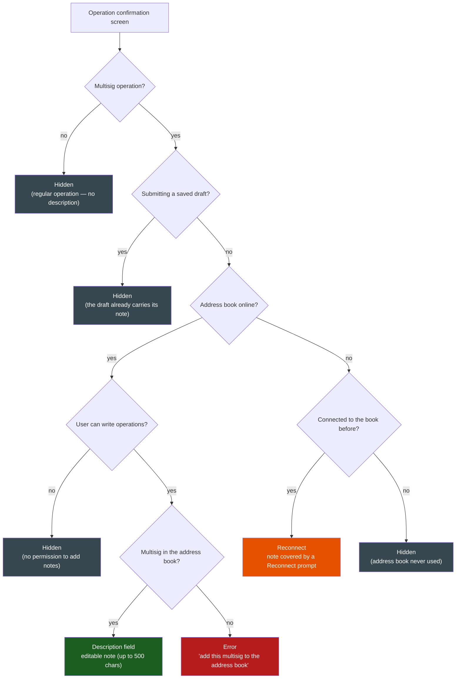
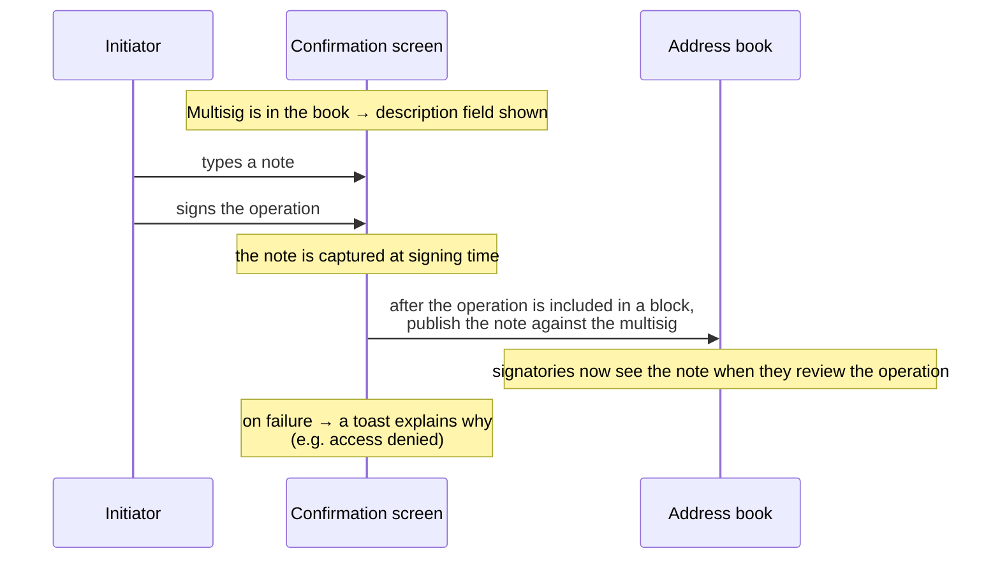

# Multisig Operation Description

> Part of the [Feature Map](../../features/README.md) — Last reviewed: 2026-06-11

## Overview

An **operation description** is a short note the initiator of a multisig operation attaches on the confirmation screen.
Once the operation is included in a block, the note is published to the shared address book and stored against the
multisig account, so the other signatories see the operation's context when they review and approve it.

The description input appears on every operation confirmation screen, but it only shows up when it can actually be saved
and read back by others. The feature decides this automatically — the user never sees a dead input or hits an avoidable
error.

## Who can post a description

Descriptions live in the shared address book, which authorizes a write when **all** of the following hold:

- the user has the **"write operations"** permission;
- the multisig is a **known contact** in the address book;
- the multisig is **reachable** by the user — i.e. they are connected to it as an owner, proxy, or co-signer (which is
  exactly what makes a contact visible to them).

Because contact visibility and write access are governed by the same relationship, the rule simplifies to: **if the
multisig is in your address book, you can describe its operations.** If it isn't, the address book rejects the note, so
the feature surfaces that as an error instead of letting the user type into a field that will fail.

## States of the description area

The confirmation screen shows one of four states, chosen from the operation and the user's address-book connection.

| State         | When it appears                                                                                  | What the user sees                                                                                       |
| ------------- | ------------------------------------------------------------------------------------------------ | -------------------------------------------------------------------------------------------------------- |
| **Field**     | Multisig operation, online, user can write operations, multisig is in the address book           | An editable note (up to 500 characters)                                                                  |
| **Error**     | Same as above, but the multisig is **not** in the address book                                   | An inline error showing the multisig and asking to add it to the address book / contact an administrator |
| **Reconnect** | Multisig operation, address book offline, but the user has connected before                      | The note is disabled and covered by a **Reconnect** prompt                                               |
| **Hidden**    | Not a multisig, a draft submission, no write permission while online, or the book was never used | Nothing is shown                                                                                         |

**Why an error instead of silently hiding.** When the user is online and allowed to write notes, a missing multisig is a
fixable situation — someone needs to add the multisig to the address book. The feature names the exact multisig and
points to the fix, rather than quietly dropping the field.

**Why the permission check only applies online.** The "write operations" permission is only known while the user is
connected. Offline, the feature can't tell, so it keeps the Reconnect prompt; after reconnecting it re-evaluates and
hides the note if the user turns out to lack the permission.

## Lifecycle

The note is captured at the moment of signing and published only after the operation successfully lands on-chain. It is
**not** posted if the note is empty, the operation isn't a multisig, or a draft submission is in progress (drafts
publish their own note).

## Related description paths

Operation descriptions are also written from two other flows, governed by the same address-book authorization:

- **Approving someone else's operation** — the approver is a signatory, so the multisig is always reachable; no extra
  address-book check is needed.
- **Submitting a saved draft** — the note comes from the draft itself, which is why this feature hides its own field
  during a draft submission.
