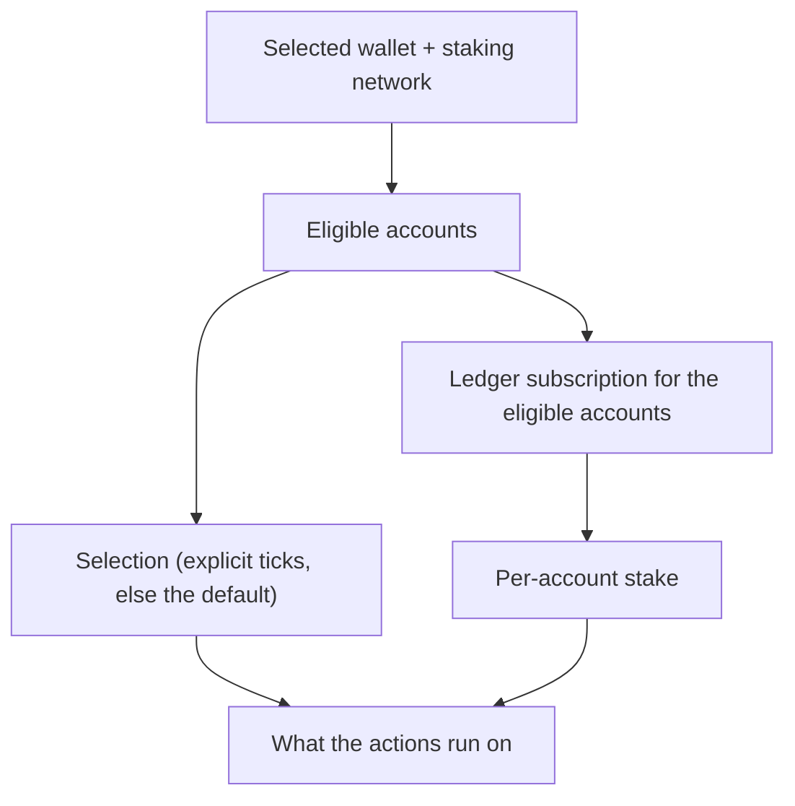

# Staking Accounts

> Part of the [Feature Map](../../features/README.md) — Last reviewed: 2026-08-04

## Overview

Who the classic Staking page is about. It answers three questions for that page: which of the selected wallet's accounts
can stake on the selected network, which of them the actions operate on, and what each of them currently has bonded.

Everything here is scoped to the **one** network chosen on the Staking page (owned by `staking-network`). The
dashboard's multi-chain view is a different aggregate and deliberately shares nothing with this one.

## Who can use it / when it applies

- The Staking page only. It follows the globally selected wallet, so switching wallets re-scopes it entirely.
- An account appears only if the chain can actually hold it — the key scheme and the account's own chain binding both
  have to allow it.
- **A Polkadot Vault base account is dropped as soon as the wallet has derived keys.** The base account shadows its own
  shards; showing both would offer the same stake twice.

## States / scenarios

| State                 | When it appears                                                | What the user sees                                  |
| --------------------- | -------------------------------------------------------------- | --------------------------------------------------- |
| No eligible accounts  | The wallet holds nothing this chain can stake with             | An empty account list; every action disabled        |
| Loading               | The ledger read for the eligible accounts has not answered yet | Amounts render as skeletons; actions stay disabled  |
| Ready, nothing bonded | The ledger answered and no account has a stake                 | Zeroed rows; only "Start staking" is offered        |
| Ready, bonded         | At least one account has a ledger                              | Per-account stake and rewards; the matching actions |

**Loading is about the app's own progress, never about the answer.** The ledger subscription writes an entry for every
requested account, unbonded ones included, so "this account stakes nothing here" is a real answer rather than an
unfinished read. A selection with no eligible accounts is not loading either — there is nothing to wait for.

## The default selection

Staking actions operate on the ticked accounts, and the page ticks some for the user:

| Wallet                                                           | Default                                        |
| ---------------------------------------------------------------- | ---------------------------------------------- |
| Any wallet with exactly one eligible account                     | That account                                   |
| Multisig, proxied, Nova Wallet, WalletConnect, browser extension | The first account — they sign with exactly one |
| Multishard vault with several shards                             | Nothing — the user picks                       |

A multishard vault is the only case left unselected: choosing which shards to act on is a real decision, and its rows
carry checkboxes for exactly that. Everywhere else there is nothing to choose between, so leaving the selection empty
would only disable the page.

**An explicit tick wins over the default, but only while it still exists.** The selection is derived from the account
list rather than latched when the wallet changes: accounts arrive asynchronously — from storage for the wallet, from the
network config for the chain — and a selection computed once, before they landed, would stay empty forever. That was a
real bug: on a single-account wallet the row carries no checkbox, so the user could not correct it by hand and every
staking action stayed disabled behind "Select accounts".

## Lifecycle

The ledger subscription is keyed by (chain, accounts) and re-opened whenever that pair changes; `reset` releases it. It
is only opened once there is a chain, a connected api and at least one eligible account — there is nothing to ask
otherwise.

## Related

- `staking-network` — owns the selected network, its api and connection state.
- [`staking-validators`](../staking-validators/README.md) — the elected set for the same network, for the validator
  picker.
- `wallet-select` — the selected wallet and its accounts, which everything here derives from.
