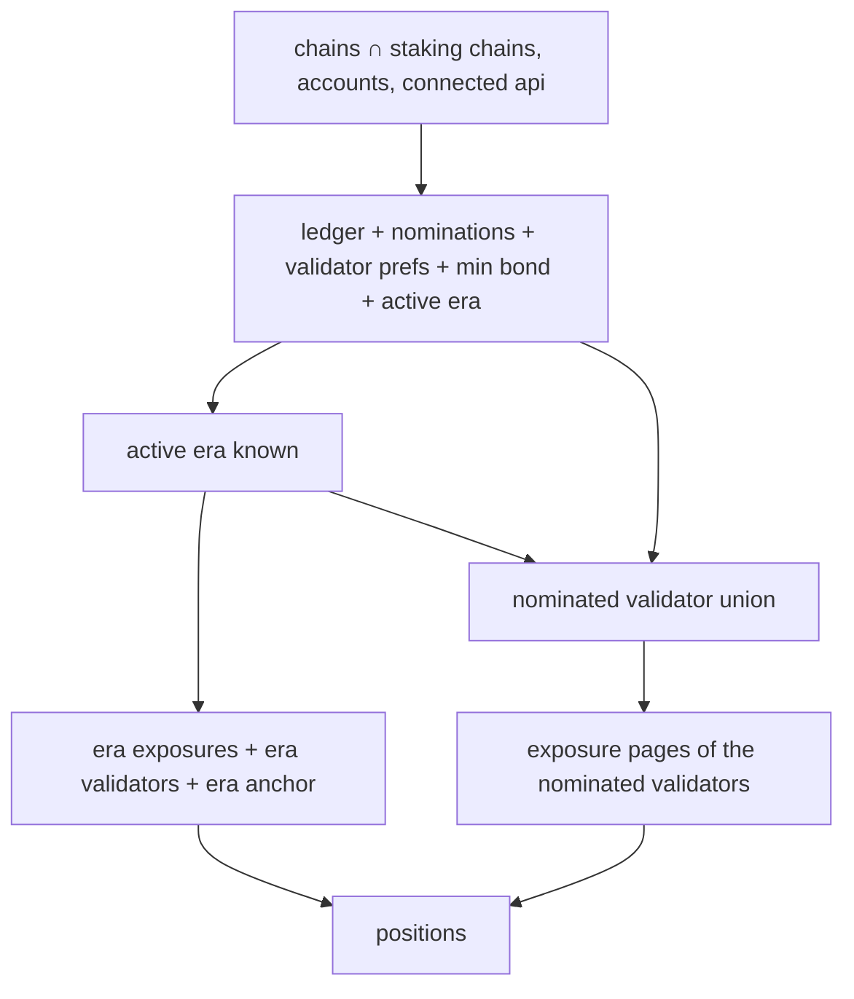

# Staking Positions

> Part of the [Feature Map](../../features/README.md) — Last reviewed: 2026-08-24

## Overview

The single source of truth for **what the dashboard's account selection has staked, everywhere at once**. It answers
three questions for the staking dashboard: which positions exist, what each of them is worth and earning, and whether
the app is still finding out.

A **position** is one bonded ledger of one account on one staking chain — its stake, what is unbonding, what can be
withdrawn right now, and one of two kinds. A **nominator** position carries what it nominates and which of those
validators actually back it in the active era; a **validator** position carries the stash's own terms (commission,
whether it accepts nominations) and its active-era standing (self stake, total stake, nominator count, era points). The
aggregate assembles positions from the staking domain's on-chain reads and hands the dashboard finished rows plus the
totals its KPI cards show.

## The multi-chain rule

This aggregate is deliberately **not** scoped to a selected network. The old Staking page works one chain at a time
(that selection lives in `aggregates/staking-network`); the dashboard shows Polkadot Asset Hub and Kusama Asset Hub as
rows of one flat table, so everything here is computed per **(chain × account)** and merged.

The chain list is **every Asset Hub the running configuration actually knows about** — the app's staking chain constants
intersected with the chains loaded from the network config. This matters: Westend Asset Hub exists only in dev configs,
so it must appear for developers and stay absent in production without anyone maintaining a second list. The code this
replaces hardcoded a Polkadot + Kusama pair and silently dropped Westend; that is the bug this rule exists to prevent.

Accounts follow the same per-chain logic: a wallet account is included on a chain only when its key scheme and its own
chain binding allow it — the same availability rule the Staking page applies, so the two views never disagree about
whose stake is whose.

## The selection, not the wallet

The aggregate answers for **exactly the account ids it is given**, and nothing else. The dashboard hands its account
selection over with `selectAccountIds(ids)`, which _replaces_ the set. That selection is **not a wallet**: it spans
every wallet of the installation and the address book, and the wallet selected in wallet management plays no part —
switching wallets there must not change a single row of the staking tab. Reading the selected wallet's accounts here was
the bug this rule exists to prevent: the tab showed the accounts of one wallet plus whatever address-book rows were
ticked, and ticking an account of another wallet did nothing.

Each selected id is resolved against the installation's own account objects:

- **A wallet account** — any local account object with that key — joins a chain when at least one of those objects is
  available on it (the same key can live in several wallets: chain-bound in one, universal in another). No wallet-level
  rule applies on top: the picker lists accounts one by one, so a ticked account is wanted as-is, a Polkadot Vault base
  account included.
- **An address-book row** has no account object, so the full availability check has nothing to run against. Its **key
  scheme** is a property of the `AccountId` itself, and it is checked: an Ethereum-style 20 byte address cannot be a
  stash on an `AccountId32` chain, so it never joins one. A position derived from it is a position like any other; what
  makes it different is only what the row can _do_ — with no local account behind it, the dashboard resolves it to the
  `draft` access mode.

That check is not a nicety. The chain does **not** politely answer "no ledger" for a key it cannot decode: the ledger
read asks for every account in one `staking.bonded.multi` batch, and one unencodable key rejects the **whole batch**. A
single EVM address book row therefore used to leave every chain's ledger map empty, which reads as "answered nothing" —
and since a chain stays pending until its map covers every requested account, the entire staking dashboard sat in a
permanent skeleton for every account of every chain. Selections mixing EVM and Substrate addresses are ordinary, so this
is the normal case, not an edge one.

Beyond the scheme, the chain still decides by simply having no ledger for the address. The set is deduplicated and
sorted, so an address selected twice (a wallet account that is also a contact) is subscribed once.

**The cost is bounded by the selection, never by the wallet list or the address book.** Every selected id widens the
ledger, nominations and validator-prefs subscriptions of every staking chain (it is part of their keys, so changing the
set retires the old key and opens the new one). The set is therefore exactly what the user has selected on the dashboard
right now: the staking widgets replace it whenever the selection changes and release it on unmount. Nothing ever
subscribes for every wallet or the whole contact list.

**Many wallets at once is the normal case, not an edge one.** A selection of fifty accounts is one `bonded.multi` +
`ledger.multi` pair per chain, one `nominators.multi`, one `validators.multi` — batched reads whose cost grows with the
selection, not with the number of wallets. What does grow is downstream: the union of nominated validators (the exposure
pages read) and the per-stash unclaimed-payout scans. Those reads are memoised per `(chain, era, validator)` and
`(chain, era)` in the staking domain, so widening the selection only reads what the previous selection did not.

## Nominator or validator

Every account that can hold a ledger is also asked whether it registered as a validator, and **current intent wins**:
live validator prefs on chain make the position a validator, nominations make it a nominator, a ledger with neither is
merely bonded. The two never mix — a validator position lists no nominations, a nominator position carries no validator
facts.

The prefs question is answered by **existence, not by value**. Registering as a validator with 0% commission stores
exactly the chain's default entry, so a plain value read cannot tell that validator from an account that never
registered — the read has to see whether the entry exists at all, and only a present entry makes a validator. Getting
this wrong in either direction mislabels real accounts: 0%-commission validators are common, and "everyone is a
validator" is what a naive default-decoding read reports.

One case overrides the intent rule: a validator that **chilled mid-era** has no prefs on chain anymore but is still in
the era's validator set — still elected, still earning, its nominators still attached. Membership in that set upgrades
an intent-less (non-nominating) stash to a validator for the rest of the era, and the era entry then supplies the
commission the live prefs no longer can. Era facts are looked up by the ledger's **stash**, so a position tracked
through a legacy controller account still resolves its validator standing.

A validator's status ladder is shorter than a nominator's: `active` means elected into the era's validator set,
`waiting` means registered but not elected, and `unknown` means that set has not been read yet — the same anti-flicker
rule as the nominator ladder, a verdict is never shown before the data that proves it. `inactive` and `bonded` are
unreachable — elected means exposed, and there is no validator equivalent of "elected but dropped out" — so a validator
position never carries a status reason. The era-scoped facts (self stake, total stake, nominator count, era points) are
`null` until the stash is elected and the era set has been read; consumers show "no data" rather than zeros.

## What it exposes

| Store                  | What it answers                                                                                 |
| ---------------------- | ----------------------------------------------------------------------------------------------- |
| `$stakingChains`       | Which staking chains this installation has, in a stable order                                   |
| `$chainAccounts`       | Which of the selected accounts are eligible on each of them                                     |
| `$selectedAccountIds`  | The dashboard selection, set by `selectAccountIds`, released when the last consumer leaves      |
| `$positions`           | Every position of the selection, across all chains                                              |
| `$summary`             | Per-chain and overall totals: staked, redeemable, unbonding, active validators, position counts |
| `$minNominatorBond`    | The minimum bond required to nominate, per chain                                                |
| `$nominatedValidators` | The union of validators nominated on each chain — also what the exposure reads are scoped to    |
| `$pending`             | Whether the first load is still in flight                                                       |

Planck amounts in `$summary` are **per chain, in that chain's asset**, and are never summed across chains — fiat
conversion is the caller's job. The overall figures are the ones that survive mixing assets: position counts and the
active-validator count.

**Active validators are counted per chain.** The same validator key elected on Polkadot and on Kusama is two validators,
so the overall count is the sum of the per-chain distinct sets, not a global set of keys.

Those rules live in one pure function, `summarizePositions(positions)`, which is what `$summary` maps over and is
exported alongside it. A consumer that narrows the selection further — the dashboard's KPI row follows its own account
picker on top of the selection — summarizes the subset with the same function instead of restating the rules.

`$summary.totalStaked` is the ledger's **total** — bonded plus everything still unbonding — matching what the dashboard
showed before this aggregate existed. `redeemable` and `totalUnbonding` split the unlocking chunks against the active
era, so they always add up to the unbonding part of that total.

## Loading and emptiness

`$pending` is about the app's own progress, never about the answer. A chain resolves the moment its ledger map lands:
the ledger subscription writes an entry for **every** requested account, empty ones included, so "this account stakes
nothing here" is a real answer rather than an unfinished load. Once at least one account is bonded, the chain stays
pending until its nominations **and validator prefs** cover every bonded account — otherwise a nominating position would
flash as merely _bonded_, and a validating one as a plain nominator.

The exposures deliberately do not join that wait, and answer for themselves instead. They are keyed by the nominated
validator set, so they cannot even be requested until the nominations land, and holding the whole table back for them
would withhold the stake, the share and the account over one slow read. `$positions` instead carries the position's
status as `unknown` until the exposure pages arrive — the aggregate passes `null` rather than an empty exposure map,
which `positionsService` tells apart, and the Status cell shimmers while the rest of the row is already usable. Passing
`{}` was the bug: it reads as "no validator backs this stash", so every nominating position wore a red `Inactive` pill
for the seconds in between.

Two things deliberately do **not** hold the dashboard hostage: a chain whose connection is disabled, and a chain whose
connection has errored. Both keep `$pending` false, because neither will ever produce data and a permanent spinner is
worse than a chain that is simply missing from the table.

**A subscription that fails still does hold it, and that is a known gap.** A connected chain whose ledger — or
nominations, or validator-prefs — subscription cannot be set up looks identical to one that has not answered yet: the
pooled resources carry no error state, only a cache entry that never arrives. `$pending` therefore cannot tell "failed"
from "loading" and shows a skeleton forever. Closing that needs an error signal in `shared/query`, not a change here;
until then, anything that can make a chain read throw is a permanent-skeleton bug, which is why the requests sent to a
chain must be valid by construction.

## Resource lifecycle

Everything is driven from Effector, not from React — the dashboard renders whatever is in the stores, and mounting a
component never starts a subscription.

- **(chain, accounts)** starts the ledger, nominations and validator-prefs subscriptions, the minimum bond, and the
  active-era subscription — only for chains that have a connected api and at least one eligible account.
- **(chain, era)** starts the era's exposure overviews, the era validator set (needed to explain _why_ an idle position
  earns nothing) and the era anchor that turns unbonding eras into dates.
- **(chain, era, nominated validators)** reads the exposure pages of exactly the validators the selection nominates —
  the only per-validator read expensive enough to be worth scoping.

The underlying resources are **ref-counted pools**: a start with a key already in flight joins the existing request
instead of duplicating it, so every start must be matched by a stop with the same key or the subscription outlives its
last consumer. All of it goes through one binding that diffs the desired request list against what is already started,
which gives the two properties that matter:

- **A new era retires the old one.** The era is part of every era-scoped key, so a new era produces a new key; the
  previous key is stopped in the same pass rather than left holding a refcount for the life of the app.
- **Live data does not churn subscriptions.** The nominations subscription re-emits on every block. The nominated-set
  union is therefore kept behind a content check, so an identical payload — or any unrelated store updating — never
  restarts the pooled exposure read. Only a genuinely different nomination set does.

`reset` stops every key the aggregate started, on every resource, and drops the selection with them. It does so by
declaring that the aggregate **wants nothing** — the request lists go empty and the same diff releases the lot — rather
than by stopping keys behind the diff's back. That is not a stylistic choice: `reset` changes the request lists in the
very tick it fires (it clears the selection, which is part of the ledger and nominations keys), and a second writer
diffing the same snapshot of started keys would either double-stop one or leave a freshly started one behind. Reset is
not permanent — selecting accounts again re-arms the aggregate, which is exactly what the dashboard's staking widgets do
when they mount.

## What it replaces

The dashboard's staking widgets used to fetch through React hooks: `useStakingOverview` (hardcoded to two chains) and
`useActiveValidatorCount` (a hand-rolled `useEffect` that re-queried the whole era validator set per chain, per render
of its inputs). Both are superseded by `$positions` / `$summary`. Position status, unbonding maths and redeemable sums
live in `domains/staking` (`positionsService`) and are not duplicated here.

## Related

- `domains/staking` — the on-chain reads, the pooled resources, and `positionsService`, which turns fetched data into a
  position. This aggregate never talks to a node itself.
- `aggregates/staking-network` — the _single_ selected chain of the classic Staking page. Deliberately separate: this
  aggregate has no selected chain.
- `aggregates/staking-accounts` — the classic page's account filtering and ledger subscription for the selected chain.
- `domains/network` (`accounts.$list`), `entities/network` — the installation's account objects the selection is
  resolved against, and the connected apis everything above is keyed by. `aggregates/wallet-select` is deliberately
  **not** a dependency.
- `features/dashboard-staking-positions`, `features/dashboard-accounts-table` — the callers of
  `useStakingAccountSelection`: each pushes the dashboard selection once for its tab, and the other staking widgets read
  the resulting positions. The hook retains the selection per consumer; dashboard tabs stay mounted once visited, so
  both hold it at once and the aggregate releases it only when the last consumer unmounts.
