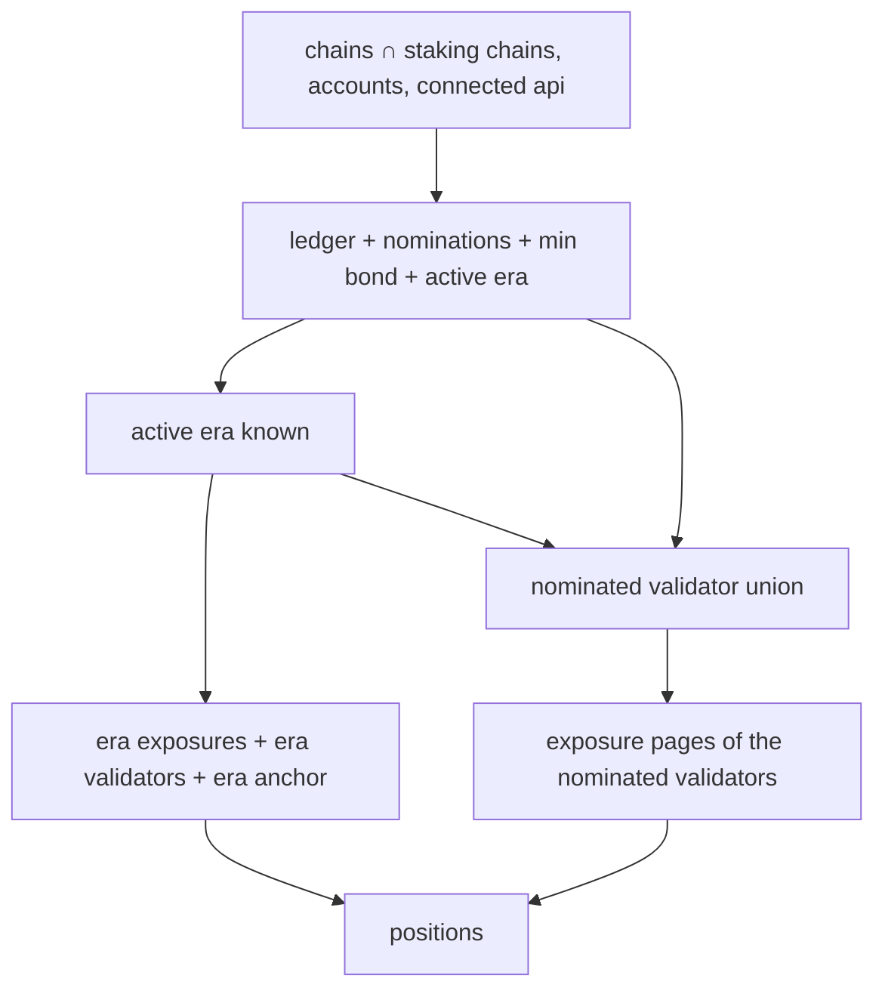

# Staking Positions

> Part of the [Feature Map](../../features/README.md) — Last reviewed: 2026-07-27

## Overview

The single source of truth for **what the selected wallet has staked, everywhere at once**. It answers three questions
for the staking dashboard: which positions exist, what each of them is worth and earning, and whether the app is still
finding out.

A **position** is one bonded ledger of one account on one staking chain — its stake, what it nominates, which of those
validators actually back it in the active era, what is unbonding, and what can be withdrawn right now. The aggregate
assembles positions from the staking domain's on-chain reads and hands the dashboard finished rows plus the totals its
KPI cards show.

## The multi-chain rule

This aggregate is deliberately **not** scoped to a selected network. The old Staking page works one chain at a time
(that selection lives in `aggregates/staking-network`); the dashboard shows Polkadot Asset Hub and Kusama Asset Hub as
rows of one flat table, so everything here is computed per **(chain × account)** and merged.

The chain list is **every Asset Hub the running configuration actually knows about** — the app's staking chain constants
intersected with the chains loaded from the network config. This matters: Westend Asset Hub exists only in dev configs,
so it must appear for developers and stay absent in production without anyone maintaining a second list. The code this
replaces hardcoded a Polkadot + Kusama pair and silently dropped Westend; that is the bug this rule exists to prevent.

Accounts follow the same per-chain logic: an account is included on a chain only when its key scheme and its own chain
binding allow it, and a Polkadot Vault base account is dropped whenever the wallet has derived keys — the same rule the
Staking page applies, so the two views never disagree about whose stake is whose.

## What it exposes

| Store                  | What it answers                                                                                 |
| ---------------------- | ----------------------------------------------------------------------------------------------- |
| `$stakingChains`       | Which staking chains this installation has, in a stable order                                   |
| `$chainAccounts`       | Which accounts are eligible on each of them                                                     |
| `$positions`           | Every position of the selection, across all chains                                              |
| `$summary`             | Per-chain and overall totals: staked, redeemable, unbonding, active validators, position counts |
| `$minNominatorBond`    | The minimum bond required to nominate, per chain                                                |
| `$nominatedValidators` | The union of validators nominated on each chain — also what the exposure reads are scoped to    |
| `$pending`             | Whether the first load is still in flight                                                       |

Planck amounts in `$summary` are **per chain, in that chain's asset**, and are never summed across chains — fiat
conversion is the caller's job. The overall figures are the ones that survive mixing assets: position counts and the
active-validator count.

**Active validators are counted per chain.** The same validator key elected on Polkadot and on Kusama is two validators,
so the overall count is the sum of the per-chain distinct sets, not a global set of keys.

`$summary.totalStaked` is the ledger's **total** — bonded plus everything still unbonding — matching what the dashboard
showed before this aggregate existed. `redeemable` and `totalUnbonding` split the unlocking chunks against the active
era, so they always add up to the unbonding part of that total.

## Loading and emptiness

`$pending` is about the app's own progress, never about the answer. A chain resolves the moment its ledger map lands:
the ledger subscription writes an entry for **every** requested account, empty ones included, so "this account stakes
nothing here" is a real answer rather than an unfinished load. Once at least one account is bonded, the chain stays
pending until its nominations arrive too — otherwise a nominating position would flash as merely _bonded_.

Two things deliberately do **not** hold the dashboard hostage: a chain whose connection is disabled, and a chain whose
connection has errored. Both keep `$pending` false, because neither will ever produce data and a permanent spinner is
worse than a chain that is simply missing from the table.

## Resource lifecycle

Everything is driven from Effector, not from React — the dashboard renders whatever is in the stores, and mounting a
component never starts a subscription.

- **(chain, accounts)** starts the ledger and nominations subscriptions, the minimum bond, and the active-era
  subscription — only for chains that have a connected api and at least one eligible account.
- **(chain, era)** starts the era's exposure overviews, the era validator set (needed to explain _why_ an idle position
  earns nothing) and the era anchor that turns unbonding eras into dates.
- **(chain, era, nominated validators)** reads the exposure pages of exactly the validators the selection nominates —
  the only per-validator read expensive enough to be worth scoping.

The underlying resources are **ref-counted pools**: a start with a key already in flight joins the existing request
instead of duplicating it, so every start must be matched by a stop with the same key or the subscription outlives its
last consumer. All of it goes through one binding that diffs the desired request list against what is already started,
which gives the two properties that matter:

- **A new era retires the old one.** The era is part of every era-scoped key, so a new era produces a new key; the
  previous key is stopped in the same pass rather than left holding a refcount for the life of the app.
- **Live data does not churn subscriptions.** The nominations subscription re-emits on every block. The nominated-set
  union is therefore kept behind a content check, so an identical payload — or any unrelated store updating — never
  restarts the pooled exposure read. Only a genuinely different nomination set does.

`reset` stops every key the aggregate started, on every resource.

## What it replaces

The dashboard's staking widgets used to fetch through React hooks: `useStakingOverview` (hardcoded to two chains) and
`useActiveValidatorCount` (a hand-rolled `useEffect` that re-queried the whole era validator set per chain, per render
of its inputs). Both are superseded by `$positions` / `$summary`. Position status, unbonding maths and redeemable sums
live in `domains/staking` (`positionsService`) and are not duplicated here.

## Related

- `domains/staking` — the on-chain reads, the pooled resources, and `positionsService`, which turns fetched data into a
  position. This aggregate never talks to a node itself.
- `aggregates/staking-network` — the _single_ selected chain of the classic Staking page. Deliberately separate: this
  aggregate has no selected chain.
- `aggregates/staking-accounts` — the classic page's account filtering and ledger subscription for the selected chain.
- `aggregates/wallet-select`, `entities/network` — the selected wallet's accounts and the connected apis everything
  above is keyed by.
