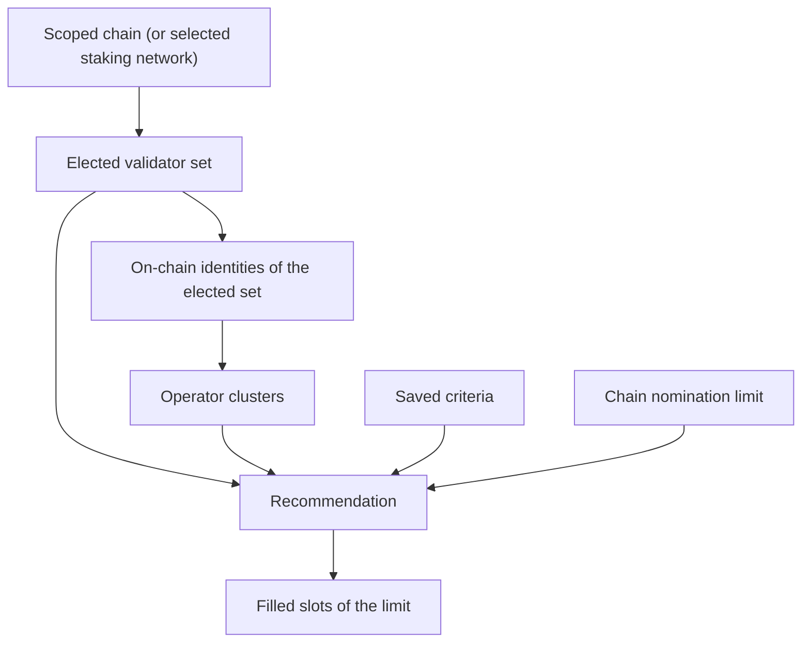

# Staking Validators

> Part of the [Feature Map](../../features/README.md) — Last reviewed: 2026-07-27

## Overview

The single source of truth for **"who should I nominate?"** on the staking screens. It takes the elected validator set
of the network the user is currently looking at, joins it with on-chain identities, and turns the user's saved
preferences into a concrete, ordered recommendation — the list the "Recommended" tab shows and the set the "N of 16
slots would be filled from the top of the list" hint counts.

It answers three questions for the UI:

- **What is elected right now** on the selected staking network, and is that answer ready yet.
- **Which of those validators we recommend**, in order, and how many nomination slots that fills.
- **Why a given validator scores the way it does**, so the "Why recommended" card can explain a pick.

The recommendation rules themselves (filtering, ordering, cluster spreading, graceful relaxation of over-strict filters)
live in the staking domain. This aggregate is what makes them apply to _this_ user on _this_ network: it owns the user's
saved criteria and the identity join the rules need.

## Who can use it / when it applies

- Any staking surface. There is no feature flag and no wallet requirement — the recommendation describes the network,
  not the user's own stake.
- The selected network comes from the **staking-network** aggregate, so switching networks anywhere in staking re-scopes
  everything here at once. Nothing is duplicated: this aggregate never picks a chain of its own.
- The elected set is read per network and never expires within a session, so returning to a network the user already
  visited is instant.
- The criteria are a **user preference**, shared by every staking surface and every window, and they survive a restart.

## States / scenarios

| State                | When it appears                                         | What the user sees                                           |
| -------------------- | ------------------------------------------------------- | ------------------------------------------------------------ |
| Loading              | The elected set of the selected network has not arrived | `pending` — the list renders its skeleton                    |
| Ready                | The elected set has arrived                             | The validators, the recommendation and the filled-slot count |
| Empty era            | The set arrived but holds no validators                 | No recommendation, zero filled slots — not a loading state   |
| Recommendation empty | Impossible while any validator is nominable             | See "Strict criteria never produce an empty list" below      |
| Score unavailable    | The asked-for validator is not in the elected set       | No breakdown — the "Why recommended" card stays hidden       |

Switching networks moves straight from Ready back to Loading (or straight to Ready when that network was visited
before), and every store re-scopes together — there is no window where the recommendation belongs to one network and the
validator list to another.

### Strict criteria never produce an empty list

Turning every filter on can leave no candidate in a given era. Rather than show an empty "Recommended" tab, the
selection is rebuilt with the mandatory rule only (blocked validators are always dropped — they reject nominations, so
recommending them can never work). The user's criteria are not changed by this; they simply do not bite for that era.

Because of that, the filled-slot count can legitimately be **fewer** than the chain's nomination limit: a small era, or
a set dominated by one operator, gives fewer distinct picks than there are slots. It is never _more_.

## Operator clusters

Spreading a nomination across operators limits the blast radius of a single operator being slashed, so at most two
validators of one operator enter a recommendation. That requires knowing which validators belong together.

**A validator's cluster is its on-chain identity display name.** Every sub-identity of one operator carries the parent's
display name, so `Operator A`, `Operator A / node-2` and `Operator A / node-3` form one cluster — which is exactly what
the "3rd in cluster" badge means to someone reading the list: _the third validator run by the same identity_.
**Validators with no on-chain identity are never clustered** — with nothing to tie them together, treating them as one
group would be a guess, so each stands alone.

The tradeoff: two genuinely unrelated operators who register the _same_ display name collide into one cluster, and the
second one loses slots it arguably deserved. This is rare, and the display name is the only thing the user can actually
see — two entries reading `Operator A` look like the same operator whether or not they are, so grouping them matches
what the list communicates. The alternative, keying on the parent identity's account, would demand a wider identity
record for a case the user cannot distinguish anyway.

## Saved criteria

Three switches, all on by default, all persisted and shared across windows:

| Criterion        | Effect when on                                        |
| ---------------- | ----------------------------------------------------- |
| Exclude slashed  | Drops validators carrying a slash in the defer window |
| Require identity | Keeps only validators with an on-chain identity       |
| Limit clusters   | Keeps at most two validators per operator cluster     |

Patches are merged, so a screen can flip one switch without restating the rest, and a reset returns all three to the
defaults. A payload written before a criterion was retired still hydrates — the flags are read key by key, so a key
nobody reads any more is simply ignored.

**A stored payload is never trusted as-is.** Storage can hold an older shape, a half-written value or a hand-edited
entry, and a missing switch would otherwise read as neither on nor off. Every switch is validated on load and falls back
to its default individually when it is absent or not a boolean — so a partially corrupt payload keeps the switches it
does carry instead of resetting everything, and no recommendation is ever computed from an undefined filter.

## Which chain is served

By default the validator set follows the network selected on the classic Staking page. That is not enough on its own:
the dashboard shows positions on several chains at the same time, so opening "change validators" on a Kusama position
while Polkadot is the selected network would otherwise list Polkadot validators without saying so.

Any consumer can therefore scope the aggregate explicitly with `scopeChain(chainId)`, and hand it back with
`scopeChain(null)`. The validator-selection feature scopes to the chain the host opened it for and clears the scope when
the picker closes, so the served set and the chain shown in the header can never disagree.

## Lifecycle

Identities are asked for once per elected set: when a set arrives, and when the user switches to a network whose set was
already known. Until they arrive, no validator has a cluster, so a recommendation computed in that moment simply spreads
less — it is never wrong, only briefly less informed, and it settles as soon as the identities land.

The nomination limit comes from the connected chain. Before a connection exists it falls back to the staking pallet's
own default of 16, so the "N of 16 slots" hint is never blank while the network is still connecting.

## Related

- **staking-network** — owns the selected network, its api and its connection state. This aggregate consumes it as the
  default chain, which `scopeChain` can override.
- **Staking domain** — owns the elected set, the active era, the recommendation algorithm and the score breakdown. This
  aggregate adds the user preference and the identity join that the algorithm needs, which is why they live here and not
  in the domain.
- **Network domain** — resolves on-chain identities, including the People-chain hop, from the staking chain id.
