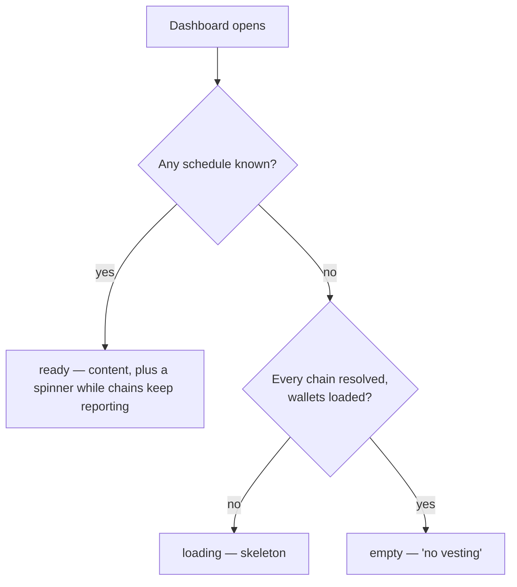

# Vesting portfolio

> Part of the [Feature Map](../../features/README.md) — Last reviewed: 2026-07-13

## Overview

Answers one question for the whole app: **what is vesting right now, across every account the user can see?** It gathers
the live vesting schedules of every non-hidden account on every vesting-capable chain, turns them into per-account views
and a wallet-wide summary, and — the part that carries most of the weight — decides **whether the answer can be trusted
yet**.

The vesting block on the dashboard ([`vesting-claim`](../../features/vesting-claim/README.md)) is its only consumer
today. That block is self-contained: it takes no account list from the page it renders in, because vesting is not a
property of the dashboard's account selection but of the wallet.

## Who / when

- Covers **all non-hidden accounts**, not the dashboard's selected subset. A hidden wallet's accounts are excluded
  entirely — a claim from one could not be confirmed, since the confirmation resolves the initiator's wallet out of the
  visible list.
- A chain participates only if its **runtime** exposes `pallet_vesting` (`query.vesting.vesting` + `tx.vesting.vest`) and
  at least one account's address scheme matches it. This is discovered from the connected chain's metadata; there is no
  static list of vesting chains.

## States / scenarios

The block has three states, and the whole point of this aggregate is that it never lies about which one it is in.
"This wallet has no vesting" is a strong claim, and it is only made once **every chain that could have contradicted it
has spoken**.

A chain is *unresolved* while it might still surface a schedule, and *resolved* the moment it cannot:

| Chain condition                                    | Verdict                                            |
| -------------------------------------------------- | -------------------------------------------------- |
| Disabled                                           | not part of the question                           |
| Still connecting (no api yet)                      | **unresolved** — its runtime is not readable yet    |
| Failed to connect (ERROR)                          | resolved — it will never answer                    |
| Connected, runtime has no vesting pallet           | resolved — vesting is impossible there             |
| Connected, vesting pallet, no account addresses it | resolved — nothing of ours to look up              |
| Connected, vesting pallet, our accounts            | resolved **only** once its schedules have arrived  |
| Schedules arrived, timeline chain's head unknown   | **unresolved** — no figure can be read yet          |
| Anything still outstanding after 30s               | given up on — see below                            |

Wallets are part of the question too: while they are still being read there are no keys to look up, every chain would
resolve trivially, and the empty state would be a lie told before the question was asked. The same goes for the network
config: a user who has disabled *every* chain, on the other hand, has given a real (and empty) answer, and is shown it.

**The deadline.** The app opens a connection to every enabled chain, and a chain whose RPC is down never settles — its
socket keeps retrying, so it sits in "connecting" (or flaps between error and connecting) for the entire life of the
app. Across dozens of chains that is the norm, not the exception. A chain that connects but never *answers* is rarer and
subtler — a degraded RPC that holds the socket open, a storage subscription that dies without a word — but from here the
two are indistinguishable, and either would leave the loader spinning and, for a wallet with no vesting, the skeleton up
permanently. So **every chain still outstanding after 30 seconds is given up on**, connected or not.

The cost of the deadline being too short is a false "no vesting" — the very thing this model exists to prevent — so it is
deliberately generous, and the cost of it being too long is only a loader that lingers. If a given-up-on chain does
report later and turns out to hold vesting, its schedules simply appear.

The clock restarts on every activation, not just on a new account set: a timer armed on a previous visit keeps running
while the block is unmounted, and without the restart the next visit would open with its grace already spent.

| State     | When it appears                                                | What the consumer shows                        |
| --------- | -------------------------------------------------------------- | ---------------------------------------------- |
| `loading` | Any chain may still surface a schedule, or wallets are loading  | Skeleton                                       |
| `ready`   | At least one **row** can be shown — not awaited any further      | Content, with `loadingMore` while chains report |
| `empty`   | Every chain resolved and none holds vesting                     | "No vesting" row                               |

Two rules keep the states honest over time:

- **Content leads.** The first row to land flips the block to `ready`; the chains still reporting are shown as a quiet
  "loading more" spinner rather than holding the whole block back. `ready` is read off the *rendered rows*, and the
  summary's schedule count is counted off them too: a chain whose schedules are known but whose timeline head is not can
  build no row, and a callout advertising a count the modal has no rows to back is worse than one that arrives a moment
  later.
- **Answers latch.** Chains connect, error and reconnect for the entire life of the app. Once a terminal state has been
  shown for the current account set, a chain going unresolved again reports as `loadingMore` — it never throws a settled
  block back to a skeleton. Changing the account set resets the latch: that is a new question.

## The figures

Two rules decide every number the consumer prints, and both exist because the obvious version of them is wrong.

**Everything is timed on the schedule's own chain.** `pallet_vesting` on a migrated Asset Hub stores *relay* block
numbers, so the current height *and* the expected block time must both be read from the **timeline chain** (`additional
.timelineChain`, falling back to the chain itself). Pairing one chain's blocks with another's clock silently scales
every rate and every date by the ratio between them — Kusama Asset Hub's 2s against its relay's 6s is a factor of three.
A chain whose block time has not been fetched yet gets **no rate and no dates** rather than a plausible-looking guess,
and one whose timeline *height* is unknown gets **no rows at all** — nothing it holds can be stated without that height
— while staying unresolved, so the block waits on its loader instead of announcing a total it cannot itemise.

**Claimability is a token fact, not a fiat one.** The summary's `hasClaim` — the callout's badge, the "Ready to unlock"
tile — is read off the claimable BN, never off its fiat value: an asset with no price feed (a dev chain, a newly listed
token, a failed price fetch) is worth 0 in fiat and still perfectly claimable, and the rows would then offer a claim
button the callout denies.

**The daily unlock is what a day actually releases**, obtained by projecting each schedule 24 hours forward and
subtracting it from itself — never `perBlock × blocksPerDay`. That naive rate ignores both ends of the schedule and so
overstates anything that runs for less than a day, without bound: a 0.05 KSM vesting that completes within the hour was
reported as unlocking 4.32 KSM a day. The projection is zero while the start block is more than a day out, and never
exceeds what the schedule still holds. An account's daily figure is simply the sum of its schedules'.

A **cliff** is a schedule that releases its whole amount in one block (`perBlock ≥ locked`) — a property of its shape,
not of where the chain has got to. A schedule whose start block merely lies in the future has *not started*; if it vests
gradually it is not a cliff, and saying so was the second half of the same bug.

## Lifecycle

Schedules and their `VESTING` balance locks are **live subscriptions** (one pooled per chain + account set, from
`domains/vesting`). They are held only while a consumer is on screen, and follow the chain set as it connects: a chain
that connects late simply joins, and its schedules appear under the existing content.

Because the subscriptions are live, a claim landing on-chain — its lock drops, a fully-vested schedule is pruned — flows
back in without any refetch. So does a change made on another device.

**The head is subscribed to, not polled.** The schedules almost never change — they move only when someone calls
`vest()` or a new vested transfer lands — while *every figure derived from them* changes with the timeline chain's
current block. So the block is what has to be live, and re-fetching the (unchanged) schedules on a timer would correct
nothing. Each timeline chain's head is therefore subscribed to for as long as the block is on screen, sharing the pooled,
ref-counted `blockResource`: chains that share a timeline (every migrated Asset Hub points at its relay) are watched
once, and nothing is watched at all once the block leaves the screen. The background poll behind `$currentBlock` remains
a floor — heights only move forward, so the aggregate simply takes whichever source is further ahead, and neither a
first frame with no head yet nor a head left over from an earlier visit can show a stale figure.

This is what keeps the block honest about time: a cliff ends, a schedule starts vesting, an amount becomes claimable, and
the UI says so within a block — with no interval, no refetch, and nothing for the user to reload.

Vesting figures move with every block, but most of those movements change nothing that is printed. The aggregate compares
what *would* be displayed against what *is* displayed and drops the update when they match, so a schedule sitting in its
cliff, or one long finished, costs nothing per block — and no update can disturb a claim mid-signature, which reads its
own snapshot.

## Related

- [`vesting-claim`](../../features/vesting-claim/README.md) — the dashboard block and the claim flow built on this data.
- `domains/vesting` — the live schedules/locks subscription and the pure vesting math.
- `domains/network` (`block`) — the timeline chains' live heads (`blockResource`) and their expected block times, from
  which the unlock rates and dates are projected.
- `currency-select` — the active currency and prices behind the summary's fiat figures.
