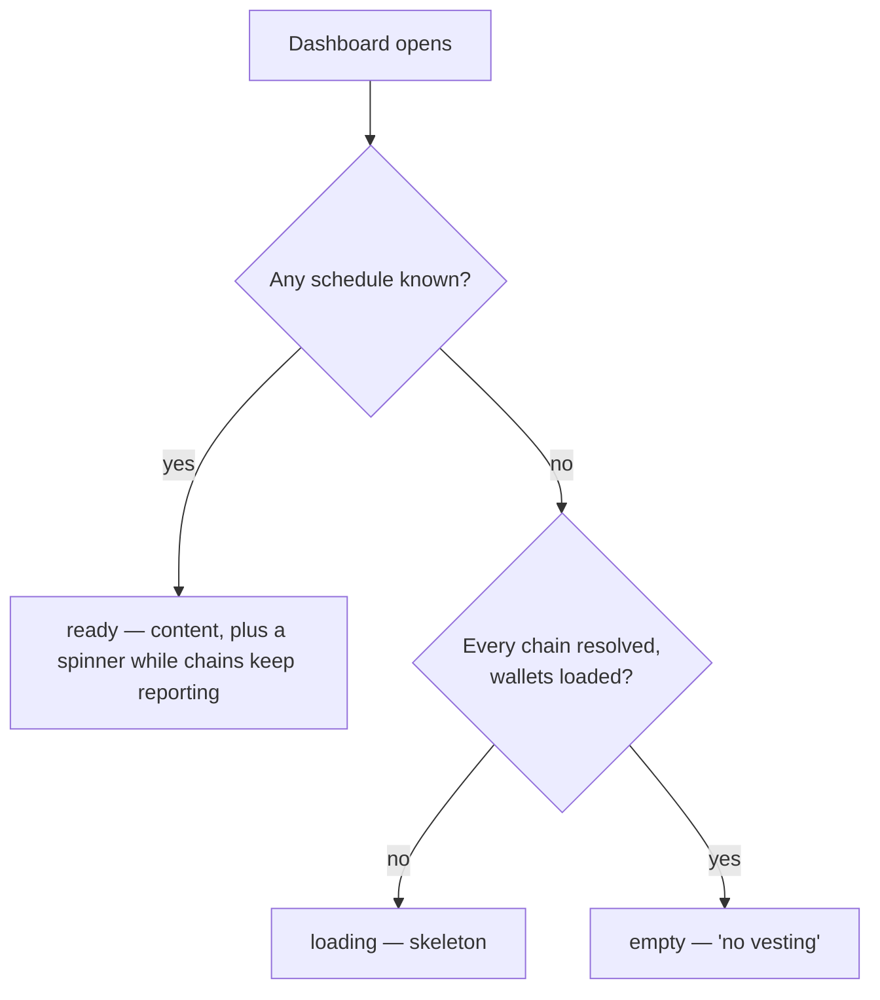

# Vesting portfolio

> Part of the [Feature Map](../../features/README.md) — Last reviewed: 2026-07-13

## Overview

Answers one question for the whole app: **what is vesting right now, across every account the user can see?** It gathers
the live vesting schedules of every non-hidden account on every vesting-capable chain, turns them into per-account views
and a wallet-wide summary, and — the part that carries most of the weight — decides **whether the answer can be trusted
yet**.

The vesting block on the dashboard ([`vesting-claim`](../../features/vesting-claim/README.md)) is its only consumer
today. That block is self-contained: it takes no account list from the page it renders in, because vesting is not a
property of the dashboard's account selection but of the wallet.

## Who / when

- Covers **all non-hidden accounts**, not the dashboard's selected subset. A hidden wallet's accounts are excluded
  entirely — a claim from one could not be confirmed, since the confirmation resolves the initiator's wallet out of the
  visible list.
- A chain participates only if its **runtime** exposes `pallet_vesting` (`query.vesting.vesting` + `tx.vesting.vest`) and
  at least one account's address scheme matches it. This is discovered from the connected chain's metadata; there is no
  static list of vesting chains.

## States / scenarios

The block has three states, and the whole point of this aggregate is that it never lies about which one it is in.
"This wallet has no vesting" is a strong claim, and it is only made once **every chain that could have contradicted it
has spoken**.

A chain is *unresolved* while it might still surface a schedule, and *resolved* the moment it cannot:

| Chain condition                                    | Verdict                                            |
| -------------------------------------------------- | -------------------------------------------------- |
| Disabled                                           | not part of the question                           |
| Still connecting (no api yet)                      | **unresolved** — its runtime is not readable yet    |
| Still connecting after a 30s grace period          | given up on — see below                            |
| Failed to connect (ERROR)                          | resolved — it will never answer                    |
| Connected, runtime has no vesting pallet           | resolved — vesting is impossible there             |
| Connected, vesting pallet, no account addresses it | resolved — nothing of ours to look up              |
| Connected, vesting pallet, our accounts            | resolved **only** once its schedules have arrived  |

Wallets are part of the question too: while they are still being read there are no keys to look up, every chain would
resolve trivially, and the empty state would be a lie told before the question was asked.

**The grace period.** The app opens a connection to every enabled chain, and a chain whose RPC is down never settles —
its socket keeps retrying, so it sits in "connecting" (or flaps between error and connecting) for the entire life of the
app. Across dozens of chains that is the norm, not the exception, and waiting on such a chain forever would leave the
loader spinning and — for a wallet with no vesting — the skeleton up, permanently. So a chain that has not connected
within **30 seconds** is given up on. A chain that *has* connected is always waited for: its storage read answers in
milliseconds, so there is no reason to give up on it.

The cost of the grace being too short is a false "no vesting" — the very thing this model exists to prevent — so it is
deliberately generous, and the cost of it being too long is only a loader that lingers. If a given-up-on chain does
connect later and turns out to hold vesting, its schedules simply appear.

| State     | When it appears                                                | What the consumer shows                        |
| --------- | -------------------------------------------------------------- | ---------------------------------------------- |
| `loading` | Any chain may still surface a schedule, or wallets are loading  | Skeleton                                       |
| `ready`   | At least one schedule is known — shown immediately, not awaited | Content, with `loadingMore` while chains report |
| `empty`   | Every chain resolved and none holds vesting                     | "No vesting" row                               |

Two rules keep the states honest over time:

- **Content leads.** The first schedule to land flips the block to `ready`; the chains still reporting are shown as a
  quiet "loading more" spinner rather than holding the whole block back.
- **Answers latch.** Chains connect, error and reconnect for the entire life of the app. Once a terminal state has been
  shown for the current account set, a chain going unresolved again reports as `loadingMore` — it never throws a settled
  block back to a skeleton. Changing the account set resets the latch: that is a new question.

## Lifecycle

Schedules and their `VESTING` balance locks are **live subscriptions** (one pooled per chain + account set, from
`domains/vesting`). They are held only while a consumer is on screen, and follow the chain set as it connects: a chain
that connects late simply joins, and its schedules appear under the existing content.

Because the subscriptions are live, a claim landing on-chain — its lock drops, a fully-vested schedule is pruned — flows
back in without any refetch. So does a change made on another device.

Vesting figures move with every block, but almost none of those movements change a printed number. The aggregate
compares what would be displayed against what is displayed and drops the update when they match, so a background block
tick or a balance refresh cannot re-render the UI — least of all a claim mid-signature.

## Related

- [`vesting-claim`](../../features/vesting-claim/README.md) — the dashboard block and the claim flow built on this data.
- `domains/vesting` — the live schedules/locks subscription and the pure vesting math.
- `domains/network` (`block`) — the current block height and each timeline chain's expected block time, from which the
  unlock rates and dates are projected.
- `currency-select` — the active currency and prices behind the summary's fiat figures.
