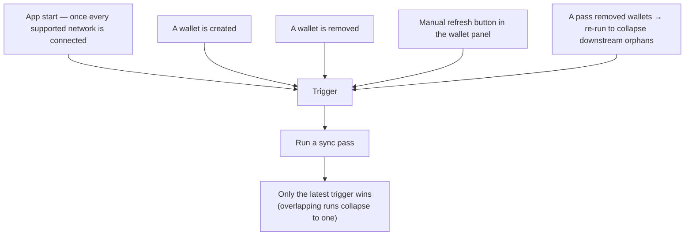
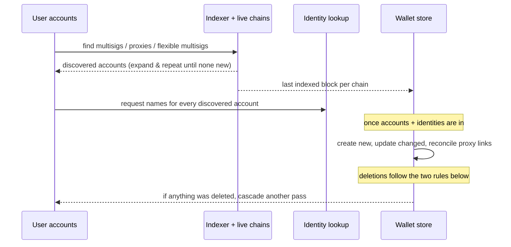
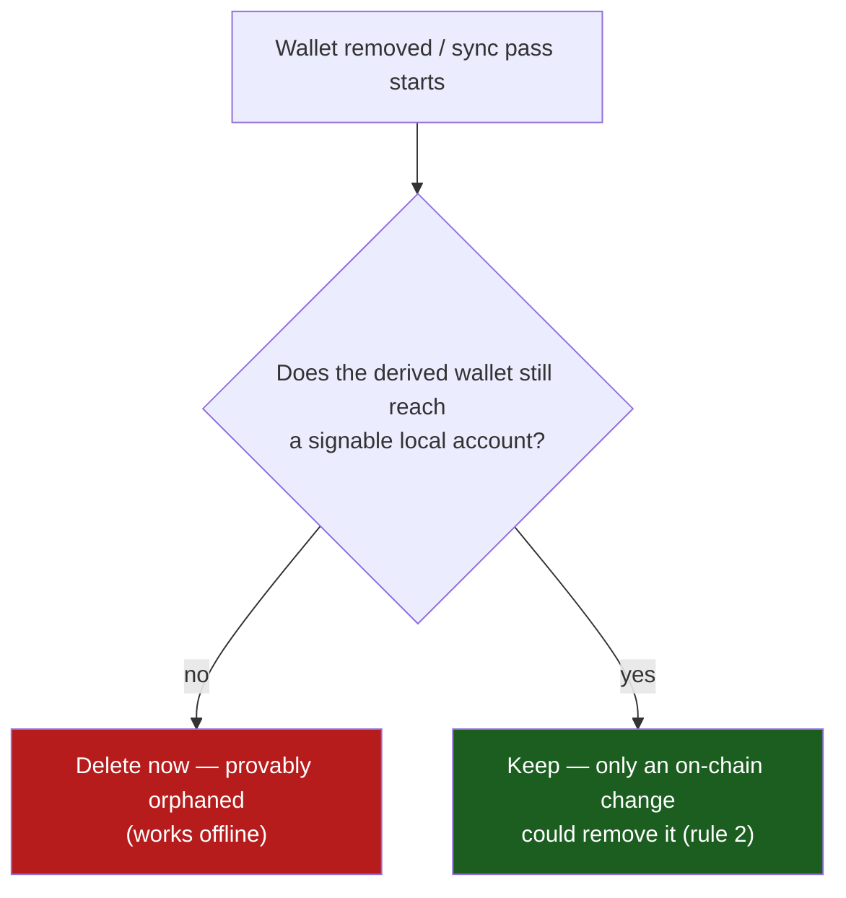

# Account Sync

## Overview

**Account sync** keeps the user's _derived_ wallets in step with on-chain reality.
The user only ever adds a **signing wallet** (a Vault, a key, a watch-only address);
the multisig, flexible-multisig, and delegated-authority (proxy) wallets that depend
on it are never added by hand — the sync service discovers them, creates them as
watch-only wallets, keeps their details current, and removes them once they no longer
exist on-chain.

It runs in the background and is mostly invisible: the only direct UI is a refresh
control in the wallet panel. Everything else surfaces as wallets appearing or
disappearing and as "wallet added" notifications.

## What it discovers

Starting from the user's own accounts as seeds, sync asks the indexer (and verifies
against the live chains) for three kinds of derived account, then keeps expanding:

- **Multisig** — a multisig account the user is a signatory of. The account id is
  re-derived from the returned signatories + threshold and only accepted if it
  matches, so an indexer can't fabricate a membership.
- **Delegated authority (proxy)** — an account that has delegated a proxy to one of
  the user's accounts. Only **immediate** proxies are tracked (delay `0`); delayed
  proxies are ignored.
- **Flexible multisig** — a pure proxy whose delegate is a discovered multisig
  account (a multisig that controls a pure-proxy account).

Discovery is **recursive**: every newly found account becomes a seed for the next
round, so chains of relationships (a proxy of a multisig of a proxy …) are walked to
their end. Only accounts the user has **permission to act with** are used as the
initial seeds.

## When it runs

- **First run** waits until *all* chains that support proxies/multisigs are
  connected — syncing against a half-connected node set would produce false deletes.
- **Cascade re-run.** When a pass actually deletes wallets, it kicks another pass so
  that wallets which only existed *because of* the now-deleted ones (a proxied of a
  removed multisig, and so on) collapse too. It terminates as soon as a pass deletes
  nothing.
- Concurrent triggers don't stack — only the most recent run is kept.

## States the user sees

The sync service has a single visible control — a button in the wallet-select panel:

| State | When it appears | What the user sees |
| --- | --- | --- |
| **Idle** | No sync in progress | A refresh icon; clicking it starts a manual sync |
| **Syncing** | A sync pass is running | A spinner with a "Syncing accounts…" tooltip |

Indirectly, a sync pass may: add watch-only wallets (multisig / flexible multisig /
delegated authority), update an existing proxied wallet's connections and deposit,
remove wallets that no longer exist on-chain, and raise a "wallet added"
notification for each newly created wallet.

## Lifecycle

A pass discovers accounts, fetches each chain's last-indexed block and the identities
used to name new wallets, then reconciles the wallet store: create what's new, update
what changed, and delete what's gone.

### When a derived wallet is deleted

A derived wallet is removed for one of two distinct reasons, decided differently. The
distinction matters: confusing them is what used to leave orphaned wallets behind.

**1. Its local source is gone — immediate, local, no source needed.** A derived wallet
is only _yours_ because one of your **signable** accounts sits behind it as a signatory
or delegate — possibly through a chain of other derived wallets. The moment that last
signable account disappears (you removed the wallet, or an upstream derived wallet was
itself removed), the dependent wallet is provably orphaned and is deleted **right away,
from local data alone** — no indexer, no chain call. Because the dependency is followed
recursively, a single pass collapses a whole chain at once (a proxied of a multisig of a
removed key). This check runs both when you remove a wallet **and** as the first step of
every sync pass, so a derived wallet never lingers waiting for a source to respond.

**2. The on-chain relationship was revoked — confirmed against sources.** The wallet
still has a local signer, but the proxy was revoked or the multisig dissolved on-chain.
This needs external confirmation and the indexer can lag, so deletion stays guarded: the
chain must have been part of the pass, the indexer must report a last-processed block for
it, and that block must be **at or past** the account's creation block (accounts newer
than the indexer's checkpoint are kept until it catches up). Proxied wallets get an extra
on-chain check — kept if any delegate is still valid on live chain state; unreachable
chains are left untouched. A wrongful removal here heals on the next pass.

## Related

- **`domains/network/account-sync`** — the discovery engine and the indexer/on-chain
  providers (proxy, multisig, indexed-blocks). This feature orchestrates those
  results into wallet create/update/delete, identity naming, proxy-store
  reconciliation, and notifications.
- **Identity, proxy, notification, and wallet** domains/entities consume the output
  of each pass.
- The discovery providers read from the accounts SubQuery indexer and cross-check
  against connected chain APIs; indexer lag is the reason for the block-number and
  on-chain deletion guards above.
