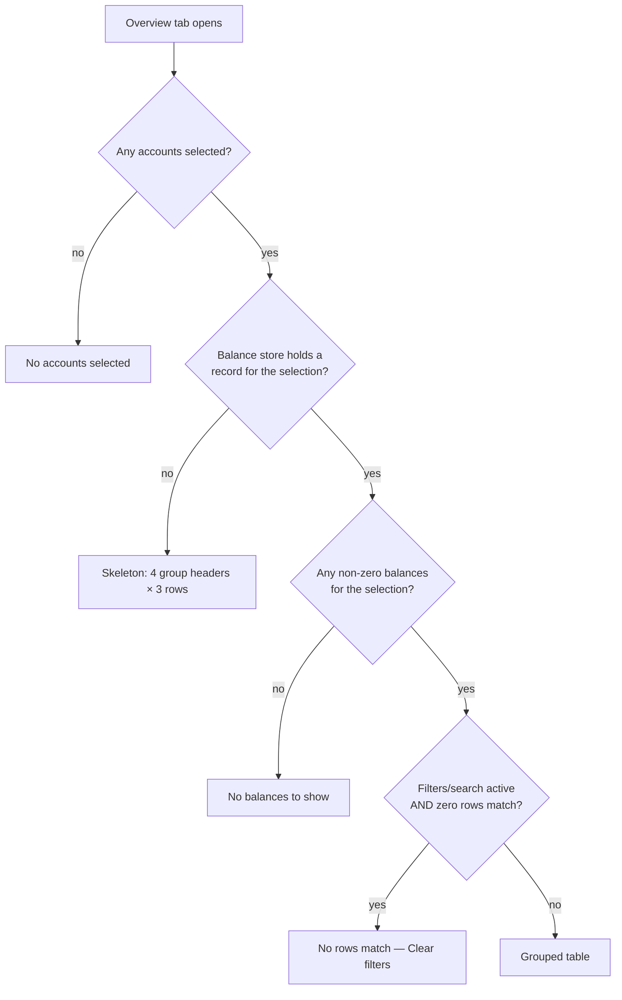

# Dashboard Accounts Table

> Part of the [Feature Map](../README.md) — Last reviewed: 2026-08-26

## Overview

A full-width widget on the Dashboard's **Overview** tab, also openable full screen: **one row per (selected account ×
chain × asset)** that holds a non-zero balance, grouped by account with a fiat subtotal per group. Each numeric cell
splits the balance by **purpose** — Transferable, Staked, Governance, Other, Total — so a user can see not just how much
they hold on a chain but what it is doing there. The table adds four filter facets, a minimum row-total amount filter,
free-text search, column sort that ranks accounts and their rows together, and CSV export, so a user with dozens of
accounts across many chains can find and total exactly the holdings they are looking for.

Ships customer request **O1** (`tasks/customer-dashboard-requests.md`), built to the approved design **variant 2a** ("1f
developed") from the claude.ai/design project file `Accounts Table Widget Options.dc.html`, then reworked against
`Accounts Table Redesign.dc.html` in the same project — filters behind one button, the Total column on its own accent
surface. Two of that redesign's moves were tried and rolled back: dropping the per-cell fiat sublines, and its column
proportions with a fixed-width Total.

## Who can use it / when it applies

- Gated by the **`dashboard`** feature flag, DI feature `dashboard/accounts-table`, injected into `dashboardWidgetsSlot`
  at **order 1** with a default size of **2×6** — Portfolio Overview's own size, second in the seeding flow straight
  after it, which puts the two at the top of the grid side by side and flush: the fiat snapshot, and where that money
  actually sits. Every other overview widget shifted up one order to make room, their order relative to each other
  unchanged; a stored layout is never re-seeded, so only a first-time or reset layout is affected. At half the grid the
  table runs in its compact column set — that is what makes five purpose columns fit in half a screen.
- Needs at least one account selected in the dashboard's account picker; an empty selection renders its own "no accounts
  selected" state rather than an empty table.
- With the global **"show fiat"** toggle **off**, the table does not disappear: rows, filters, search and CSV export all
  keep working on token amounts. Only fiat-denominated UI is suppressed — the per-cell fiat subline and every group's
  fiat subtotal. The table shows no grand total of its own: the same figure is the headline of
  `dashboard-portfolio-overview`, one card above.
- The widget starts its own balance fetch for the dashboard's selected accounts (`balanceSubModel.fetchAccounts` /
  `fetchAccountIds`), wired the same way as `dashboard-portfolio-overview` so it stays self-sufficient — see
  "Subscription cost" below for why registering it twice is safe.

## States / scenarios



| State                     | When it appears                                                              | What the user sees                                                                                                                                                                                      |
| ------------------------- | ---------------------------------------------------------------------------- | ------------------------------------------------------------------------------------------------------------------------------------------------------------------------------------------------------- |
| No selection              | The dashboard's account picker has nothing selected                          | Centered "no accounts selected" message; header chrome and footer are hidden                                                                                                                            |
| Loading                   | Accounts selected, but the balance store holds no record yet for any of them | Skeleton mirroring the real layout: 4 group headers, 3 stub rows each                                                                                                                                   |
| Loaded                    | The balance store holds at least one record for the selection                | Grouped table: header row, per-account groups with subtotals, data rows; the footer states how many rows over how many accounts — the only place the table counts itself; it carries no other hint text |
| Zero balances             | Selection resolved, but every (account, chain, asset) balance is zero        | "No balances to show" empty state — a real answer, not a loading artifact                                                                                                                               |
| Empty after filter/search | Filters and/or the search box are active and nothing matches                 | "No rows match your filters" + explainer + "Clear filters" button; chips row stays visible                                                                                                              |
| Filters/search active     | At least one filter or a non-empty search query is set                       | Chips row under the header (one chip per active filter, ×), a count on the Filters button, filtered table                                                                                               |
| Fiat off                  | Global "show fiat" toggle is off                                             | Same rows and controls, minus every group's fiat subtotal                                                                                                                                               |

The **skeleton vs. empty** distinction follows the same rule as `dashboard-portfolio-overview`: the balance subscription
writes a record for every (account, chain, asset) it queries, zero balances included, so the first record landing is the
moment "nothing to show" becomes a statement about the accounts rather than about the app's own progress
(`hasBalanceRecords` in `lib/balanceRecords.ts`). Until then the widget shows its skeleton, never an empty table or a
row of zeros.

## The purpose split

Every numeric cell is not "the balance" — it is one balance broken into **why it's frozen or free**, via a waterfall
partition of `free + reserved` computed once per (account, chain, asset) in `splitBalanceByPurpose`:

```
free + reserved  →  Transferable  →  Staked  →  Governance  →  Other (remainder)
```

Each bucket after Transferable is **capped by what's left**, so the buckets always sum exactly to the total and `Other`
can never go negative even when locks overlap (`pallet_balances`' `frozen` is the _maximum_ of an account's locks, never
their sum).

- **Staked** comes from the **staking ledger** (`aggregates/staking-positions`, a position's `stake.active`), never from
  the deprecated `LockTypes.STAKING` lock — that lock type is absent on Asset Hub, where staking holds funds in
  `reserved` rather than locking `free`. The cell is `null` (renders `—`) on any (chain, asset) that isn't the staking
  asset of a staking chain, and also `null` **while staking data is still loading**, even on a cell that will turn out
  to have a position — a pending `—` is never allowed to render as `0`.
- **Governance** is the conviction-vote lock, and only ever applies to the chain's **native asset** — a parachain's
  custom token cannot carry a governance lock, so that cell is `—` there.
- **Vested is not a column and no longer a hint either.** Vesting is non-zero on a small minority of rows, so a
  dedicated column would be mostly `—`; the amount simply lives inside **Other**. It used to be called out by an "incl.
  X vested" subline under that cell, dropped in the redesign along with every other subline — a row is one line, and
  vesting is a detail for the account's own screen, not for a hundred-row table.

**`—` vs. `0`:** a dash means the bucket does not apply to this (chain, asset) pair, or its data has not been read yet
(staking, specifically); a `0` means the chain actually reports a zero balance for that bucket. The two must never be
conflated — a staking cell renders `—` while a fetch is pending and only becomes a number (which may itself be `0`) once
the ledger has answered.

## Filters, search, sort, grouping

- **All filters live behind one "Filters" button** in the header, not in a band across the table. Five permanent
  dropdowns cost a 44px strip that said "All" five times over — the height of two data rows spent on the state "nothing
  is filtered". The button carries a count when filters are on; the chips row below spells them out and only appears
  then.
- **Four facets** — Network, Chain, Account, Token — each listing every distinct value present in the current selection
  with a per-option row count. Every option carries the same glyph the table draws for that value — the relay's icon,
  the chain's icon, the account's identicon, the token's icon — so a filter list reads like the rows it filters.
  Selections are **OR within a facet, AND across facets** (e.g. "Polkadot or Kusama" AND "DOT or KSM"). Inside the
  popover: one facet open at a time, starting with whichever carries a selection; a facet whose rows all share one value
  is dropped entirely (filtering by the only network there is filters nothing); picking a value applies it immediately,
  so there is no Apply button.
- **The Token facet is keyed by symbol**, not by (chain, asset): "which of my accounts hold DED, and where" is one
  question about one token, and the Chain column answers the "where" half on the rows that survive. It is the one facet
  with **its own search box** — a wallet spanning a few dozen chains reaches thirty-plus tokens, past the point where
  scanning beats typing. The query matches the two strings each option shows, its symbol and its full name
  (`performSearch`), and the list keeps its own order rather than being re-ranked by match weight.
- **Wallet type is not a filter.** It was one until the Token filter replaced it: a wallet's kind is visible on every
  group header already (the badge next to the account name), and "show me only my multisigs" is a question the account
  picker above the table answers, while "who holds this token" had no answer anywhere. The `walletTypeBucket` on a row
  survives for that badge's tooltip.
- **Minimum row-total amount filter** — a popover with a free-text input plus `≥ $100K` / `≥ $1M` presets. Accepts
  `100K`, `1M`, or a `$`/comma-decorated plain number (`parseAmountInput` in `lib/filters.ts`); a row without a priced
  total never passes a minimum filter.
- **Chips row** appears whenever a filter or the search box is active: one chip per filter value with its own ×, plus a
  "Clear all" button that also clears the search box.
- **Free-text search** matches the strings the user actually sees on the row — resolved account name, the displayed SS58
  address, and the chain name (`performSearch` with `getMeta` supplying `chainName`) — never the raw stored `accountId`
  or unresolved account fields. Search **filters without re-ranking**: the grouped table's order carries meaning
  (account grouping, in-group sort), so `performSearch`'s relevance ordering is used only to decide which rows match,
  then the original row order is kept.
- **Column sort ranks the accounts as well as their rows.** Sorting Governance lifts every account that holds a
  governance balance to the top of the table, and orders that account's own rows the same way inside — an account is
  ranked by its **fiat sum in the sorted column** (`groupColumnFiat`), the group subtotal being that same sum for Total.
  Sorting inside groups only, as this first shipped, left the numbers moving while the accounts stayed put, so the
  question the sort was asked ("who holds governance locks?") still meant scrolling every account. Categorical columns
  (Chain) default ascending; numeric columns (Transferable / Staked / Governance / Other / Total) default descending; a
  second click on the same header flips direction, for the accounts and the rows together.
- **No separate group-order control.** The column sort is the only ordering control the table has: it ranks the accounts
  and their rows together, which is what a dropdown duplicating it ("Accounts by value / A→Z") would otherwise say a
  second time. Alphabetical account order is gone with it — search by name covers finding one account, and the sort
  covers ranking them.
- **Collapse/expand all** is the chevron button inside the **Chain** column header, left of its label — it folds the
  very groups that column names, which is what lets an icon stand there without a label of its own. Individual groups
  fold independently via their own caret. Collapsing is a display concern only — it never removes a group's rows from
  filtering, sorting, the footer's row count, or CSV export.

## Two column sets

The widget is resizable — 2 to 4 of the dashboard's grid columns — and the same size is a different pixel width on every
window, so the table keys its layout off **its own width** (a container query at `900px`, never a viewport breakpoint).

| Width   | Chain                    | Address | Transferable / Staked / Governance / Other / Total |
| ------- | ------------------------ | ------- | -------------------------------------------------- |
| ≥ 900px | icon + name              | shown   | shown                                              |
| < 900px | icon only, name on hover | hidden  | shown                                              |

Below 900px the five numeric columns would be left ~65px each and every amount would wrap onto three lines. The compact
set drops only what a person can recover elsewhere: the **address** is the same for every row of a group apart from the
chain's own SS58 prefix — which the Chain column already names — and the CSV export still carries it in full; the
**chain name** stays one hover away on the icon. The purpose split, which is what the table exists to show, keeps its
space at both widths. Nothing about filtering, sorting, search or export changes with width: the compact set is a
display concern only, exactly like collapsing a group.

The header controls **wrap** onto a second line rather than being clipped when the card is too narrow for them — every
one of them is a text button or a search field that stops being usable once squeezed.

Below ~550px (a 2-column widget on a small window, the narrowest the widget can be) the amounts start wrapping onto two
lines again. That is the accepted floor rather than a third column set: dropping a purpose bucket would make the table
say something false about a balance.

## How a row reads

Five rules, all about making a hundred rows scannable:

- **Total owns a surface.** It is the number a person scans a hundred rows for, so it is the one column with a hairline
  on its left edge and a tint that runs to the card's right edge. The grid therefore pads left only: a right pad would
  leave a white gutter and the column would read as a floating box. That tint — and the group header's — is a shade
  lighter than the page behind the card: the two surfaces reach the card's edge, so a tint matching the page would erase
  the card's outline wherever they touched it. A group header is laid out on that same grid — its account block spans
  every column but the last — so an account's subtotal lands in the very track its rows' totals do, at any width and
  with no number kept in sync by hand.
- **A zero is muted.** `0` and `—` both say "nothing to see here"; only a number worth reading gets full contrast.
- **Every cell keeps its fiat subline** — except under a zero, where the line could only ever read `$0` — and every
  numeric column keeps flexing (Total a shade wider than the rest). The redesign proposed dropping the sublines outright
  and fixing Total to 140px; both were tried and rolled back — the fiat line under a token amount is what makes two
  chains' balances comparable at a glance, and a fixed Total track costs the flexing columns space they need more at the
  widget's narrow sizes.
- **Amounts are compressed to fit a column, never to mislead.** Thousands abbreviate (`242.02K DOT`), as they do on the
  staking KPI cards and against the app's default, which spells them out; decimals are capped at four, and an amount too
  small for that cap renders `<0.0001` rather than a lying `0.0000` (`AssetBalance`'s `shorthands` / `maxDecimals`). The
  exact figure is one CSV export away — that export never abbreviates, never caps and never rounds.
- **An amount never wraps.** A `1fr` grid track is `minmax(auto, 1fr)`, and `auto` for wrapping text is the widest
  _word_ — so a column would shrink under its own content and split `6.51894 USDT` across two lines, which is what it
  did. With the break forbidden, the track's minimum is the whole string; where the columns then out-measure the card,
  the rows region scrolls sideways instead, a number cut in half being worse than a scrollbar.

A group header is the account: caret, identicon, name over its address, an explorers button, subtotal. The identicon,
name and address are `NamedAccount`'s own rendering rather than a hand-assembled trio, so the header draws an account
the way every other screen does. Two things it used to carry are gone — the "N chains · M assets" tail, which answered a
question nobody asks of a header while the address (the one thing that tells two same-named accounts apart) was missing,
and the wallet-kind badge, which repeated for every account what the account picker above the table already sorts by.

The explorers button — revealed on hover over the row, and on keyboard focus — opens **`RootExplorers`**, the generic
Subscan / Sub.ID links, the same component wallet management uses. It sits at the end of the account's name rather than
at the end of the row: ninety of these icons in a column read as noise, while the one beside the name under the pointer
reads as an offer. Its space is reserved even while invisible, so revealing it shifts nothing. A group is an account
_across_ chains, so there is no chain whose explorer to open, and the chain-aware `AccountExplorers` with `chain={null}`
would offer none at all. The header row itself is a `div`: the fold trigger is the account block, because the explorers
popover is a button and one button cannot live inside another.

## Full-screen view

The **expand icon** in the header's top-left corner opens the same table in a full-screen modal —
`size="3xl" height="full"`, the exact configuration the staking validator picker uses, so the app's two full-screen
tables read as one thing. Escape, the cross and a click outside all close it; nothing is lost by closing, so nothing
guards it.

It is the **same table**, not a second one: widget and full screen share one `useAccountsTable` instance, so the current
filters, search, sort, group order and fold state carry into the full screen, and anything changed there is still in
effect in the widget after closing. At the modal's width the table always shows its full column set.

## CSV export

Exports **exactly what the table is showing**, and that is not a promise kept by hand: the view and the export read the
same `buildVisibleGroups` (`lib/visibleRows.ts`) — search, filters, row sort, grouping, account sort — so a filter that
reaches the screen reaches the file, with no second implementation to keep in step (`lib/__tests__/visibleRows.test.ts`
pins it). Rows come out in the on-screen sequence: account order, then each account's own sort. Collapsed groups are
included — folding a card hides its rows, it does not filter them. When search or filters leave nothing, the export
button is disabled off the very same list.

- Every numeric cell is a **full-precision token amount** (`toTokens`, unrounded, ungrouped) — never fiat, never
  abbreviated. A spreadsheet is where a user does arithmetic on exact values.
- A bucket that renders `—` on screen (Staked/Governance not applicable, or pending) exports as an **empty cell**, never
  `0` and never the literal dash.
- The address column carries the **displayed SS58** (`row.displayAddress`, in the chain's prefix), never the raw
  `accountId` hex.
- The filename encodes the active filters (`nova-spektr-accounts-<parts>-YYYY-MM-DD.csv`): network names and wallet
  types are used as-is, chain and account filters — whose stored values are hex ids, unusable in a filename — contribute
  a **count** instead (`2-chains`, `3-accounts`), the amount filter contributes its raw input (`min-100K`), and an
  active search contributes only the literal word `search`, deliberately never the query text itself (it could contain
  anything, including a contact's name).

## Subscription cost

The widget starts its own balance fetch for the dashboard's selection in `index.ts` — `balanceSubModel.fetchAccounts`
for wallet accounts, `balanceSubModel.fetchAccountIds` for address-book contacts (paired with every chain whose address
scheme matches the contact's key). This mirrors `dashboard-portfolio-overview`'s wiring rather than importing it, and it
is safe to double-register: `balanceSubModel` keys live chain subscriptions by `(account, chain)` and skips a key that
already exists, so having two overview features register the same accounts never opens a second live subscription — only
the one-shot fetch effect runs twice, which is cheap.

The widget also hands the dashboard selection to the positions aggregate through its `useStakingAccountSelection` hook,
so every selected account — whichever wallet it belongs to, address-book entries included — gets a staking position and
therefore a Staked amount. `features/dashboard-staking-positions` does the same from the Staking tab. Dashboard tabs
stay mounted once visited, so both hold the selection at once: the aggregate counts its consumers and releases the
selection only when the last one unmounts, so hiding this widget never blanks the Staking tab.

## Known gaps / deferred

Deferred from the approved design for this first ship:

- **No per-column filter popovers** on the numeric columns (design explored this; only the bar-level minimum-amount
  filter shipped).
- **No group-by control.** The table is always grouped by account; a flat / "group by network" toggle was part of the
  explored design but not this cut.
- **Vested has no column of its own** — see "The purpose split" above; it is a deliberate product decision, not an
  oversight, but is listed here because the design exploration did consider a dedicated column.
- The fiat figures used for **sorting and subtotals** go through a `Number()` conversion of a `BigNumber`-computed token
  amount (`buildRowFiat` in `lib/rows.ts`) — display-grade precision, adequate for ranking and a rounded subtotal, not
  accounting-grade. The **CSV export path stays exact**: it re-derives token amounts through `toTokens` directly and
  never routes through the fiat conversion.

## Related

- `pages/Dashboard` — hosts `dashboardWidgetsSlot`, owns the account selection this widget reads.
- `features/dashboard-portfolio-overview` — the fiat-snapshot card at the top of the same tab; this table shares its
  balance-subscription wiring pattern and its `hasBalanceRecords` skeleton rule.
- `features/dashboard-staking-positions` — tracks the same address-book contact ids for staking positions from the
  Staking tab; see "Subscription cost" above for the coordination.
- `aggregates/staking-positions` — the source of every `Staked` bucket value.
- `features/assets-balances` — `balanceSubModel`, the pooled per-(account, chain) subscription this widget's fetch
  effects feed into.
- `aggregates/currency-select` — the fiat toggle, active currency and price feeds every fiat figure depends on.
