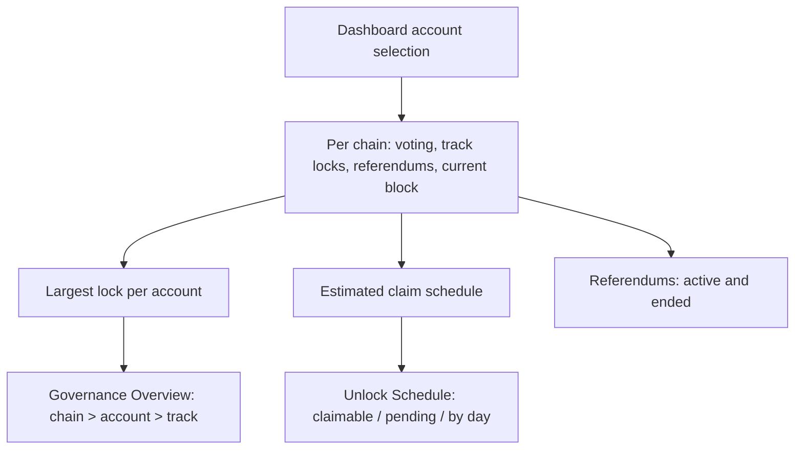

# Dashboard Governance

> Part of the [Feature Map](../README.md) — Last reviewed: 2026-08-19

## Overview

The Dashboard's **Governance** tab: three widgets that answer, for the accounts the user has picked, _how much of my
money is tied up in voting, when do I get it back, and what am I currently voting on_.

Governance costs the user liquidity, and the cost is invisible on the chain explorer: a vote locks tokens for a period
that depends on the conviction, the outcome, and every other vote on the same track. These widgets exist to make that
cost legible — what is locked, what is already claimable, what unlocks on which day, and which referendum each lock came
from.

| Widget                  | The question it answers                                                              |
| ----------------------- | ------------------------------------------------------------------------------------ |
| **Governance Overview** | How much is locked in governance, split by chain and drillable to account and track  |
| **Unlock Schedule**     | What is claimable now, what is still pending, and on which days it unlocks           |
| **Referendums**         | What is being voted on now (and how I voted), and which ended votes still hold locks |

## Who can use it / when it applies

- Gated by the **`dashboard`** feature flag. The Overview and Unlock Schedule widgets additionally render nothing at all
  when the global **show fiat** toggle is off — they lead with a fiat total, and a governance lock with no price behind
  it has nothing to lead with.
- Scoped to the dashboard's **account picker**. With nothing picked, each widget shows the shared "No accounts selected"
  prompt rather than an empty chart.
- Reads **Polkadot Asset Hub and Kusama Asset Hub** — the two chains the app runs governance on.
- Everything is derived from live on-chain voting, track locks and referendum state; nothing here is stored.

## States / scenarios

Every widget follows the same four-state shape, and the distinction that matters is the last two: _still arriving_ and
_nothing there_ are different answers, and only one of them is worth waiting on.

| State        | When it appears                             | What the user sees                                           |
| ------------ | ------------------------------------------- | ------------------------------------------------------------ |
| No selection | The account picker is empty                 | Title + "No accounts selected"                               |
| Loading      | Voting data for a chain has not arrived     | Title + skeletons                                            |
| Empty        | Loaded, and the selection has no governance | "No governance activity found" / "No governance locks found" |
| Populated    | At least one account votes or holds a lock  | The widget's own content                                     |

A chain drops out of every widget when none of the selected accounts votes on it. A user staking only on Polkadot never
sees an empty Kusama row.

## Governance Overview

A donut of the fiat locked per chain, and one row per chain naming the locked amount, how many accounts vote there,
their average conviction and anything already claimable. Clicking a chain opens its breakdown by account; clicking an
account there opens its breakdown by track.

**A lock is the largest of the account's locks, never their sum.** Governance locks on one chain overlap — voting 10 DOT
on one referendum and 10 DOT on another locks 10 DOT, not 20. Summing them would double-count money the user still has.
The same rule holds at every level of the drill-down, so the account rows always add up to the chain row.

**Average conviction is weighted by the amount behind each vote**, so a 1000 DOT vote at 1x and a 1 DOT vote at 6x
report roughly 1x. An unweighted mean would let a token-sized vote dominate the number that describes where the money
is.

## Unlock Schedule

Three figures — **Claimable**, **Pending**, **Delegated** — and a dated list of upcoming unlocks. Claimable and Pending
each open a per-account breakdown; Delegated does not, because delegated balance has no unlock date to break down.

**Upcoming unlocks are grouped by day, not by referendum.** Unlock times are estimated from the current block and the
chain's block time, so they carry hours of error even when the arithmetic is exact; a list of per-referendum timestamps
would advertise a precision that does not exist. Each day's row names the amount, the accounts and the tracks behind it.

When the chain has not reported its block time yet, the pending total is still shown but the dated list is empty — a
total is true without a schedule, a schedule is not true without block time.

## Referendums

Two tabs over the same table: **Active** and **Ended**, both filterable by chain and searchable over the title, the
referendum id and the chain name.

- **Active** — id, track, title, the user's own votes as chips (aye / nay / abstain / split, with counts), the aye–nay
  split, time left, and the referendum's own TVL — the network's whole tally, ayes plus nays, which is the context the
  user's vote sits in rather than a figure about the user. Time left is colour-coded: under a day is critical, under a
  week is a warning. Clicking a row opens the referendum's detail with the per-account votes.
- **Ended** — the outcome (approved, rejected, cancelled, timed out, killed), when it ended, how much is still locked
  and how much of that is unlockable now. The tab exists because an ended referendum is exactly what a user stops
  watching and exactly what keeps holding their tokens.

**A vote's lock outlives the referendum, and only sometimes.** A lock extends past the end only for a vote that backed
the winning side — conviction is the price of being right, not of participating — so a losing vote, an abstention or a
cancelled referendum releases at the end block. The detail modal marks each vote **Unlockable**, **Locked until ~date**,
or **Shadowed**: shadowed means another, longer lock on the same track already covers this one, so releasing it alone
would free nothing.

## Lifecycle

Claim schedules are recomputed only when the block or the underlying voting data actually changes, so scrolling the tab
or reopening a modal does not re-derive them.

## Names on screen

Every account shown — in a chart legend, a breakdown row or a modal title — is rendered through the shared account-name
resolver, so it carries the same name the user sees everywhere else in the app (custom name, address book, on-chain
identity, wallet, then a short address). A breakdown that named an account differently from the sidebar would read as a
different account.

## Related

- **Governance entities** (`entities/governance`) — voting, conviction and claim-schedule maths.
- **Governance page** (`pages/Governance`) — the full governance surface these widgets summarise; unlocking itself
  happens there, not here.
- [`dashboard-portfolio-overview`](../dashboard-portfolio-overview/README.md) — the Overview tab's balance card, where
  governance locks appear as part of the locked share.
