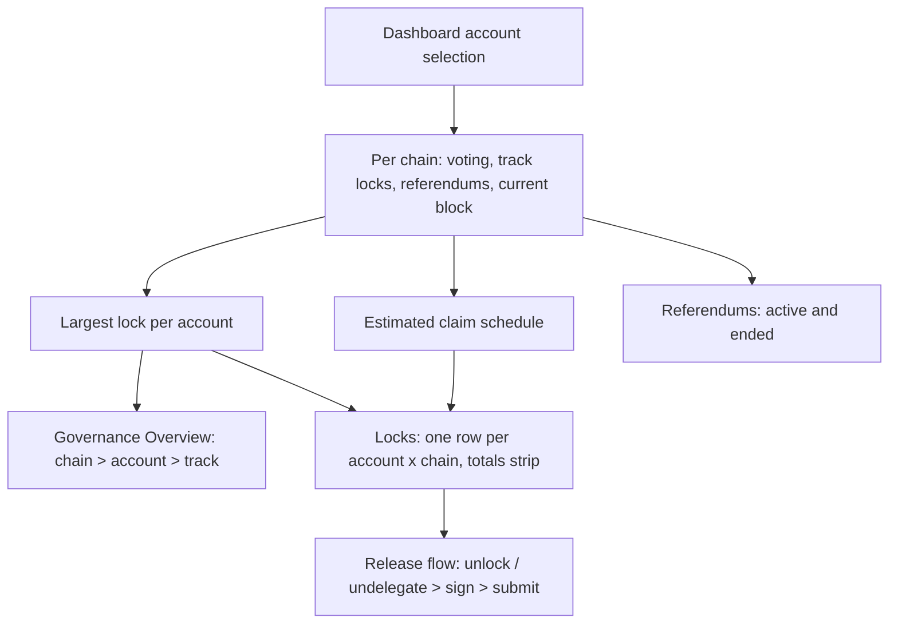

# Dashboard Governance

> Part of the [Feature Map](../README.md) — Last reviewed: 2026-09-04

## Overview

The Dashboard's **Governance** tab: three widgets that answer, for the accounts the user has picked, _how much of my
money is tied up in voting, when do I get it back, and what am I currently voting on_.

Governance costs the user liquidity, and the cost is invisible on the chain explorer: a vote locks tokens for a period
that depends on the conviction, the outcome, and every other vote on the same track. These widgets exist to make that
cost legible — what is locked, what is already claimable, when the rest comes back, and which referendum each lock came
from.

| Widget                  | The question it answers                                                                                                            |
| ----------------------- | ---------------------------------------------------------------------------------------------------------------------------------- |
| **Governance Overview** | How much is locked in governance, split by chain and drillable to account and track                                                |
| **Locks**               | What is claimable, pending and delegated, which account holds which lock, what I can release right now, and take a delegation back |
| **Referendums**         | What is being voted on now (and how I voted), and which ended votes still hold locks                                               |

**The tab reads top-down from the total to the decision.** The default layout puts **Governance Overview** and **Locks**
side by side — the total, then what can be done about it — and **Referendums** full-width beneath them, where the votes
that will create the next locks are still being decided.

That order is the default only. A user who has already arranged this tab keeps their arrangement — the change touches
the fallback, not the stored layouts — and **Reset layout** drops the stored one so the default takes over (and brings
back any widget hidden on the tab).

## Who can use it / when it applies

- Gated by the **`dashboard`** feature flag; the unlock flow the Locks widget dispatches also wants **`governance`**, so
  that widget needs both on. The Overview and Referendums widgets render nothing at all when the global **show fiat**
  toggle is off — both lead with fiat figures. Locks keeps its table without fiat and hides only its totals strip: DOT
  and KSM do not add, so a total without a price has nothing to say, but a lock still does.
- Scoped to the dashboard's **account picker**. With nothing picked, each widget shows the shared "No accounts selected"
  prompt rather than an empty chart.
- Reads **Polkadot Asset Hub and Kusama Asset Hub** — the two chains the app runs governance on.
- Everything is derived from live on-chain voting, track locks and referendum state; nothing here is stored.
- The card's key under the hood is still the old one, so layouts saved before the rename keep their place.
- Like every widget on the grid it can be **hidden** in edit mode and brought back from the header's **"Add widget"**
  menu — see the [Dashboard spec](../../pages/Dashboard/README.md).

## States / scenarios

Every widget follows the same four-state shape, and the distinction that matters is the last two: _still arriving_ and
_nothing there_ are different answers, and only one of them is worth waiting on.

| State        | When it appears                             | What the user sees                                                                                |
| ------------ | ------------------------------------------- | ------------------------------------------------------------------------------------------------- |
| No selection | The account picker is empty                 | Title + "No accounts selected", centred in the card, with a governance-specific prompt            |
| Loading      | Voting data for a chain has not arrived     | Title + a skeleton shaped like the table that is coming (avatar, name, one plate per column)      |
| Empty        | Loaded, and the selection has no governance | "No governance activity found" / "No governance locks found", centred, with a line on what counts |
| Populated    | At least one account votes or holds a lock  | The widget's own content                                                                          |

An empty card is mostly empty space, so its message sits in the middle of it rather than pinned under the title, and the
loading body has the shape of the rows it stands in for — the swap to real data is a fill-in, not a jump.

A chain drops out of every widget when none of the selected accounts holds anything on it. A user staking only on
Polkadot never sees an empty Kusama row.

## Governance Overview

A donut of the fiat locked per chain, and one row per chain naming the locked amount, how many accounts vote there,
their average conviction and anything already claimable. Clicking a chain opens its breakdown by account; clicking an
account there opens its breakdown by track.

**A lock is the largest of the account's locks, never their sum.** Governance locks on one chain overlap — voting 10 DOT
on one referendum and 10 DOT on another locks 10 DOT, not 20. Summing them would double-count money the user still has.
The same rule holds at every level of the drill-down, so the account rows always add up to the chain row.

**Average conviction is weighted by the amount behind each vote**, so a 1000 DOT vote at 1x and a 1 DOT vote at 6x
report roughly 1x. An unweighted mean would let a token-sized vote dominate the number that describes where the money
is.

## Locks

A half-width card with a totals strip and one row per **account × chain**, and an **expand** icon in its header that
opens the same rows full screen with every column and the filters.

**The strip** — **Claimable**, **Pending**, **Delegated** — sums every row in fiat, because DOT and KSM do not add. It
is summed from the same rows the table is built from, so a lock that makes a row is in the total too — and it stays on
the whole position: in full screen a filtered table can show less than the totals above it. The strip disappears when
show fiat is off; the table stays.

**In the card** each row is the account (with its chain's icon), the locked amount with one line under it — how much is
claimable, when the next part releases, or how much is delegated, when there is one of those — and the Action cell.
Three columns fit half the grid; below that the rows scroll sideways rather than crushing amounts into wrapped digits,
and the Action column stays pinned to the right edge so the row's controls never leave the screen. Rows arrive sorted by
claimable, then by locked, so the money the user can take home is on top.

**Full screen** is the same table given the whole window — the configuration the Accounts table and the validator picker
use — with Chain, Claimable, Pending (with its estimated release date), Delegated and Tracks as their own columns, a
**Claimable only** toggle and a chain filter. Pending and Delegated show only while some row has them. Widget and modal
share one table state, so a filter set in the modal is what the next open shows; the card itself does not filter.
Escape, the cross and a click outside close it; nothing is lost by closing. Amounts too small to read — a single-planck
class lock, a fraction of a cent — are labelled `<0.0001 DOT` / `<$0.01` instead of a ten-digit tail.

**Locked is what the chain freezes, not what the votes add up to.** The chain keeps a per-track class lock that only an
explicit `unlock` clears, so a vote removed without one leaves the lock behind with nothing voting on it. The row takes
the larger of the votes' lock and the class lock, which is why an account whose votes are all gone still shows — its
whole lock is claimable, and releasing it is exactly what the widget is for.

**This is the only widget on the tab that acts rather than reports.** Everything else on the Governance tab explains a
number; this one dispatches the [unlock flow](../governance-unlock-flow/README.md) for the row's account, on the row's
chain, for exactly the tracks that have expired — so releasing a lock no longer means leaving the dashboard for the
Governance page. The flow is mounted app-wide rather than inside the widget, so it survives navigation once opened and
opens on top of the full-screen view as readily as on top of the card. The rows need no manual refresh afterwards: they
are derived from live voting and lock data, so a landed release drops out of the table on its own — including one that
lands later, when the last multisig signatory approves.

**A delegation can be taken back from the same row.** An account that delegates shows **Undelegate** beneath its Unlock
verdict (alone, when nothing is claimable and nothing is pending): one click revokes every delegation the account holds
on that chain, whatever the delegate — picking delegates or tracks stays on the Governance page. Revoking does not free
the balance by itself: a delegation with conviction becomes a pending lock that expires after its period, and the row
then offers Unlock for it; a delegation without conviction expires in the same block, so the release adds the `unlock`
to the same transaction and the balance comes back at once. `undelegate` is origin-bound like `remove_vote`: the
delegator's own key, its multisig or a proxy signs, never a bystander paying the fee.

Filtering to a chain or to **Claimable only** can leave nothing on screen; that says "no rows match", not "no locks" —
the two are different answers and read differently.

**The Action cell is a verdict, not a button that sometimes fails.** Each row says what can be done and why, so the user
never clicks into a dead end:

| Row                                     | Action cell                                                                               |
| --------------------------------------- | ----------------------------------------------------------------------------------------- |
| Only a delegation                       | **Undelegate** + the number of tracks; the tooltip says what revoking does to the balance |
| Nothing claimable                       | "Nothing claimable", with the estimated release date when one is known                    |
| Claimable, but the key never signs      | "Watch-only" — a `remove_vote` is origin-bound and cannot be paid for by proxy            |
| Claimable, signed by the account itself | **Unlock** + the amount that comes back                                                   |
| Claimable, signed by a multisig         | **Unlock** + "needs signatories" — signing opens a pending operation                      |
| Claimable, released by a local payer    | **Unlock** (secondary) + "permissionless" — `unlock(track, target)` takes any origin      |
| Claimable, but nothing local can sign   | **Unlock**, disabled, naming the reason                                                   |
| Delegates too                           | **Undelegate** beneath whichever of the above applies                                     |
| Delegation, but the key never signs     | **Undelegate**, disabled — "must be signed by the delegator"                              |
| Delegation, signed by a multisig        | **Undelegate** + "needs signatories"                                                      |
| Chain not connected                     | Every button disabled — nothing signs without a live connection                           |

**The claim is re-derived at the moment of the click.** The row's figures come from a periodic snapshot; a referendum
that ended in between adds a required `remove_vote`, so the schedule is recomputed against the live head before the flow
opens, and the fresh actions are what gets signed. When the live head no longer backs the button — the lock was released
elsewhere, or the fresh `remove_vote` needs a key nobody holds — the click says so in a toast instead of opening
nothing; the row catches up on the next snapshot. Undelegate needs no re-derivation — delegations only move through the
user's own transactions and the rows follow the live voting subscription — but a click on a row already redrawn without
them says so in a toast.

**Who pays is a tie the selected wallet wins.** A permissionless release can be paid by any local signer, and the same
key can live in more than one wallet; nothing else tells the candidates apart, and the flow's signing-path chooser picks
a route _for_ the initiator rather than the initiator itself, so the choice would otherwise be silent. The row prefers
the selected wallet's account and falls back to the first signer. The payer's balance is not checked here — the flow's
fee validation reports an unaffordable fee once the fee is known.

## Referendums

Two tabs over the same table: **Active** and **Ended**, both filterable by chain and searchable over the title, the
referendum id and the chain name.

- **Active** — id, track, title, the user's own votes as chips (aye / nay / abstain / split, with counts), the aye–nay
  split, time left, and the referendum's own TVL — the network's whole tally, ayes plus nays, which is the context the
  user's vote sits in rather than a figure about the user. Time left is colour-coded: under a day is critical, under a
  week is a warning. The Votes column is there only while one of the selected accounts has voted on something — a column
  of dashes says nothing and takes width from the title. Clicking a row opens the app's own referendum modal — the same
  one the Governance page uses, so the proposal can be read and voted on without leaving the dashboard. That modal reads
  its chain from the single global governance network selector, so the row's chain is selected first; a row whose chain
  has no live connection is dimmed and inert. Opened from here the modal names its chain next to the title and says
  which wallet a vote is cast from — the dashboard's account selection is not what the vote acts for. Once the modal
  closes, the selector is put back to the chain the user had chosen on the Governance page: the dashboard only borrowed
  it.
- **Ended** — the outcome (approved, rejected, cancelled, timed out, killed), when it ended, how much is still locked
  and how much of that is unlockable now. The tab exists because an ended referendum is exactly what a user stops
  watching and exactly what keeps holding their tokens.

**A vote's lock outlives the referendum, and only sometimes.** A lock extends past the end only for a vote that backed
the winning side — conviction is the price of being right, not of participating — so a losing vote, an abstention or a
cancelled referendum releases at the end block. The Ended detail modal marks each vote **Unlockable**, **Locked until
~date**, or **Shadowed**: shadowed means another, longer lock on the same track already covers this one, so releasing it
alone would free nothing.

## Lifecycle

Claim schedules are recomputed only when the block or the underlying voting data actually changes, so scrolling the tab
or reopening a modal does not re-derive them.

## Names on screen

Every account shown — in a chart legend, a breakdown row or a modal title — is rendered through the shared account-name
resolver, so it carries the same name the user sees everywhere else in the app (custom name, address book, on-chain
identity, wallet, then a short address). A breakdown that named an account differently from the sidebar would read as a
different account.

## Related

- **Governance entities** (`entities/governance`) — voting, conviction and claim-schedule maths.
- **Governance page** (`pages/Governance`) — the full governance surface these widgets summarise.
- [`governance-unlock-flow`](../governance-unlock-flow/README.md) — the confirm/sign/submit flow the Locks widget's
  Unlock and Undelegate buttons dispatch; mounted app-wide, and blind to everything the dashboard knows.
- [`dashboard-portfolio-overview`](../dashboard-portfolio-overview/README.md) — the Overview tab's balance card, where
  governance locks appear as part of the locked share.
