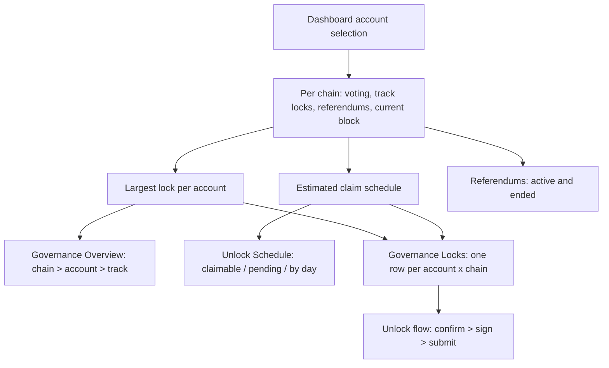

# Dashboard Governance

> Part of the [Feature Map](../README.md) — Last reviewed: 2026-09-01

## Overview

The Dashboard's **Governance** tab: four widgets that answer, for the accounts the user has picked, _how much of my
money is tied up in voting, when do I get it back, and what am I currently voting on_.

Governance costs the user liquidity, and the cost is invisible on the chain explorer: a vote locks tokens for a period
that depends on the conviction, the outcome, and every other vote on the same track. These widgets exist to make that
cost legible — what is locked, what is already claimable, what unlocks on which day, and which referendum each lock came
from.

| Widget                  | The question it answers                                                              |
| ----------------------- | ------------------------------------------------------------------------------------ |
| **Governance Overview** | How much is locked in governance, split by chain and drillable to account and track  |
| **Unlock Schedule**     | What is claimable now, what is still pending, and on which days it unlocks           |
| **Referendums**         | What is being voted on now (and how I voted), and which ended votes still hold locks |
| **Governance Locks**    | Which account holds which lock, and which of them I can release right now            |

**The tab opens on what is live, not on what is locked.** The default layout leads with **Referendums** full-width — the
one widget about decisions still being made, and the only reason to come back daily — then **Governance Locks**
full-width beneath it, and finally **Governance Overview** and **Unlock Schedule** side by side. The two summaries sit
last on purpose: they explain a total the user already met on the Overview tab, while the two tables above are where
something can actually be done.

That order is the default only. A user who has already arranged this tab keeps their arrangement — the change touches
the fallback, not the stored layouts — and **Reset layout** drops the stored one so the default takes over (and brings
back any widget hidden on the tab).

## Who can use it / when it applies

- Gated by the **`dashboard`** feature flag; the unlock flow the Locks widget dispatches also wants **`governance`**, so
  releasing needs both on. The Overview and Unlock Schedule widgets additionally render nothing at all when the global
  **show fiat** toggle is off — they lead with a fiat total, and a governance lock with no price behind it has nothing
  to lead with.
- Scoped to the dashboard's **account picker**. With nothing picked, each widget shows the shared "No accounts selected"
  prompt rather than an empty chart.
- Reads **Polkadot Asset Hub and Kusama Asset Hub** — the two chains the app runs governance on.
- Everything is derived from live on-chain voting, track locks and referendum state; nothing here is stored.
- Like every widget on the grid it can be **hidden** in edit mode and brought back from the header's **"Add widget"**
  menu — see the [Dashboard spec](../../pages/Dashboard/README.md).

## States / scenarios

Every widget follows the same four-state shape, and the distinction that matters is the last two: _still arriving_ and
_nothing there_ are different answers, and only one of them is worth waiting on.

| State        | When it appears                             | What the user sees                                           |
| ------------ | ------------------------------------------- | ------------------------------------------------------------ |
| No selection | The account picker is empty                 | Title + "No accounts selected"                               |
| Loading      | Voting data for a chain has not arrived     | Title + skeletons                                            |
| Empty        | Loaded, and the selection has no governance | "No governance activity found" / "No governance locks found" |
| Populated    | At least one account votes or holds a lock  | The widget's own content                                     |

A chain drops out of every widget when none of the selected accounts votes on it. A user staking only on Polkadot never
sees an empty Kusama row.

## Governance Overview

A donut of the fiat locked per chain, and one row per chain naming the locked amount, how many accounts vote there,
their average conviction and anything already claimable. Clicking a chain opens its breakdown by account; clicking an
account there opens its breakdown by track.

**A lock is the largest of the account's locks, never their sum.** Governance locks on one chain overlap — voting 10 DOT
on one referendum and 10 DOT on another locks 10 DOT, not 20. Summing them would double-count money the user still has.
The same rule holds at every level of the drill-down, so the account rows always add up to the chain row.

**Average conviction is weighted by the amount behind each vote**, so a 1000 DOT vote at 1x and a 1 DOT vote at 6x
report roughly 1x. An unweighted mean would let a token-sized vote dominate the number that describes where the money
is.

## Unlock Schedule

Three figures — **Claimable**, **Pending**, **Delegated** — and a dated list of upcoming unlocks. Claimable and Pending
each open a per-account breakdown; Delegated does not, because delegated balance has no unlock date to break down.

**Upcoming unlocks are grouped by day, not by referendum.** Unlock times are estimated from the current block and the
chain's block time, so they carry hours of error even when the arithmetic is exact; a list of per-referendum timestamps
would advertise a precision that does not exist. Each day's row names the amount, the accounts and the tracks behind it.

When the chain has not reported its block time yet, the pending total is still shown but the dated list is empty — a
total is true without a schedule, a schedule is not true without block time.

## Referendums

Two tabs over the same table: **Active** and **Ended**, both filterable by chain and searchable over the title, the
referendum id and the chain name.

- **Active** — id, track, title, the user's own votes as chips (aye / nay / abstain / split, with counts), the aye–nay
  split, time left, and the referendum's own TVL — the network's whole tally, ayes plus nays, which is the context the
  user's vote sits in rather than a figure about the user. Time left is colour-coded: under a day is critical, under a
  week is a warning. Clicking a row opens the app's own referendum modal — the same one the Governance page uses, so the
  proposal can be read and voted on without leaving the dashboard. That modal reads its chain from the single global
  governance network selector, so the row's chain is selected first; clicking a row whose chain has no live connection
  only says so in a toast. That selection is sticky — the same way the Governance page remembers the chain the user last
  switched to — so after opening a Kusama referendum here the Governance page opens on Kusama until another chain is
  chosen.
- **Ended** — the outcome (approved, rejected, cancelled, timed out, killed), when it ended, how much is still locked
  and how much of that is unlockable now. The tab exists because an ended referendum is exactly what a user stops
  watching and exactly what keeps holding their tokens.

**A vote's lock outlives the referendum, and only sometimes.** A lock extends past the end only for a vote that backed
the winning side — conviction is the price of being right, not of participating — so a losing vote, an abstention or a
cancelled referendum releases at the end block. The Ended detail modal marks each vote **Unlockable**, **Locked until
~date**, or **Shadowed**: shadowed means another, longer lock on the same track already covers this one, so releasing it
alone would free nothing.

## Governance Locks

One row per **account × chain**: the account, the chain, the locked amount (the largest lock, never the sum), what is
claimable, what is still pending with its estimated release date, what is delegated, the tracks behind it, and — the
point of the widget — a button that releases it.

**Locked is what the chain freezes, not what the votes add up to.** The chain keeps a per-track class lock that only an
explicit `unlock` clears, so a vote removed without one leaves the lock behind with nothing voting on it. The row takes
the larger of the votes' lock and the class lock, which is why an account whose votes are all gone still shows — its
whole lock is claimable, and releasing it is exactly what the widget is for. The header carries a **Claimable only**
toggle and a chain filter; rows arrive sorted by claimable, then by locked, so the money the user can take home is on
top.

**This is the only widget on the tab that acts rather than reports.** Everything else on the Governance tab explains a
number; this one dispatches the [unlock flow](../governance-unlock-flow/README.md) for the row's account, on the row's
chain, for exactly the tracks that have expired — so releasing a lock no longer means leaving the dashboard for the
Governance page. The flow is mounted app-wide rather than inside the widget, so it survives navigation once opened. The
rows need no manual refresh afterwards: they are derived from live voting and lock data, so a landed release drops out
of the table on its own — including one that lands later, when the last multisig signatory approves.

Filtering to a chain or to **Claimable only** can leave nothing on screen; that says "no rows match", not "no locks" —
the two are different answers and read differently.

**The Action cell is a verdict, not a button that sometimes fails.** Each row says what can be done and why, so the user
never clicks into a dead end:

| Row                                     | Action cell                                                                          |
| --------------------------------------- | ------------------------------------------------------------------------------------ |
| Nothing claimable, everything delegated | "No unlock date" — delegated balance releases only when the delegation does          |
| Nothing claimable                       | "Nothing claimable", with the estimated release date when one is known               |
| Claimable, but the key never signs      | "Watch-only" — a `remove_vote` is origin-bound and cannot be paid for by proxy       |
| Claimable, signed by the account itself | **Unlock**                                                                           |
| Claimable, signed by a multisig         | **Unlock** + "needs signatories" — signing opens a pending operation                 |
| Claimable, released by a local payer    | **Unlock** (secondary) + "permissionless" — `unlock(track, target)` takes any origin |
| Claimable, but nothing local can sign   | **Unlock**, disabled, naming the reason                                              |
| Chain not connected                     | **Unlock**, disabled — nothing signs without a live connection                       |

**The claim is re-derived at the moment of the click.** The row's figures come from a periodic snapshot; a referendum
that ended in between adds a required `remove_vote`, so the schedule is recomputed against the live head before the flow
opens, and the fresh actions are what gets signed. When the live head no longer backs the button — the lock was released
elsewhere, or the fresh `remove_vote` needs a key nobody holds — the click says so in a toast instead of opening
nothing; the row catches up on the next snapshot.

**Who pays is a tie the selected wallet wins.** A permissionless release can be paid by any local signer, and the same
key can live in more than one wallet; nothing else tells the candidates apart, and the flow's signing-path chooser picks
a route _for_ the initiator rather than the initiator itself, so the choice would otherwise be silent. The row prefers
the selected wallet's account and falls back to the first signer. The payer's balance is not checked here — the flow's
fee validation reports an unaffordable fee once the fee is known.

## Lifecycle

Claim schedules are recomputed only when the block or the underlying voting data actually changes, so scrolling the tab
or reopening a modal does not re-derive them.

## Names on screen

Every account shown — in a chart legend, a breakdown row or a modal title — is rendered through the shared account-name
resolver, so it carries the same name the user sees everywhere else in the app (custom name, address book, on-chain
identity, wallet, then a short address). A breakdown that named an account differently from the sidebar would read as a
different account.

## Related

- **Governance entities** (`entities/governance`) — voting, conviction and claim-schedule maths.
- **Governance page** (`pages/Governance`) — the full governance surface these widgets summarise.
- [`governance-unlock-flow`](../governance-unlock-flow/README.md) — the confirm/sign/submit flow the Locks widget's
  Unlock button dispatches; mounted app-wide, and blind to everything the dashboard knows.
- [`dashboard-portfolio-overview`](../dashboard-portfolio-overview/README.md) — the Overview tab's balance card, where
  governance locks appear as part of the locked share.
