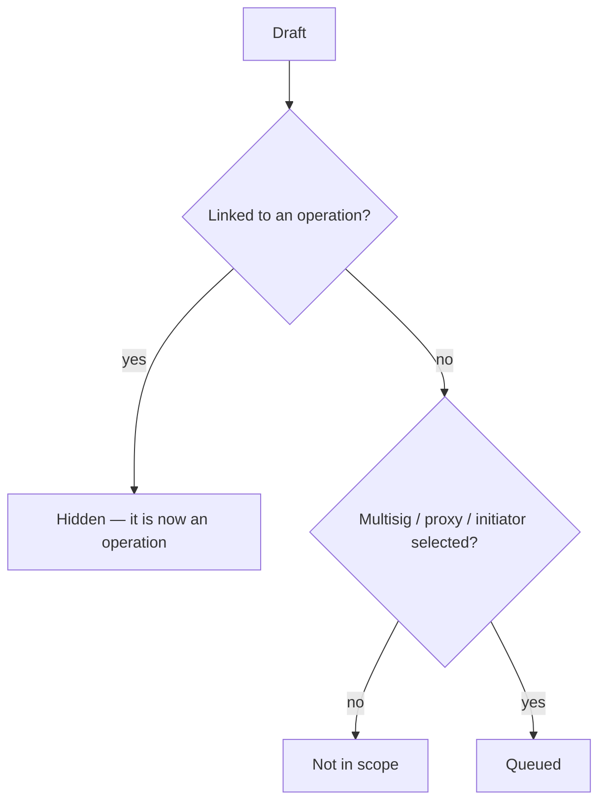

# Operations Queue

> Part of the [Feature Map](../README.md) — Last reviewed: 2026-08-20

## Overview

A Dashboard card answering "what needs me next?" for the currently selected accounts. It collects the two kinds of work
that are blocked on the user personally — **Drafts** waiting to be submitted on chain, and multisig operations
**Awaiting signature** from a signatory they control — into one date-grouped list, each row deep-linking to the full
operation view.

The card is deliberately an _action_ queue, not a history: an item appears only while the user can still do something
about it, and leaves the moment they (or a co-signatory) do. Anything already in flight or finished belongs to the
Operations page, not here.

## Who can use it / when it applies

- Gated by the **`operationsQueueWidget`** feature flag.
- Needs at least one account selected in the dashboard's account picker; with an empty selection the card renders its
  own "No accounts selected" state rather than an empty queue.
- The **Drafts** subsection additionally requires the backend to be reachable and the wallet to hold draft-read
  permission. Without that, drafts are absent entirely and the card shows multisig signatures only — a local-only wallet
  still gets a useful queue.
- The card is a dashboard widget with a default place and a default size on the grid, and a minimum size below which it
  stops being readable. Users arrange and resize widgets themselves in edit mode — and may hide the card outright,
  bringing it back from the header's **"Add widget"** menu — so both are defaults rather than guarantees.

## States / scenarios

| State           | When it appears                                              | What the user sees                                      |
| --------------- | ------------------------------------------------------------ | ------------------------------------------------------- |
| Hidden          | `operationsQueueWidget` flag off, or the user hid the widget | No card at all                                          |
| No selection    | No accounts selected                                         | Title + "Select accounts above" prompt                  |
| Loading         | Drafts available but not yet fetched                         | Title only; neither subsection nor the empty state      |
| Empty           | Loaded, and both subsections are empty                       | Title + "Nothing awaiting your action"                  |
| Drafts only     | Scoped drafts exist, nothing awaits signature                | Drafts subsection (accent count badge)                  |
| Signatures only | Ops await the user, no drafts (or drafts unavailable)        | Awaiting-signature subsection (negative count badge)    |
| Both            | Both sets non-empty                                          | Drafts first, then Awaiting signature; the list scrolls |

Each subsection carries a count badge, and both are omitted rather than shown at zero — an empty subsection header would
read as a state to resolve when there is nothing to do.

### Which drafts appear

A draft is queued when it is **visible** (no operation has linked back to it yet — once submitted, the operation itself
takes over the row) **and** in scope: any of its multisig, proxy, or initiator account is in the current selection. The
three-way match matters because the person who should act on a draft is not always its author — a proxy or initiator
sees the work waiting on them.

Each draft row offers a **Submit** button, disabled with a tooltip explaining the block: not signed in to the backend,
the draft carries no call data, or the multisig account is not in this wallet. The reason is always stated — a dead
button with no explanation is the state this gating exists to avoid.

### Which operations await signature

An operation is queued only when **all** of these hold: it is still `Pending`, it is not
[awaiting its final status](../multisig-operations/README.md#awaiting-the-final-status) (such an operation already
resolved on-chain — only the outcome is unknown, so there is nothing left to sign), its multisig account is in the
current selection, and the user controls at least one signatory that can still act on it. That last check is the
load-bearing one — it excludes operations the user has _already_ approved, operations where they hold no signatory at
all, and signatories on chains the account cannot use. Watch-only signatories never count: they cannot sign, so
surfacing the operation as actionable would be a lie.

Rows show the operation's method, chain, multisig name, description, transfer amount where one can be extracted, and the
approval status, plus the same approve/reject actions as the Operations page.

## Lifecycle

The user opens the Dashboard and picks accounts; the card resolves drafts and pending multisig operations for that
selection and renders them newest-first, grouped under date headers (most recent day first). From there every path
leaves the card: **Submit** opens the draft submission flow in place, approve/reject runs the multisig action inline,
and clicking a row navigates to the draft or the multisig operation detail. Acting on an item is what removes it — a
submitted draft becomes an operation and drops out of Drafts, and a signed operation stops being actionable and drops
out of Awaiting signature.

The card has no error state: an unreachable backend degrades to "drafts unavailable" (the subsection is simply absent),
and chains or accounts that cannot be resolved drop the affected rows rather than failing the card.

## Related

- `pages/Dashboard` — hosts the widget slot and owns the account selection this card scopes to.
- [`drafts`](../drafts/README.md) — owns draft visibility, the submit gate, and the submission flow; this card is one of
  its two consumers, alongside the Operations page's Drafts section. Visibility rules live there so both views agree on
  what "pending" means.
- [`multisig-operations`](../multisig-operations/README.md) — supplies the operation icon, actions, and the transfer
  amount extraction reused in the rows here.
- `domains/network` — the multisig operations list and the signatory resolution behind the awaiting-signature rule.
