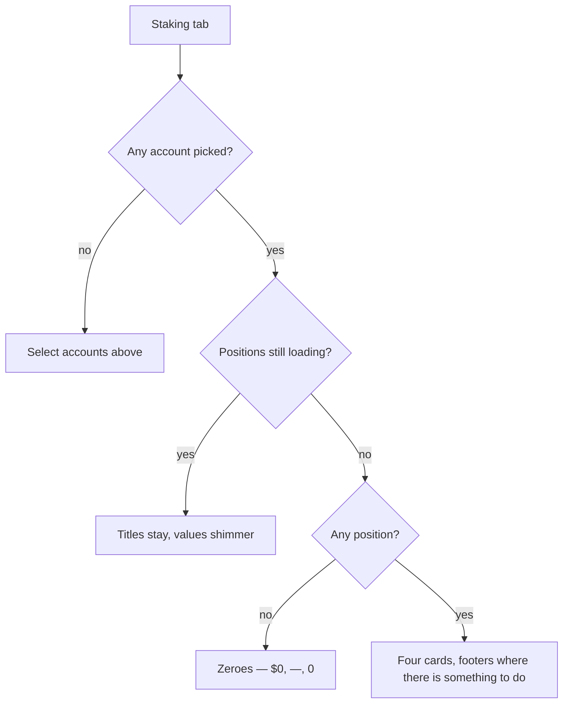

# Staking KPI Row

> Part of the [Feature Map](../README.md) — Last reviewed: 2026-07-27

## Overview

The top strip of the Dashboard's **Staking** tab: four cards that answer, at a glance, _how much am I staking, what is
it earning, who is earning it, and is anything about to be lost_. Each card is a door — clicking it opens a drill-down
with the per-position detail behind the number, and two of them carry a call-to-action footer for money that needs the
user to do something about it.

The row is deliberately **multi-chain and multi-asset**. Token amounts are never summed across assets: a total is either
fiat (`$29.6M`) or a list (`5.38M DOT + 60K KSM`). Anything else would invent a number that does not exist.

## Who can use it / when it applies

- Gated by the **`dashboard`** feature flag.
- Scoped twice: the underlying positions belong to the **selected wallet**, and the row additionally follows the
  **dashboard's own account picker**. An account the user unticks disappears from every figure and every drill-down row.
- With no accounts selected the row renders the shared "Select accounts above" message instead of four empty cards.
- Fiat figures need a price feed for the chain's staking asset. A chain without one still contributes its **token**
  amount to the sub-lines and drill-down rows; only its fiat share is zero. It is never silently dropped.

## States / scenarios

| State           | When it appears                                | What the user sees                                                               |
| --------------- | ---------------------------------------------- | -------------------------------------------------------------------------------- |
| No selection    | The dashboard account picker is empty          | One card-width message, no KPI cards                                             |
| Loading         | The positions aggregate is still resolving     | Card titles in place, values and sub-lines shimmering, no layout shift           |
| Empty           | Loaded, the selection stakes nothing           | `$0`, a grey `—` for APY, `0` nominations — **not** skeletons                    |
| Populated       | At least one position                          | Four figures with sub-lines                                                      |
| Unbonding       | Something is unbonding or already withdrawable | A footer on Total staked with the amounts, a withdrawable chip and a Redeem link |
| Unclaimed       | Something is unclaimed                         | A footer on Rewards with the amount, an expiry chip and a Claim link             |
| Drill-down open | A card or a footer link is clicked             | The matching modal                                                               |

**Empty is an answer, not a wait.** Once the aggregate reports it is done, zero positions produce zeroes. Showing
skeletons there would tell a user who genuinely stakes nothing that the app is still thinking, forever.

**Footers drop entirely when empty.** There is no "Nothing to claim" placeholder: the footer exists to prompt an action,
and an empty prompt is noise on a surface people scan rather than read. Card heights are fixed and the footer is pinned
to the bottom, so a footer appearing — or a shimmer resolving — never moves the row.

### The four cards

- **Total staked** — the fiat total, with a per-asset sub-line. Its footer merges what is still unbonding with what has
  already matured, because a position whose chunks have all matured has nothing "unbonding" left yet is precisely the
  one that needs the Redeem link. A green chip counts the positions with something withdrawable.
- **Est. APY** — a **stake-weighted** blend of the per-chain network APYs, weighted by the **fiat value of the earning
  stake only**. Positions that are bonded-but-idle, waiting for an election, or not exposed contribute nothing: the card
  answers "what is the stake that _is_ earning earning", so an idle ledger must not halve it. A chain whose APY is
  unknown is skipped rather than counted as zero, for the same reason. With nothing weighable the card shows a grey em
  dash instead of a confident `0.0%`.
- **Active nominations** — distinct validators actually backing a position in the active era, counted **per chain**: the
  same validator key elected on Polkadot and on Kusama is two validators, because it is two rewards.
- **Rewards** — what the selection earned over the last 30 days, plus an unclaimed footer. The window is anchored to UTC
  midnight rather than to "now", so re-opening the tab does not refetch the same 30 days under a new key.

### Reward expiry

Staking payouts can only be claimed for the last **84 eras**; after that the reward is gone. The chip on the Rewards
footer counts down to the moment the **oldest** unclaimed era falls out of that window, coloured red under two weeks,
amber up to a month, green beyond, with a tooltip explaining the rule — most people have never heard of the claim window
until a reward silently expires. Eras are converted to days through the chain's own era duration, falling back to one
era per day when the chain cannot supply an anchor.

### Drill-downs

- **Est. APY / Active nominations** open the same modal: a donut over the positions plus one row each, hover-linked in
  both directions — the donut centre swaps to the hovered row, and hovering a row dims the other segments. A single
  position renders as a full ring rather than disappearing.
- **Rewards** opens the claim drill-down: a donut rail with the unclaimed total and the soonest expiry, a table of
  Account / Earned / Unclaimed / Eras with a select-all and per-row checkboxes, and a footer that totals the selection
  per asset plus its fiat. Rows that **cannot** be claimed — watch-only accounts, and accounts with nothing outstanding
  — are dimmed and uncheckable, but stay visible: their absence would read as a bug. Multisig and proxied accounts stay
  selectable; the flow behind the claim differs, the right to claim does not.
- **Total staked** opens the positions drill-down: the same donut over staked value, a table of Account / Staked /
  Unbonding / actions with a chip per unlocking chunk (amber with a countdown while locked, green once ready), and
  Redeem / Unbond buttons.

Both 940px drill-downs offer **Export CSV**, which writes the address the user sees and full-precision token amounts —
the opposite of the abbreviated `5.38M` on screen, because a spreadsheet is where people do arithmetic.

### Actions and access modes

An action the account's access mode does not allow is **absent**, not greyed out — a watch-only row simply has no
buttons. Everything else is a question of _which_ flow, not _whether_.

The row itself never runs a transaction. Claim, Redeem and Unbond publish a request carrying the selected positions or
payouts, and the staking flows own everything from there. Until a flow declares itself connected, those primary buttons
render **disabled with a tooltip** saying so, rather than firing an event into the void.

## Lifecycle

The user opens the Staking tab; the cards shimmer while the positions aggregate resolves, then settle into figures. From
there everything is local: click a card or a footer link to open its drill-down, hover the donut, tick rows, export a
CSV. The only outbound step is a claim/redeem/unbond request handed to a staking flow, which takes over from the modal.

Nothing here starts a chain subscription on mount — ledgers, nominations, eras and exposures are driven by the positions
aggregate. The row does drive three of its own reads (network APY, the 30-day reward window, and the unclaimed payout
scan per stash), each through the shared ref-counted pools so a second card asking for the same data joins the request
in flight instead of duplicating it.

## Related

- [`staking-positions`](../../aggregates/staking-positions/README.md) — the positions and totals every card is derived
  from, and the owner of the underlying subscriptions.
- `domains/staking` — network APY, reward history, the unclaimed-payout scan and the claim window itself.
- `features/dashboard-staking-positions` — the positions table below this row, and the owner of the access-mode
  resolution this row reuses.
- `features/dashboard-portfolio-overview` — the Overview tab's equivalent card, and the house pattern for fiat, donut
  and drill-down behaviour followed here.
- `pages/Dashboard` — hosts the staking widget slot and owns the account selection.
