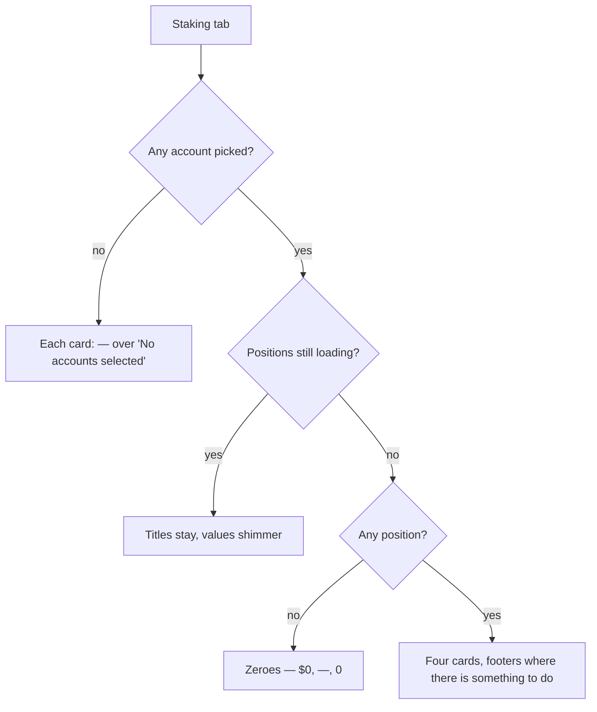

# Staking KPI Cards

> Part of the [Feature Map](../README.md) — Last reviewed: 2026-08-25

## Overview

Four cards on the Dashboard's **Staking** tab that answer, at a glance, _how much am I staking, what is it earning, who
is earning it, and is anything about to be lost_. Each card is a door — clicking it opens a drill-down with the
per-position detail behind the number, and two of them carry a call-to-action footer for money that needs the user to do
something about it.

**Four separate dashboard widgets, not a row.** Each card is its own DI feature (`dashboard/staking-total-staked`,
`-apy`, `-nominations`, `-rewards`), so edit mode gives each one its own drag handle and the user can put any card
anywhere on the tab — or between the Positions table and the rewards chart. They ship as one module because they share a
data layer, not a layout: every card assembles its figures from the same hook over the same stores, so a card and its
drill-down can never disagree about a number. Layouts saved before the split are migrated in place by the dashboard
model, so the cards do not jump to the bottom of an arranged tab.

The cards are deliberately **multi-chain and multi-asset**. Token amounts are never summed across assets: a total is
either fiat (`$29.6M`) or a list (`5.38M DOT + 60K KSM`). Anything else would invent a number that does not exist.

## Who can use it / when it applies

- Gated by the **`dashboard`** feature flag.
- Scoped by the **dashboard's own account picker** and nothing else — the positions aggregate answers for the picked
  accounts across every wallet, and the wallet selected in wallet management plays no part. An account the user unticks
  disappears from every figure and every drill-down row.
- With no accounts selected each card keeps its shape and shows an em dash over "No accounts selected", and stops being
  clickable. A quarter-width card has no room for the two-line block the full-width widgets use, and zeroes would claim
  a fact nobody established.
- Fiat figures need a price feed for the chain's staking asset. A chain without one still contributes its **token**
  amount to the sub-lines and drill-down rows; only its fiat share is zero. It is never silently dropped.
- Like every widget on the grid it can be **hidden** in edit mode and brought back from the header's **"Add widget"**
  menu — see the [Dashboard spec](../../pages/Dashboard/README.md).

## States / scenarios

| State           | When it appears                                | What the user sees                                                     |
| --------------- | ---------------------------------------------- | ---------------------------------------------------------------------- |
| No selection    | The dashboard account picker is empty          | Four cards, each a grey em dash, none clickable                        |
| Loading         | The positions aggregate is still resolving     | Card titles in place, values and sub-lines shimmering, no layout shift |
| Empty           | Loaded, the selection stakes nothing           | `$0`, a grey `—` for APY, `0` nominations — **not** skeletons          |
| Populated       | At least one position                          | Four figures with sub-lines                                            |
| Unbonding       | Something is unbonding or already withdrawable | A footer on Total staked with the amounts and a Redeem link            |
| Unclaimed       | Something is unclaimed                         | A footer on Rewards with the amount and a Claim link                   |
| Drill-down open | A card or a footer link is clicked             | The matching modal                                                     |

**Empty is an answer, not a wait.** Once the aggregate reports it is done, zero positions produce zeroes. Showing
skeletons there would tell a user who genuinely stakes nothing that the app is still thinking, forever.

**Footers drop entirely when empty.** There is no "Nothing to claim" placeholder: the footer exists to prompt an action,
and an empty prompt is noise on a surface people scan rather than read. Card heights are fixed and the footer is pinned
to the bottom, so a footer appearing — or a shimmer resolving — never moves the card.

### The four cards

- **Total staked** — the fiat total of the **active** stake, with a per-asset sub-line; what is unbonding is not in it,
  so the card and its footer never count the same planck twice. The footer merges what is still unbonding with what has
  already matured, because a position whose chunks have all matured has nothing "unbonding" left yet is precisely the
  one that needs the Redeem link.
- **Est. APY** — a **stake-weighted** blend of the per-chain network APYs, weighted by the **fiat value of the earning
  stake only**. Positions that are bonded-but-idle, waiting for an election, or not exposed contribute nothing: the card
  answers "what is the stake that _is_ earning earning", so an idle ledger must not halve it. A chain whose APY is
  unknown is skipped rather than counted as zero, for the same reason. With nothing weighable the card shows a grey em
  dash instead of a confident `0.0%`.

  A footer line — `network avg 14.2% · 30d` — gives the number something to be judged against. Unlike the headline,
  which falls back to the NPoS inflation curve when a chain reports no era reward, the benchmark is **realized-only**:
  the mean of what the chain's last ~30 days of completed eras actually paid, net of the current median commission, and
  unmeasurable is left `null` rather than guessed at from the curve — a benchmark nobody can verify against a real
  payout is worse than no benchmark. It is blended the same way as the headline, by the same fiat weights, and shown
  only once it is complete: not loading, a headline to sit beside, a benchmark that resolved, full coverage of the
  earning stake, and a contributing chain set exactly equal to the headline's — the two readings fail independently (the
  headline still has a curve fallback, the benchmark does not), and a benchmark covering more or fewer chains than the
  figure beside it is a false comparison in either direction. A benchmark that could not measure a chain holding part of
  the stake would describe a different portfolio than the headline next to it, so it stays hidden rather than being
  presented as "the" network average.

- **Nominated validators** — how many distinct validators the selection nominates, counted **per chain**: the same key
  elected on Polkadot and on Kusama is two validators, because it is two nomination sets and two rewards. The subline
  carries how many of them the era actually backs, which is what the card used to lead with. The headline moved because
  the question people bring to it is coverage — "who am I spread across" — and a count of _active_ validators silently
  omits every nomination that was not elected.
- **Rewards** — what the selection earned over the last 30 days, plus an unclaimed footer. The window is anchored to UTC
  midnight rather than to "now", so re-opening the tab does not refetch the same 30 days under a new key.

### Filters on the rewards drill-down

Three, and they compose: **network**, **account** and **period**.

- **Network** appears only when the selection stakes on more than one — a filter with a single option is furniture.
  Built from the rows themselves, never a hard-coded list of chains.
- **Account** is the rail under the donut rather than a separate control — headed "My accounts", because the selection's
  accounts can stand behind a validator as nominators _or be the validator_: an account that runs one carries a
  Validator chip on its rail entry, exactly the chip the positions table uses. The same list answers "which of my
  accounts is behind this" and "show me only that one". It is built from the network-scoped data but **not** from the
  account-scoped data, so the filter never hides its own alternatives, and clicking the active entry clears it.
- Both narrow the table, the donut, the totals **and** the export together. An export that silently ignored the filters
  on screen would be the worst of the three.

The donut and the list are hover-linked both ways, and pointing at a slice **scrolls its row into view** — following a
slice with the eye is useless when its row is below the fold. Only a hover that came from the donut scrolls; scrolling
because the pointer is already on a row would fight the user's own scrolling.

### Cards abbreviate, drill-downs do not

A card enables the thousands shorthand — it has room for `71.2K DOT`, not `71,200.4821 DOT`. A drill-down is the "one
click away" that abbreviation promises, so its tables print the amount in full: `106.66 DOT`, never `0.1K DOT`. Ten rows
of `0.1K` cannot be compared at all, and a hundred tokens read as a rounding error. Millions keep their `M` everywhere —
nobody compares eight digits.

**One unclaimed era per validator is the normal steady state**, not an anomaly. Payouts are permissionless and submitted
by whoever gets there first, so the most recently closed era is unpaid on every validator the selection backs until
someone calls it in. A validator carrying _many_ eras is the signal worth reading — that is money nobody has collected,
and the footer counts down to the era it expires in.

### Loading states say what they know

Two answers arrive independently — the payout scan (what is unclaimed) and the era replay (what was earned) — so the
screen shows each column's own state rather than one global spinner:

- The table renders **its own header and column widths** with the cells blanked, so nothing shifts when the rows land.
- **Earned** shimmers per row while its chain is still being attributed; **Unclaimed** shimmers per row while its
  chain's payout scan is out. Printing `0 DOT` in either would state a fact nobody has established.
- The footer says _"Checking what is still unclaimed…"_ instead of _"Nothing outstanding"_ until the scan answers. The
  second sentence is a claim about the user's money and must never be guessed.
- Once an answer arrives and it is empty, the shimmer stops and a sentence takes over. Shimmering at a user who
  genuinely earned nothing tells them the app is still thinking, forever.

Measured cold on a one-account wallet over 30 days: **~7 s and ~131 KB** to first full render, dominated by the era
replay.

### What the drill-down costs to render

Three rules keep a hover-driven screen with a `NamedAccount` in every row from re-resolving names per frame:

- **The donut does not animate.** Every hover re-renders it, and with animation on Recharts mounts and unmounts its
  `JavascriptAnimate` on each of those renders while the unmount sets state on the way out. Sweeping the pointer across
  the ring queued them faster than React could flush and blew the update-depth limit — a real crash, not a theory.
- **Hover travels by context, not by prop.** A `hoveredId` threaded through the table's column definitions changes their
  identity on every pointer move and re-renders the whole list; through a context only the colour dots re-render and the
  memoised table is skipped.
- **Fiat is resolved once per row.** It used to be recomputed inside four memos and again in every cell — a `BigNumber`
  conversion per row per render for a figure that cannot change without the row changing.

**Filters never refetch.** The payout history is fetched once per chain for the whole selection and filtered in memory;
scoping the request to the filters would re-download a year of history on every filter click and cache a separate copy
per combination. Only the **period** changes a request, because it changes which eras are attributed.

### The period tabs

`7d / 30d / All time / Custom` sit on the rewards drill-down and move **two** things: the earned attribution window (the
donut and the Earned column), and the CSV export. They deliberately do **not** filter the claim: a payout expires by
**era**, not by date, and hiding part of what is still claimable behind a date filter hides money.

**Custom** opens a date-range picker, and only then — a date field sitting next to "30d" invites the user to set both
and wonder which one won. Both ends of the range are inclusive of the whole day, so 1 Jul – 31 Jul is 31 days, and a
half-picked or not-yet-picked range is a real state: nothing is fetched or reported until both ends land — the table
gives way to a "Pick dates" hint and the export is disabled — because an open-ended window would quietly read as "all
time" behind a tab that says "custom". A range that ends in the past is attributed over the closed eras inside it
**only** — eras are numbered from the active one, so a July window looked at in September still reaches back over the
eras since July, but the ones that closed after 31 Jul are neither fetched nor counted; an era straddling either end is
kept, since era boundaries are only known to the day.

There is deliberately **no "received in period" figure** next to the tabs. Received (actual payouts, on the indexer's
timestamps) and earned (the eras' arithmetic) are different facts on different clocks — old eras claimed inside the
window inflate one, unclaimed eras of the window inflate the other — and showing both side by side read as a
discrepancy, not as two answers. The earned total in the donut is the number the screen stands behind; what was actually
paid and when remains available, line by line, through the CSV export.

They also bound the earned attribution. Replaying an era costs an indexer page walk whose rows carry the validator's
whole nominator list — measured at ~10 KB a row, so a full 84-era history for a wallet backing ten operators is several
megabytes. Asking for a week costs a tenth of that. The window is therefore a parameter of the fetch, not a filter over
something already downloaded, and one request covers the whole selection per chain rather than one per account.

### Reward expiry

Staking payouts can only be claimed for the last **84 eras**; after that the reward is gone. **The footers carry amounts
only — no status chips.** A card footer is a number plus the action that acts on it; the countdown badges that used to
sit there crowded the amount into an ellipsis, which is the opposite of what a KPI card is for.

The warning still reaches the user where there is room to act on it: the claim modal leads with how long the **oldest**
unclaimed era has left, and the positions table badges expiry per row, coloured by urgency and explained by a tooltip —
most people have never heard of the claim window until a reward silently expires. Eras are converted to days through the
chain's own era duration.

### Drill-downs

- **Est. APY** opens the donut breakdown: one segment per position, hover-linked in both directions — the donut centre
  swaps to the hovered row, and hovering a row dims the other segments. A single position renders as a full ring rather
  than disappearing. Each row carries its own network average, under the row's APY, with **its exact window** —
  `network avg 15.2% · 21d` on a Kusama row next to `· 30d` on a Polkadot one, because the two chains' history depths
  genuinely differ. The row deliberately ignores the card footer's coverage gate: a single chain's average is complete
  by definition, so a benchmark that could not cover every chain still degrades into detail here, never into nothing.
- **Nominated validators** opens the nomination spread — where the selection's stake actually went, as opposed to where
  it was pointed. The table lists **every nomination of every account**, grouped by account (largest position first) and
  labelled with what the era did with it:

  | Status          | Meaning                                                     |
  | --------------- | ----------------------------------------------------------- |
  | **active**      | elected, and its exposure page carries this account's stake |
  | **no stake**    | elected, but the election put nothing of ours behind it     |
  | **not elected** | not in the era's validator set, so it can back nobody       |

  The middle state is the one no other surface shows: a nomination that looks fine in the list and earns nothing.
  Without the era's validator set nothing is called "no stake" — an accusation the data does not support is worse than
  no answer, so the row falls back to "not elected". An **active** validator whose exposure page has not been read shows
  an em dash, never a zero.

  Beside it, a donut sized by the **fiat value of the stake behind each validator**, plus a grey slice for bonded stake
  backing nobody. Fiat, not planck: a chart mixing DOT and KSM by raw amounts would rank them by decimals. Donut and
  table are hover-linked both ways through the row's colour dot. The donut deliberately ignores the status filter above
  the table — it is the whole picture the filtered list is a slice of. The view exists to expose concentration: twenty
  accounts converging on two operators is two dominant slices here and invisible in any per-account figure.

- **Rewards** opens the rewards drill-down, **seen from the validator**. That is the chain's own unit: a payout is
  `payout_stakers_by_page(validator, era, page)`, it is permissionless, and it pays every nominator in that page at
  once. A per-account list therefore invites the same call to be submitted twice — once per account of ours behind the
  same validator — and the runtime rejects the second as already claimed. One row per (chain, validator) keeps them
  together, sums what each of our accounts is owed, and submits the call once.

  Each row carries the validator, **which of our accounts stand behind it**, what it **earned** over the selected
  window, what is still **unclaimed**, and its own **Claim** button. Every column except Actions is **sortable**; the
  default keeps unclaimed first (largest outstanding on top — the actionable column leads). Amount columns sort by
  **fiat**, since planck amounts of different networks are not comparable; the validator column sorts by the
  **displayed** name (resolved identity, address until it resolves). Sorting reorders only the table — the donut, totals
  and export keep the claim order. The footer claims everything at once. Nothing is selected first: with the validator
  as the unit there is no per-row choice worth making, and "claim all" is what the user actually wants nine times out of
  ten. A validator only watch-only accounts stand behind keeps its row and loses its button — its absence would read as
  a bug.

  **A validator we run is our row too.** When the row's validator is one of the selection's own accounts it wears a "My
  validator" badge next to the name, and the backing column reads **"self"** — or **"self + N accounts"** when other
  accounts of ours nominate it. The chain lists the validator's own stake among its backers, so the count deliberately
  excludes the validator itself: "2 accounts" for a validator plus one nominator would claim a backer the validator gave
  itself. The tooltip still lists every backing account, self included. Claiming needed no change: a self payout is the
  same permissionless `payout_stakers` call, so those rows were always claimable.

  **Earned and unclaimed are different facts and are never mixed.** Unclaimed is what the chain still owes, read from
  the payout scan. Earned is the era's own arithmetic — exposure, reward points, commission — replayed over the window,
  because the reward indexer records an amount and an address and **never the validator behind it**. It is therefore
  accrued, not received: an era pays out when someone submits its payout call, which may be days later. The donut is
  sized by earned, so it stays meaningful for a wallet that has already claimed everything.

  The replay attributes **own validators** as well as nominations. An exposure row keeps the validator's self-stake in
  its own field rather than in the nominator list, so the validator's line is added to the shares explicitly — earning
  the era formula's validator payout, its own-stake share plus commission. Before that, an account running a validator
  read a flat zero in Earned while its Unclaimed kept growing: the two columns disagreed about the same money.

- **Total staked** opens the positions drill-down: the same donut over staked value, a table of Account / Staked /
  Unbonding / actions with a chip per unlocking chunk (amber with a countdown while locked, green once ready), and
  Redeem / Unbond buttons.

**Exports carry raw data, not the table above them.** Both write the address the user sees and full-precision token
amounts — the opposite of the abbreviated `5.38M` on screen, because a spreadsheet is where people do arithmetic — but
neither exports what is rendered:

**Every export name carries the filters that produced it** —
`nova-spektr-staking-reward-payouts-polkadot-30d-2026-07-31.csv`. A folder of exports is unreadable when three of them
differ only by a network or a window nobody wrote down.

- **Rewards** exports the indexer's own payout rows, scoped to the filters on screen: one line per payout with its `id`,
  block number, UTC timestamp, address, type and amount. The table answers "who earns for me and what is outstanding";
  the file answers "what was paid, and when", and only per-payout rows with a block can be reconciled against the chain.
  A sum cannot. The rows are fetched when the modal opens, over a year of history, so nobody pays for them until they
  ask.
- **Total staked** exports where the stake actually sits: one line per account → validator pair with the amount the era
  put behind it, read from the exposure pages, plus the account's bonded total for context. `13.5M staked` says nothing
  about the concentration underneath it. The split is the election's, not the nomination list's — an account nominating
  sixteen validators is usually backing far fewer — so a validator whose exposure page has not been read yet is omitted
  rather than written down as a zero.
- **Nomination spread** exports the same pairs but **all** of them, with the status column beside the amount: the paid
  ones, the elected ones that pay nothing, and the ones that were never elected. It is the only file in which a wasted
  nomination can be told from a working one. An unread exposure leaves the amount cell empty rather than writing a zero
  nobody verified.

### Actions and access

Redeem and Unbond are origin-bound — only the stash may withdraw or unbond its own ledger — so a row the user cannot act
on renders them **disabled with the reason in the tooltip**, rather than showing an empty cell. Everything else is a
question of _which_ flow, not _whether_.

The verdict is resolved by the positions feature, from the account behind the position and from the same chain, so the
drill-down and the positions table cannot disagree — including about the two halves of the draft rule (can a draft start
at this address, and may this user write one). Both surfaces read the account domain's own list: an earlier split, where
this hook walked `Wallet.accounts` and the table read the domain, is exactly how they came to differ over virtual
signatory placeholders.

Claim is the exception, here as in the drawer: a payout names the validator and is permissionless, so it is gated by
whether anyone here can sign on the network and offered even on a row nothing else is.

The cards themselves never run a transaction. Claim, Redeem and Unbond publish a request carrying the selected positions
or payouts, and the staking flows own everything from there. A host declares which of the three it has connected — **per
action**, not one flag — and a button whose request nobody consumes renders **disabled with a tooltip** saying so,
rather than firing an event into the void.

[`staking-dashboard-actions`](../staking-dashboard-actions/README.md) is that host today, and all three are live:
**Claim** and **Unbond** through the claim and amount flows, **Redeem** through
[`staking-confirm-flow`](../staking-confirm-flow/README.md). A redeem request names the position by address and chain;
the figure the confirm leads with is read from the position itself, and a position with nothing unlocked is dropped
rather than opened.

## Lifecycle

The user opens the Staking tab; the cards shimmer while the positions aggregate resolves, then settle into figures. From
there everything is local: click a card or a footer link to open its drill-down, hover the donut, tick rows, export a
CSV. The only outbound step is a claim/redeem/unbond request handed to a staking flow, which takes over from the modal.

Nothing here starts a chain subscription on mount — ledgers, nominations, eras and exposures are driven by the positions
aggregate. The cards do drive four of their own reads (network APY, the network average benchmark, the 30-day reward
window, and the unclaimed payout scan per stash), each through the shared ref-counted pools so a second card asking for
the same data joins the request in flight instead of duplicating it. The benchmark is one more era-keyed read per chain
(`networkAvgRateResource`: `erasValidatorPrefs` for the current median commission, plus `erasValidatorReward` and
`erasTotalStakeMulti` batched over the trailing window) — cached like the network APY read it sits beside, so a rollover
is the only thing that ever triggers a refetch.

## Related

- [`staking-positions`](../../aggregates/staking-positions/README.md) — the positions and totals every card is derived
  from, and the owner of the underlying subscriptions.
- `domains/staking` — network APY, reward history, the unclaimed-payout scan and the claim window itself.
- `features/dashboard-staking-positions` — the positions table on the same tab, and the owner of the access-mode
  resolution these cards reuse.
- [`staking-dashboard-actions`](../staking-dashboard-actions/README.md) — the host that resolves these requests into
  flow input and announces which buttons are live.
- `features/dashboard-portfolio-overview` — the Overview tab's equivalent card, and the house pattern for fiat, donut
  and drill-down behaviour followed here.
- `pages/Dashboard` — hosts the staking widget slot and owns the account selection.
