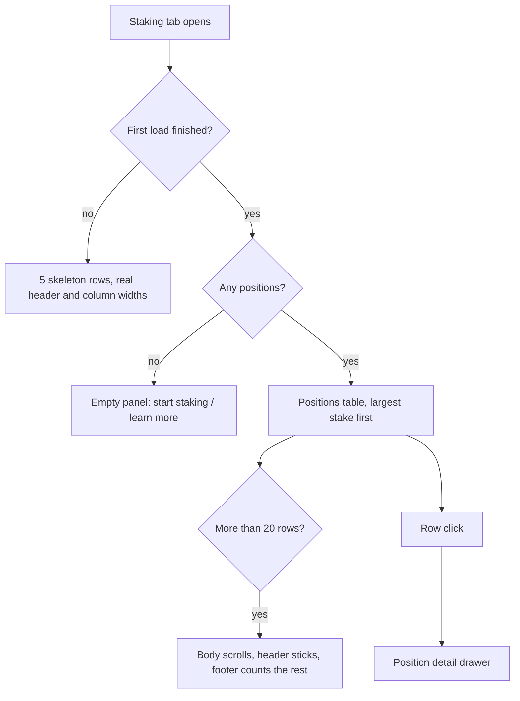

# Dashboard Staking Positions

> Part of the [Feature Map](../README.md) — Last reviewed: 2026-07-27

## Overview

The staking tab's main surface: **one row per staking position**, across every staking chain at once, with a detail
drawer behind each row.

A position is one account's bonded ledger on one chain. The table answers _which of my positions needs attention_ — what
is staked, what share of the chain it is, whether it is actually earning, how much APY, how many validators back it, and
what rewards are about to expire. The drawer answers _what exactly is wrong with this one and what can I do about it_.

Nothing here fetches from a node. `aggregates/staking-positions` already drives every read; this feature joins the
caches it filled and renders them.

## Who can use it / when it applies

Visible whenever the `dashboard` feature flag is on and the wallet has at least one account. What the user may _do_ with
a row depends on how the account can be signed for:

| Access mode | When                                                                                                                       | What the row and drawer show                                                   |
| ----------- | -------------------------------------------------------------------------------------------------------------------------- | ------------------------------------------------------------------------------ |
| `direct`    | A local, signable account                                                                                                  | Full action set                                                                |
| `multisig`  | A multisig with at least one signatory key in this installation                                                            | Full action set, plus a `2/3` chip                                             |
| `draft`     | A multisig with no local signatory, a proxied account whose proxy is not local, or an address with no local account at all | Full action set, plus a pencil glyph — the operation can only leave as a draft |
| `watchOnly` | A watch-only wallet, or an account imported as watch-only                                                                  | `view only` in the row; the drawer replaces the action chips with a note       |

Watch-only is not "the buttons are greyed out". The chips are **absent**, and the drawer says so in words: actions are
unavailable by design, not broken. A disabled control invites the user to keep trying.

`getAccessMode` is exported from the feature barrel — the KPI and rewards-chart widgets classify accounts the same way
rather than each inventing their own rule.

## States / scenarios

### The table

Columns, in order: **Account · Staked · Share · Status · APY · Validators · Unclaimed · actions**. Sorted by staked
descending by default, and clearing the sort returns to that default rather than to the aggregate's arbitrary order.

- **Account** — the resolved name, the address, the chain, and everything about the account that changes what can be
  done with it: the multisig threshold and the count of pending drafts this very account already initiated on this very
  chain.
- **Share** — a share of what the user is _looking at_. Under the dashboard's account filter the denominator is the
  visible chain total, so the column always adds up to 100%.
- **Status** — `Active` / `Waiting` / `Inactive` / `Bonded`, each with the reason behind it. The reason is the point:
  "Inactive" alone tells the user nothing actionable, "every nominated validator is oversubscribed" points straight at
  changing validators. When the chain has not said why, the tooltip falls back to the plain status meaning rather than
  inventing one.
- **APY** — the mean APY of the validators that actually back the position; for one that earns nothing, the mean of what
  it nominates, which is what it _would_ earn. Grey `—` when the chain reports no reward data.
- **Unclaimed** — the amount plus how long it has left. An unclaimed payout is not merely uncollected: it is destroyed
  once its era leaves the runtime history. The chip is red under 14 days, amber to 30, green beyond.

Beyond 20 rows the table body becomes the scroll container — about eight rows visible, header pinned, and a footer
saying how many there are in total. The card must not push the rest of the dashboard off the screen.

Loading renders the same table with the cells blanked: same header, same widths, same row height, so nothing moves when
the data lands.

### The drawer

A 560px right-hand panel: who the account is and its access mode, a six-cell stats grid repeating the row's columns (the
user arrived by clicking one of them and should not have to remember which), the next unbonding chunk with a
`12d 4h left → Aug 3` countdown, the action chips, and the full nominations table.

Each nomination is `active`, `waiting` or `dropped out`, and the era validator set is what separates the last two: a
validator missing from it was simply not elected, while one that _is_ elected but does not carry our stake dropped us
out of its rewarded page. While that set is unknown nothing is called dropped out — nothing proves it was.

The unbonding countdown comes from the chain's era anchor. Without one the strip falls back to the era count, which is
the only thing actually known.

## Lifecycle

Changing validators is the one thing this feature completes on its own: picking a set needs no transaction. The picker
opens scoped to the **position's** chain, not the chain selected on the Staking page — otherwise editing a Kusama
position while Polkadot is selected would quietly list Polkadot validators.

Everything else is a hand-off. The dashboard builds no transaction: a table row is a place to decide something, not a
place to sign it.

### Phase 4 contract

The widget emits, and never consumes:

| Event                        | Fired by                                               |
| ---------------------------- | ------------------------------------------------------ |
| `claimRequested`             | The drawer's `Claim <amount>` chip                     |
| `addStakeRequested`          | The drawer's `Add stake` chip                          |
| `unbondRequested`            | The drawer's `Unbond` chip                             |
| `nominationsChangeRequested` | The validator picker's submit, with the chosen set     |
| `startStakingRequested`      | `+ New position` and the empty state's `Start staking` |

Until a host takes responsibility for them it calls `positionActions.actionsWired()`, and every chip that has no
destination renders disabled with a tooltip saying the flows are not connected yet. A chip that looks pressable and
silently does nothing is the worse failure: the user cannot tell an unwired button from a broken one.
`Change validators` is exempt — it has a real destination today.

## Known gaps

- **Address-book positions do not exist yet.** `aggregates/staking-positions` derives positions from the selected
  wallet's accounts only, so the `draft` mode is reachable today via foreign multisigs and proxied accounts, not via
  contacts. `getAccessMode` already handles the contact case for when the aggregate widens.
- **The "learn how staking works" link points at the docs root**, because no staking docs page is referenced anywhere in
  the app yet.

## Related

- `aggregates/staking-positions` — the source of every position and every cache this feature reads.
- `domains/staking` — the on-chain reads: era validators, exposure pages, unclaimed payouts, era timing.
- `features/validator-selection` — the picker the `Change validators` chip opens, and the model that scopes the
  validator aggregate to the position's chain.
- `features/drafts` — where the pending-draft counts come from.
- `features/dashboard-portfolio-overview` — the same card pattern on the overview tab.
