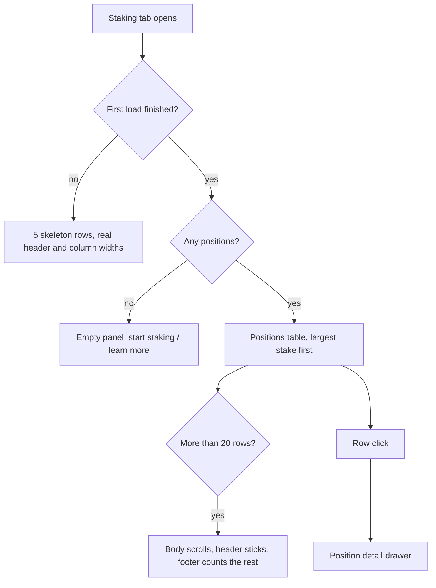

# Dashboard Staking Positions

> Part of the [Feature Map](../README.md) — Last reviewed: 2026-08-19

## Overview

The staking tab's main surface: **one row per staking position**, across every staking chain at once, with a detail
drawer behind each row.

A position is one account's bonded ledger on one chain — either **nominating** validators or **being** one; the
aggregate decides which (see its spec for the rule), and the row reads differently for each kind. The table answers
_which of my positions needs attention_ — what is staked, what share of the chain it is, whether it is actually earning,
how much APY, how many validators back it (or nominate it), and what rewards are about to expire. The drawer answers
_what exactly is wrong with this one and what can I do about it_.

Nothing here fetches from a node. `aggregates/staking-positions` already drives every read; this feature joins the
caches it filled and renders them.

It does own one piece of wiring, though: the dashboard's account selection also contains **address book entries**, which
are not accounts of any wallet and would therefore never produce a position. This widget hands those ids to the
aggregate (`trackAccountIds`) once for the whole staking tab — the KPI and rewards widgets read the resulting positions
rather than repeating the wiring. The tracked set is replaced on every selection change and released on unmount, so it
never grows past what the user is looking at.

## Who can use it / when it applies

Visible whenever the `dashboard` feature flag is on and the wallet has at least one account. What the user may _do_ with
a row depends on how the account can be signed for:

| Access mode | When                                                                                                                                  | What the row and drawer show                                                   |
| ----------- | ------------------------------------------------------------------------------------------------------------------------------------- | ------------------------------------------------------------------------------ |
| `direct`    | A local, signable account                                                                                                             | Full action set                                                                |
| `multisig`  | A multisig with at least one signatory key in this installation                                                                       | Full action set, plus a `2/3` chip                                             |
| `draft`     | A multisig with no local signatory, a proxied account whose proxy is not local, or an address book entry with no local account at all | Full action set, plus a pencil glyph — the operation can only leave as a draft |
| `watchOnly` | A watch-only wallet, or an account imported as watch-only                                                                             | `view only` in the row; the drawer replaces the action chips with a note       |

Watch-only is not "the buttons are greyed out". The chips are **absent**, and the drawer says so in words: actions are
unavailable by design, not broken. A disabled control invites the user to keep trying.

The drawer badge next to the account name states provenance, not signability: `Local wallet` (green) when a local wallet
holds the account, `Address book` (gray) when none does — a contact position must not claim to be a local wallet. A
watch-only account keeps its own `view only` badge; whether an operation leaves as a signature or a draft stays the
pencil glyph's business.

`getAccessMode` is exported from the feature barrel — the KPI and rewards-chart widgets classify accounts the same way
rather than each inventing their own rule.

## States / scenarios

### The table

Columns, in order: **Account · Staked · Share · Status · APY · Validators · Unclaimed · actions**. Sorted by staked
descending by default, and clearing the sort returns to that default rather than to the aggregate's arbitrary order.

- **Account** — the resolved name, the address, the chain, and everything about the account that changes what can be
  done with it: the multisig threshold and the count of pending drafts this very account already initiated on this very
  chain. A validator position adds a `Validator` chip here (with a tooltip) — the one glance-level marker that the rest
  of the row reads differently.
- **Share** — a share of what the user is _looking at_. Under the dashboard's account filter the denominator is the
  visible chain total, so the column always adds up to 100%.
- **Status** — `Active` / `Waiting` / `Inactive` / `Bonded`, each with the reason behind it. The reason is the point:
  "Inactive" alone tells the user nothing actionable, "none of the nominated validators was elected" points straight at
  changing validators. When the chain has not said why, the tooltip falls back to the plain status meaning rather than
  inventing one. Until the active-era exposures have been read the cell shows no pill at all, only a shimmer: the
  exposures land seconds after the ledgers, and every pill available at that point would be a verdict nobody has checked
  — a red `Inactive` on a position that turns out to be earning. A validator position shares the `Active` / `Waiting`
  labels but its tooltips say what they mean _for a validator_ — elected and validating, or registered and waiting for
  election; `Inactive` and `Bonded` never appear on one, and no reason is ever attached.
- **APY** — the mean APY of the validators that actually back the position; for one that earns nothing, the mean of what
  it nominates, which is what it _would_ earn. A validator position shows its **own** commission-adjusted era APY — the
  figure computed for that stash — not a mean over nominations it does not have. Grey `—` when the chain reports no
  reward data, or while a validator is not elected.
- **Validators** — `n of m`: how many of the nominated validators actually back the position. On a validator position
  the column flips to its audience — `{n} nominators` — and shows `—` while it is not elected, because the count only
  exists inside the active era.
- **Unclaimed** — the amount plus how long it has left. An unclaimed payout is not merely uncollected: it is destroyed
  once its era leaves the runtime history. The chip is red under 14 days, amber to 30, green beyond.

The header row is always sticky — below the row threshold the widget shell is what scrolls, and the column names must
survive that scrolling too. Beyond 20 rows the table body additionally becomes its own scroll container — about eight
rows visible, header pinned to it, and a footer saying how many there are in total. The card must not push the rest of
the dashboard off the screen.

Loading renders the same table with the cells blanked: same header, same widths, same row height, so nothing moves when
the data lands.

### The drawer

A 720px right-hand panel: who the account is and its access mode, a six-cell stats grid repeating the row's columns (the
user arrived by clicking one of them and should not have to remember which), the next unbonding chunk with a
`12d 4h left → Aug 3` countdown, the action chips, and — for a nominator — the full nominations table. The countdown
shows the two largest units that still say something — `12d 4h`, then `3h 7m`, then `43m` — because a wait rounded to
`0d 0h` tells the user only that it is under an hour, which is exactly when the minutes matter. The width is set by that
table — six columns, four of them sortable — not by the panel's own content; at 560px its headers no longer fit.

Each nomination is `active`, `waiting` or `dropped out`, and the era validator set is what separates the last two: a
validator missing from it was simply not elected, while one that _is_ elected but does not carry our stake dropped us
out of its rewarded page. While that set is unknown nothing is called dropped out — nothing proves it was.

The table sorts by status by default — earning first, then dropped out, then not elected, with the biggest stake first
inside each band — which is the order the drawer is opened to see. Status, our stake, APY and era points are sortable
from the header. Each validator carries the standard explorers button, so the address is one click away, in full, next
to the chain's block explorers.

A **validator position** has no nominations to list, so the table gives way to a validator stats section: commission
(with a red `Blocked` badge when the validator refuses new nominations), self stake, total stake, nominator count and
era points. Everything but the commission is a fact of the active era, so while the validator is waiting for election
those cells all read `—` under a note saying it was not elected — showing zeros there would read as facts nobody
established. The stats grid's `Validators` cell becomes `Nominators` for the same reason. The `Change validators` chip
is absent rather than disabled — a validator nominates nobody, so the picker has nothing to change — while `Claim`,
`Add stake` and `Unbond` stay: a validator stash bonds, unbonds and collects its own rewards like any other.

The unbonding countdown comes from the chain's era anchor. Without one the strip falls back to the era count, which is
the only thing actually known.

#### The Claim chip

Claiming is gated by _who can sign on the network_, not by who owns the position: a payout is permissionless, so a
contact's position is claimable as long as **any account of any of the installation's wallets** can sign on that chain —
the same rule the Rewards modal applies to its Claim button. The chip's states, in order of precedence:

- **No signer on the chain** — disabled, with "None of your wallets can sign on {network}". This wins over everything
  else: whatever the payout scan finds, nobody here could sign the claim.
- **Nothing to claim**, scan finished — disabled, with "Nothing to claim on this position".
- **Scan still running** — enabled; the chip does not assert "nothing to claim" about payouts nobody has checked yet.
- Otherwise — enabled, leading with the unclaimed amount.

(As with every chip, disabling still falls back to the "not connected yet" tooltip when the action is unwired — but a
`blockedHint` above wins the tooltip text whenever both apply, so an unwired _and_ blocked chip explains the block, not
the wiring gap.)

## Lifecycle

Changing validators is the one thing this feature completes on its own: picking a set needs no transaction. The picker
opens scoped to the **position's** chain, not the chain selected on the Staking page — otherwise editing a Kusama
position while Polkadot is selected would quietly list Polkadot validators.

Everything else is a hand-off. The dashboard builds no transaction: a table row is a place to decide something, not a
place to sign it.

### Hand-off contract

The widget emits, and never consumes:

| Event                        | Fired by                                               | Wired |
| ---------------------------- | ------------------------------------------------------ | ----- |
| `claimRequested`             | The drawer's `Claim <amount>` chip                     | yes   |
| `addStakeRequested`          | The drawer's `Add stake` chip                          | yes   |
| `unbondRequested`            | The drawer's `Unbond` chip                             | yes   |
| `nominationsChangeRequested` | The validator picker's submit, with the chosen set     | yes   |
| `startStakingRequested`      | `+ New position` and the empty state's `Start staking` | yes   |

A host announces which of these it has taken responsibility for through `positionActions.actionsWired([...])`, and every
chip whose action has not been announced renders disabled with a tooltip saying so. A chip that looks pressable and
silently does nothing is the worse failure: the user cannot tell an unwired button from a broken one. The gate is **per
action**, not one flag, because the flows behind them arrive separately.

[`staking-dashboard-actions`](../staking-dashboard-actions/README.md) is that host today, and every chip is now wired —
`Change validators` included: the picked set is handed to [`staking-confirm-flow`](../staking-confirm-flow/README.md),
which turns it into a `nominate` transaction.

## Known gaps

- **The "learn how staking works" link points at the docs root**, because no staking docs page is referenced anywhere in
  the app yet.
- **The drawer offers no `Redeem` chip.** The unbonding strip counts a chunk down but does not offer to withdraw it once
  it unlocks; redeeming is requested from the KPI drill-down, which is where the approved design puts it.
- **A draft row's actions rely on the flows' own draft mode.** An address-book position renders with the pencil glyph
  and its chips enabled; turning the hand-off into a draft is the flow's job, and the toast that confirms it belongs to
  the wiring feature. Claim is the deliberate exception: a payout is permissionless, so a contact position's claim is
  signed by a substituted payer of ours rather than saved as a draft.

## Related

- `aggregates/staking-positions` — the source of every position and every cache this feature reads.
- `domains/staking` — the on-chain reads: era validators, exposure pages, unclaimed payouts, era timing.
- `features/validator-selection` — the picker the `Change validators` chip opens, and the model that scopes the
  validator aggregate to the position's chain.
- [`staking-confirm-flow`](../staking-confirm-flow/README.md) — signs the picked set the picker submits.
- [`staking-dashboard-actions`](../staking-dashboard-actions/README.md) — the host that consumes the events above and
  announces which chips are live.
- `features/drafts` — where the pending-draft counts come from.
- `features/dashboard-portfolio-overview` — the same card pattern on the overview tab.
