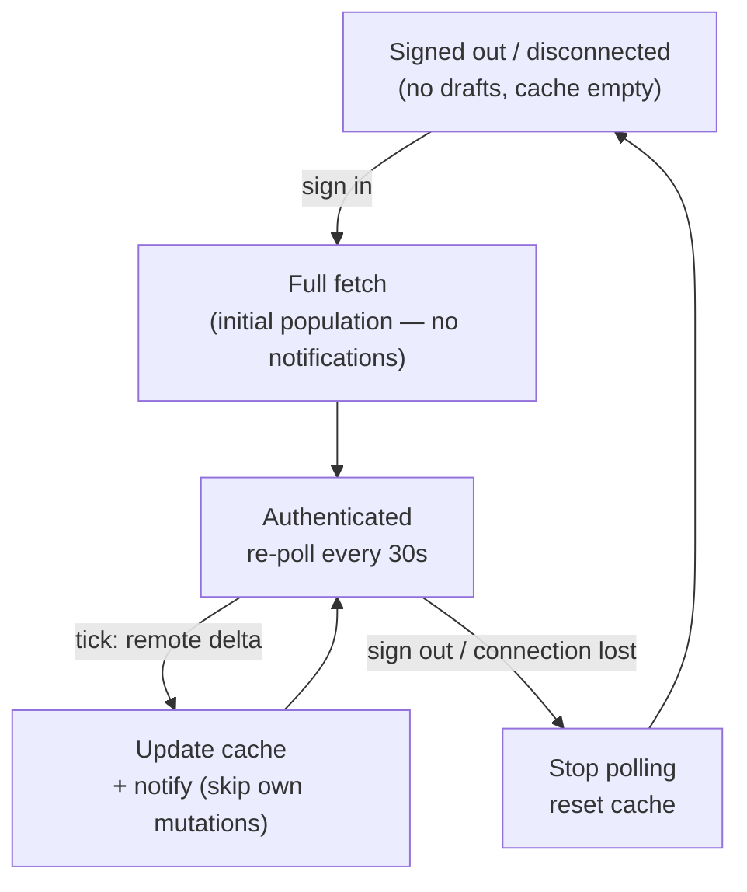
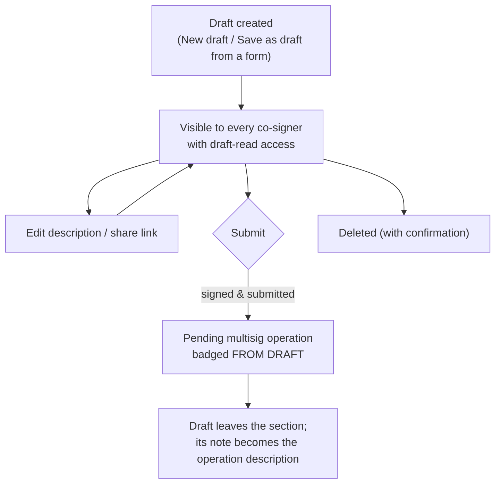

# Operation Drafts

> Part of the [Feature Map](../README.md) — Last reviewed: 2026-07-16

## Overview

A **draft** is a multisig operation prepared ahead of time but not yet submitted on-chain. Drafts let a team agree on an
operation — its call, its signing path, and a mandatory description of intent — before anyone signs. They are stored in
the shared **address-book backend**, so every co-signer with access sees the same draft list, and any of them (with the
right permissions) can review, edit, share, submit, or delete a draft.

Drafts surface as a collapsible **Drafts section** inside the operations table on the
[Operations view's](../multisig-operations/README.md) Pending tab — the first section under the shared column header,
styled and column-aligned like operation rows, gated by the view's Status filter and narrowed by the filters a draft can
evaluate (network, date range, search; an active transaction-type or proxy-type filter hides all drafts — see the
Operations view spec). A compact subsection with the same submit gating also appears in the dashboard's operations
queue.

Because drafts live on the backend they are inherently multi-user: shareable via a deep link
(`Paths.OPERATIONS?draftId=…`), auto-fetched on sign-in, and re-polled every 30s — so every client picks up others' add
/ update / remove changes and raises an in-app notification for them (see [Sync & reconnect](#sync--reconnect)).

## Who can use it / when it applies

Everything about drafts is backend data, gated by the address-book connection and per-user permissions:

- The section renders only once the user has **connected the address book at least once**; while the backend is
  unhealthy the section is dimmed under a reconnect overlay.
- **Seeing** drafts requires the _draft read_ permission (without it the section hides entirely).
- **Creating and editing** requires _draft write_ — without it the "New draft" row is disabled with an explanatory
  tooltip, and the per-row Edit buttons are absent entirely.
- **Deleting** requires _draft write_ (the backend dropped its dedicated delete permission) — without it the delete
  control is absent.
- **Submitting** additionally requires an active backend session, the draft's call data, and a local account matching
  the draft's source (see [Submitting](#submitting)).

## The drafts section

Drafts are listed flat, **newest first**, each row column-aligned with the operations table:

- **Operation** — a draft icon, the decoded operation title (or "Unknown Operation" while the call can't be decoded),
  and the chain name with the draft's creation date inline.
- **Value** — the amount and asset, when one can be extracted from the call.
- **Submitter** — the draft's source account (the proxied source for a proxy-routed draft, otherwise the multisig),
  resolved to a name.
- **Description** — the draft's note inline (an italic "No description" placeholder when absent).
- **Actions** — one primary control:

  | Primary control     | When                                                                                           |
  | ------------------- | ---------------------------------------------------------------------------------------------- |
  | **Submitted** badge | The draft was just submitted in this session (it disappears from the list on the next refresh) |
  | **Add wallet**      | No local account matches the draft's source — a pairing prompt instead of a submit button      |
  | **Add call data**   | The draft has no call data yet — opens the submit flow at the call-data step                   |
  | **Submit**          | Call data present and a local source account exists; disabled with a tooltip when signed out   |

Like an operation row, a draft row **expands** into three panels; the secondary actions live in their headers:

- **Details** — network, multisig (and proxy, when the draft routes through one), threshold, who created the draft and
  when, plus the full description. The header carries the **Edit** button (write permission, not yet submitted).
- **Signing path** — the draft's stored execution hops, labelled Proxied → Multisig → Initiator. The panel header
  carries two icon actions: **Open overview**, which opens the account-structure view anchored on the draft's exact
  signing path, and **Share**, which copies the draft's deep link (opening the link scrolls to and highlights the
  draft).
- **Advanced** — the call data (copyable, with a decoded JSON view once it decodes), or a hint that call data will be
  added on submission. The header carries the **Delete** trash icon (write permission, not yet submitted) behind a
  confirmation dialog.

A draft that has been **linked to a live operation** (submitted by anyone) leaves the list automatically — the resulting
operation row in the table carries a **FROM DRAFT** badge instead, and the draft's description becomes the operation's
description.

Below the rows, a dashed **"New draft"** row starts the creation flow (write permission required).

## The signing path (route)

The signing path is the heart of the feature. A draft does not just say "sign this transaction" — it encodes the exact
**route** through the account topology: proxy hops, multisig hops, ending at a signer. This matters because one
transaction can be reachable by multiple routes, and signing through the wrong route wraps the call differently (e.g.
`proxy.proxy(real, call)` vs a bare multisig `as_multi`).

At submit time the saved path is resolved back into concrete accounts and **strictly followed** — the flow never
silently re-routes. The canonical initiator is the path's first node (important for nested multisigs, where the deepest
multisig is the leaf, not the root). The route drives extrinsic wrapping, the multisig threshold/deposit, and which
account balances get validated. **Legacy drafts** with an empty saved path fall back to automatic route discovery from
initiator to a chosen signatory — but only when no saved path exists.

## Creating a draft

The creation modal walks three steps — **Call data → Signing path → Confirm**:

1. **Call data** — paste hex call data (validated and previewed once it decodes) or build the call from scratch with the
   extrinsic builder, on a chosen chain (defaults to Polkadot Asset Hub). Call data can be **skipped** and authored
   later; undecodable data is blocked with an error.
2. **Signing path** — pick how the operation will be executed: which multisig, through which proxy (if any), and which
   signatory initiates. Drafts restrict sources and multisig hops to **address-book (backend contact) entries only**.
3. **Confirm** — review the decoded call and signing path, and write the **description** (required, up to 500
   characters) explaining the operation's intent to co-signers.

The wizard can **jump ahead** from a seed: chain + valid call data + complete path opens straight to _Confirm_; chain +
call data only opens to _Signing path_. Drafts can also be started **from an operation form**: transfer, staking,
governance, proxy, and other operation flows offer a _draft mode_ ("Save as draft", via `createDraftModeBinding`) that
seeds the modal with the form's call data, chain, and signing path.

**Editing** an existing draft is limited to its description (with the decoded call and signing summary shown for
context); closing with unsaved changes asks for confirmation.

## Submitting

Submitting turns a draft into a real on-chain multisig operation. The **Submit** action opens a staged flow — **call
data (conditional) → confirm → sign → submit** — that reconstructs the draft's transaction and signing path, lets the
user confirm and sign (adapting to the signer's wallet type), and submits the first approval — creating the pending
operation every co-signer then sees in the operations table.

- **Call data** (only if the draft was saved without it) — the submitter pastes call data, sees a decoded preview, and
  confirms; this patches the draft on the backend, then advances to confirm.
- **Confirm** — shows the signing path as a breadcrumb (plus a review popover for paths of length ≥ 2), a signatory
  selector when more than one valid signatory exists, wallet/account/signatory details, description, an external decode
  link, expandable call args, the **fee**, the **multisig deposit** when the route contains a multisig, and **validation
  errors** from a balance-aware validator that checks every account that must pay along the route. The Sign button stays
  disabled until the wrapped extrinsic and fee are ready, validation passes, and the initiator is available.
- **Sign / Submit** — hands off to the shared `OperationSign` and `OperationSubmit` flows. On success it shows a success
  toast and records a backend operation description linking the draft to the resulting on-chain operation, so the
  multisig operation inherits the draft's description. A **Submitted** badge shows until the backend confirms.

Submission is gated: the user must be signed in to the backend, the draft must carry valid **call data** (otherwise the
primary action is _Add call data_), and a local account matching the draft's source must exist (otherwise a wallet
pairing prompt is shown). Whether the wallet also holds a usable signatory on the path is a separate, later check inside
the submit flow (see [States / scenarios](#states--scenarios)).

## States / scenarios

| State                           | When it appears                                                                                          | What the user sees                                                                         |
| ------------------------------- | -------------------------------------------------------------------------------------------------------- | ------------------------------------------------------------------------------------------ |
| Path unresolvable               | The saved path can't be re-resolved against the current wallets (e.g. a wallet on the route was removed) | The flow is **blocked** with a signing-path-unresolved error — never wrapped to the raw tx |
| Extrinsic build failure         | Wrapping the call fails                                                                                  | A generic extrinsic error (debounced ~300ms so transient init states don't flash red)      |
| No signatories                  | The wallet holds no account that can sign                                                                | An empty-account warning, with an add-account affordance for Polkadot Vault                |
| Initiator unavailable           | The draft's stored initiator can no longer sign                                                          | A banner asking the user to pick a replacement signatory; signing disabled until they do   |
| Undecodable / missing call data | Bad or absent call data at create or submit entry                                                        | Blocked with a clear hint                                                                  |
| Post-submit sync failure        | Recording the operation description fails after a successful on-chain submit                             | A toast with a **Retry** action; the draft stays visible and retryable                     |

## Sync & reconnect

Drafts are a backend-backed shared cache; the client keeps it converged through a simple fetch-and-poll loop tied to the
backend session:

- **On sign-in** — the client does a full fetch of all drafts (paged) into the local cache. Each draft arrives with its
  linked operation, so submission state needs no second request.
- **While authenticated** — it re-polls every 30s, so add / update / remove changes made by other clients show up within
  one interval and raise an in-app notification.
- **On sign-out or connection loss** — polling stops and the **local cache is reset**, so drafts disappear from the UI
  until the backend is reachable again.
- **On reconnect** — re-authenticating triggers a fresh full fetch that repopulates the cache. This first post-reset
  fetch is treated as **initial population**, not as a batch of new drafts — so a reconnect does _not_ spam "draft
  added" notifications for the entire list; only genuine deltas observed after repopulation notify.
- **Self-mutation de-duplication** — a client's own create / update / delete is suppressed in the change diff, so you
  are never notified about your own action when the next fetch echoes it back.

## Lifecycle

Only the **description** can be updated after a draft is created. Call data is **not editable**: the only time it is
written post-create is the one-time _late fill_ of call data that was skipped at create (the conditional call-data step
in the submit flow) — completing a missing field, not editing an existing one.

## Related

- [`multisig-operations`](../multisig-operations/README.md) — hosts the drafts section on its Pending tab and badges
  operations that originated from drafts.
- [`multisig-operation-description`](../../aggregates/multisig-operation-description/README.md) — a submitted draft's
  description is published as the operation's shared note (the confirmation screen hides its own description field
  during a draft submission).
- **`signing-path`** — provides the path graph model, path node types, route resolution, validation, and the breadcrumb
  / review UI. Drafts are a persistence and coordination layer on top of it.
- **`OperationSign` / `OperationSubmit`** (shared operations) — the actual sign-and-broadcast machinery.
- **`backend` domain** — draft CRUD and cache, operation descriptions, auth, and permissions.
- **Dashboard operations queue** — shows a compact drafts subsection with the same submit gating.
