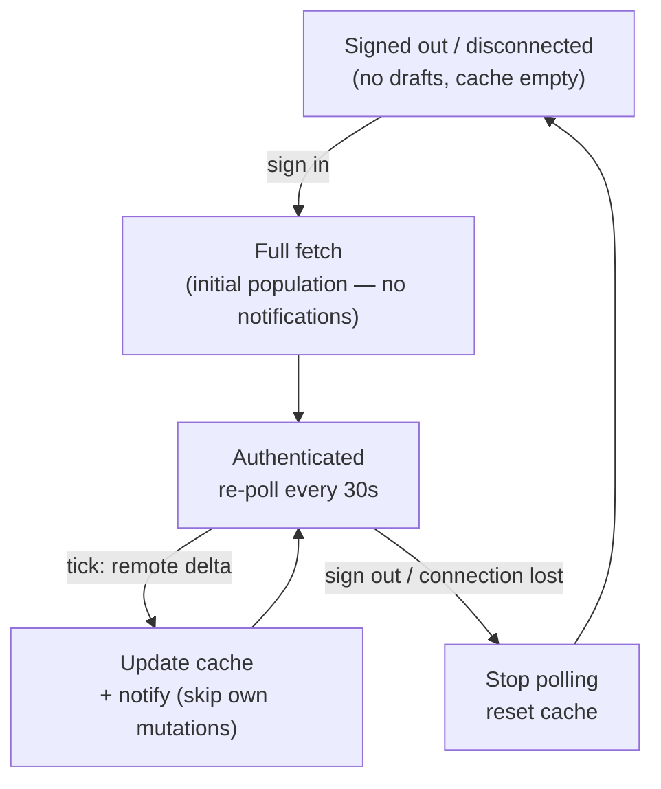
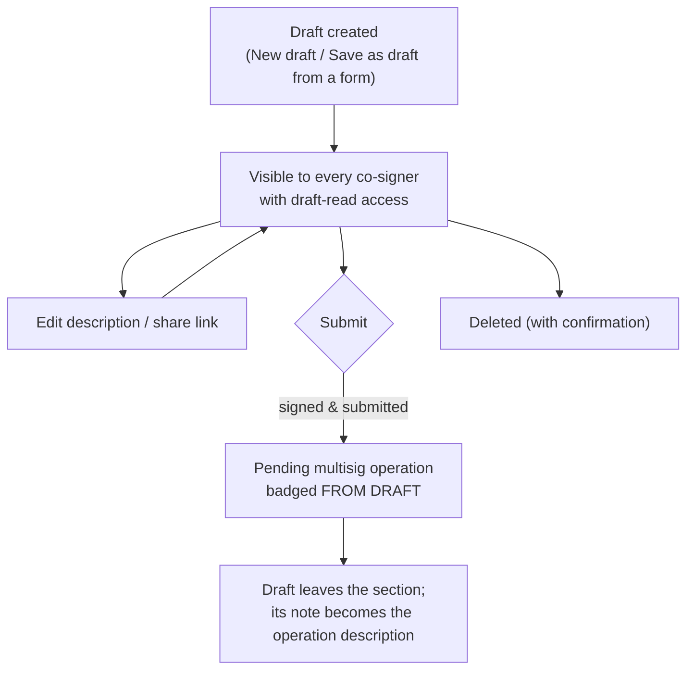

# Operation Drafts

> Part of the [Feature Map](../README.md) — Last reviewed: 2026-08-26

## Overview

A **draft** is a multisig operation prepared ahead of time but not yet submitted on-chain. Drafts let a team agree on an
operation — its call, its signing path, and a mandatory description of intent — before anyone signs. They are stored in
the shared **address-book backend**, so every co-signer with access sees the same draft list, and any of them (with the
right permissions) can review, edit, share, submit, or delete a draft.

Drafts surface as a **Drafts group** inside the operations table on the
[Operations view's](../multisig-operations/README.md) Pending tab — the first group, styled and column-aligned like
operation rows, gated by the view's Status filter and narrowed by the filters a draft can evaluate (network, date range,
search, and **Needs my signature**, which keeps only drafts the user can submit — `findSubmittableInitiator` in
`lib/draft-initiator.ts`, the same rule that enables Submit, so a draft nobody local can initiate or a legacy draft
without a signing path is not "mine"; an active transaction-type or proxy-type filter hides all drafts — see the
Operations view spec). Because it is the first visible group, its **heading (label and count) is drawn and its collapse
state is owned by the Operations view**, not by this feature: `useDraftsSectionState` (in
`lib/useDraftsSectionState.ts`) is the one source of truth for whether the group renders, its rows and the count the
heading shows (`0` for an empty group, like the In-progress group; no chip while the address book is unhealthy), and
`DraftsSection` (`components/DraftsSection.tsx`) reads the same hook to render only the rows and the New-draft control,
taking `isCollapsed` as a prop instead of drawing its own header. Search matches a draft's description and the names and
addresses of every account it shows — the proxy, the multisig and the assigned **initiator** — so "which drafts is Adam
expected to submit?" is answerable by typing a name, without opening each draft's Submit dialog (see
[`operations-search`](../../aggregates/operations-search/README.md)). A compact subsection with the same submit gating
also appears in the dashboard's operations queue.

Because drafts live on the backend they are inherently multi-user: shareable via a deep link
(`Paths.OPERATIONS?draftId=…`), auto-fetched on sign-in, and re-polled every 30s — so every client picks up others' add
/ update / remove changes and raises an in-app notification for them (see [Sync & reconnect](#sync--reconnect)).

## Who can use it / when it applies

Everything about drafts is backend data, gated by the address-book connection and per-user permissions:

- The section renders only once the user has **connected the address book at least once**; while the backend is
  unhealthy the section is dimmed under a reconnect overlay.
- **Seeing** drafts requires the _draft read_ permission (without it the section hides entirely).
- **Creating and editing** requires _draft write_ — without it the "New draft" row is disabled with an explanatory
  tooltip, and the per-row Edit buttons are absent entirely.
- **Deleting** requires _draft write_ (the backend dropped its dedicated delete permission) — without it the delete
  control is absent.
- **Submitting** additionally requires an active backend session, the draft's call data, and a local account matching
  the draft's source (see [Submitting](#submitting)).

Two of these are published for surfaces that only _predict_ whether a draft is possible — a dashboard row deciding
whether to offer an action at all:

- **Availability** — `ready`, `offline`, `notConnected` or `noPermission`. The last two are terminal and nothing the
  user does on that screen fixes them; `offline` is not, because reconnecting is a click away and the draft card carries
  the prompt itself, so a caller should let the user in rather than turn them away.
- **The source set** — which addresses a draft on a given chain may start from. Narrower than "any address in the
  address book" twice over: the signing-path graph only routes from multisigs and from proxied accounts that reach one,
  because a draft has to terminate at somebody's key; and a source must be an address-book entry, because a co-signer
  opening the draft elsewhere has to see the same account. An ordinary stash address kept as a contact is therefore not
  a draft source and never will be.

Published rather than re-derived per screen: a caller that judged this differently would send the user into a form whose
draft toggle renders nothing, or whose source list is empty. The wording of a refusal does not travel: a surface that
only _predicts_ whether a draft is possible (the staking dashboard's blocked reasons) phrases its own explanation, and
the drafts feature keeps its i18n keys to itself.

The source set is asked one chain at a time (`useDraftSources`) or across several at once (`useDraftSourceLookup`, for a
table that mixes networks). Both keep their combined stores in a module cache, as the signing-path graph does: an
Effector `combine` stays subscribed for the life of the process, so minting one per render would leave a growing pile of
live subscriptions recomputing on every contact and proxy update.

## The drafts section

Drafts are listed flat, **newest first**, each row column-aligned with the operations table:

- **Operation** — a draft icon, the decoded operation title (or "Unknown Operation" while the call can't be decoded),
  and the chain name with the draft's creation date inline.
- **Value** — the amount and asset, when one can be extracted from the call.
- **Submitter** — the draft's source account (the proxied source for a proxy-routed draft, otherwise the multisig),
  resolved to a name.
- **Initiator** — the draft's assigned signer (`initiatorAccountId`), resolved like any account — custom name →
  address-book contact → identity → the owning wallet's name → stored account name → short address — in both the
  collapsed row and the Signing-path panel. A draft with no assigned initiator stays visible with an explicit
  **Unassigned** mark. Like the operations' Initiator column it is shown by default only from 1536px up, until the user
  decides in the Operations view's column settings menu — that choice then holds at every window size.
- **Description** — the draft's note inline (an italic "No description" placeholder when absent).
- **Actions** — one primary control:

  | Primary control     | When                                                                                                                                                                    |
  | ------------------- | ----------------------------------------------------------------------------------------------------------------------------------------------------------------------- |
  | **Submitted** badge | The draft was just submitted in this session (it disappears from the list on the next refresh)                                                                          |
  | **Recreate**        | The draft has no saved signing path — it can never be submitted, so the action starts a new draft seeded with its chain, call data and note (write permission required) |
  | **Add wallet**      | No local account matches the draft's source — a pairing prompt instead of a submit button                                                                               |
  | **Add call data**   | The draft has no call data yet — opens the submit flow at the call-data step                                                                                            |
  | **Submit**          | Call data present and a local source account exists; disabled with a tooltip when signed out                                                                            |

Like an operation row, a draft row **expands** into three panels; the secondary actions live in their headers:

- **Details** — network, multisig (and proxy, when the draft routes through one), threshold, who created the draft and
  when, plus the full description. The header carries the **Edit** button (write permission, not yet submitted).
- **Signing path** — the draft's stored execution hops, labelled Proxied → Multisig → Initiator. The panel header
  carries two icon actions: **Open overview**, which opens the account-structure view anchored on the draft's exact
  signing path, and **Share**, which copies the draft's deep link (opening the link scrolls to and highlights the
  draft).
- **Advanced** — the call data (copyable, with a decoded JSON view once it decodes), or a hint that call data will be
  added on submission. The header carries the **Delete** trash icon (write permission, not yet submitted) behind a
  confirmation dialog.

A draft that has been **linked to a live operation** (submitted by anyone) leaves the list automatically — the resulting
operation row in the table carries a **FROM DRAFT** badge instead, and the draft's description becomes the operation's
description.

Below the rows, a dashed **"New draft"** row starts the creation flow (write permission required).

## The signing path (route)

The signing path is the heart of the feature. A draft does not just say "sign this transaction" — it encodes the exact
**route** through the account topology: proxy hops, multisig hops, ending at a signer. This matters because one
transaction can be reachable by multiple routes, and signing through the wrong route wraps the call differently (e.g.
`proxy.proxy(real, call)` vs a bare multisig `as_multi`).

At submit time the saved path is resolved back into concrete accounts and **strictly followed** — the flow never
silently re-routes. The route drives extrinsic wrapping, the multisig threshold/deposit, and which account balances get
validated. There is **no fallback route**: a draft without a usable saved path (a legacy draft from before the field
existed, or a truncated one) cannot be submitted at all — its Submit button is disabled with the reason, because
discovering a route would mean signing along one the draft's authors never agreed on.

> **Two things are called "initiator".** The path runs outermost-first: it starts at the **source** account that
> executes the call and ends at the account that **signs** it.
>
> - The **source** — the path's _first_ node — is the submit flow's canonical initiator (`$initiator`). This matters for
>   nested multisigs, where `multisigAccountId` stores the deepest hop, not the root.
> - The **signer** — the path's _last_ node — is what the UI labels "Initiator" in the signing-path panel, what
>   `initiatorAccountId` stores, and the person a co-signer is waiting on. This is the one the operations search
>   matches.
>
> Both readings are correct in their own context; check which one a given call site means before reusing it.

## Creating a draft

The creation modal walks three steps — **Call data → Signing path → Confirm**:

1. **Call data** — paste hex call data (validated and previewed once it decodes) or build the call from scratch with the
   extrinsic builder, on a chosen chain (defaults to Polkadot Asset Hub). Call data can be **skipped** and authored
   later; undecodable data is blocked with an error.
2. **Signing path** — pick how the operation will be executed: which multisig, through which proxy (if any), and which
   signatory initiates. Drafts restrict sources and multisig hops to **address-book (backend contact) entries only**.
3. **Confirm** — review the decoded call and signing path, and write the **description** (required, up to 500
   characters) explaining the operation's intent to co-signers. A transfer to a recipient that is not in the address
   book must be acknowledged here first (see [Unknown recipient warnings](#unknown-recipient-warnings)).

The wizard can **jump ahead** from a seed: chain + valid call data + complete path opens straight to _Confirm_; chain +
call data only opens to _Signing path_. Drafts can also be started **from an operation form**: transfer, staking,
governance, proxy, and other operation flows offer a _draft mode_ ("Save as draft", via `createDraftModeBinding`) that
seeds the modal with the form's call data, chain, and signing path.

### Pinning the source

In draft mode the **path's first node is the origin**: every host flow builds the draft's call from it, not from
whatever account the form itself is sitting on. So who the source is decides what the draft _does_.

For most forms that is the point — a transfer, a vote, a new proxy or a brand-new stake is being authored from scratch,
and the source picker is the control that says on whose behalf. A flow opened for one **specific account** — a staking
position, say — is the opposite case, and pins the source to it: the first hop is decided, the source list collapses to
that one entry, and the user picks only the hops after it. Left free, a user could author an `unbond` for contact A's
position sourced at contact B, and the draft would act on B's ledger or fail outright — after being reviewed and
co-signed. Pinning removes the class of mistake rather than validating against it.

Today the dashboard staking flows (add stake / unbond / change validators / redeem / change reward destination) pin;
every other call site leaves `pinnedSourceAccountId` off.

> **Open on two counts.**
>
> The legacy Staking-page forms (`staking-withdraw`, `staking-unstake`, `staking-bond-extra`, `staking-restake`,
> `staking-nominate`, `staking-payee`) sit between the two cases: they are opened on one of the user's own accounts and
> show that account's figures, yet their draft mode lets the source be re-pointed, and an `unstake` amount validated
> against account A can end up drafted for B. Pinning them is a behavioural change that needs its own verification pass.
>
> Nothing enforces the choice. `pinnedSourceAccountId` is optional, so a future flow opened for one specific account can
> forget it and fail silently. Making it required was tried and reverted: it puts the word `null` into all ~20
> draft-capable forms and drags every one of their features into a change that has nothing to do with them — which the
> Feature Map gate correctly refuses. If the enforcement is worth it, it is its own PR, with the spec review that
> implies.

**Editing** an existing draft is limited to its description (with the decoded call and signing summary shown for
context); closing with unsaved changes asks for confirmation.

## Submitting

Submitting turns a draft into a real on-chain multisig operation. The **Submit** action opens a staged flow — **call
data (conditional) → confirm → sign → submit** — that reconstructs the draft's transaction and signing path, lets the
user confirm and sign (adapting to the signer's wallet type), and submits the first approval — creating the pending
operation every co-signer then sees in the operations table.

- **Call data** (only if the draft was saved without it) — the submitter pastes call data, sees a decoded preview, and
  confirms; this patches the draft on the backend, then advances to confirm.
- **Confirm** — shows the signing path as a breadcrumb (plus a review popover for paths of length ≥ 2), a signatory
  selector when more than one valid signatory exists, wallet/account/signatory details, the **recipient** of a transfer
  call (when one can be decoded), description, an external decode link, expandable call args, the **fee**, the
  **multisig deposit** when the route contains a multisig, and **validation errors** from a balance-aware validator that
  checks every account that must pay along the route. The Sign button stays disabled until the wrapped extrinsic and fee
  are ready and validation passes.
- **Sign / Submit** — hands off to the shared `OperationSign` and `OperationSubmit` flows. A draft is only ever signed
  along a **fully resolved** path: every node of the saved path must map to a local account before a transaction is
  built at all (see [States / scenarios](#states--scenarios)). On success it shows a success toast and records a backend
  operation description linking the draft to the resulting on-chain operation, so the multisig operation inherits the
  draft's description. A **Submitted** badge shows until the backend confirms.

Submission is gated: the user must be signed in to the backend, the draft must carry a **saved signing path** (without
one it is not submittable at all — the row offers _Recreate_ instead) and valid **call data** (otherwise the primary
action is _Add call data_), and a local account matching the draft's source must exist (otherwise a wallet pairing
prompt is shown). Whether the wallet also holds a usable signatory on the path is a separate, later check inside the
submit flow (see [States / scenarios](#states--scenarios)).

## Unknown recipient warnings

Gated by [`recipient-verification`](../../aggregates/recipient-verification/README.md), which is itself gated on the
external address book connection — a user who never connected it sees nothing here. Only drafts whose call data decodes
to a transfer (or XCM transfer) have a recipient; every other draft is unaffected. Proxy-only drafts (a proxied source
with no multisig hop) are covered the same way as multisig ones.

- **Create → Confirm.** When the decoded recipient is not known (`unknown`) or cannot be checked (`unverifiable`), an
  amber acknowledgement box appears below the transaction card, above the "This does not sign yet" note. **Create
  draft** stays disabled until its checkbox is ticked. The tick is cleared by anything that can change the recipient —
  new call data, another chain, closing the modal, or opening a new one — so it never carries over to a different
  address. This is where the transfer form's _draft mode_ hands off: the form skips its own gate when saving as a draft
  and relies on this step instead.
- **"Can't check" is not "nothing to check".** While the chain's api is not connected the call data can't be decoded, so
  the recipient is unknown-unknown: **Create draft** stays disabled with a "waiting for the network connection" note
  until the api is up. (With the address book never connected there is nothing to check, and the api is not required.)
- **Submit → Confirm.** The same box (with the multisig-signing copy — submitting is the first approval) appears above
  the Sign button; **Sign** is disabled until ticked, and the signing step refuses to start without the tick. The
  acknowledgement resets on every flow start and finish, and when late-filled call data replaces the draft.
- **Recipient row.** Whenever the call data decodes to a transfer, the submit confirm shows its recipient as a
  **Recipient** row in the details (own accounts resolve to their wallet name) — the warning never points at an address
  the user can't see.

## States / scenarios

| State                           | When it appears                                                                                                                      | What the user sees                                                                                                                                                                                                |
| ------------------------------- | ------------------------------------------------------------------------------------------------------------------------------------ | ----------------------------------------------------------------------------------------------------------------------------------------------------------------------------------------------------------------- |
| No signing path                 | The draft was saved without a usable path (legacy draft, or fewer than two nodes)                                                    | The row offers **Recreate** instead of Submit — a new draft seeded from this one, where the author picks the signing path. Reaching the submit flow from a stale surface explains the same thing                  |
| Path unresolvable               | Any account on the saved path has no local counterpart (a wallet on the route was removed, or the draft was authored by a co-signer) | The flow is **blocked**: the submitter is shown _which_ account is missing — name and address — and told to add it to submit along this path. The transaction is never built, so there is no Sign button to press |
| Extrinsic build failure         | Wrapping the call fails                                                                                                              | The blocked verdict for invalid call data (see below)                                                                                                                                                             |
| No signatories                  | The wallet holds no account that can sign                                                                                            | An empty-account warning, with an add-account affordance for Polkadot Vault                                                                                                                                       |
| Undecodable / missing call data | Bad or absent call data at create or submit entry                                                                                    | Blocked with a clear hint                                                                                                                                                                                         |
| Unknown recipient               | The draft's transfer recipient is not a contact / own account, or the address book can't vouch                                       | An acknowledgement checkbox gates **Create** (create flow) and **Sign** (submit flow)                                                                                                                             |
| Post-submit sync failure        | Recording the operation description fails after a successful on-chain submit                                                         | A toast with a **Retry** action; the draft stays visible and retryable                                                                                                                                            |
| Source picker, book offline     | Draft mode is on and the address book was connected before but is unreachable now                                                    | No picker at all — the mode card carries the Reconnect prompt, and a dead list under it would only contradict it                                                                                                  |
| Source picker, nothing to offer | The book is reachable but no address in it can start a draft here — a pinned position that is a plain contact, or no multisig at all | "No account available to create this draft" and the reason (naming the pinned address); **Open address book** only if the host passes `onLeaveFlow` (global-slot modals outlive navigation)                       |
| Source picker, no permission    | The user lacks `operation-draft:write` but the flow opened in draft mode anyway                                                      | A notice instead of the picker: nothing can be prepared from the account; to act on it, add its key to a wallet                                                                                                   |

### Why the confirm step can't open

Reaching the confirm screen needs several things to line up: a live connection, a re-resolvable signing path, a wrapped
extrinsic, a fee estimate, a chosen signatory, and a completed balance validation. Any one of them can fail to arrive —
a node that is down, throttling or simply silent; a path whose accounts are gone; call data that no longer decodes. The
step used to have a single observable state for all of it, "Preparing signing data…", with no timeout and no way out: a
throttled node left the modal spinning until the user gave up.

Waiting is now a verdict with three outcomes — **ready**, **preparing** (naming the step still outstanding) and
**blocked** (naming a reason and offering the remediation that matches it):

| Blocked because…              | When it appears                                                                                | What the user is offered       |
| ----------------------------- | ---------------------------------------------------------------------------------------------- | ------------------------------ |
| The network is turned off     | The user disabled this chain in settings                                                       | Open network settings / Cancel |
| The network can't be reached  | The socket is down or dropped, or a request failed on a disconnect                             | Try again / Change node        |
| The node is busy              | The node refused a request with a rate-limit error                                             | Change node / Try again        |
| The node isn't responding     | The socket is up but nothing came back before the deadline — the shape a throttling node takes | Change node / Try again        |
| The fee couldn't be estimated | Fee estimation itself failed                                                                   | Try again / Change node        |
| No signatory is chosen        | Valid signatories exist but none is selected                                                   | A signatory picker, plus Close |
| The signing path is unusable  | An account on the saved path has no local counterpart — the screen names it when it can        | Close                          |
| There is no signing path      | A legacy draft saved before paths were recorded                                                | Close                          |
| The call data isn't valid     | The draft's call can't be decoded on this chain                                                | Close                          |
| Something went wrong          | An internal state the flow can't recover from (e.g. an initiator belonging to no wallet)       | Reload app / Close             |

Three things decide when a verdict lands. Answers known without asking the network (disabled chain, unusable path,
invalid call data, no signatory) are held back for a moment first, so a state that is merely still settling never
flashes an error. An outright rejection from the node is reported as soon as it arrives, classified by what it says
(rate limit, disconnect, fee failure). Anything that neither succeeds nor fails gets a **15-second deadline**, after
which the verdict is read off the connection: still connected means the node isn't responding, otherwise the network
can't be reached.

Blocking is not final. **Try again** re-runs the outstanding steps with a fresh deadline, and a chain that reconnects on
its own while the flow sits blocked _on the network_ retries it automatically — only then, so a flapping node can't keep
resetting the deadline of a flow that is still legitimately preparing, nor flicker a local verdict such as "no
signatory".

**Validation counts as one of the steps.** It reads balances that arrive over the same node as everything else, so a
quiet node strands it: previously that left the Sign button disabled with no spinner and no error — the same silent dead
end, one screen later. It is the last requirement checked, because it waits on balances and is normally the last to
finish, so naming it is only informative once everything else is in. A validation that _finishes_ and reports real
problems (not enough to cover the fee) has reached a verdict: the confirm screen stays, the problems are listed inline
under the details, and Sign stays disabled. Only a validation that never finishes at all reaches the deadline and
blocks.

**Render order** on the submit modal: the empty-wallet screen (no signatories at all, and nothing more specific wrong —
an unresolvable path usually empties the signatory list too, and the specific message must not hide behind the generic
one) → a blocked verdict → the preparing spinner → the confirm screen. A blocked verdict outranks the spinner because it
is terminal for that attempt. The verdict is the single owner of every failure: an unresolvable path is rendered as the
"add this account" screen when the verdict names the missing account, and as the generic blocked screen otherwise.

> **Behaviour change.** A block that arrives _after_ the confirm screen has rendered — a node going quiet mid-review,
> say — now replaces the confirm screen with the blocked verdict. Previously the confirm screen stayed on screen and the
> failure was only visible as a Sign button that would not enable.

## Sync & reconnect

Drafts are a backend-backed shared cache; the client keeps it converged through a simple fetch-and-poll loop tied to the
backend session:

- **On sign-in** — the client does a full fetch of all drafts (paged) into the local cache. Each draft arrives with its
  linked operation, so submission state needs no second request.
- **While authenticated** — it re-polls every 30s, so add / update / remove changes made by other clients show up within
  one interval and raise an in-app notification.
- **On sign-out or connection loss** — polling stops and the **local cache is reset**, so drafts disappear from the UI
  until the backend is reachable again.
- **On reconnect** — re-authenticating triggers a fresh full fetch that repopulates the cache. This first post-reset
  fetch is treated as **initial population**, not as a batch of new drafts — so a reconnect does _not_ spam "draft
  added" notifications for the entire list; only genuine deltas observed after repopulation notify.
- **Self-mutation de-duplication** — a client's own create / update / delete is suppressed in the change diff, so you
  are never notified about your own action when the next fetch echoes it back.

## Lifecycle

Only the **description** can be updated after a draft is created. Call data is **not editable**: the only time it is
written post-create is the one-time _late fill_ of call data that was skipped at create (the conditional call-data step
in the submit flow) — completing a missing field, not editing an existing one.

## Related

- [`multisig-operations`](../multisig-operations/README.md) — hosts the drafts section on its Pending tab and badges
  operations that originated from drafts.
- [`multisig-operation-description`](../../aggregates/multisig-operation-description/README.md) — a submitted draft's
  description is published as the operation's shared note (the confirmation screen hides its own description field
  during a draft submission).
- **`signing-path`** — provides the path graph model, path node types, route resolution, validation, and the breadcrumb
  / review UI. Drafts are a persistence and coordination layer on top of it.
- **`OperationSign` / `OperationSubmit`** (shared operations) — the actual sign-and-broadcast machinery.
- **`backend` domain** — draft CRUD and cache, operation descriptions, auth, and permissions.
- **Dashboard operations queue** — shows a compact drafts subsection with the same submit gating.
