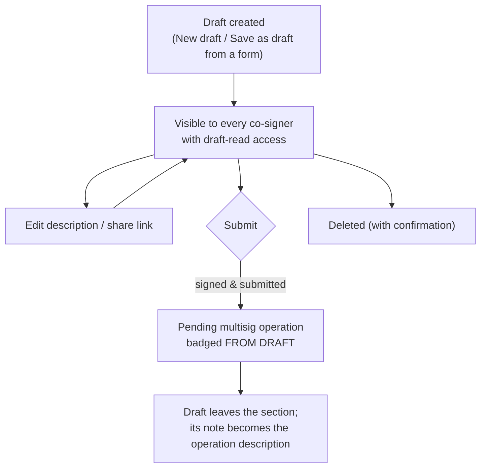

# Operation Drafts

> Part of the [Feature Map](../README.md) — Last reviewed: 2026-07-06

## Overview

A **draft** is a multisig operation prepared ahead of time but not yet submitted on-chain. Drafts let a team agree on an
operation — its call, its signing path, and a mandatory description of intent — before anyone signs. They are stored in
the shared **address-book backend**, so every co-signer with access sees the same draft list, and any of them (with the
right permissions) can review, edit, share, submit, or delete a draft.

Drafts surface as a collapsible **Drafts section** inside the operations table on the
[Operations view's](../multisig-operations/README.md) Pending tab — the first section under the shared column header,
styled and column-aligned like operation rows, gated by the view's Status filter. A compact subsection with the same
submit gating also appears in the dashboard's operations queue.

## Who can use it / when it applies

Everything about drafts is backend data, gated by the address-book connection and per-user permissions:

- The section renders only once the user has **connected the address book at least once**; while the backend is
  unhealthy the section is dimmed under a reconnect overlay.
- **Seeing** drafts requires the _draft read_ permission (without it the section hides entirely).
- **Creating and editing** requires _draft write_ — without it the "New draft" row is disabled with an explanatory
  tooltip, and the per-row Edit buttons are absent entirely.
- **Deleting** requires _draft delete_ — without it the delete control is absent.
- **Submitting** additionally requires an active backend session, the draft's call data, and a local account matching
  the draft's source (see [Submitting](#submitting)).

## The drafts section

Drafts are listed flat, **newest first**, each row column-aligned with the operations table:

- **Operation** — a draft icon, the decoded operation title (or "Unknown Operation" while the call can't be decoded),
  and the chain name with the draft's creation date inline.
- **Value** — the amount and asset, when one can be extracted from the call.
- **Submitter** — the draft's source account (the proxied source for a proxy-routed draft, otherwise the multisig),
  resolved to a name.
- **Description** — the draft's note inline (an italic "No description" placeholder when absent).
- **Actions** — one primary control:

  | Primary control     | When                                                                                           |
  | ------------------- | ---------------------------------------------------------------------------------------------- |
  | **Submitted** badge | The draft was just submitted in this session (it disappears from the list on the next refresh) |
  | **Add wallet**      | No local account matches the draft's source — a pairing prompt instead of a submit button      |
  | **Add call data**   | The draft has no call data yet — opens the submit flow at the call-data step                   |
  | **Submit**          | Call data present and a local source account exists; disabled with a tooltip when signed out   |

Like an operation row, a draft row **expands** into three panels; the secondary actions live in their headers:

- **Details** — network, multisig (and proxy, when the draft routes through one), threshold, who created the draft and
  when, plus the full description. The header carries the **Edit** button (write permission, not yet submitted).
- **Signing path** — the draft's stored execution hops (proxied → multisig → chosen signer). The panel header carries
  two icon actions: **Open overview**, which opens the account-structure view anchored on the draft's exact signing
  path, and **Share**, which copies the draft's deep link (opening the link scrolls to and highlights the draft).
- **Advanced** — the call data (copyable, with a decoded JSON view once it decodes), or a hint that call data will be
  added on submission. The header carries the **Delete** trash icon (delete permission, not yet submitted) behind a
  confirmation dialog.

A draft that has been **linked to a live operation** (submitted by anyone) leaves the list automatically — the resulting
operation row in the table carries a **FROM DRAFT** badge instead, and the draft's description becomes the operation's
description.

Below the rows, a dashed **"New draft"** row starts the creation flow (write permission required).

## Creating a draft

The creation modal walks three steps — **Call data → Signing path → Confirm**:

1. **Call data** — paste hex call data (validated and previewed once it decodes) or build the call from scratch with the
   extrinsic builder, on a chosen chain.
2. **Signing path** — pick how the operation will be executed: which multisig, through which proxy (if any), and which
   signatory initiates.
3. **Confirm** — review the decoded call and signing path, and write the **description** (required, up to 500
   characters) explaining the operation's intent to co-signers.

Drafts can also be started **from an operation form**: transfer, staking, governance, proxy, and other operation flows
offer a _draft mode_ that seeds the modal with the form's call data, chain, and signing path — when the seed is
complete, the modal jumps straight to Confirm so the user only writes the description.

**Editing** an existing draft is limited to its description (with the decoded call and signing summary shown for
context); closing with unsaved changes asks for confirmation.

## Submitting

Submitting turns a draft into a real on-chain multisig operation. The **Submit** action opens a flow that reconstructs
the draft's transaction and signing path, lets the user confirm and sign (adapting to the signer's wallet type), and
submits the first approval — creating the pending operation every co-signer then sees in the operations table.

Submission is gated: the user must be signed in to the backend, the draft must carry valid **call data** (otherwise the
primary action is _Add call data_), and a local account matching the draft's source must exist (otherwise a wallet
pairing prompt is shown). After a successful submission the row shows a **Submitted** badge, and once the backend links
the draft to its operation, the draft leaves the section for everyone.

## Lifecycle

## Related

- [`multisig-operations`](../multisig-operations/README.md) — hosts the drafts section on its Pending tab and badges
  operations that originated from drafts.
- [`multisig-operation-description`](../../aggregates/multisig-operation-description/README.md) — a submitted draft's
  description is published as the operation's shared note (the confirmation screen hides its own description field
  during a draft submission).
- **Signing path / extrinsic builder** — the creation flow reuses the shared signing-path picker and call builder.
- **Dashboard operations queue** — shows a compact drafts subsection with the same submit gating.
