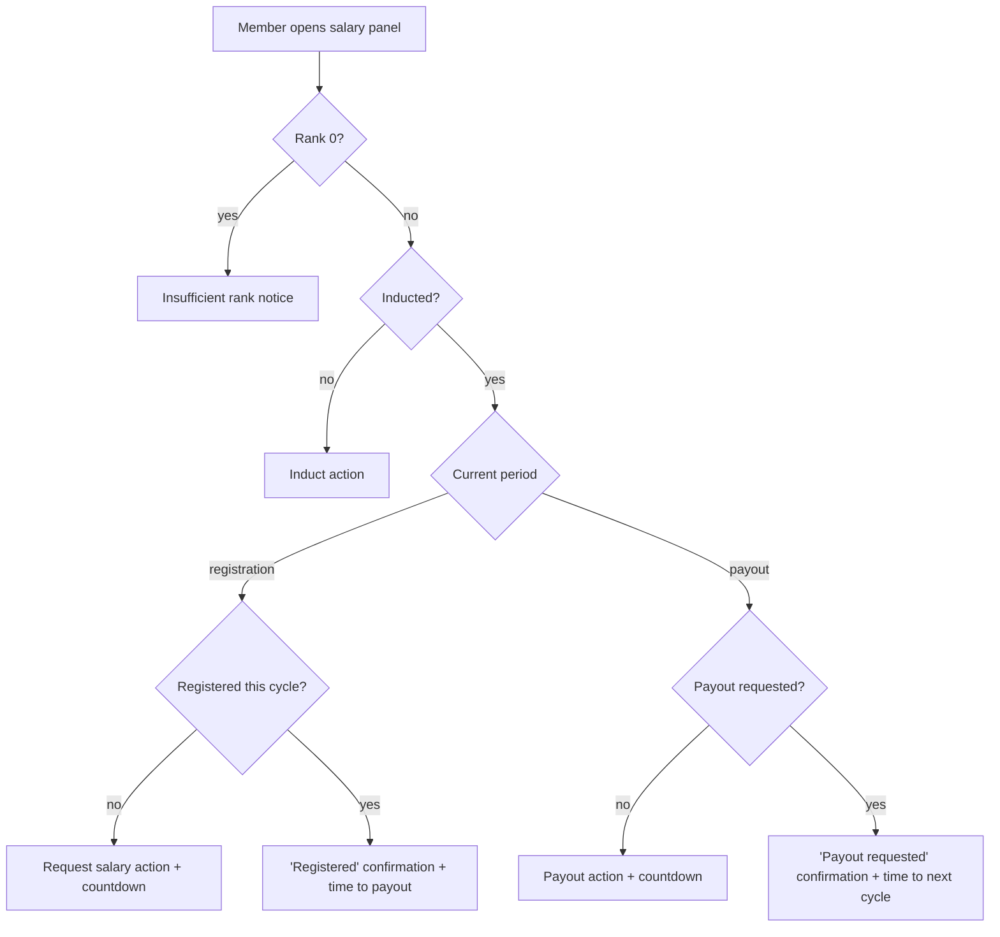

# Fellowship Salary

> Part of the [Feature Map](../README.md) — Last reviewed: 2026-07-17

## Overview

Lets a Polkadot Technical Fellowship member manage their on-chain salary directly from Nova Spektr. The salary system
runs in repeating cycles, each split into a **registration** period and a **payout** period, and a member has three
possible actions: **induct** themselves into the salary system (one-time), **register** for salary in the current cycle,
and **request a payout** of the registered amount to a **beneficiary** account of their choice. The feature shows the
member's salary amount, the current period with a countdown, exactly one applicable action at a time, and the chosen
beneficiary.

## Who can use it / when it applies

- The Fellowship section must be enabled (feature flag) and the Fellowship (collectives) network connected. While the
  network is disconnected the feature is unavailable and resumes automatically on reconnect.
- One of the user's wallets must contain the account of a Fellowship member — the feature works on behalf of that
  member. Users who are not members never see it.
- Action buttons are disabled when the matched account cannot sign transactions (e.g. a watch-only wallet).
- Members of rank 0 (candidates) have no salary; instead of salary info they see an "insufficient rank" notice.

The feature surfaces in two places inside the Fellowship section:

- the member's **profile modal** — a Salary panel (amount, period countdown, action button, beneficiary card);
- the Fellowship **task cards** — "request salary", "induct" and "payout" tasks each carry the matching action button.

## States / scenarios

The visible state follows the member's claim status and the phase of the current salary cycle:

| State                 | When it appears                                                     | What the user sees                                                     |
| --------------------- | ------------------------------------------------------------------- | ---------------------------------------------------------------------- |
| **Insufficient rank** | Member has rank 0                                                   | A notice that the rank is too low; no salary amount or actions         |
| **Induct**            | Member never joined the salary claim system                         | Salary amount and an "Induct" action                                   |
| **Request salary**    | Registration period, inducted, not yet registered in this cycle     | Salary amount, countdown to the payout period, "Request salary" action |
| **Registered**        | Registration period, already registered                             | Success mark and time left until the payout period                     |
| **Payout**            | Payout period, registered this cycle (or missed the previous claim) | Salary amount, countdown to cycle end, "Payout" action                 |
| **Payout requested**  | Payout period, payout already requested                             | Success mark and time left until the next cycle                        |
| **Disabled actions**  | The member account cannot sign (e.g. watch-only)                    | The same state, with action buttons disabled                           |

Salary amount depends on the member's rank and on whether the member is active or passive (on leave) — the panel always
shows the figure that applies to them.

### Beneficiary

The payout destination. By default it is the member's own account; the member can change it at any time via **Edit
beneficiary**:

- The picker lists the user's own accounts compatible with the Fellowship chain (watch-only excluded), grouped by wallet
  type, each shown with its resolved display name and wallet name.
- Typing in the field searches accounts **by the same names the user sees on screen** — custom account names, contact
  names, on-chain identities, wallet names — as well as by address. Any valid address can also be pasted directly, so
  the beneficiary does not have to be one of the user's accounts.
- The choice is remembered locally per member and chain, and is used for every subsequent payout until changed. The
  payout confirmation always shows the beneficiary the funds will go to.

## Lifecycle

The happy path for each action is the same three-step flow:

1. The member presses the action (in the profile panel or on a task card) — a confirmation opens showing the salary
   amount, the signing account, the network fee, and (for payout) the beneficiary.
2. The member signs the transaction and it is submitted to the chain.
3. On inclusion the panel switches to the corresponding "done" state (registered / payout requested) driven by the
   updated on-chain status.

Instead of signing immediately, the operation can be **saved to the basket** (when the wallet supports it) and signed
later with other queued operations. On task cards for basket-capable wallets the button acts as a toggle: pressing it
adds the operation to the basket (the button turns green), pressing again removes it.

Notable failures: if no member account can be resolved when an action modal opens, an error is shown instead of the
confirmation; if the network drops mid-session, the feature becomes unavailable until reconnect.

## Related

- **Fellowship profile** (`fellowship-profile`) hosts the Salary panel; **Fellowship tasks** (`fellowship-tasks`) hosts
  the task-card action buttons.
- Basket submission of a saved salary operation reuses the shared operations confirm flow (`operations`), which renders
  its own confirmation for salary request / induct / payout drafts.
- Salary rules (cycle phases, who may register or claim) come from the on-chain fellowship salary pallet; the feature
  mirrors them and never offers an action the chain would reject.
