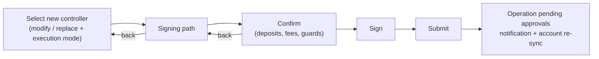

# Flexible Multisig — Change Signatories

> Part of the [Feature Map](../README.md) — Last reviewed: 2026-07-17

## Overview

A flexible multisig wallet is a pure proxy account controlled by a multisig ("the controller"). Changing the signatories
or the threshold therefore means **re-pointing the pure proxy at a different controller multisig** — the signatory set
itself is immutable on-chain. This feature is the guided flow for that change: pick (or compose) the new controller,
choose how the swap is executed, review the deposits, sign, and submit.

One-line summary: "edit the signatories of a flexible multisig" = "replace its controller multisig with a new one,
safely".

## Who can use it / when it applies

- Applies to **flexible multisig wallets** only (a multisig with a pure-proxy account).
- Entry points:
  - **Wallet details** of a flexible multisig — the "Change signatories" action (also available in the wallet management
    dropdown).
  - **Proxies tab** of wallet details — an "Edit" button on any multisig proxy row that has proxy authority over the
    flexible multisig's pure proxy. This covers stale ex-controllers too, so a leftover controller from a previous edit
    can still be replaced. The button is hidden while a removal of that proxy is pending.
- The transaction is signed by one of the **current** controller's signatories (the new set takes over only after the
  operation executes and gathers enough approvals).
- Blocked while another change-signatories operation for the same wallet is still pending — only one edit can be in
  flight at a time.

## States / scenarios

### Choosing the new controller

The first step shows a persistent **"was → will become" banner**: the current controller (address, resolved name,
threshold, expandable signatory list) on the left, the future one on the right. Until a valid target is chosen, the
right side stays a dashed "not selected" placeholder and Next is disabled. A strip above the banner names the wallet and
its pure-proxy address, with a shortcut to the accounts-structure overview.

The picker offers two tabs:

| Tab                       | What it does                                                                                                                                                                                                                                      |
| ------------------------- | ------------------------------------------------------------------------------------------------------------------------------------------------------------------------------------------------------------------------------------------------- |
| **Modify current**        | An inline editor pre-filled with the current signatories. Add or remove signatories (minimum 2; removal available only above 2) and pick a threshold (2…n). The new controller address is derived live from the edited set.                       |
| **Replace with existing** | A searchable list of known multisigs — the user's own multisig wallets ("My wallets") and multisig contacts from the address book ("From address book") — filtered to the chain's crypto family (Substrate vs EVM) and excluding the current one. |

Search in both tabs matches what the user actually **sees**: names are resolved through the canonical chain (custom
account name → local contact → backend contact → on-chain identity → wallet name), and the query is matched against that
displayed name as well as the address. A row visible under one name can always be found by that name.

Validation in the Modify tab: no duplicate signatories, no empty rows, addresses must be valid for the chain, and the
derived multisig must differ from the current controller (an unchanged set keeps Next disabled rather than producing a
no-op transaction). Signatory pickers hide accounts already chosen in other rows and exclude watch-only accounts.

### Execution mode

A toggle chooses how the old controller is handled, with an info popover explaining both options:

| Mode                   | What happens on-chain                                                                            | Trade-off                                                                                                                                                               |
| ---------------------- | ------------------------------------------------------------------------------------------------ | ----------------------------------------------------------------------------------------------------------------------------------------------------------------------- |
| **Verified** (default) | Adds the new controller as a proxy; the old one is removed **later**, in a separate cleanup step | Safe: the old controller keeps access until the new one is verified to work. Temporarily locks one extra proxy deposit. The banner shows both controllers side by side. |
| **Trusted**            | Adds the new controller and removes the old one **atomically in one batch**                      | Immediate and deposit-neutral, but there is no fallback if the new controller was composed incorrectly. The banner marks the current controller "will be removed".      |

### Confirm step gating

The Sign button stays disabled — with a tooltip naming the reason — while: fees/deposits are still loading, validation
is running, an edit operation for this wallet is already pending, the chosen controller equals the current one, or the
signer's balance can't cover the costs. The review lists the proxy deposit (the total that will be reserved after the
operation), the multisig deposit, and the network fee; balance validation uses only the **additional** amount this
operation locks.

### Draft mode

Instead of executing, the user can flip the step into draft mode, pick a draft signing path, and save the operation as a
draft (the Next button becomes "Initiate"). Closing the flow after initiating a draft redirects to the Operations page.
Only the bare controller-edit call is stored — the multisig wrapping is applied at submit time by whichever signatory
picks the draft up.

## Lifecycle

1. **Select controller** — compose or pick the new multisig, choose the execution mode.
2. **Signing path** — choose which of the user's own accounts signs, starting from the flexible multisig; only the `Any`
   proxy type is accepted along the path. Going back preserves the selection.
3. **Confirm** — review the change (the banner stays visible), deposits and fee; guards above apply.
4. **Sign & submit** — on success the user gets a "Flexible multisig wallet edited" notification, local accounts are
   re-synced, and a "view operation" shortcut switches to the initiating wallet and opens the Operations page.

If the new controller multisig is not yet known to the app (e.g. composed from scratch in the Modify tab), the submitted
batch also announces its threshold and signatories on-chain so other participants' apps can discover it; the
announcement is skipped when the multisig already exists locally. In verified mode the batch additionally carries a
marker so the operation can later be distinguished from a plain add-proxy and the old controller cleaned up.

## Related

- **Candidate list** for the Replace tab comes from the `multisig-candidates` aggregate (multisig wallets merged with
  multisig contacts from the shared address book).
- **Proxy verification / removal** — the verified path hands the old controller over to the proxies tab flow, where it
  is verified and later removed; the Edit button there re-enters this feature with a controller override.
- **Drafts** — see [`drafts`](../drafts/README.md) for how saved drafts are signed and submitted later.
- The generic multisig "edit signatories" for non-flexible multisigs is a different flow; this feature is specific to
  the pure-proxy + controller architecture of flexible multisigs.
