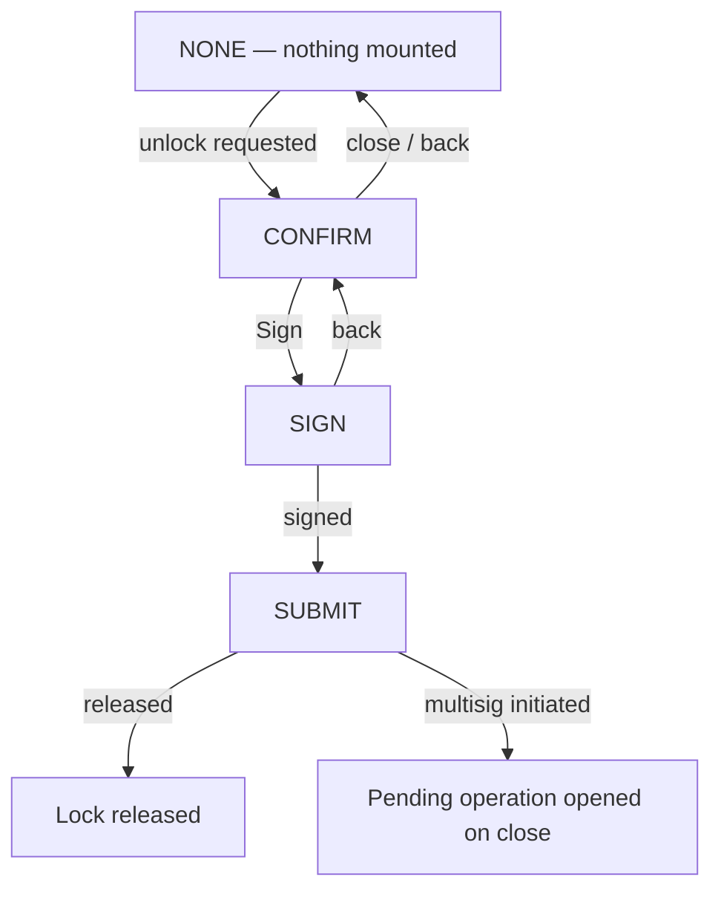

# Governance unlock flow

> Part of the [Feature Map](../README.md) — Last reviewed: 2026-09-04

## Overview

Releases a **governance conviction lock** — one account, one chain — and walks the user from a pressed button to a
landed extrinsic: confirm → sign → submit.

A conviction lock is the price of having voted: the tokens stay frozen after the referendum ends, for a period set by
the conviction and the outcome. Getting them back means a `convictionVoting.removeVote` for every vote still on the
books plus an `unlock` per track — a batch nobody assembles by hand. This flow takes that batch **already assembled**
and does the rest.

It is deliberately incurious about where the request came from. Today the Dashboard's
[Locks widget](../dashboard-governance/README.md) dispatches it, one row at a time, and the flow knows nothing about the
dashboard, its account picker, the Governance page's network selector or the selected wallet. Its whole input is a fully
resolved request — the chain, who originates the transaction, whose lock is released, the calls and the amount — and
everything it shows is derived from that one snapshot.

**The same flow also takes a delegation back.** A request whose `actions` carry an `undelegate` (plus an `unlock` for
each delegated track whose conviction is None, whose lock expires in the same block) is read as a revocation rather than
a release: the title, the amount label ("Delegated"), the label over the account it acts for, the hint under the details
and the icon all switch to undelegate wording. Nothing else changes — the signing route, the multisig handling, the fee
and deposit validation and the success screens are the same ones the unlock uses, because both are a batch of
conviction-voting calls on one account; who may sign is still decided per call.

The flow is **mounted globally** in the app shell's modal slot, so it opens from wherever the user pressed the button
rather than from a route, and stays open across navigation.

## Who can use it / when it applies

- Gated by the **`dashboard` and `governance`** feature flags together — it exists to serve the dashboard's Locks
  widget, and has no other entry point yet.
- The **initiator** — the account that originates the transaction — may be:
  - a **plain key**, signing for its own lock;
  - a **multisig or flexible multisig**, which does not release anything on submit: it opens a pending operation the
    remaining signatories must approve. Closing the flow navigates to that operation, so an initiation is never a
    success screen with nothing behind it;
  - a **proxied account**, signed by its delegate;
  - a **local payer releasing someone else's lock**. `convictionVoting.unlock(class, target)` takes any origin, so a
    watched address whose votes are all gone can still be released by any local key that can pay. This is available for
    an **unlock-only** release and no other: `removeVote` and `undelegate` must be signed by the voter, so as soon as
    one is required the payer route is off the table — a request that asks for it anyway is dropped, not shown.
- The **signing route** is seeded with the default path and can be changed on the confirm screen. It is not cosmetic —
  the account at the end of the route is the one that pays the fee and reserves the multisig deposit — so it is never
  picked silently when the wallet offers more than one. Changing it re-wraps the transaction, re-prices the fee and
  re-validates.
- A **regular account signs for itself**, and for one the signing path is empty by design; the flow falls back to the
  initiator as its own signatory. Without that fallback the route comes out empty, no transaction is built, and the
  confirm sits forever on a fee that never arrives.

## States / scenarios

| State               | When it appears                                                         | What the user sees                                                                                                                                                                                                |
| ------------------- | ----------------------------------------------------------------------- | ----------------------------------------------------------------------------------------------------------------------------------------------------------------------------------------------------------------- |
| None                | No release requested                                                    | Nothing — the flow renders no modal                                                                                                                                                                               |
| Confirm             | An unlock was requested                                                 | The released amount in token and fiat, who it unlocks for, the calls the release is made of (one line per `unlock`/`remove vote`/`undelegate`, with its track), the signing-path chooser, network fee, and a hint |
| Confirm — preparing | The wrapped transaction, the fee or the validation is still in flight   | The figures are already there; fee and deposit sit behind their own loaders and **Sign stays disabled** until all three land                                                                                      |
| Confirm — multisig  | The route runs through a multisig                                       | An extra multisig-deposit row alongside the fee                                                                                                                                                                   |
| Confirm — unpayable | The signer cannot cover the fee, or cannot reserve the multisig deposit | The reason is spelled out and **Sign is blocked**. Switching the signing route re-checks it                                                                                                                       |
| Sign                | Sign pressed                                                            | The wallet's standard signing screen; going back returns to Confirm with everything intact                                                                                                                        |
| Submit              | The signature arrived                                                   | The standard submission screen                                                                                                                                                                                    |
| Released            | The extrinsic landed and the initiator is not a multisig                | Success. Nothing is pushed back to the host — the dashboard's rows update on their own                                                                                                                            |
| Multisig initiated  | The extrinsic landed but the release still needs signatories            | Success for the _initiation_; closing the flow opens the resulting pending operation                                                                                                                              |

**The account the lock is released for is always spelled out**, on its own row, next to the account that signs. For a
permissionless release the two differ, and the confirm says so in words — a notice that the user pays the fee and that
the unlocked funds stay where they are — rather than leaving it to a differing address in a details row. The hint under
the details matches the release: it mentions removing votes only when a `remove vote` is actually among the calls.

**Closing resets everything.** Whatever step it is on, closing the flow clears the request, the signing route and the
confirm, so the next unlock starts clean rather than inheriting the last one.

**A render crash closes the flow too.** If the modal itself throws, it is caught rather than taken out on the app shell,
and the flow is reset to None the same way closing it would be — no step left stranded mid-signature, and the Unlock
button works again on the next click.

## Lifecycle

**The confirm opens on the click, not on the data.** Everything it leads with — the amount, the account, the chain, the
number of calls — is in hand the moment the button is pressed. The wrapped transaction, the fee and the validation each
cost a round trip to the node, so they are not awaited: the modal opens immediately and they stream in behind their own
loaders.

**The request is a snapshot, and the flow trusts it.** Locks, referenda and the claimable amount move with every block;
the release being signed must not. The host is the one responsible for the request being current — the Locks widget
re-derives both the claimable actions and the initiator against the live head at the moment of the click, because a
referendum that ended since the last snapshot adds a required `removeVote`, and that call is origin-bound: a
permissionless payer good enough for the snapshot is no longer allowed to send it. From then on this flow signs exactly
what it was handed. Nothing here follows the chain, so a block tick cannot disturb a signature in progress.

**Only a flow at the sign step may claim a signature.** Signing and submission are app-wide singletons: every operation
in the app goes through the same events. A flow parked on Confirm — or abandoned there while a hardware-wallet request
is still in flight elsewhere — would otherwise pick up a foreign payload and submit it as its own. So the flow reacts to
a signature only while it is itself at the sign step.

**Released is not the same as submitted.** A multisig initiation lands too, and it releases nothing until the remaining
signatories approve, so the success screen says which of the two happened rather than reporting the money back either
way. Nothing has to tell the host to refresh: the dashboard's rows are derived from live voting and lock subscriptions,
so a real release drops out of the table on its own — including one that only lands later, when the last signatory
approves.

## Related

- [`dashboard-governance`](../dashboard-governance/README.md) — the Locks widget that dispatches every request this flow
  serves, and decides who can release what.
- [`vesting-claim`](../vesting-claim/README.md) — the same shape one pallet over: a hidden extrinsic turned into a
  confirm/sign/submit flow, with the same signing-route and affordability rules.
- [`staking-confirm-flow`](../staking-confirm-flow/README.md) — another flow mounted globally in the app shell's modal
  slot and opened by an event rather than by navigation.
- **Governance page unlock** (`widgets/UnlockModal`) — the page's own unlock surface, bound to the Governance page and
  its network selector. Untouched by this feature; the two do not share state.
- `operations/OperationSign`, `operations/OperationSubmit`, `shared/transactions` — the reused signing, submission and
  validation stack.
