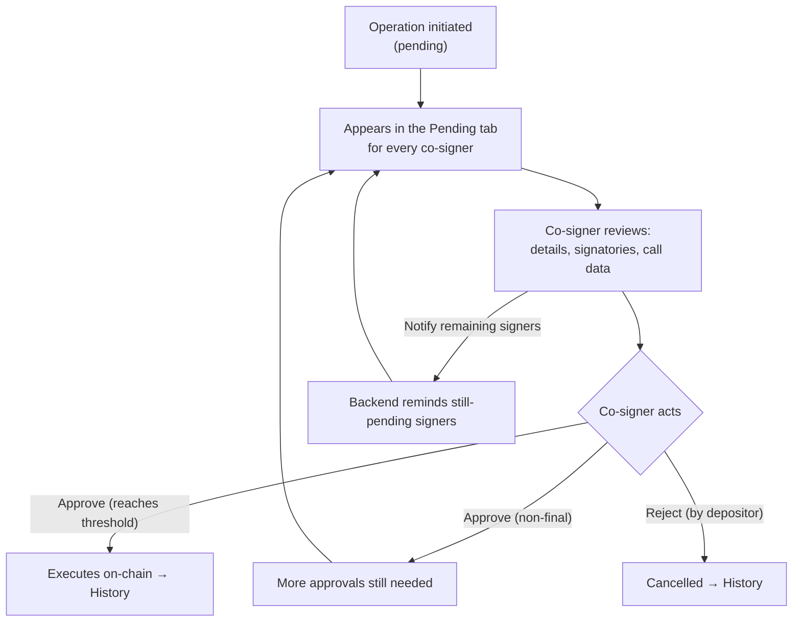

# Multisig Operations

> Part of the [Feature Map](../README.md) — Last reviewed: 2026-07-01

## Overview

The **Operations view** is the multisig co-signer's inbox. It lists every multisig operation that the active multisig
account is involved in — the ones still waiting for approvals, the ones already resolved, and the ones the user chose to
hide — and lets the user act on each of them without leaving the list.

A multisig operation is created when one signatory initiates a call; it then needs a threshold of approvals before it
executes on-chain. Until that happens, the operation is a shared, half-finished thing: any co-signer needs to see what
it is, who has already signed, and whether it is their turn. This view is where that happens — reviewing an operation,
approving or rejecting it, inspecting its call data, and (when the shared backend is available) nudging the signatories
who still need to act.

## Who can use it / when it applies

The view applies whenever the active account is a **multisig or flexible multisig**. Each row is an operation belonging
to a multisig the user co-signs — either a multisig held in one of the user's wallets, or a contact-backed external
multisig the user tracks but does not own.

Per operation, what the user can *do* depends on their relationship to it:

- **Approve / Reject** require the user to own a signatory account that is still able to act (an actionable signatory for
  approval; the depositor for rejection), on a network Nova can reach. Watch-only accounts cannot sign.
- **View** (details, signatories, log, call data) is available to anyone who can see the operation.
- **Notify remaining signers** requires the shared address-book backend to be connected and the operation to be pending;
  the backend then authorizes the specific caller (see below).

Contact-backed external multisigs are read-only: their pending rows offer a prompt to pair the wallet rather than sign,
and resolved rows are hidden from them entirely.

## States / scenarios

The list is split into three tabs, and each operation renders differently depending on its status and the viewer's
relationship to it.

### List-level

| Tab | What it holds |
| --- | ------------- |
| **Pending** | Operations still collecting approvals; also shows saved drafts awaiting submission |
| **History** | Executed, cancelled, or errored operations |
| **Hidden** | Operations the user manually hid from the pending/history lists |

Operations are grouped by date. The list can be narrowed by **filters** (date range, network, transaction type, proxy
type) and **search**, and the current filtered set can be **exported to CSV**. An operation can be reached directly via a
shareable **deep link**, which focuses the row and switches to the matching tab.

### Per-operation

A collapsed row shows the operation's title, network, amount, status, a share-link button, and — for a submitted draft —
a badge. Expanding it reveals three panels:

- **Details** — depositor, timestamp, and the shared operation description (see Related).
- **Signatories** — the wallet and contact signatories with a per-signatory signed / pending / rejected marker, a **Log**
  of the operation's events, **Notify remaining signers**, and (for owned multisigs) an **Open overview** of the account
  structure.
- **Advanced** — call hash, call data (with a formatted JSON view), deposit, the on-chain time point / explorer link, and
  a control to **hide / unhide** the operation.

Some operations are recognised as special shapes and get a tailored card and detail panel instead of the generic amount
row: **edit-flexible-controller** and **verify-proxy** operations.

The available **actions** on a row follow these rules:

| Situation | What the user sees |
| --------- | ------------------ |
| Pending, user owns an actionable signatory, non-final approval | **Approve** button |
| Pending, user's approval reaches the threshold (final signing), call data present | **Approve** button (executes the call) |
| Pending, final signing but call data missing | **Add call data** button (approval is blocked until it is provided) |
| Pending, user owns the depositor account | **Reject** button |
| Pending, contact-backed external multisig | **Add wallet** pairing prompt instead of sign buttons |
| Executed / cancelled / errored | No actions (view only) |

### Notify remaining signers

On a **pending** operation, when the address-book backend is connected, a **Notify remaining signers** button lets an
authorized signatory push an Element (Matrix) reminder to the signatories whose approval is still outstanding. The
backend owns the rules — it only ever reminds still-pending signers, authorizes the caller (only the operation's creator
or a signatory who has already approved may nudge), and rate-limits repeat nudges. Feedback is delivered entirely through
toasts:

| Outcome | Toast |
| ------- | ----- |
| One or more signers reminded | Success — *reminded N signer(s)* |
| Nobody is left to remind | Neutral — *nobody pending* |
| Reminders attempted but delivery failed | Error — *delivery failed* |
| Backend rejects the caller (not creator/approver) | Error — *forbidden* |
| Feature not yet available on the backend | Error — *not available* |
| Nudged too soon after the last one | Error — *rate-limited* (includes the time the next nudge is allowed, when known) |

The button hides itself entirely once the operation is no longer pending or when the backend is offline.

## Lifecycle

**Happy path.** An operation is initiated and shows up as *pending* for every co-signer. Each actionable signatory
approves in turn; while the threshold is not yet met, approvals are non-final and simply advance the count. The approval
that reaches the threshold is the *final signing* — it carries the full call data and executes the underlying call, after
which the operation moves to History. Alternatively, the depositor can reject the operation, cancelling it.

**Notable failures.**

- **Missing call data on final signing** — the last approver cannot sign the real call until its call data is supplied,
  so the row offers *Add call data* instead of *Approve*.
- **Network unreachable / operation gone** — approving or rejecting surfaces a modal (network not available, connection
  timeout, account or operation not found, already signed) rather than failing silently.
- **Nudge rejected** — authorization (403), rate-limit (429), unavailable backend (404), or delivery failure are each
  turned into an explanatory toast; nothing is sent when no signer is still pending.

## Related

- [`multisig-operation-description`](../../aggregates/multisig-operation-description/README.md) — the shared note attached
  to an operation and shown in its Details panel; this view reads and displays those descriptions.
- **Address-book backend connection** — the same backend that stores descriptions also backs *Notify remaining signers*.
  The nudge endpoint owns authorization and rate-limiting; this view only decides whether to show the button (pending
  operation + connected backend) and maps the backend's response onto a toast.
- **Drafts** — the Pending tab surfaces saved operation drafts awaiting submission alongside live operations, and a
  submitted draft is badged on its resulting operation row.
