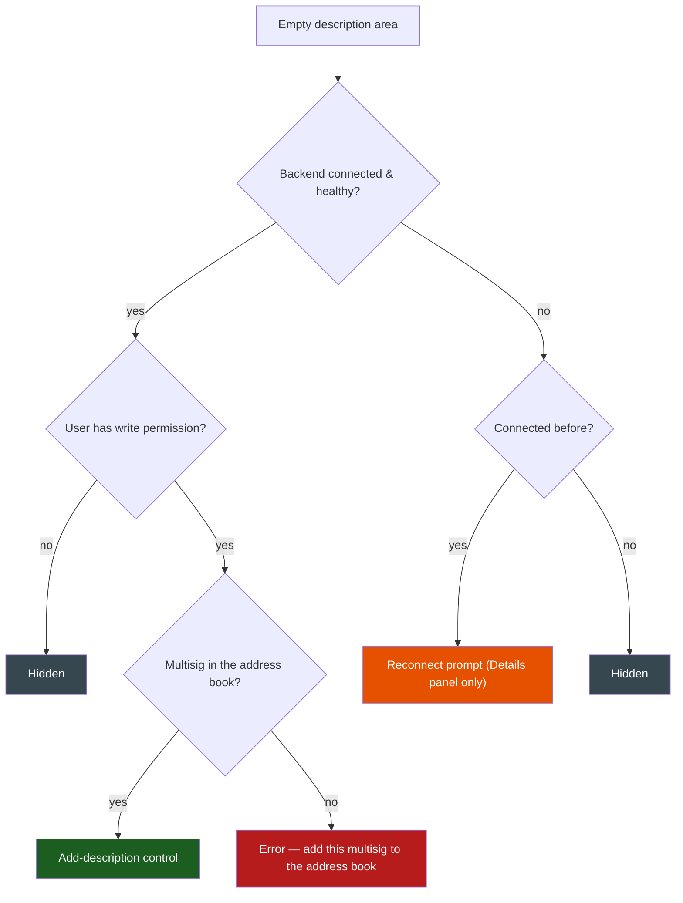
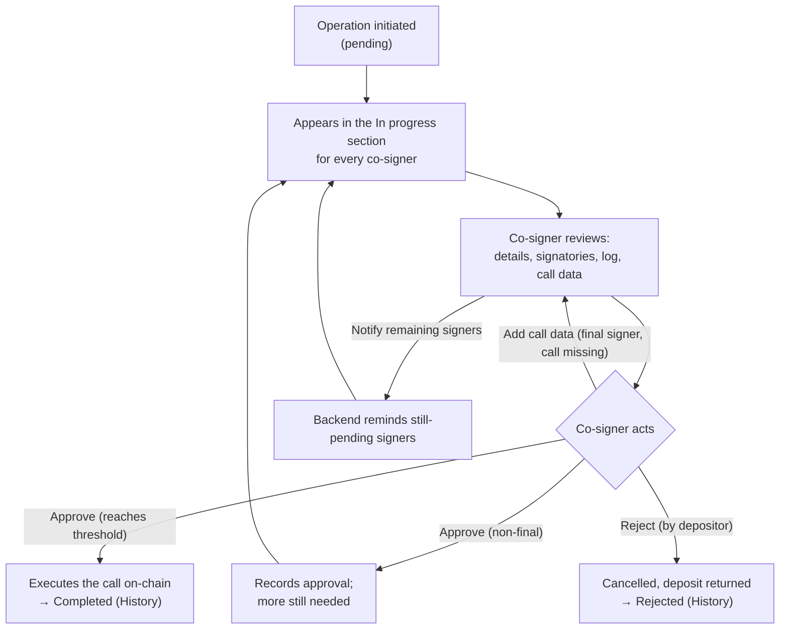

# Multisig Operations

> Part of the [Feature Map](../README.md) — Last reviewed: 2026-07-14

## Overview

The **Operations view** is the multisig co-signer's inbox. For the active multisig account it lists every operation the
account is involved in — the ones still collecting approvals, the ones already resolved, and the ones the user chose to
hide — and lets the user act on each without leaving the list.

A multisig operation is created when one signatory initiates a call; it then needs a threshold of approvals before it
executes on-chain. Until that happens the operation is a shared, half-finished thing: any co-signer needs to see what it
is, who has already signed, and whether it is their turn. This view is where that happens — reading an operation,
approving or rejecting it, inspecting its decoded call, supplying missing call data, following its event log, attaching
a shared description, and (when the address book is connected) nudging the signatories who still need to act.

The list is a **table**: a sticky column header (Operation / Value / Submitter / Description) with sortable columns sits
above rows grouped into collapsible **status sections** (In progress / Completed / Rejected). The **Description** header
label is shown only once the external address book has been connected (descriptions are address-book data) — the same
gate that reveals the drafts section; until then the column area stays blank. Saved **drafts** awaiting submission
appear as the first collapsible section under the same table header on the Pending tab.

## Who can use it / when it applies

The view applies whenever the active account is a **multisig** or a **flexible multisig** (a multisig that operates
through a proxy). Each row is an operation belonging to a multisig the user co-signs. A multisig comes in two flavours,
and the flavour changes what the user can do:

- **Local multisig** — held in one of the user's wallets; the user owns one or more signatory keys. Full per-operation
  actions are available (subject to the rules below).
- **External (contact-backed) multisig** — a multisig the user only _tracks_ through the address book; discovered from
  chain because its address matches a contact. The user holds **no signatory key**, so it is effectively read-only:
  signing actions are replaced by a prompt to pair the wallet that actually holds a key, and the account-structure
  overview is hidden (there is nothing in the user's account graph to draw).

Per operation, what the user can _do_ depends on their relationship to it:

| Action                                                    | Available when                                                                                                                                                                                          |
| --------------------------------------------------------- | ------------------------------------------------------------------------------------------------------------------------------------------------------------------------------------------------------- |
| **View** (details, signatories, log, call data, advanced) | Always — to anyone who can see the operation                                                                                                                                                            |
| **Approve**                                               | Pending, the user owns an _actionable_ signatory (a signatory account that hasn't approved yet, is reachable on-chain, and is not watch-only), and — for the final signing — valid call data is present |
| **Add call data**                                         | Pending, the user is the _final_ required signer, but the operation's call data is missing/invalid                                                                                                      |
| **Reject**                                                | Pending, and the user owns the **depositor** account (the original initiator), reachable on the operation's chain and not watch-only                                                                    |
| **Notify remaining signers**                              | Pending, the address-book backend is connected and healthy, and the multisig is in the external address book; active only after the backend session account has signed (disabled with a tooltip before) |
| **Add wallet** (external multisig)                        | Pending external multisig — a pairing prompt instead of sign buttons                                                                                                                                    |
| **Attach / edit description**                             | See [Address book availability](#address-book-availability)                                                                                                                                             |
| **Hide / unhide**, **share link**, **export**             | Always                                                                                                                                                                                                  |

Watch-only accounts can view but never sign. For an external multisig, resolved (non-pending) operations show no action
column at all.

## Operation types

Every operation carries an on-chain **call hash**; its **call data** may or may not be known yet. When the call is
decoded, the view recognises a family of operation types and gives each a tailored title, icon, amount, and details
panel. Unrecognised or still-undecoded calls fall back to a generic presentation.

### Recognised families

| Family                     | Operations                                                                                                                           | Shown as                                                                                                        |
| -------------------------- | ------------------------------------------------------------------------------------------------------------------------------------ | --------------------------------------------------------------------------------------------------------------- |
| **Transfer**               | Transfer, Transfer-all, asset & ORML transfers                                                                                       | "Transfer" with the amount and asset (Transfer-all shows no number); "Transfer All" for the all-balance variant |
| **Cross-chain (XCM)**      | teleports, reserve transfers, `xTokens`, `polkadotXcm` variants                                                                      | "Cross-chain transfer" with **two** chain chips (source → destination) and the amount                           |
| **Multi-transfer**         | a batch made entirely of transfers                                                                                                   | "Multi Transfer" with the **summed** amount                                                                     |
| **Vested transfer**        | vested transfer (also inside a batch)                                                                                                | "Vested transfer" with the locked amount                                                                        |
| **Staking**                | Start Staking (bond), Change Validators (nominate), Stake More, Unstake, Restake, Withdraw Unstaked (redeem), Set reward destination | each with its own title/icon and, where relevant, amount                                                        |
| **Governance**             | Vote, Remove vote, Unlock, Delegate, Revoke delegation, Edit Delegation                                                              | each with its own title/icon; vote shows the conviction amount                                                  |
| **Proxy management**       | Add proxy, Create pure proxy, Revoke proxy, Revoke pure proxy                                                                        | "…delegated authority (proxy)" titles; details show delegate/revoke target and access type                      |
| **Edit flexible multisig** | swapping the controller of a flexible multisig                                                                                       | a dedicated card — see below                                                                                    |
| **Verify proxy**           | a marker remark proving control of a proxied wallet                                                                                  | a dedicated card — see below                                                                                    |

**Proxy wrappers** are unwrapped for the title, icon, and amount: a proxied call shows the **inner** operation (not
"proxy"), and for a flexible multisig the view always presents the _core_ transaction that runs through the proxy.
**Batches** are given a recognised title only when the whole batch maps to a known shape — a batch of transfers becomes
**"Multi Transfer"**, a vested-transfer batch becomes **"Vested transfer"**. Other batches (for example a bond+nominate
or an unlock+remove-vote) are **not** relabelled to their inner operation in the list: the row shows the generic call
label (**"Utility: Batch all"**) with the generic icon, even though the displayed **amount** is still taken from the
meaningful inner call.

### Two special shapes

These bypass the normal amount row and get a bespoke card in the list plus a bespoke details panel. Detection is
exclusive — an operation is at most one of them.

- **Edit flexible multisig** — swapping which multisig controls a flexible multisig. The card shows the old and new
  controllers (identicons, old → new) and a coloured tag for the mode:
  - **Atomic swap** — the old controller is removed in the same transaction (both add and remove happen together).
  - **Verified swap** — the new controller is added now; the old one is removed later, after verification. The old
    controller is recovered from a marker embedded in the transaction.

  The details panel lists the old proxy (atomic only) and the new proxy, each with its threshold and signatories, the
  execution mode, and a link into the wallet's proxy details.

- **Verify proxy** — a signer proving they control a proxied (pure proxy) wallet by sending a marker remark through it.
  The card shows a verification badge and a "Verification for wallet" label; the **details** panel names the verifying
  wallet, shows the optional remark, and links to the pure-proxy wallet's details.

### Undecoded and unrecognised operations

When the call data has not been supplied yet, only the call hash is known, so the operation cannot be decoded. It then
shows as **"Unknown Operation"** with a generic icon (tinted by status) and no amount. A call that _is_ decoded but
belongs to none of the families above (a bare batch, a remark, a collective call, …) shows its raw **"Section: Method"**
label — e.g. "Utility: Batch all" — with the same generic icon. In both cases the **Advanced** panel still shows the
call hash and on-chain time point.

An undecoded operation is still actionable: if the current user is the final required signer, an **"Add call data"**
action lets them paste the hex call data — validated against the call hash — which both decodes the display and unblocks
the final approval.

## The operation row and its panels

A collapsed row is a fixed-height card whose cells line up with the sticky table header:

- **Operation** — the recognised title with its icon, and the network name underneath (two chain chips for XCM). Special
  shapes (edit-flexible, verify-proxy) render their bespoke card across the Operation and Value cells instead.
- **Value** — the operation's amount and asset, when one can be extracted from the (core) call.
- **Submitter** — the multisig account, resolved to its wallet/contact name with an identicon.
- **Description** — the shared operation note, inline. See [Description in the row](#description-in-the-row).
- **From draft** — an uppercase **FROM DRAFT** badge when the operation originated from a submitted draft; hovering it
  shows the operation's description.
- **Status** — a bordered pill: **"X of Y signed"** while pending, **Executed** or **Rejected** once resolved.
- **Actions** — Approve / Reject / Add call data buttons per the rules above (or the Add-wallet pairing prompt for an
  external multisig).

There is no share button on the row — sharing lives in the expanded Signatories panel header. Expanding a row reveals
three panels:

- **Details** — depositor, timestamp, the recognised transaction's specifics, and the shared **operation description**
  (preview with a "show full" expansion and an Edit action when editing is allowed). Special shapes render their bespoke
  details here.
- **Signatories** — the signatory list and the operation's activity **Log**, plus the header actions (including **Notify
  remaining signers** when applicable). Detailed below.
- **Advanced** — call hash, call data with a formatted JSON view (once known), the on-chain time point with an explorer
  link, and the **hide / unhide** control. When the outer and core calls differ (proxy/batch wrappers), the labels
  switch to "Core call hash" / "Core call data".

### Description in the row

The Description cell shows the operation's shared note inline (truncated; the full text appears on hover). When there is
**no** description yet and the operation is still **pending**, the cell offers a way to add one, gated by the same
address-book rules as everywhere else (see [Description states](#description-states)):

- **Can edit** (backend healthy, write permission, multisig in the address book) — an **"Add description"** control,
  revealed on row hover, opening the shared description editor.
- **Multisig not in the address book** — a locked "Add description" hint (also hover-revealed) whose tooltip names the
  multisig and asks to add it to the address book.
- **Reconnect / hidden states** — the cell renders nothing; the reconnect affordance lives in the Details panel only, so
  the table stays quiet.

On a resolved operation without a description the cell is simply empty.

### Signatories and the log

The Signatories panel header carries two tabs — **Signatories** and **Log** (with a badge counting the operation's
events) — plus header actions:

- **Notify remaining signers** — on a pending operation with the address-book backend connected and the multisig known
  to the external address book, a button that nudges the still-pending signatories (see
  [Notify remaining signers](#notify-remaining-signers)); otherwise it renders nothing.
- **Open overview** — opens the account-structure view for the multisig. Hidden for external multisigs; for a flexible
  multisig it is trimmed to the proxied account, its backing multisig, and the one proxy connection this operation uses.
- **Share** — copies the operation's deep link (with a confirmation toast).

**Signatory list.** A single flat list of all signatories, ordered so the story reads top-to-bottom: a signatory who
**rejected** is pinned first, then those who **approved** in block order, then everyone still pending. Each signatory
resolves to its wallet or contact name where known (falling back to a short, copyable address) and carries a status chip
— **Signed**, **Rejected**, or **Unsigned** (rejection takes precedence over an earlier approval).

**The Log.** The Log tab shows a chronological activity feed of the operation's on-chain lifecycle inline, grouped by
day (oldest first). It distinguishes three event kinds:

- **Initiated** — the depositor's first approval that created the operation.
- **Signed** — any subsequent approval.
- **Cancelled** — a rejection.

Each entry names the signer (resolved to a wallet or contact name, with wallet or identicon avatar), the time of day,
and — where the chain has explorers — a link to the approving/rejecting extrinsic. There is no separate "executed" log
line: the final approval is just another _Signed_ event; overall progress is shown by the row's signed-of-threshold
status pill. The log carries no header of its own — only the event feed. A freshly created operation always has at
least the initiation event, so the log is never empty.

## Actions

### Approving

An operation can be **approved** by a user who owns an _actionable_ signatory — a signatory account that has not yet
approved, is available on the operation's chain, and is not watch-only. Two cases:

- **Non-final signing** — the threshold is not yet within reach; approving simply records another approval on-chain.
  Call data is **not** required.
- **Final signing** — this approval reaches the threshold and **executes the underlying call**, which requires valid
  call data. If call data is present, the **Approve** button executes it; if it is missing, an **Add call data** button
  is shown instead (the last signer must supply it so the multisig can run the real call).

Approving runs a short wizard: **choose the signing account and path** (with the multisig deposit shown only on the
first approval, plus the network fee) → **confirm** (a recap including the underlying core transaction on the final
sign) → **sign**. Signing adapts to the account's wallet type — Polkadot Vault (QR scan), browser Extension, or
WalletConnect (watch-only accounts cannot sign and are excluded upstream). The signed extrinsic is then submitted, with
a status modal showing **in progress → success** (auto-closing) **or error** (dispatch or submission failures such as
insufficient balance or a network problem). On the final approval of an add/remove-proxy operation the wallet's accounts
are re-synced; an optional operation description is posted to the address book at this point.

### Adding call data

When the final signer faces a missing/invalid call, the **Add call data** modal accepts pasted hex, validates it live
(must be hex, must hash-match the call hash, must decode), previews the decoded call, and stores it. Once valid call
data exists, the operation decodes throughout the view and the **Approve** button appears for the final signer.

### Rejecting

Only the **depositor** (the original initiator) can **reject** a pending operation — the depositor account must be
reachable on the operation's chain and not watch-only. Rejecting is a two-step confirm-then-sign flow that submits a
cancellation; the deposit returns to the depositor and the operation moves to the **Rejected** section on the History
tab.

### Deep-link edge cases

Opening an operation via a shared link can surface a dedicated modal when the target can't be acted on: **already
signed/executed**, **network not available**, **account not found**, **operation not found**, or a **connection
timeout** (with retry).

## Address book availability

Several capabilities in this view are backed by the shared **address-book backend**. The app tracks the connection as a
single health signal — _connected & healthy_ means the user is signed in, the session hasn't expired, there is no
network issue, and the last contact sync didn't error. Anything else is unhealthy, and once the user has connected at
least once it surfaces reconnect affordances (a status dot, a reconnect pill, a session-expired toast with a Reconnect
action, and a re-sync badge).

### What connection state affects

- **Contact names.** Backend contacts are session-scoped and cleared on any disconnect. While connected, signatories and
  the multisig resolve to human names; when disconnected they fall back to shortened addresses.
- **External multisig discovery.** Contact-backed external multisigs (and their operations) exist in the list only
  because a contact matches them, so losing the backend connection drops backend-contact-derived external multisigs on
  the next refresh; locally stored contacts still seed discovery.
- **Notify remaining signers.** Requires _backend connected + operation pending + multisig known to the external
  address book_; it does not depend on wallet ownership, so it can appear on a tracked external multisig too. The
  button is disabled until the backend session account has signed the operation; the backend independently enforces
  the same rule.
- **Operation description.** The description is a short note the initiator attaches, published to the shared address
  book so co-signers see the operation's context.
- **Drafts.** The drafts section on the Pending tab is backend data — it appears only once the user has connected the
  address book at least once, and reads/writes are permission-gated.

### Description states

An **existing** description is always shown — inline in the row's Description cell, and in the Details panel (preview
with a "show full" expansion); only the ability to **add or edit** it depends on the state below. Adding and editing
happen in a shared description editor modal, reachable from both the row cell and the Details panel. The **empty**
description area is shown, or not, per this rule (in this view the operation is always a multisig and never a draft
submission):

| State         | When it appears                                                                        | What the user sees                                                                                                           |
| ------------- | -------------------------------------------------------------------------------------- | ---------------------------------------------------------------------------------------------------------------------------- |
| **Editable**  | Connected & healthy, write permission, multisig is in the address book                 | An **Add description** control (row: hover-revealed; Details: a button) opening the editor (up to 500 characters)            |
| **Error**     | Connected & healthy, write permission, but the multisig is **not** in the address book | Row: a locked hint whose tooltip names the multisig and asks to add it to the address book; Details: the same message inline |
| **Reconnect** | Backend unhealthy, but the user has connected before                                   | A slim **Reconnect** prompt in the Details panel; the row cell stays empty                                                   |
| **Hidden**    | Connected without write permission, or the address book was never used                 | Nothing                                                                                                                      |

### Notify remaining signers

On a **pending** operation, when the address-book backend is connected and healthy **and the multisig is known to the
external address book** (a backend contact matches its account), a **Notify** button lets a signatory push an Element
(Matrix) reminder to the signatories whose approval is still outstanding. The button does not depend on wallet
ownership, so it can show on a tracked external multisig too.

Only a signatory who has **already signed** the operation may notify. The button mirrors that rule locally: until the
backend session account is among the operation's approvers (or is its depositor), the button renders **disabled** with
the tooltip _Available after you sign the operation with your signatory_; once signed, it is active with the tooltip
_Notify signatories to sign the operation via Element_. The backend still owns enforcement — it only ever reminds
still-pending signers, rejects non-signatories and signatories who have not signed yet (403), and rate-limits nudges
**per multisig account**: a recent nudge by _anyone_ for that multisig blocks the next one until the window elapses.
A signer who cannot be reached (delivery failed, or no Element handle on file) counts as _unreachable_. Feedback is
delivered entirely through toasts:

| Outcome                                                              | Toast                                                                                                 |
| -------------------------------------------------------------------- | ----------------------------------------------------------------------------------------------------- |
| All targeted signers reminded                                        | Success — _notified {names} to sign the transaction_ (falls back to a count if names are unavailable) |
| Some reminded, some unreachable                                      | Success — _notified {names}; M couldn't be reached_ (same count fallback)                             |
| Backend has no pending reminders for this operation (not synced yet) | Neutral — _the notification service hasn't synced this operation yet, try again later_                |
| Nobody reached, all pending signers lack an Element handle           | Error — _the pending signers have no Element handle in the address book yet_                          |
| Nobody reached for other reasons (delivery failed / room not joined) | Error — _couldn't reach the signers_                                                                  |
| Backend rejects the caller (not a signatory who signed)              | Error — _only a signatory who has already signed can send notifications_                              |
| Operation not yet available for reminders (backend hasn't synced it) | Error — _this operation isn't available for reminders yet_                                            |
| Nudged too soon after the last one (any requester, same multisig)    | Error — _rate-limited_, phrased as a wait: _next one available in N minutes/hours_ (when known)       |

The button hides itself entirely once the operation is no longer pending, when the backend is offline, or when the
multisig is absent from the external address book.

## List view

### Tabs

The list is split into three tabs, and an operation belongs to exactly one:

| Tab         | What it holds                                                                                                     |
| ----------- | ----------------------------------------------------------------------------------------------------------------- |
| **Pending** | Operations still collecting approvals (with a count badge); also hosts the **drafts** section awaiting submission |
| **History** | Executed, cancelled, or errored operations (with a count badge)                                                   |
| **Hidden**  | Operations the user manually hid (the tab only appears when something is hidden, and carries a count)             |

The view opens on **Pending**; a deep link switches to the tab holding the focused operation; unhiding the last hidden
operation switches back to Pending.

**Merged scope.** When any **non-search filter** is active (status, network, type, proxy type, or date range), the tabs
collapse into a single **"All operations"** pill showing the total matching count (drafts rows included when the drafts
section is in scope), and the filter applies across all statuses at once — pending and resolved results appear
together, each under its status section. Activating such a filter also normalizes the underlying tab to Pending,
regardless of which tab was active beforehand — so the merged scope always includes the drafts section (subject to the
Status filter, below). Hidden operations join the merged scope only when the Status filter selects **Hidden** — they
then appear under a trailing **Hidden** section; otherwise they remain reachable only through the Hidden tab. Search
alone does not merge the scope — it narrows the current tab. Clearing the filters restores the tabs, reopening on
Pending.

### Sections, sorting, and navigation

Within a tab, operations are grouped into **status sections** — **In progress**, **Completed**, **Rejected** — each with
a collapsible header showing its count (so the Pending tab has one section, History has up to two, and the merged scope
can additionally show a trailing **Hidden** section when the Status filter selects it). Collapsing a section is
remembered while the page is open; a deep link into a collapsed section expands it so the target can be focused. The
list is virtualised for long histories.

The sticky table header offers **sorting** on three columns, applied **within each section**. Clicking a column cycles
ascending → descending → off:

- **Operation** — by the recognised operation type (its internal type identifier, so like operations group together; the
  order does not exactly match the displayed titles).
- **Value** — groups by what the row shows, then by amount. Operations whose Value column displays an amount sort
  numerically (an approximation: amounts are compared across different assets without fiat conversion); after them come
  operations that carry a value the column does not render (batch contents, staking/governance amounts, transfer-all);
  last, operations with no value at all. Ascending flips the whole order (no-value first, largest amount last).
- **Submitter** — alphabetically by the multisig's wallet name (falling back to its account id).

With sorting off, operations are ordered **newest first** by their creation time (block and extrinsic index break
ties). The list can be narrowed by **search** and five **filters**:

- **Search** — matches the multisig wallet name, the multisig address, or the call hash.
- **Date range** — a from/to (or from-only) interval.
- **Status** — Drafts / In progress / Completed / Rejected / Hidden. Drafts and hidden operations obey the same logic
  as the regular statuses: with no status selected the scope behaves as before (drafts visible on Pending, hidden ops
  confined to the Hidden tab); selecting statuses shows exactly the chosen kinds — e.g. **Drafts** alone shows only the
  drafts section, **Hidden** surfaces hidden operations in their own section.
- **Proxy type** — for flexible multisigs, filters by the proxy's access type.
- **Network** — matches the operation's chain or, for XCM, its destination chain.
- **Transaction type** — Transfer, Cross-chain, the staking / governance / proxy types, or Unknown.

A **Clear** control appears once any filter is active.

### Export, deep links, hide/unhide

- **CSV export** downloads exactly the **currently filtered set** (so the active tab/merged scope and every filter
  apply), sorted newest-first, with a rich column set (status, chain, accounts, method, decoded amount and asset,
  recipient, call hash/data, approval/rejection counts, and the raw events/args). The filename records the tab, date,
  and item count.
- **Deep link** — the expanded Signatories panel header has a Share action that copies the operation's link; opening the
  link switches to the right tab, expands the operation's section if collapsed, and focuses and expands the exact
  operation, scrolling it into view.
- **Hide / unhide** — the Advanced panel's eye control hides an operation (moving it to the Hidden tab) or unhides it;
  each action shows a toast with an **Undo**. Hidden ids are remembered across sessions.

### Drafts section

On the **Pending** tab (once the address book has ever been connected), saved operation **drafts** render as the first
collapsible section of the table — under the shared column header, above the status sections — styled and
column-aligned like operation rows, newest first. The section obeys the **Status filter** (visible with no status
selected, or when **Drafts** is selected). A draft row shows the would-be operation (title, network and creation date,
amount, submitter), an Edit action, and its primary control (submit or the step it is blocked on); like an operation
row it **expands** into a details panel; drafts can be shared, edited, and deleted subject to backend permissions. Once
a draft is submitted, it leaves the section and its resulting operation row is badged **FROM DRAFT**. The drafts flow
itself (creation, review, submission, the row's panels) belongs to the `drafts` feature — this view only hosts its
section.

## Lifecycle

**Happy path.** An operation is initiated and appears as _pending_ for every co-signer. Each actionable signatory
approves in turn; while the threshold is not yet met, approvals are non-final and just advance the count. The approval
that reaches the threshold is the _final signing_ — it carries the full call data and executes the underlying call,
after which the operation moves to the Completed section on the History tab. Alternatively the depositor can reject the
operation, cancelling it.

**Notable failures.**

- **Missing call data on final signing** — the last approver cannot run the real call until its call data is supplied,
  so the row offers _Add call data_ instead of _Approve_; supplying valid call data both decodes the display and
  unblocks the final approval.
- **Network unreachable / operation gone** — approving, rejecting, or deep-linking surfaces an explanatory modal
  (network not available, connection timeout, account or operation not found, already signed) rather than failing
  silently.
- **Nudge rejected** — authorization (403 — only a signatory who signed), per-multisig rate-limit (429 — shown as
  "next one available in N minutes/hours"), the operation not yet synced by the backend (404), or delivery failure are
  each turned into an explanatory toast; nothing is sent when no signer is still pending.

## Related

- [`multisig-operation-description`](../../aggregates/multisig-operation-description/README.md) — the shared note
  attached to an operation; this view reads it (row cell and Details panel), lets signatories add/edit it through the
  description editor, and posts it on the confirmation/approval flows.
- **Address-book backend connection** — the same backend that stores descriptions also backs _Notify remaining signers_
  and supplies contact names, external-multisig discovery, and drafts. The nudge endpoint owns authorization and
  per-multisig rate-limiting; this view decides whether to show the button (pending operation + connected backend +
  multisig in the address book), disables it until the session account has signed, and maps the backend's response onto
  a toast. Connection health, reconnection, and session expiry are governed by the backend aggregate.
- **Drafts** (`features/drafts`) — the Pending tab hosts the drafts section; a submitted draft is badged on its
  resulting operation row.
- **Wallet pairing** — for a tracked external multisig, the per-operation action is an **Add wallet** prompt that pairs
  a wallet holding an actual signatory key, turning the read-only row into an actionable one.
