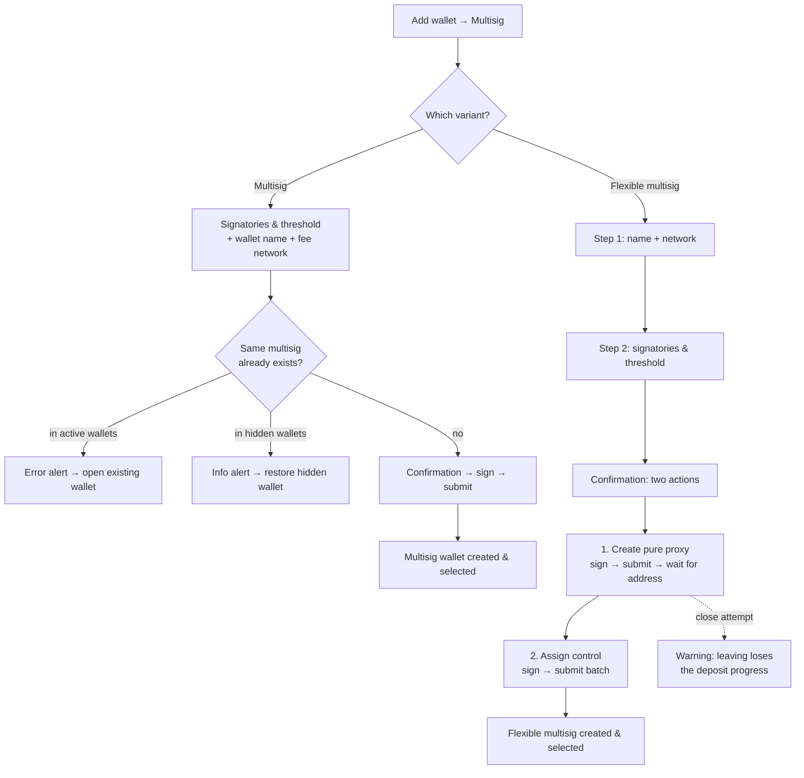

# Multisig Wallet Create

> Part of the [Feature Map](../README.md) — Last reviewed: 2026-07-17

## Overview

Creates a new multisig wallet from the **Add wallet → Multisig** entry. The user picks one of two variants, gathers
signatories, sets a threshold and signs the creation on-chain:

- **Multisig (classic)** — a deterministic account derived from the signatory set and threshold. It works across all
  supported networks; the composition can never change. Creation costs only a network fee (an on-chain remark that
  timestamps the wallet for discovery by other signatories).
- **Flexible multisig** — a pure-proxy account on one chosen network, controlled by a multisig. Because the funds live
  on the proxy, the signatory set and threshold can be changed later without moving assets. Creation requires two
  on-chain transactions and locks a proxy deposit.

Both variants share the same signatory-picking experience; they differ in steps, fees and what exists after success.

## Who can use it / when it applies

- The entry appears in the wallet-pairing dropdown (onboarding page and the wallet panel) when the multisig feature is
  enabled; the flexible option additionally requires its own feature flag.
- The user must own at least one non watch-only account to act as the **first signatory** — it initiates and signs the
  creation. Watch-only, proxied and multisig wallets cannot be signatories from "My accounts".
- Only networks that support multisig are offered. A network must be connected to submit; the flexible flow lists only
  connected networks, the classic flow silently switches to the next connected one.
- The signing account must cover the network fee (classic) or fee + proxy deposit + existential deposit (flexible) —
  otherwise validation errors block the flow.

## States / scenarios

| State                           | When it appears                                                      | What the user sees                                                                                                                         |
| ------------------------------- | -------------------------------------------------------------------- | ------------------------------------------------------------------------------------------------------------------------------------------ |
| **Type chooser**                | Right after the entry point                                          | Two cards (Flexible / Multisig) with feature bullets and wiki links; Continue enabled after picking                                        |
| **Name & network** (flexible)   | Flexible flow, step 1                                                | Wallet name input and a network select limited to connected multisig networks; total creation cost with a fee/deposit breakdown            |
| **Signatories & threshold**     | Classic single form step / flexible step 2                           | The signatory rows, add/remove controls, threshold select (2…N), wallet name (classic); alerts and validation errors                       |
| **Fee network modal** (classic) | Edit icon next to the fee                                            | All multisig networks with the creation fee and the first signatory's balance, split into available / unavailable                          |
| **Existing multisig**           | Chosen signatories + threshold already form a known multisig         | Classic: error with a shortcut to open that wallet. Flexible: informational — creating on top of an existing multisig is allowed           |
| **Hidden multisig**             | The same multisig exists among hidden wallets                        | Info alert with a Restore button; restoring closes the flow and selects the wallet                                                         |
| **Confirmation** (classic)      | After a valid form submit                                            | Summary: name, signatory list, threshold, signing wallet/account, multisig deposit and fee; sign button                                    |
| **Confirmation** (flexible)     | After a valid form submit                                            | Two sequential actions — "Create pure proxy" then "Assign control" — each with its own sign/submit; a "don't leave" warning until finished |
| **Leave warning** (flexible)    | Closing the modal after step 1 and before both transactions complete | A confirm dialog explaining that progress (and the deposit) would be lost                                                                  |

### The signatory rows

- The **first row is always the user's own account** — selected from their wallets; it becomes the initiator and the
  signer of the creation transactions.
- Every other row is a combobox accepting either a pick from **Contacts** and **My accounts** groups, or any pasted
  address valid on the selected network.
- **Search matches what is displayed**: options are filtered by the resolved account name (custom names, contact names,
  identity), the wallet name and the address as shown for the network — an account renamed in Spektr is found by its
  visible name, not only the stored one. Contacts match by name and address. Already-picked signatories are hidden from
  the options.
- The **name field auto-fills** from the matched account or contact and is locked for own accounts. Every signatory
  needs a name: external signatories are saved to the address book on success (new contacts created, renamed ones
  updated), so other flows show consistent names.
- Duplicated addresses and addresses not valid on the selected network are flagged inline; both block submission.
- The threshold select unlocks once at least two rows are filled; minimum threshold is 2.

### Network choice (classic)

The classic multisig account is universal — the network only determines where the creation remark is submitted and paid
for. The default is Polkadot Asset Hub (an EVM network for Ethereum-type accounts). The fee modal ranks networks by
whether the first signatory can afford the fee there; if the current choice becomes unaffordable or disconnected, the
flow auto-switches to an available one.

## Lifecycle

**Classic:** pick type → fill signatories, threshold, name (optionally change the fee network) → confirmation summary →
sign with the first signatory → submit. On success the multisig wallet is created locally, becomes the selected wallet,
account sync starts discovering its on-chain history, and contacts are created/updated for external signatories. The
modal closes itself shortly after submission.

**Flexible:** pick type → name + network → signatories + threshold → confirmation with two actions:

1. **Create pure proxy** — sign and submit; the app then waits for the on-chain event that reveals the new pure
   account's address before enabling step 2.
2. **Assign control** — sign and submit a batch that tops up the pure account, registers the multisig (if it does not
   exist yet) and hands proxy control of the pure account to it.

On success up to three wallets appear: the **flexible multisig wallet** (selected), the underlying **classic multisig
wallet** (unless it already existed) and a **proxied wallet** record for the pure account. Abandoning between the two
steps is guarded by a warning dialog — the pure proxy would exist on-chain with the deposit paid but without multisig
control assigned.

Failures: balance/validation errors are shown inline on the form and the confirmation and block progress; a rejected or
failed signature returns the user to the confirmation to retry.

## Related

- [`flexible-change-signatories`](../flexible-change-signatories/README.md) — later changes to a flexible multisig's
  signatory set, the capability this variant is created for.
- `multisig-wallet`, [`multisig-operations`](../multisig-operations/README.md) — operating the created wallets.
- `account-sync` — other signatories discover a created classic multisig through the on-chain remark timestamp.
- `wallet-pairing` — owns the Add wallet dropdown this feature plugs into.
- The address book — external signatory names entered here become shared contact data.
