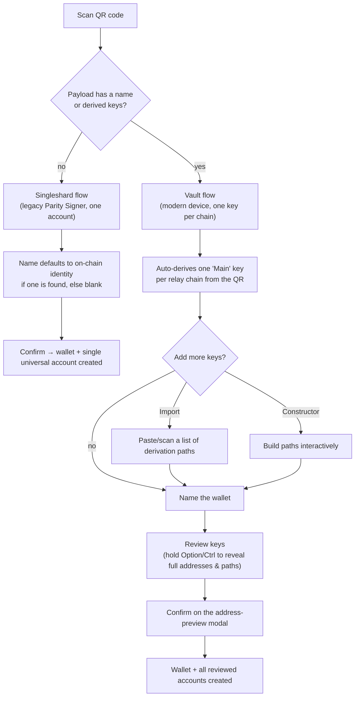

# Polkadot Vault Wallet Pairing

> Part of the [Feature Map](../README.md) — Last reviewed: 2026-07-07
>
> **Draft — pending author review.** Written from reading the code; needs sign-off from the feature owner before it is
> treated as the source of product truth.

## Overview

Connects a Polkadot Vault (or legacy Parity Signer) device to Spektr by scanning a QR code, and turns the scanned keys
into a wallet. The same modal handles two very different device generations — a single-account legacy signer and a
modern Vault that can expose many keys, one per chain — and picks the right flow automatically from what the QR code
contains.

## Who can use it / when it applies

Gated by the `polkadotVault` feature flag. Two entry points open the same pairing modal:

- the onboarding welcome screen (first wallet in the app), and
- the "add wallet" dropdown available once at least one wallet exists.

## States / scenarios

| State                  | When it appears                                                  | What the user sees                                                                                    |
| ----------------------- | ------------------------------------------------------------------ | -------------------------------------------------------------------------------------------------------- |
| **Scan**               | Always, first step                                                 | Camera QR reader with a tutorial video alongside it                                                    |
| **Singleshard review** | Scanned payload has no wallet name and no derived keys              | A single account preview; wallet name pre-fills from an on-chain identity lookup if one resolves        |
| **Vault review**       | Scanned payload carries a wallet name and/or a list of derived keys | A wallet-name field plus the list of keys grouped by chain, with Import/Constructor actions to add more |

**Why the fork instead of one flow.** The two device generations produce structurally different QR payloads — a legacy
signer's payload has no name or derived-key list, a Vault's does — so the app tells them apart from the payload shape
alone rather than asking the user which device they have.

**Why keys can be added two ways.** Import accepts a list of derivation paths a user already has (e.g. from a QR or
pasted text); Constructor is for building paths interactively when the user doesn't already have them written down.
Both feed the same review list before confirmation.

## Lifecycle

1. User scans a QR code with a Vault/Parity Signer device.
2. The payload shape decides Singleshard vs. Vault review (see above).
3. **Singleshard:** the wallet is created immediately from the single scanned account, using an identity-derived name if
   one is found.
4. **Vault:** the user names the wallet, reviews the auto-derived "Main" keys (one per relay chain) plus anything added
   via Import/Constructor, then confirms on an address-preview modal.
5. On confirmation, the wallet and its accounts are created, on-chain data is synced for the new accounts, and — for
   the Vault flow — the new wallet is auto-selected as the active wallet.

## Related

- Key review/editing UI (Import, Constructor, the address-preview modal) lives in `@/features/wallets`, shared with
  other flows that manage derived keys.
- [`polkadot-vault-wallet`](../polkadot-vault-wallet/README.md) owns how the resulting wallet behaves once created —
  signing permissions, wallet-switcher display — and reuses this feature's draft-building logic when the user adds more
  keys to an existing wallet later.
