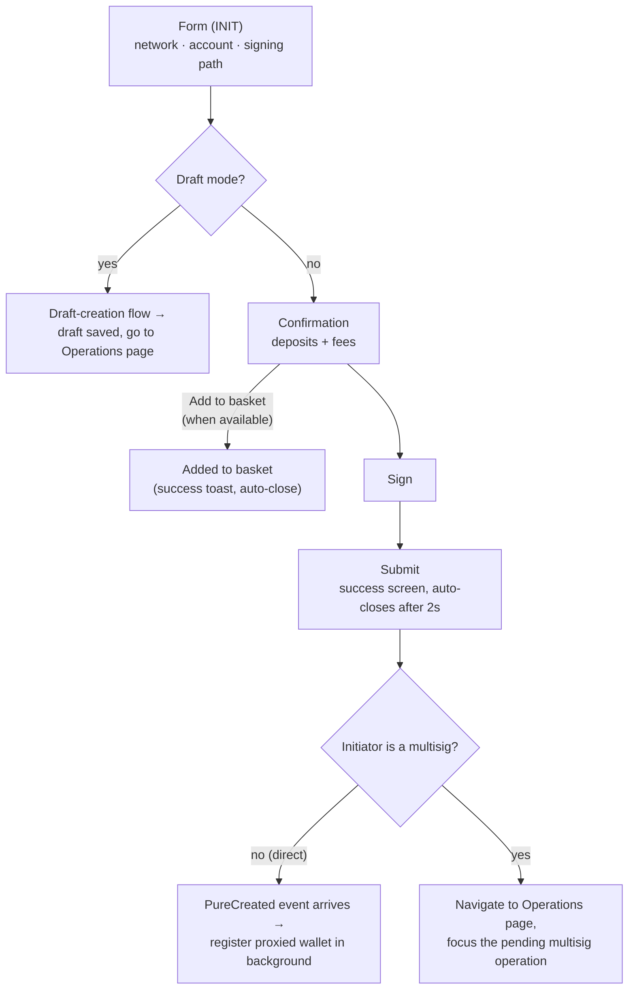

# Create Pure Proxy

> Part of the [Feature Map](../README.md) — Last reviewed: 2026-07-07

## Overview

Creates a **pure proxy** (a keyless account controlled entirely by proxies) on-chain for one of the user's wallets. The
initiating account submits a `proxy.createPure` transaction and is automatically granted "Any" delegated authority over
the new account. The feature is a self-contained modal flow — pick network, account, and signing path; confirm the
deposits and fees; sign; submit — that ends by registering the new proxied wallet, handing the user off to their pending
operations, or deferring execution via a draft or the basket.

When the initiator is a multisig, the result is a pure proxy controlled by that multisig — the same shape a flexible
multisig uses. Flexible-multisig creation itself, however, runs its own dedicated flow in `multisig-wallet-create` and
does not reuse this feature.

## Who can use it / when it applies

- Opened from **wallet details** (three-dots menu). Offered for every wallet type that can sign — Polkadot Vault,
  single-key, WalletConnect, Multisig, Flexible Multisig, and Proxied — but never for watch-only wallets, and for a
  Proxied wallet only when it is held with **"Any"** proxy authority.
- Only on networks that **support pure proxies** and where the wallet has an available account; the network list is
  filtered to those chains.
- The initiator pays a **proxy deposit**, reserved from its own balance. When the initiator is a multisig, a **multisig
  deposit** and the fee also apply, and those are checked against the signatory's balance.

## States / scenarios

The modal advances through a fixed sequence of steps. Three things branch the outcome: whether the user chose **draft
mode** on the form (build a signing path and save a draft instead of signing now), whether they pick **Add to basket**
on the confirmation step, and whether the initiator is a **multisig** (the transaction is wrapped in `asMulti` and
cannot complete on the first signature).

| Step / state     | When it appears                         | What the user sees                                                                                                                            |
| ---------------- | --------------------------------------- | --------------------------------------------------------------------------------------------------------------------------------------------- |
| **Form (INIT)**  | On open                                 | Network, account, and signing-path selectors; live fee and deposit summary (hidden in draft mode)                                             |
| **Confirmation** | After a valid form submit (non-draft)   | Proxy deposit, multisig deposit (if multisig), and fee; an **Add to basket** secondary action when the signatory's wallet supports the basket |
| **Sign**         | After confirmation                      | The signing screen for the chosen signatory                                                                                                   |
| **Submit**       | After signing                           | A generic "submitted successfully" result that auto-closes after 2s                                                                           |
| **Basket**       | "Add to basket" pressed on Confirmation | An "added to basket" success toast that auto-closes                                                                                           |

## Lifecycle

**Direct (single-signature) initiator.** Once the transaction lands, the feature subscribes to the on-chain
`proxy.PureCreated` event for the initiator. The submit success screen auto-closes after ~2s regardless; the
subscription keeps running in the background, and when the event arrives the feature learns the new account's address
and registers it as a **proxied wallet** with the initiator holding "Any" authority.

**Multisig initiator.** The pure proxy is **not** created on the first signature — the `asMulti` call only registers a
pending multisig operation that still needs the remaining signatories to approve. The feature still starts the same
event listener, but `PureCreated` only fires once the operation reaches threshold and executes, so the durable
registration path is the proxied-wallet discovery flow, not this feature. Once the submit success screen closes, the
user is navigated to the **Operations page** with the newly created pending operation focused. The redirect link is
keyed to the **multisig account** (for a flexible multisig, its `multisigAccountId`), so the pending operation resolves
and is highlighted rather than erroring.

**Draft mode.** Toggling draft mode on the form replaces the signing controls with a **draft signing path** builder.
"Initiate" opens the draft-creation flow seeded with the call data and path; once the draft is saved, the modal closes
and the user is taken to the **Operations page**.

**Add to basket.** On the confirmation step — when the signatory's wallet supports the basket (Polkadot Vault or
single-key wallets) — the core transaction can be saved to the **basket** for later batch execution instead of signing;
the flow ends with an "added to basket" confirmation.

## Related

- **`proxy-add`** — adds a proxy relationship to an existing account (this feature creates a brand-new keyless account).
- **`proxied-wallet`** — discovers and registers pure proxies on-chain, including those created by a multisig after the
  operation executes.
- **`multisig-wallet-create` (flexible multisig)** — creates a pure proxy for the flexible multisig through its own
  dedicated flow; related by product shape, not by code reuse.
- **`multisig-operations`** — hosts the Operations page and the deep link that focuses the pending operation after a
  multisig-initiated creation.
- **`drafts` / basket** — the deferred-execution targets for draft mode and "Add to basket".
