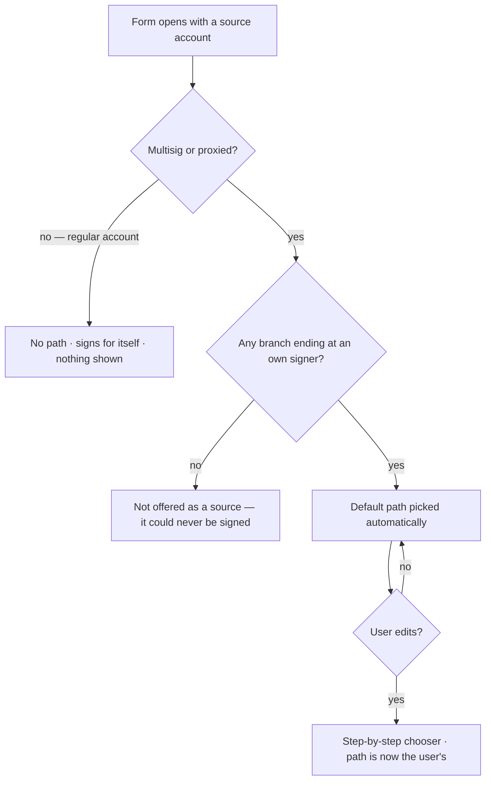

# Signing path

> Part of the [Feature Map](../README.md) — Last reviewed: 2026-08-23

## Overview

A **signing path** is the chain of accounts a transaction travels through: from the account that _executes_ it — the
**source** — down to the account that actually _signs_ it, the **signer** whose key the user holds.

Substrate has no "sign as somebody else". A proxied account's call must be wrapped in `proxy.proxy`, a multisig's in
`multisig.asMulti`, and those wrappings nest arbitrarily — a proxied account whose delegate is a multisig whose
signatory is another multisig. The signing path is that nesting made **explicit, visible and editable**, instead of a
route the app picks silently on the user's behalf.

The choice is load-bearing rather than cosmetic: the account at the end of the path is the one that **pays the fee and
reserves the multisig deposit**, and — when the path runs through a multisig — whether the transaction executes
immediately or merely opens a pending operation for co-signers. So when a wallet offers more than one way in, the user
is shown the route and can change it.

Every operation form builds one: transfers, staking, governance, delegation, proxy management, call-data execution,
multisig approve/reject, the vesting claim.

## Who can use it / when it applies

Whether a path exists at all is decided by the **source account**, not by the operation:

- A **regular account** — neither multisig nor proxied — signs for itself. It has **no path** (the empty path is a valid
  path), and nothing is shown. This is the rule most easily got wrong: a signatory derived from the path _alone_ is
  `null` for a regular account, so **every caller must fall back to the initiator**. A form that does not gets an empty
  route, and an empty route builds no transaction, quotes no fee, and cannot be signed — with nothing on screen to say
  why.
- A **multisig** or **proxied** source needs at least one hop, so it has a path, and the user is shown it.
- The path UI appears only once a path has **two or more hops**. Anything shorter is direct signing, and there is
  nothing to visualise or choose between.

## The shape of a path

Three kinds of node — `proxied`, `multisig`, `signer` — and a grammar the app never breaks:

- it **starts** at the source: a `proxied` or a `multisig`;
- every **middle** node is a `multisig` (only a multisig can stand between a source and a signer);
- it **ends** at a `signer` — a key the user owns;
- **no account appears twice**, so a path can never loop;
- it is at most **six hops** deep;
- and the **empty path** is legal: that is a regular account.

Each hop becomes a transaction wrapper — a `multisig` node an `asMulti`, a `proxied` node a `proxy.proxy` — so the path
_is_ the wrapping, read left to right. A **flexible multisig** is the one special case: its facade is a pure proxy
standing in front of an inner multisig, so it enters the path as `proxied` and the multisig hop behind it collapses into
a single multisig wrapper rather than a proxy-over-multisig pair.

## States / scenarios

The governing rule for what the user is offered:

> **Reachability hides; a wrong proxy type disables.** An option that is unusable _for this operation_ is shown,
> disabled, with the reason. An option that could _never reach a signature_ is not offered at all.

The first keeps the user informed — they can see that the proxy exists and learn why it will not do. The second keeps
them out of dead ends: a branch with no signer of theirs at the bottom could be picked, hop by hop, and never completed.

Reachability is judged against the accounts the user can actually sign with — watch-only accounts cannot, so they never
terminate a branch. That rule is this feature's to define, and it is published rather than restated: anything elsewhere
that merely _predicts_ whether a path exists — a dashboard deciding whether to offer a Claim button, a KPI tile deciding
a network is actionable — asks the same predicate, because a screen that hides an action this flow would have completed
is worse than no screen at all. **Drafts are the exception**: a draft may be finished by a co-signer on someone else's
machine, so branches that _this_ user cannot complete are still offered, and the sources come from the address book
instead of the wallet.

**Which accounts may be a source is a delegation question, not an ownership one.** Only multisigs, and proxied accounts
whose delegation reaches a multisig, are offered: everywhere else the operation runs from a specific account and the
path merely says how a signature reaches it, so a plain key is no source at all. A **permissionless** call inverts that
— a staking payout names the validator and may be submitted by anybody — and there, and only there, a caller may ask for
the keys this installation holds to be offered as roots too. The claim confirm is the one screen that does.

| State                    | When it appears                                                                                                        | What the user sees                                                                                                             |
| ------------------------ | ---------------------------------------------------------------------------------------------------------------------- | ------------------------------------------------------------------------------------------------------------------------------ |
| No path                  | Source is a regular account                                                                                            | Nothing. It signs directly                                                                                                     |
| Own keys as sources      | The caller asked for them, for a permissionless call                                                                   | The accounts this installation can sign with, offered as path roots alongside the delegating ones                              |
| Default path             | Source is multisig/proxied and some branch ends at an account the user can sign with                                   | The route, as a breadcrumb of hops, chosen for them                                                                            |
| Step-by-step chooser     | "Edit signing path" opened                                                                                             | One hop at a time — "Select a source account", then "Pick a wallet to sign via" / "Pick an initiator" — until "Path complete"  |
| User-overridden path     | A hop was picked by hand                                                                                               | Their path, kept as-is; the automatic default no longer overwrites it until the form resets                                    |
| Option disabled          | The proxy's type cannot perform _this_ operation (a non-`Any` proxy adding a proxy, a proxy type that cannot transfer) | The option stays visible, greyed, with a tooltip saying why — never silently dropped                                           |
| Branch not offered       | No account the user can sign with terminates that subtree (watch-only cannot sign); drafts opt out                     | The source or hop is absent: offering it would lead to a path that cannot be completed                                         |
| Proxy verification badge | The hop is a delegate of a pure proxy                                                                                  | Verified / pending verification / not verified, so an unverified delegation is not mistaken for a safe one                     |
| Hop in error             | The form's validation blames an account on the route — it cannot cover the fee or the deposit                          | That hop is marked on the path itself, so the problem is attached to the account causing it rather than to the form as a whole |
| Dead end                 | A hop has nothing beneath it                                                                                           | "No options available for this hop"                                                                                            |
| Unresolvable path        | A saved draft's path has a node with no local account (a wallet was removed, or it was never added)                    | Resolution names the first such node, so the draft can say _which_ account to add rather than that the route is unusable       |

## Lifecycle

A form opens, and the path is **seeded automatically** from the account graph — the user's multisigs, their proxy
relations, and which leaf accounts they can actually sign with. It stays automatic until the user touches it: from then
on the path is theirs, and re-seeding will not overwrite it until the form is reset.

The two ways in stay in step. Picking a signer from the legacy signatory dropdown **recomputes the path** so it
terminates at that signer; editing the path changes who the signatory is. Neither can be left saying something the other
contradicts.

At confirmation the path is turned into two things: the **route** — the accounts, in order — which decides who pays and
who signs, and the **wrappers**, which decide what is actually submitted to the chain. If a multisig lies anywhere on
the route, submitting does not execute the call; it opens a pending operation for the co-signers, and the confirmation
says so rather than implying the transaction is done.

### Known limitation

**A proxy's announcement delay is not taken into account.** A delayed delegate is offered exactly like an immediate one,
and a path built through it will not execute on submission — it has to be announced and then waited out. Nothing in the
path UI says so today.

## Related

- `domains/network` — the account graph the path is traversed over, and the route it resolves to.
- `entities/proxy` / [`multisig-operations`](./multisig-operations/README.md) — the proxy delegations and multisig
  memberships that form the graph's edges, and the pending operation a multisig hop produces.
- [`drafts`](./drafts/README.md) — persists a chosen path, and must cope with one that no longer resolves.
- [`vesting-claim`](./vesting-claim/README.md) — a claim is signed by the account itself, and so is the plainest example
  of the empty-path/regular-account rule above.
