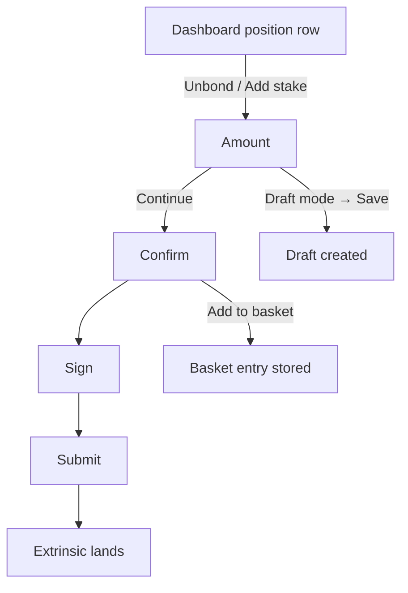

# Staking amount flow (unbond / add stake)

> Part of the [Feature Map](../README.md) — Last reviewed: 2026-08-25

## Overview

Asks the user **how much**, for the two staking actions that need an amount, and takes the answer through confirm → sign
→ submit:

- **Unbond** — start unbonding part or all of an active stake;
- **Add stake** — bond more on top of an existing position.

Both are entered from a position row on the staking dashboard, which hands over the position it is showing. The flow
builds no position data of its own: the figures it leads with are already on screen when the button is pressed.

### Why one feature covers two actions

The approved design gives Unbond a screen (frame F7) and Add stake none — because they are the same screen. One
position, one amount field with a `Max`, one helper line, one signing route, `Cancel` / `Continue`. The only differences
are which figure caps the amount, which call is built and what the callouts say about the consequence.

Forking them would mean two copies of the signing, fee, validation and draft plumbing so that one copy could hide a
callout. Instead the action is a parameter of a single flow, with two entry points. Add stake therefore inherits the
Unbond layout verbatim, which is also what the design review asked for.

## Who can use it / when it applies

- Opened only from a dashboard position — the flow never picks an account or a chain itself, and never opens on its own.
- **Signing** requires an account of the current wallet that reaches a signer on the position's chain. Multisig and
  proxied accounts are wrapped automatically; the **signing route** is seeded with the default path and can be changed
  on the amount screen and again on the confirm. That choice is load-bearing: the account at the end of the route pays
  the fee and reserves the multisig deposit.
- A regular account signs for itself. For one the signing path is empty by design, and the flow falls back to the
  initiator — without that fallback the wrapping step refuses the transaction and the confirm waits forever on a fee
  that can never arrive.
- **Without a local signer**, the operation can still leave as a **draft** for somebody else to sign — see _Drafts_
  below.
- Watch-only accounts can do neither, and the dashboard does not offer them the action in the first place.

## States / scenarios

The amount screen is one layout in both modes:

| Element              | Unbond                                                                                                                                                     | Add stake                                                 |
| -------------------- | ---------------------------------------------------------------------------------------------------------------------------------------------------------- | --------------------------------------------------------- |
| Title                | "Unbond"                                                                                                                                                   | "Add stake"                                               |
| Header               | Signing route (or the bare account when it signs directly) + network chip; in draft mode the network chip alone — the draft path picker follows the toggle | same                                                      |
| Amount label (right) | `Staked: 1.2M DOT` — the position's **active** stake                                                                                                       | `Available: …` — spendable balance, minus the network fee |
| `Max`                | the whole active stake                                                                                                                                     | everything available after the fee                        |
| Helper line          | `≈ $6.24M · remaining staked: 100 DOT ($520)`                                                                                                              | `≈ $6.24M`                                                |
| Warning callout      | amber, when the remainder falls below the minimum active bond                                                                                              | never                                                     |
| Info callout         | unbonding period and the projected unlock date                                                                                                             | "funds start earning next era"                            |
| Footer               | `Cancel` / `Continue`                                                                                                                                      | same                                                      |

**The below-minimum warning does not block `Continue`.** Leaving a stub too small to nominate is legal — merely
suboptimal — and the user may well mean it. The callout names both figures and the two ways out ("unbond everything, or
leave at least X"), and the button stays enabled.

Two boundaries are deliberate:

- **exactly at the minimum** does _not_ warn — a position sitting on the minimum is still valid and still earning;
- **a full unbond** does _not_ warn — leaving nothing behind is the intended way out, not a mistake.

| State                     | When it appears                                                         | What the user sees                                                             |
| ------------------------- | ----------------------------------------------------------------------- | ------------------------------------------------------------------------------ |
| Amount                    | The dashboard requests unbond / add stake                               | The screen above, `Continue` disabled until an amount is entered               |
| Amount too large          | Above the active stake (unbond) or above what is available (add stake)  | A red callout names the cap, the field reads invalid, `Continue` is blocked    |
| Below minimum active bond | Remainder > 0 but under the chain's minimum nominator bond              | Amber callout; `Continue` **stays enabled**                                    |
| No unbonding slots left   | The ledger already holds the maximum number of unbonding chunks         | Red callout, `Continue` blocked — the node would reject the call outright      |
| No signer on the route    | Nobody on the resolved route can sign (normal mode)                     | A red "No account to sign with" alert; `Continue` and `Sign` are blocked       |
| Unpayable                 | The signer cannot cover the fee, or cannot reserve the multisig deposit | The error explains which, and both `Continue` and `Sign` are blocked           |
| Confirm                   | `Continue` pressed                                                      | Amount, signing route, amount + resulting stake, network fee, multisig deposit |
| Chill notice              | The unbond is wrapped with `chill` (see below)                          | A footnote on the confirm saying the nominations are withdrawn with it         |
| Sign / Submit             | `Sign` pressed                                                          | The shared signing and submission screens                                      |

### No one to sign with

The resolved signing route is checked for an actual signer at its end. When there is none — the position belongs to a
contact (nothing local initiates it) or to a watch-only account — `Continue` refuses and a red **"No account to sign
with"** alert names the two ways forward: add a wallet that controls the account, or save the operation as a draft for
whoever can sign. This replaces a silently dead button: before the guard, such a position opened the flow and simply
went nowhere. The guard stands down in draft mode, where nobody local is expected to sign.

**A multisig route adds the shared description field to the confirm** — the note the initiator attaches for the other
signatories, published to the shared address book once the operation is included. Whether the field, an error or nothing
shows is decided by the [multisig-operation-description](../../aggregates/multisig-operation-description/README.md)
aggregate; a plain route shows nothing.

### The unbonding callout

`Unbonding takes ~28 eras — funds unlock around Aug 19. No rewards are earned while unbonding.`

The era count comes from the chain's bonding duration. The **date** additionally needs the era anchor (when the current
era started, and how long an era lasts), which the staking-positions aggregate already holds for the dashboard. When the
chain cannot provide an anchor the line stops at the era count rather than inventing a day — a wrong date here is worse
than no date, because the user plans around it. A projection that has gone stale (the era rolled over while the modal
was open) is never printed in the past.

### Chill on unbond

Unbonding down to nothing — or to a remainder too small to nominate with — leaves the position nominating with a stake
the network will not elect. So the unbond is wrapped as `BATCH_ALL(chill, unbond)`: the nominations are withdrawn in the
same transaction, and the confirm says so. A partial unbond that leaves a healthy stake is a bare `unbond`.

## Lifecycle

The confirm opens on the amount, not on the node: the wrapped transaction, the fee and the validation each cost a round
trip, so they stream in behind their own loaders with `Sign` disabled until they land. Changing the signing route
re-runs all three in place.

The balances the validation reads are asked for by the flow itself: once the signing route resolves, every account on it
— the position's account, a multisig or proxy hop, the signatory — is re-requested from `assets-balances`. A position
outside the selected wallet has no live subscription, and the dashboard's one-shot fetch may have run while the chain
was still connecting; without this the fee check would fail on a missing balance rather than on a real shortfall.

On a successful submit the flow reports completion once, and the dashboard refreshes what it shows. Nothing here polls:
the position figures behind the dashboard are live subscriptions, so an unbond that lands — or a multisig one that lands
only when the final approval does — updates the row on its own.

## Drafts

The amount screen carries the app-wide draft toggle. In draft mode the user picks the signing path themselves (the flow
cannot sign for an account it has no key for), the fee and balance checks step aside — the eventual signer pays — and
the primary button creates a **draft** instead of walking on to the confirm.

The balance shown follows the draft, too: **`Available` — and Add stake's `Max` — read the draft path's source
account**, the account the call will actually spend from, with no fee subtracted, since the eventual signer pays it at
submit time. Before, a contact position read zero here. Unbond is unaffected: its cap is the position's own active
stake, whoever signs.

A request whose `signingMode` is `draft` — an address-book position, where the caller already knows nobody local signs —
**opens with the toggle already on**: the user should not have to discover it. The toggle stays a toggle; switching it
off returns to normal mode, where the no-route-signer guard takes over.

The source picker under the toggle is the drafts feature's own, with its states: nothing while the address book is
offline (the toggle card carries Reconnect), an explanation with **Open address book** when the pinned position has no
draft route — that button closes this flow before it navigates, since the modal would otherwise outlive the page — and a
notice when the user may not write drafts. See [`drafts`](../drafts/README.md).

**Signing and draft creation never share a confirmation.** Draft mode ends at the amount screen: it has its own button
and its own gate, `Continue` is disabled while it is on, and a created draft closes the flow. This mirrors every other
operation form in the app.

## Add to basket

The confirm carries the same secondary **"Add to basket"** button every old staking flow has: instead of signing now,
the built call is stored in the basket for this wallet to sign later, a success toast confirms it and the flow closes.

The basket signs the stored core call directly by its initiator — no multisig/proxy wrapping happens in the basket
context — so the button only appears when the initiator's own wallet is one the basket can sign with (Polkadot Vault or
a single Parity Signer shard). Watch-only, multisig, proxied and WalletConnect initiators never see it. Basket and draft
are mutually exclusive by nature — a draft is "somebody else signs later", the basket is "this wallet signs later" — so
the button is absent in draft mode (which never reaches this confirm anyway).

As in the old flows, the gate deliberately ignores the confirm's validation verdict: the basket revalidates every stored
transaction before it is signed, so a check that fails at this moment must not block storing the call for later.

## Rules carried over from the old staking flows

The old `staking-unstake` / `staking-bond-extra` forms are welded to the Staking page and stay in place for it. Their
_rules_, which are correct and long-proven, were carried over:

- **chill on full / below-minimum unbond** — from `staking-unstake`'s form model. One correction: the old rule chilled
  whenever the remainder fell to **or below** the minimum, so unbonding down to exactly the minimum — a position that
  stays perfectly valid — silently dropped the user's nominations. Here the boundary is strict, matching the warning,
  and a full unbond always chills whether or not the minimum is known.
- **the transaction origin** is the position's own account. The old flow built the inner call from the _signatory_,
  which for a multisig is the wrong origin.
- **fee, existential-deposit and permission checks** — the shared validators from `operations/OperationsValidation`:
  `unstakeValidator` for unbond, `bondExtraValidator` for add stake, the latter adding the "can this account actually
  reserve what it is bonding" rule.
- **`maxUnlockingChunks` guard** — the ledger cannot hold another unbonding entry once it is full, and `unbond` fails
  outright there. The flow blocks instead of letting the extrinsic fail on chain. Redeemable chunks don't count: the
  call consolidates those first, so they free their slot. A runtime that doesn't expose the constant gets no guard —
  refusing an operation on the strength of a constant we failed to read would be worse.

## Related

- [`staking-positions`](../../aggregates/staking-positions/README.md) — owns the positions, the chain minimum bond and
  the era anchors this flow reads; opening the modal starts no new request.
- `dashboard-staking-positions` — where the two actions are requested from.
- `drafts` — the draft-mode toggle, path picker and creation modal.
- `signing-path`, `operations/OperationSign`, `operations/OperationSubmit`, `shared/transactions` — the shared signing
  and submission stack.
- `staking-unstake`, `staking-bond-extra` — the Staking page's own forms, untouched; the source of the rules above.
