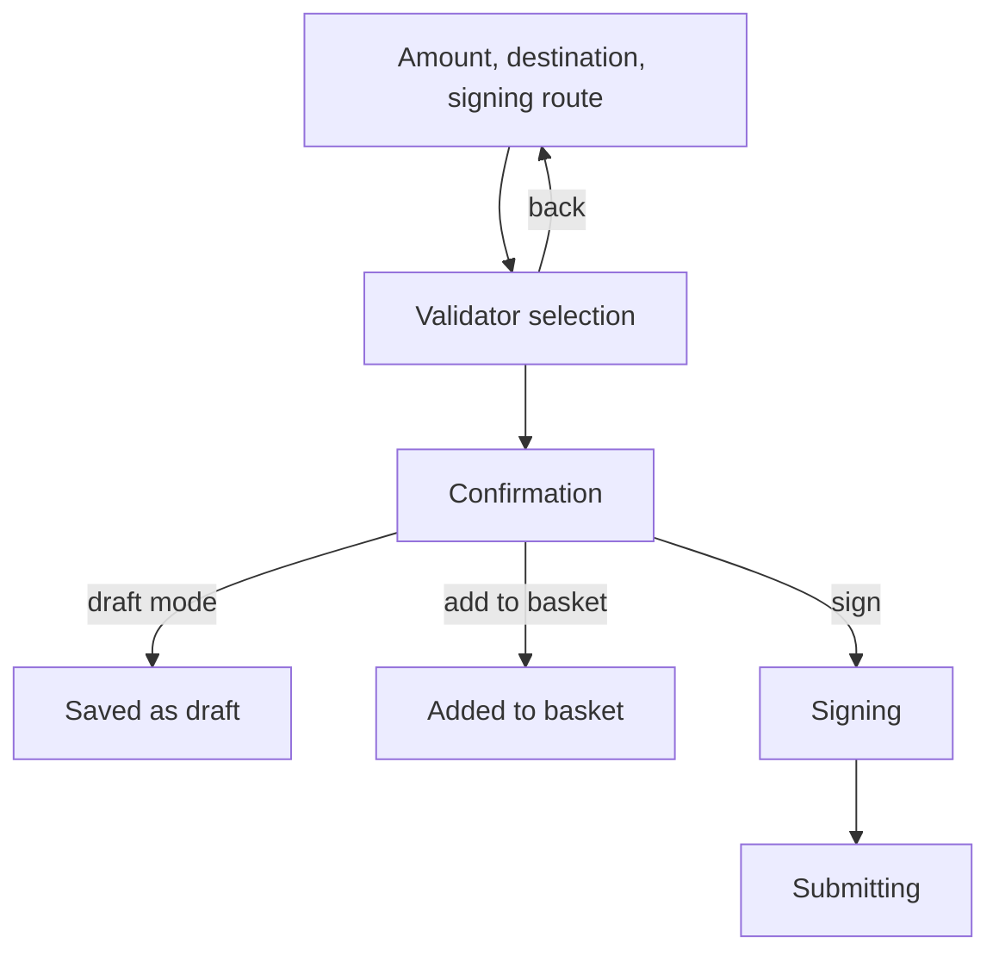

# Bond & Nominate

> Part of the [Feature Map](../README.md) — Last reviewed: 2026-08-25

## Overview

Starting to stake, as one operation. An account that holds a free balance and no ledger has to do two things before it
earns anything — lock funds (`bond`) and name the validators those funds back (`nominate`) — and doing them separately
leaves a window where the stake is locked but backing nobody. This flow takes the amount, the reward destination and the
validator set in one pass and submits them together.

It is the entry point to staking on the Staking page. Once a ledger exists, changing its parts is someone else's job:
[`staking-nominate`](../staking-nominate/README.md) for the validator set, `staking-bond-extra` for topping the stake
up.

## Who can use it / when it applies

- Any wallet the app can build a signing route from — the flow itself does not gate on wallet type; what a wallet cannot
  do is refused later, at the signing step, by the shared signing path.
- Two shapes, chosen by the wallet: a **single account**, and a **multishard vault**, where the same bond is prepared
  for several shards at once and each shard gets its own transaction.
- The nomination limit comes from the connected chain (`staking.maxNominations`), so the picker caps the selection at
  what this network actually accepts.

## States / scenarios

| State        | When it appears                                       | What the user sees                                                     |
| ------------ | ----------------------------------------------------- | ---------------------------------------------------------------------- |
| Amount       | The flow opens                                        | Bond amount, reward destination, fee, and who signs                    |
| Validators   | The amount step is submitted                          | The validator selection modal, with **Back** returning to the amount   |
| Confirmation | A validator set is submitted                          | Amount, destination and the picked validators, with the fee            |
| Signing      | Confirmed, not in draft mode                          | The wallet's signing screen — one payload per shard in the vault shape |
| Submitting   | Signed                                                | Submission progress, then the result                                   |
| Basket       | The operation was added to the basket instead of sent | A short success toast; nothing goes on chain                           |
| Draft saved  | Draft mode was on at confirmation                     | The call is stored for someone else to sign; nothing goes on chain     |

The amount is validated by the shared transaction validator (`bondNominateValidator`), which — besides fee, deposits and
"can the account reserve the amount" — refuses a bond under the chain's `MinNominatorBond`: `staking.nominate` rejects
such a stash and the batch fails as a whole.

The validator step is a step, not a detour: leaving it with **Back** keeps the amount already entered, and closing the
modal at any point abandons the whole operation rather than half of it.

## Lifecycle

1. The amount step collects how much to bond, where rewards should go, and — when the wallet offers more than one way in
   — which signing route to use.
2. Opening the picker hands it everything the flow already knows: the chain and its asset, the initiator and its wallet,
   and whether this session will be **signed here or handed over**. In draft mode the committed path names the person
   who will sign, so the picker can say so instead of implying the current user will.
3. The picked set comes back and the confirmation is assembled. From here the operation can be signed, dropped into the
   basket, or saved as a draft.
4. In the multishard shape every shard is bonded with the same amount and the same validators, and each produces its own
   transaction; the fee shown is the network's quote multiplied by the number of shards.

## Related

- [`validator-selection`](../validator-selection/README.md) — the picker this flow opens, and the source of the
  recommendation and the nomination limit.
- [`signing-path`](../signing-path/README.md) — decides who can sign and offers the route; a wallet that cannot complete
  a path is stopped there, not here.
- [`drafts`](../drafts/README.md) — where a saved operation goes when it will be signed by someone else.
- [`staking-nominate`](../staking-nominate/README.md) — the same picker over an already-bonded stash.
