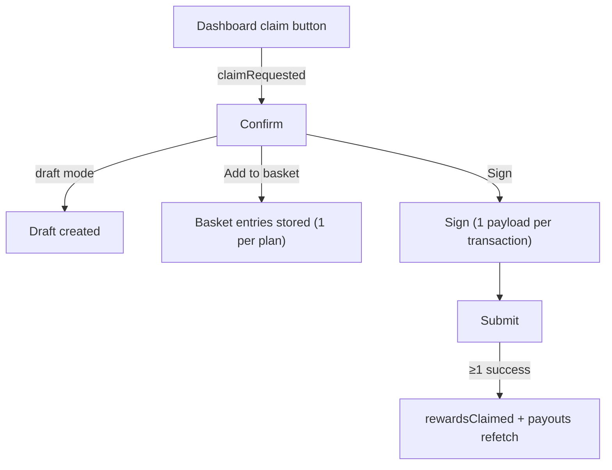

# Staking claim rewards

> Part of the [Feature Map](../README.md) — Last reviewed: 2026-08-12

## Overview

Turns unclaimed staking rewards into a first-class operation. Nomination rewards are not paid automatically: someone has
to send `staking.payout_stakers_by_page(validator_stash, era, page)` for every (validator, era, page) a stash was
exposed in, and rewards older than `historyDepth` are lost for good. This feature takes the payouts the dashboard has
already found and runs them through confirm → sign → submit.

It owns no discovery of its own. What is unclaimed, and how much, is decided by `domains/staking` (`payoutsResource` /
`useUnclaimedPayouts`); the dashboard decides _which_ of it the user asked for. This feature receives that decision as a
list of requests and is responsible for everything from the confirm screen onwards.

The flow is mounted globally through the app shell's `modalsSlot`, so any surface that can raise `claimRequested` gets
the whole operation without hosting it.

## Public contract

```ts
import { claimRewardsModel, type ClaimRequest, type ClaimedRewards } from '@/features/staking-claim-rewards';

// entry — one or more accounts' payouts
claimRewardsModel.claimRequested(requests: ClaimRequest[]);

// success — fires once per session, after at least one extrinsic lands
claimRewardsModel.rewardsClaimed: Event<ClaimedRewards>;
```

`ClaimRequest` carries `{ chain, asset, account, wallet, payouts }`. The `payouts` are `UnclaimedPayout` objects passed
through **verbatim** — in particular `page`, which is the real exposure page index and the one thing
`payout_stakers_by_page` cannot be given a guess for.

The feature shows **no toast of its own**: `rewardsClaimed` says what landed and the host decides how to announce it.

## Who can use it / when it applies

- **One network per session.** The fee it quotes, the balance it validates and the signing route it offers all belong to
  one chain, and there is no honest way to render a total fee spanning two native tokens. Requests on other chains are
  not dropped: they come back on `$skippedRequests` and the confirm says so in as many words.
- **Several accounts at once** are supported — the dashboard's claim modal can select more than one stash. Each account
  gets its own transaction and its own signing payload.
- **Anyone can pay for a payout.** `payout_stakers_by_page` credits the named validator's nominators regardless of who
  sends it, so the sender is only the fee payer. This is why draft mode can build the same call from an address-book
  source, and why the operation has no "am I the stash" precondition.
- **Multisig and proxy** accounts are wrapped automatically by the signing path — nothing here special-cases them beyond
  surfacing the multisig deposit on the confirm.
- The **signing route** is seeded with the default path and can be changed on the confirm screen, for the primary
  account. The account at the end of the route pays the fee and reserves the deposit, so it is never picked silently
  when the wallet offers more than one. Additional accounts take the same default path they would take anywhere else;
  giving each its own picker would be a screen of its own, and the common case has exactly one account.

## Batching, and where it stops

`transactionBuilder.buildPayoutStakers` builds a bare call for one payout and a `BATCH_ALL` for several, sorted by (era,
validator). It **refuses** more than `MAX_PAYOUT_CALLS_PER_BATCH` (10) — the cap is the caller's problem by design,
because only the caller knows what to do with the overflow.

This feature chunks. Payouts are sorted oldest era first, deduplicated, then cut into batches of at most ten:

| Payouts for one account | Result                                       |
| ----------------------- | -------------------------------------------- |
| 1                       | one bare `payout_stakers_by_page`            |
| 2 – 10                  | one `BATCH_ALL`                              |
| 11                      | two transactions: `BATCH_ALL(10)` + one bare |
| 25                      | three transactions: 10 + 10 + 5              |

**Chunks are signed as one multi-transaction session, not one batch at a time.** `signModel` already takes an array of
signing payloads and `submitModel` already submits an array of signed extrinsics; the vault scanning screens increment
the nonce per payload for the same signatory, so the chunks land in order instead of colliding. Signing them one at a
time would mean re-opening the confirm between chunks and would leave a half-claimed account behind on any abandonment —
the same failure, with more steps.

Oldest era first is not cosmetic: it is the ordering that puts the rewards closest to falling out of `historyDepth` in
the first transaction, so a session abandoned halfway still claimed the ones with a deadline.

## States / scenarios

| State                  | When it appears                                                       | What the user sees                                                                                  |
| ---------------------- | --------------------------------------------------------------------- | --------------------------------------------------------------------------------------------------- |
| Confirm                | `claimRequested` with at least one claimable payout                   | Total amount + fiat, signing route, "Covering N validators across M eras", network fee, then Sign   |
| Batched claim          | More than one transaction is needed                                   | A "Transactions" row with the count, and a hint explaining the claim is split and signed in turn    |
| Multisig               | A multisig sits on the route                                          | The multisig deposit row alongside the fee                                                          |
| Other networks skipped | The request spanned more than one chain                               | A warning that rewards on the other network(s) were left out and must be claimed from there         |
| Unaffordable           | The signer cannot cover the fee, or cannot reserve the deposit        | The confirm explains which, and **Sign is blocked**. Switching the signing route re-checks it       |
| No signer on the route | The chosen payer's route ends without anyone able to sign             | A red "No account to sign with" alert, and **Sign is blocked**. Switching the payer clears it       |
| Draft mode             | The claim is exactly one transaction, and the address book is healthy | The standard draft toggle, an address-book signing-path picker, and "Save as draft" instead of Sign |
| Sign / Submit          | Sign pressed                                                          | The shared `OperationSign` / `OperationSubmit` screens                                              |

**The confirm opens on the click, not on the data.** Everything it leads with — the amount, the accounts, the chain,
what is being covered — is in hand the moment the button is pressed. The wrapped transaction, the fee and the validation
each cost a round trip, so they are not awaited: the modal opens immediately, they stream in behind their own loaders,
and Sign stays disabled until they land. Changing the signing route re-runs them in place.

**A payer nobody can sign for blocks, and says why.** The route behind the payer is checked for an actual signer at its
end; when there is none — a watch-only payer — Sign is blocked behind a red **"No account to sign with"** alert rather
than a silently dead button. The dashboard substitutes a signable payer before dispatching (see _Who pays_), so this is
a backstop: it catches a payer switched to a watch-only account on the confirm itself. The guard stands down in draft
mode.

**A multisig route adds the shared description field** — the note the initiator attaches for the other signatories,
published to the shared address book once the operation is included. Whether the field, an error or nothing shows is
decided by the [multisig-operation-description](../../aggregates/multisig-operation-description/README.md) aggregate; a
plain route, and draft mode, show nothing.

### The fee shown for a batched claim

**Every transaction of the session is validated and priced, not just the first.** The primary plan goes through the
complex-tx store as before; each extra plan (a chunk past the batch cap, or another account's claim) is wrapped, then
run through the **same validator** the primary uses and priced with its own network quote. The fee row is the **sum** of
those per-transaction quotes; until the extras' quotes land it briefly shows the old per-transaction × count estimate.
That estimate is never signable: while quotes are pending the preparing gate blocks Sign, and an extra that never gets a
quote fails closed — a failing extra (an unaffordable fee, a route that resolves without anyone able to sign, or a
validation that failed outright and could not be checked) blocks Sign and surfaces in the same validation alert as a
primary failure, rather than being silently dropped.

The honest caveat that remains: **balance interactions _across_ plans from the same payer are not modeled.** The
validator checks each transaction against current balances independently, so a payer with enough free balance for each
chunk individually but not for all of them together still passes and can run out partway through the session. The
failure is a failed extrinsic, not a lost reward: the payouts stay unclaimed and can be retried.

## Drafts

Draft mode is the app-wide `createDraftModeBinding` pattern: the toggle flips the confirm into building a draft instead
of signing one, and **the two are never mixed** — in draft mode the sign path is disabled outright and the footer button
saves a draft.

Draft mode is **only offered when the claim is a single transaction**. A draft carries exactly one call data, so a
chunked or multi-account claim has nothing single to save; offering the toggle there would silently save a fraction of
what the screen totals. The toggle is hidden rather than disabled, because the reason is structural and no user action
inside the modal can change it.

Each request carries a `signingMode` — the **payer's** mode, not the nominator's: payouts are permissionless, so
producers substitute a signable payer where they can and send `local` even for an address-book nominator. A session
whose every request says `draft` (no signable payer at all) opens with the toggle already on; no current producer emits
that, so it is the model's contract rather than a live path.

The draft's call is built from the draft signing path's **source account**, not the stash — which is correct here for
the reason above: the sender of `payout_stakers_by_page` is only the fee payer, and the rewards reach the nominators
either way.

## Add to basket

The confirm carries the same secondary **"Add to basket"** button every old staking flow has: instead of signing now,
the session's calls are stored in the basket for later signing, a success toast confirms it and the flow closes.

Unlike a draft, which carries exactly one call data, **the basket takes a list natively** — so a chunked or
multi-account claim is basketed whole, one entry per plan, and each entry becomes its own extrinsic when the basket
signs. Nothing partial is ever stored: the button waits until every plan beyond the first has been built, and a session
where that cannot happen never offers it.

The basket signs each stored call directly by its payer — no multisig/proxy wrapping happens in the basket context — so
the button only appears when **every** payer's wallet is one the basket can sign with (Polkadot Vault or a single Parity
Signer shard). Watch-only, multisig, proxied and WalletConnect payers never see it, and draft mode hides it — a draft is
"somebody else signs later", the basket is "this wallet signs later".

## Lifecycle



### Refreshing the unclaimed figures

`payoutsResource` holds an answer for five minutes, and its cache key is `(chainId, stash, activeEra)` — none of which a
landed claim changes. So the figures would keep showing the rewards that were just claimed until the era rolled over.

A plain refetch does not fix that on its own: the resource answers a repeat request from its in-memory request cache
without going near the network. The entry has to be dropped first, which is what `createQueryResource`'s `invalidate`
does (added for this — see _Deviations_). On a successful submit the flow invalidates and refetches one request per
claimed stash, and the dashboard's `$cache` subscription picks up the new value.

A refresh that cannot be built (no api, no active era, no staking pallet) is skipped silently: the worst case is stale
figures until the next natural refetch, which is never worth failing a landed claim over.

For a **multisig** claim the extrinsic only proposes the operation — nothing is claimed until the final approval lands.
The refetch then simply returns the same figures, which is the correct answer.

## Who pays

A payout is **permissionless**: `payout_stakers_by_page` names the _validator_, never the nominator, and the reward
reaches each nominator's own payee whoever submits the call. The payer is therefore a free choice, not a property of the
rewards.

So the flow treats the nominator as a **preference**, not a requirement. When it is an account we hold, it pays. When it
is an address-book position we merely track, any account of ours that can sign on that chain pays instead — and the
rewards still land on the tracked address. Refusing there would abandon money we are perfectly able to collect.

The payer is always visible and always changeable: the confirm renders `SigningPathInline` with `editableInitiator`
rather than `SigningPathSection`, because the section hides itself below two hops and a payout signed by a plain account
has exactly one. Changing the source card rewrites the sender of every plan, and fee, route and validation follow from
it.

**Validation is `createTxValidator()` with no extra rules.** A payout moves nothing out of the sender, so there is no
amount rule to write; fee affordability, the existential-deposit guard, per-hop route balances, the multisig deposit and
proxy call permission are all built into the base validator.

## Related

- `domains/staking` — `payoutsResource` / `useUnclaimedPayouts` (what is unclaimed) and `UnclaimedPayout` (`era`,
  `validator`, `page`, `amount`).
- `entities/transaction` — `transactionBuilder.buildPayoutStakers`, `MAX_PAYOUT_CALLS_PER_BATCH`, the
  `PAYOUT_STAKERS_BY_PAGE` extrinsic and call-data decoder.
- `vesting-claim` — the flow this one is shaped after; same confirm/sign/submit stack, same "open on the click" rule.
- `features/signing-path` — the route picker and default-path resolution.
- `features/drafts` — `createDraftModeBinding`, the draft signing-path picker and the create-draft modal.
- `operations/OperationSign`, `operations/OperationSubmit`, `shared/transactions` — the reused signing/submission stack.
- `dashboard-staking-kpi`, `dashboard-staking-positions` — where `claimRequested` originates.

## Deviations

- **`createQueryResource` gained an `invalidate` effect** (`shared/query/createQueryResource.ts`). Without it, the
  post-claim refetch this feature is required to perform is a no-op inside the resource's stale window. Additive, and
  every existing resource keeps its behaviour.
