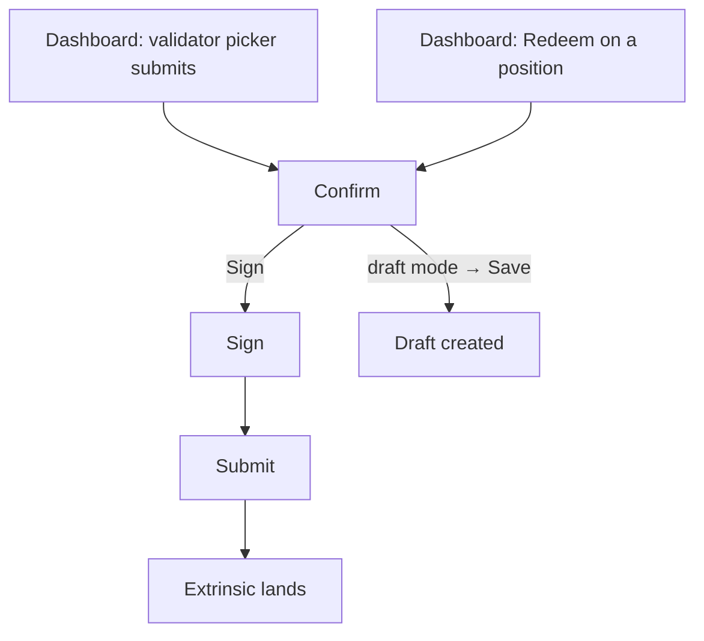

# Staking confirm flow (change validators / redeem)

> Part of the [Feature Map](../README.md) — Last reviewed: 2026-08-12

## Overview

Signs the two staking actions that ask the user for **nothing**, and takes them through confirm → sign → submit:

- **Change validators** — replace a position's nominations with a set the user has already picked;
- **Redeem** — withdraw the chunks that have finished unbonding.

Both are entered from the staking dashboard, which hands over the position it is showing plus whatever it has already
decided — the validator set for one, the redeemable figure for the other. The flow builds no position data of its own.

### Why one feature covers two actions

Neither action has an input step. A validator change arrives with its set already chosen (the picker runs on the
dashboard and closes on submit); `staking.withdraw_unbonded` takes no amount at all — it withdraws whatever the ledger
has unlocked. So both open **on their confirm**, and from there they are the same screen: one position, one signing
route, one draft toggle, `Cancel` / `Sign`. The mode decides which call is built and which single detail row the confirm
adds — a validator count that opens the list, or the amount being withdrawn — and nothing else.

Forking them would mean two copies of the signing, fee, validation and draft plumbing so that one copy could swap one
row. This is the same call [`staking-amount-flow`](../staking-amount-flow/README.md) makes for Unbond / Add stake; this
feature is its sibling for the actions that need no amount.

## Who can use it / when it applies

- Opened only from a dashboard position — the flow never picks an account or a chain itself, and never opens on its own.
- **Signing** requires an account of the current wallet that reaches a signer on the position's chain. Multisig and
  proxied accounts are wrapped automatically; the **signing route** is seeded with the default path and can be changed
  on the confirm. That choice is load-bearing: the account at the end of the route pays the fee and reserves the
  multisig deposit.
- A regular account signs for itself. For one the signing path is empty by design, and the flow falls back to the
  initiator — without that fallback the wrapping step refuses the transaction and the confirm waits forever on a fee
  that can never arrive.
- **Both calls act on the origin's own ledger.** Unlike a payout, nobody can nominate or withdraw on another stash's
  behalf, so the transaction is always built from the position's own account — never from the signatory.
- **Without a local signer**, the operation can still leave as a **draft** for somebody else to sign — see _Drafts_.
- Watch-only accounts can do neither, and the dashboard does not offer them the actions in the first place.

## States / scenarios

| State                | When it appears                                          | What the user sees                                                         |
| -------------------- | -------------------------------------------------------- | -------------------------------------------------------------------------- |
| Confirm — validators | The picker submitted a set                               | Account, network, signing route, `New validators: N` (opens the list), fee |
| Confirm — redeem     | A redeem is requested for a position with unlocked funds | The amount and its fiat value, account, network, signing route, fee        |
| Multisig             | A multisig sits on the route                             | The multisig deposit row alongside the fee                                 |
| Unpayable            | The signer cannot cover the fee or reserve the deposit   | The error explains which, and **Sign is blocked**                          |
| Empty set            | The picked set came back empty                           | No call is built and Sign stays disabled                                   |
| Nothing to redeem    | The position has no unlocked chunk                       | Sign stays disabled — the call would move nothing and still cost a fee     |
| Draft mode           | The draft toggle is on                                   | An address-book signing-path picker and `Save as draft` instead of Sign    |
| Sign / Submit        | Sign pressed                                             | The shared signing and submission screens                                  |

**The confirm opens on the click, not on the node.** Everything it leads with is in hand the moment the button is
pressed. The wrapped transaction, the fee, the validation and — for a redeem — the slashing-span read each cost a round
trip, so they stream in behind their own loaders with `Sign` disabled until they land. Changing the signing route
re-runs them in place.

### `num_slashing_spans`

`withdraw_unbonded` carries a span count, and the runtime compares it with `>=` against the stash's real one whenever
the call closes a ledger out. Too small and the extrinsic fails with `IncorrectSlashingSpans`; too large only costs a
little weight. So the figure is **read from the chain** — `SlashingSpans` for the stash, counted as "the current span
plus every prior one" — rather than assumed.

Two cases fall back instead of guessing downwards:

- a stash with **no entry** has never been slashed;
- a runtime that **dropped the storage** (staking-async) cannot answer at all.

Both take the historical value of `1`, which is right for every unslashed stash and never too small for one that has
never been slashed. A failed read does the same rather than stranding the flow.

The read covers the **draft's source account** too, not only the signing stash: a draft is a call for somebody else's
ledger, and their span count is not the position's.

### The validator set

The set is passed through exactly as the picker built it. The order is kept — on an oversubscribed election the runtime
walks the target list from the front, so re-sorting it here would quietly change which nominations count — and a
repeated stash is dropped, because the chain rejects duplicates outright.

The new nominations take effect from the next era; the stake stays bonded throughout, which is what the confirm's hint
says.

## Lifecycle

On a successful submit the flow reports completion once, and the dashboard refreshes what it shows. Nothing here polls:
the position figures behind the dashboard are live subscriptions, so a redeem that lands — or a multisig one that lands
only when the final approval does — updates the row on its own.

## Drafts

The confirm carries the app-wide draft toggle. In draft mode the user picks the signing path themselves (the flow cannot
sign for an account it has no key for), the fee and balance checks step aside — the eventual signer pays — and the
primary button creates a **draft** instead of signing.

A request whose `signingMode` is `draft` — an address-book position, where the caller already knows nobody local signs —
**opens with the toggle already on**: the user should not have to discover it. The toggle stays a toggle; switching it
off returns to normal mode, where the no-route-signer guard takes over.

**Signing and draft creation never share a button.** While the toggle is on, the signing branch is closed outright:
`Sign` is replaced, and pressing it would go nowhere. A created draft closes the flow. This mirrors every other
operation form in the app.

The draft's call is built from the draft path's **source account**, which is the account whose ledger the call will act
on — the same rule the amount flow follows.

## Related

- [`staking-amount-flow`](../staking-amount-flow/README.md) — the sibling flow for the actions that need an amount.
- [`staking-dashboard-actions`](../staking-dashboard-actions/README.md) — routes the dashboard's requests here and gates
  the chips.
- [`dashboard-staking-positions`](../dashboard-staking-positions/README.md) — the position drawer, and the validator
  picker whose submit enters this flow.
- [`dashboard-staking-kpi`](../dashboard-staking-kpi/README.md) — the Total-staked drill-down the redeem request comes
  from.
- [`staking-positions`](../../aggregates/staking-positions/README.md) — owns the positions and the redeemable figures
  this flow leads with; opening the modal starts no new request.
- `features/validator-selection` — picks the set; it never builds a transaction.
- `features/drafts` — the draft-mode toggle, path picker and creation modal.
- `signing-path`, `operations/OperationSign`, `operations/OperationSubmit`, `shared/transactions` — the shared signing
  and submission stack.
- `staking-nominate`, `staking-withdraw` — the Staking page's own forms, untouched. They stay bound to that page's
  slots; this flow exists because neither is reachable from the dashboard.
