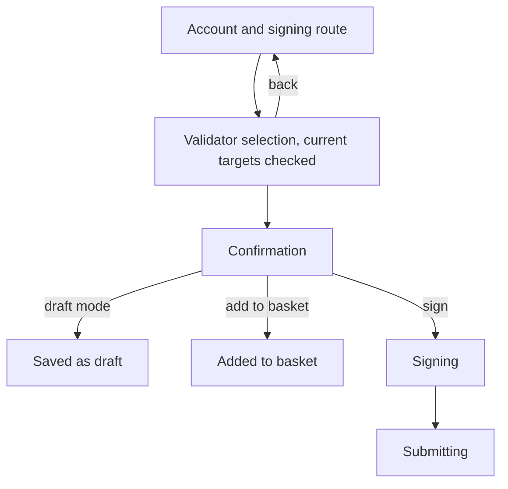

# Nominate

> Part of the [Feature Map](../README.md) — Last reviewed: 2026-08-07

## Overview

Changing who an already-bonded stash backs, without touching the stake itself. The funds stay locked exactly as they
are; only the validator set is replaced. This is what a nominator does when an operator they back stops being elected,
raises its commission, or gets slashed.

It is the counterpart of [`staking-bond-nominate`](../staking-bond-nominate/README.md), which locks funds and names
validators in one go for an account that has neither.

## Who can use it / when it applies

- A stash with an existing ledger. Whether the operation can actually be signed is decided by the shared signing path,
  not here.
- Two shapes, chosen by the wallet: a **single account**, and a **multishard vault**, where the same validator set is
  applied to several shards and each shard gets its own transaction.
- The nomination limit comes from the connected chain (`staking.maxNominations`).

## States / scenarios

| State        | When it appears                                       | What the user sees                                       |
| ------------ | ----------------------------------------------------- | -------------------------------------------------------- |
| Init         | The flow opens                                        | The acting account, the fee, and who signs               |
| Validators   | The init step is submitted                            | The picker, **with today's nominations already checked** |
| Confirmation | A validator set is submitted                          | The new set and the fee                                  |
| Signing      | Confirmed, not in draft mode                          | The wallet's signing screen — one payload per shard      |
| Submitting   | Signed                                                | Submission progress, then the result                     |
| Basket       | The operation was added to the basket instead of sent | A short success toast; nothing goes on chain             |
| Draft saved  | Draft mode was on at confirmation                     | The call is stored for someone else to sign              |

**The picker opens on what the stash holds today**, so the user edits a set rather than rebuilding it from nothing — the
common change is dropping one operator, not replacing sixteen. Those targets come from the same live nominations
subscription the Staking page reads. If it has not delivered this stash yet the picker **opens empty rather than showing
a stale set**: an empty list is visibly incomplete, while last session's nominations would look authoritative and could
be submitted as if they were current.

## Lifecycle

1. The init step establishes the acting account and, when the wallet offers more than one way in, the signing route.
2. Opening the picker hands it the chain and asset, the initiator and its wallet, the stash's current targets, and
   whether the session will be signed here or handed over. In draft mode the committed path names the eventual signer.
3. The picked set comes back, the confirmation is assembled, and the operation can be signed, basketed or saved as a
   draft.
4. Submitting replaces the whole nomination set — `nominate` is not additive, so whatever is not in the picked set stops
   being backed at the next era.

## Related

- [`validator-selection`](../validator-selection/README.md) — the picker, its recommendation and the nomination limit.
- [`staking-bond-nominate`](../staking-bond-nominate/README.md) — the same picker when there is no ledger yet.
- [`signing-path`](../signing-path/README.md) — who can sign and by which route.
- [`drafts`](../drafts/README.md) — where a saved operation goes.
