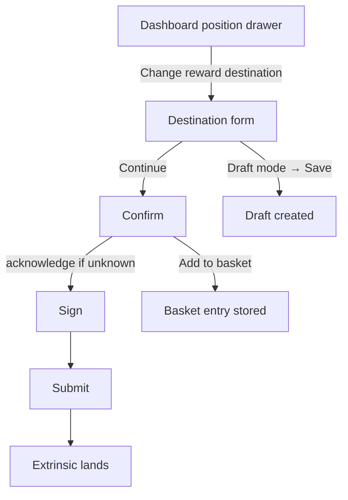

# Staking payee flow (change reward destination)

> Part of the [Feature Map](../README.md) — Last reviewed: 2026-08-26

## Overview

Lets the user change **where a staking position's rewards go** — restake them on top of the stake, or pay them out to an
account — and takes the answer through confirm → sign → submit.

Entered from a position row on the staking dashboard, which hands over the position it is showing. The flow builds no
position data of its own: the current destination it opens on is already in the drawer when the button is pressed.

### Why its own feature

`set_payee` was reachable only while creating a position (`staking-new-position-flow`) and from the old Staking page
(`staking-payee`, bound to the page's slot and to singleton form stores). The dashboard needs the same call on an
existing position, opened by an event from anywhere, with the dashboard-owned signing plumbing (`signing-path`, drafts,
basket). That is the shape `staking-amount-flow` already has, so this flow mirrors it rather than reusing the
page-welded form.

## Who can use it / when it applies

- Opened only from a dashboard position — nominator **or** validator; every stash has a payee.
- **Signing** requires an account of the current wallet that reaches a signer on the position's chain. Multisig and
  proxied accounts are wrapped automatically; the **signing route** can be changed on the form and on the confirm.
- The signing path section always names the initiator: a plain stash is drawn as a read-only single INITIATOR card, a
  multisig or proxied stash through the route editor above, with its source locked to the position.
- **Without a local signer**, the operation can still leave as a **draft** for somebody else to sign — see _Drafts_.
- Watch-only accounts can do neither, and the dashboard does not offer them the action in the first place.

## States / scenarios

The form is a radio pair under the account and network chips:

| Option                      | What is set on chain     | Extra input                                     |
| --------------------------- | ------------------------ | ----------------------------------------------- |
| **Restake rewards**         | `Staked`                 | none                                            |
| **Transferable to account** | `{ Account: <address> }` | a payout account — picker or free address entry |

`Stash` and `Controller` exist on chain but are not offered: the builder only encodes `Staked` and `Account`, and "pay
to the stash" is simply "transferable to this very account". A position that currently has one of them opens on
_Transferable_ with the stash address filled in, which is the closest thing the user can actually submit.

The picker is the shared [recipient picker](../../widgets/RecipientPicker/README.md), exactly as the transfer form
offers it: the user's own accounts that can receive on the chain, grouped by wallet; the address book — local and
synced; and an address typed in full. Nothing is excluded — paying rewards to the stash itself is the common case.

| State                  | When it appears                                             | What the user sees                                                                |
| ---------------------- | ----------------------------------------------------------- | --------------------------------------------------------------------------------- |
| Form                   | The drawer requests a change                                | Pre-selected from the current payee; `Continue` disabled until something changes  |
| Nothing changed        | The selection equals the current payee                      | A grey note under the field; `Continue` stays disabled                            |
| Invalid address        | _Transferable_ with text that is not an address             | Red field, "Please enter correct address", `Continue` disabled                    |
| No signer on the route | Nobody on the resolved route can sign (normal mode)         | Red "No account to sign with" alert; `Continue` and `Sign` blocked                |
| Unpayable              | The signer cannot cover the fee or the multisig deposit     | The error explains which, `Continue` and `Sign` blocked                           |
| Confirm                | `Continue` pressed                                          | Account, chain, signing route, **new destination**, network fee, multisig deposit |
| Unknown address        | The payout account is not in the address book (signed mode) | An amber acknowledgement box on the confirm; `Sign` disabled until it is ticked   |
| Sign / Submit          | `Sign` pressed                                              | The shared signing and submission screens                                         |

**"Nothing changed" is judged against the chain, not against the form's starting point.** Picking _Restake_ over a
`Staked` payee, or re-picking the same account under a different SS58 encoding, is not a change. Picking the stash
explicitly over a `Stash` payee _is_ one — `{ Account: stash }` is a different variant on chain. A payee the app has not
read yet lets any selection through; refusing to submit over a value nobody has seen would be guessing.

### Unknown payout address

Rewards will land on the chosen address on every payout from now on, so an address the address book does not know gets
the same kind of acknowledgement a transfer asks for, worded for a reward destination: the confirm shows the warning and
`Sign` stays disabled until the user ticks that they have verified it. A new address forgets the previous tick.
_Restake_ never warns — there is no recipient. **Draft mode is exempt**: nothing is signed when a draft is saved, and
the warning fires when the draft is eventually signed, exactly as it does for a transfer draft.

## Lifecycle

The transaction origin is the **position's own account**, never the signatory: for a multisig the inner call must come
from the multisig, and the wrapping step sets the outer origin. The confirm opens on the selection, not on the node —
the wrapped transaction, the fee and the validation stream in behind their own loaders with `Sign` disabled until they
land.

The drawer's Rewards cell is a live subscription, so a destination that lands — or a multisig one that lands only when
the final approval does — updates the drawer on its own.

## Drafts

The form carries the app-wide draft toggle. In draft mode the user picks the signing path themselves, the fee and
balance checks step aside, and the primary button creates a **draft** instead of walking on to the confirm. The draft's
**source is pinned to the position's own account**: the source picker offers nothing else, and the model builds no call
— and offers no _Save as draft_ — for a path that starts anywhere else, since `set_payee` acts on the origin's own stash
and any other origin has no rights over it. A request whose `signingMode` is `draft` — an address-book position — opens
with the toggle already on. Signing and draft creation never share a confirmation: draft mode ends at the form.

## Add to basket

The confirm carries the same secondary **"Add to basket"** button every dashboard staking flow has, under the same rule:
only when the initiator's own wallet is one the basket can sign with, never in draft mode.

## Related

- [`dashboard-staking-positions`](../dashboard-staking-positions/README.md) — shows the current destination and requests
  the change.
- [`staking-dashboard-actions`](../staking-dashboard-actions/README.md) — routes the request here and announces the
  draft.
- [`staking-positions`](../../aggregates/staking-positions/README.md) — reads the payee the drawer shows and this flow
  opens on.
- [`staking-amount-flow`](../staking-amount-flow/README.md) — the sibling whose shape this flow follows.
- `staking-payee` — the Staking page's own form, untouched.
- `drafts`, `signing-path`, `operations/OperationSign`, `operations/OperationSubmit`, `shared/transactions` — the shared
  signing and submission stack; `recipient-verification` — the unknown-address verdict.
