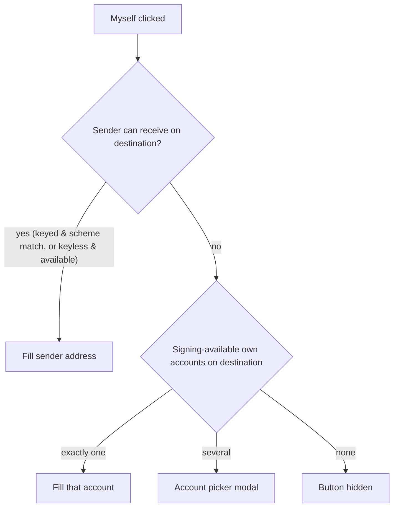

# Transfer

> Part of the [Feature Map](../README.md) — Last reviewed: 2026-08-20

## Overview

The send-asset flow: a user transfers a token from one of their accounts to any address, either within one chain or
across chains (XCM transfer / teleport). The feature owns the transfer form (sender, recipient, amount, fees), the
confirmation step, and hand-off to signing and submission. Cross-chain transfers additionally select a destination
network and show both origin and destination fees.

## Who can use it / when it applies

- Launched from the Portfolio / asset views ("Transfer" on an asset) and from flows that pre-fill a recipient (e.g.
  send-to-contact); a pre-filled recipient renders read-only.
- Any wallet that can sign on the origin chain can send: vault (including key-set vaults that hold only chain-scoped
  derived keys), multishard, WalletConnect, extension wallets, multisig and flexible multisig (a signatory signs),
  proxied wallets (the proxy signs). Watch-only wallets cannot initiate.
- The cross-chain (XCM) part appears only when the selected asset has registered cross-chain routes to other networks.

## States / scenarios

### Sender

- The sender list contains the selected wallet's accounts that are signing-available on the origin chain. A single
  eligible account is auto-picked and the selector is hidden.
- Multisig/proxied paths additionally choose a signatory / signing route; an incomplete route blocks submission.

### Recipient

The recipient field is a searchable combobox over three groups, filtered by name or address as the user types:

| Group         | Contents                                                                                                                                                                                                                                                                                                                                                                                                        |
| ------------- | --------------------------------------------------------------------------------------------------------------------------------------------------------------------------------------------------------------------------------------------------------------------------------------------------------------------------------------------------------------------------------------------------------------- |
| Own accounts  | Accounts of **all** the user's wallets that can _receive_ on the destination chain: keyed accounts (vault keys, extension, WalletConnect — the user holds the signing key) qualify by address-scheme match even when the key belongs to another chain; everything else (multisig, proxied / pure proxy, watch-only, signatories) follows its wallet feature's availability rule. The sender itself is excluded. |
| Address book  | Contacts (local and synced) whose address is valid on the destination chain.                                                                                                                                                                                                                                                                                                                                    |
| Typed address | A pasted/typed address not present above, so fresh addresses work without creating a contact.                                                                                                                                                                                                                                                                                                                   |

A committed recipient collapses into a card showing the resolved name — for the user's own account that is the account
(key) name, not the wallet name — with a clear button to re-enter edit mode.

The receive-vs-sign distinction exists for key-set vaults: their chain-scoped derived keys are valid recipients on any
scheme-compatible chain. The relaxed scheme-match rule applies only to accounts whose key the user holds; for the rest
(multisig, pure proxy, watch-only, signatory placeholders) the transfer feature defers to the owning wallet feature's
availability rule — offering such an address on a chain where it is not controlled would send funds into the void.

### Myself (XCM only)

The "Myself" button fills the recipient with the user's own address on the destination chain:

The sender-first rule matches teleport expectations: funds move between the same account's addresses on two chains.

### Amount

- Shows the sender's transferable balance; MAX mode subtracts origin (and destination, for XCM) fees and offers an
  existential-deposit switch to either keep the account alive or send everything and let it reap.
- Validation failures (zero amount, insufficient balance for amount + fees, destination below existential deposit) block
  submission with inline errors; sending an amount that would kill the sender account shows a warning.

### Cross-chain specifics

- Destination network is chosen from the asset's registered XCM routes; same-network selection makes it a regular
  transfer.
- Both origin and destination fees are shown; the transfer is dry-run against the destination and a failed dry run
  blocks submission with the decoded reason.

### Draft mode

The form can be saved as a draft (multisig flows): the user picks the signing path explicitly, fills the form and stores
the operation for later confirmation instead of signing immediately.

### Unknown recipient warnings

Gated by [`recipient-verification`](../../aggregates/recipient-verification/README.md), which is itself gated on the
external address book connection — nothing here shows for a user who has never connected it.

- **Form.** Once a recipient resolves and carries a warning (`unknown` — not in the address book / not the user's own
  account, or `unverifiable` — the address book can't currently vouch for anyone), an amber acknowledgement box appears
  between the Amount block and the fee section, with a checkbox ("I have verified this address…"). **Continue** is
  disabled until it is ticked. The checkbox resets whenever the recipient changes or a new flow starts, so an
  acknowledgement never silently carries over to a different address; it survives the warning's own copy changing (e.g.
  a mid-flow reconnect turning `unverifiable` into `unknown`).
- **Draft mode exemption.** The acknowledgement gate does not apply, and the box is not shown, while saving as a draft —
  nothing is signed yet. The gate runs instead on the draft's own confirm steps (Create and Submit), see
  [Drafts](../drafts/README.md#unknown-recipient-warnings).
- **Confirmation step.** A one-line amber note appears under the Recipient row restating that the address is not in the
  address book. It is informational only — the gate already ran on the form, so there is nothing to acknowledge again
  here.

## Lifecycle

1. User opens the form with a chain + asset context (asset can be switched inside the form).
2. Fills sender (usually auto-picked), recipient, amount; for XCM — destination network. Fees and validation update
   live.
3. Continue → confirmation screen → signing (wallet-specific) → submission; the operation can also go to the basket or
   be saved as a draft instead.
4. Failures surface as inline validation, a dry-run error, or a submission error; the form stays editable.

## Related

- `multi-transfer` — the batch counterpart with its own recipient handling.
- `send-to-contact` — launches this flow with a pre-filled, read-only recipient.
- `assets-balances` — balance data the amount/validation logic reads.
- Name resolution (`widgets/NameResolver`) — recipient card and suggestion names follow the app-wide resolution chain.
- [`recipient-verification`](../../aggregates/recipient-verification/README.md) — decides whether the recipient is
  "known" and drives the unknown-recipient warnings above.
