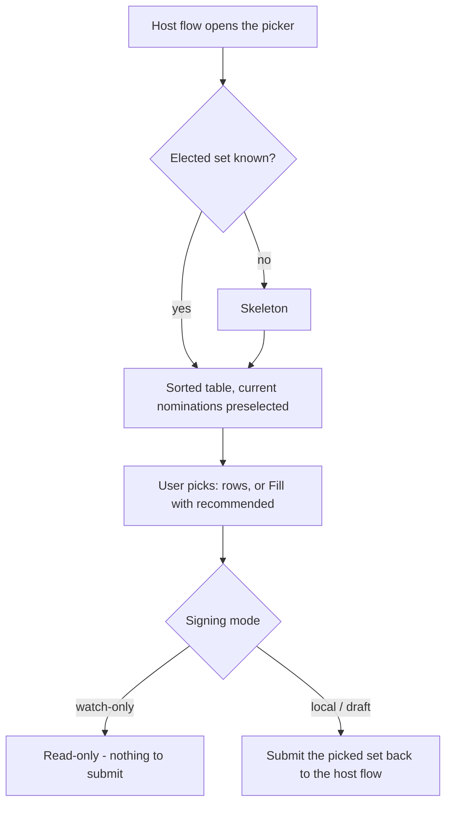

# Validator Selection

> Part of the [Feature Map](../README.md) — Last reviewed: 2026-08-04

## Overview

The screen where someone decides **who to nominate**. It opens as a modal over whichever staking flow the user is in,
lists every validator elected this era, and hands the picked set back to that flow.

The screen is built around one tension: the app already knows a good answer — the recommendation — but the user is
entitled to disagree with it. So the recommendation is one click away ("Fill with recommended"), and everything else on
the screen exists to let someone check that answer or build their own: a sortable table of the numbers that matter, a
filter popover for the thresholds they care about, a search over the names and addresses on screen, and a per-validator
detail explaining why a validator scores the way it does.

It replaces the old validators step, and deliberately keeps that step's contract: a host flow still opens it with a
chain and an asset and still receives a plain list of validators back.

## Who can use it / when it applies

- Reached from a staking flow that needs a nomination set: **bond & nominate** (first-time staking) and **change
  nominations** (an existing nominator editing their set). It is never a standalone destination.
- The validator data describes the network, not the user, so nothing here is gated on a wallet. What _is_ gated is
  submitting: see the signing modes below.
- The elected set, the recommendation and the saved recommendation criteria all come from the shared
  **staking-validators** aggregate — the criteria the user tunes here are the same ones every other staking surface
  reads, and they survive a restart.
- The chain's nomination limit (16 on Polkadot and Kusama) is a hard ceiling: the screen refuses to add beyond it rather
  than letting the chain reject the extrinsic later.

## Signing modes

Who will sign shapes the header chip, the footer, and whether the screen is editable at all. The chip appears only when
the mode changes what the user can do — **local** is the ordinary case and shows none, because a chip reading "local
wallet" announces the absence of a caveat.

| Mode           | When                                         | Effect                                                              |
| -------------- | -------------------------------------------- | ------------------------------------------------------------------- |
| **Local**      | A wallet in this app signs                   | Fully editable, continues into confirm/sign                         |
| **Draft**      | The acting account lives in the address book | Fully editable, the picked set is stored as a draft for its signer  |
| **Watch-only** | The account cannot sign anything             | Read-only: the current nominations are shown, nothing can be picked |

Watch-only is a genuinely read-only view rather than a screen with a disabled button: clicking a row, filling with the
recommendation and deselecting all are all no-ops, so the checks on screen always mean "this is what the account
nominates today" and never "this is what you were about to change it to".

## States / scenarios

| State           | When it appears                                      | What the user sees                                                        |
| --------------- | ---------------------------------------------------- | ------------------------------------------------------------------------- |
| Loading         | The elected set of the network has not arrived       | Table skeleton                                                            |
| Browsing        | The set has arrived                                  | Sorted table, meta line ("600 active validators · era 1,712")             |
| Preselected     | Opened from change-nominations                       | The account's current nominations already checked                         |
| Narrowed        | A filter, a toggle or a search query is active       | Fewer rows; "Showing 10 of 600"; a dot on the filter button               |
| Empty           | No validator matches the search or the filters       | "No validators match your search or filters" + "Clear search and filters" |
| At the limit    | As many validators picked as the chain allows        | Further rows cannot be added; already-picked ones can still be removed    |
| Detail open     | A row is opened                                      | Its numbers, led by the score; the breakdown sits in that row's tooltip   |
| Ready to submit | At least one validator picked, and the mode can sign | CTA enabled; "8 of 12 selected shown · est. set APY 15.9%"                |

### What the row badges mean

A row carries at most one badge — the single most important thing to know about that validator, not a list of everything
true about it. **Every badge explains itself on hover** (`badgeHint.*`), in the table and in the detail pane alike; a
two-word badge poses a question and the tooltip is where it gets answered, next to where it was asked. In order of
precedence:

1. **blocked** — the validator rejects new nominations. Its checkbox is inert and says so on hover, but the row itself
   opens like any other: refusing nominations is a reason to read a validator's numbers, not a reason to hide them. An
   already-nominated validator that later turns blocked keeps a working checkbox, so the user can still drop it.
2. **slashed** — it carries a slash inside the defer window.
3. **3rd in cluster** — the third-best validator run by an operator the list already shows twice. Spreading a nomination
   across operators limits the blast radius of one operator being slashed, which is why the recommendation stops at two
   per operator; the badge says which rows are the ones it stopped at.
4. **no identity** — nobody has registered a name for it on chain, so we cannot say who runs it.

There is deliberately no "oversubscribed" badge. `MaxExposurePageSize` is the size of one exposure page, not a reward
cutoff: every page is payable through `payout_stakers_by_page`, so a validator with more backers than one page holds is
spread over several pages rather than paying its tail nothing. The nominators column still shows `412 / 512` because the
count and the page size are facts; nothing derives a warning from them.

There is no "recommended" badge on the row either. The recommendation is an _action_ — "fill with recommended" — not a
property of a validator, and stamping every second row with it made the column noisy while saying nothing the Score
column does not already say more precisely.

Cluster numbering follows the **recommendation order**, not the column the user happens to be sorting by. "3rd in
cluster" is a fact about the operator's validators, and it would be a poor one if clicking a column header changed which
row carried it.

### How an operator's validators are recognised

Two ways, because operators announce themselves in two ways (`buildOperatorClusters` in
`domains/staking/recommendations`):

- **A shared root display name.** A sub-identity carries its parent's name, so `EXNESS.COM/0…5` all read `exness.com`
  and group exactly.
- **Near-identical direct identities.** Plenty of operators skip sub-identities and register a separate root identity
  per node — `BINANCE_STAKE_1 … BINANCE_STAKE_14` on Polkadot Asset Hub. Exact grouping saw fourteen unrelated operators
  there, so fourteen validators of one operator could enter a nomination that is supposed to cap at two.

Two names are one operator when they are at most `MAX_OPERATOR_NAME_DISTANCE` (3) edits apart **and** their shared
prefix covers more than half the shorter name. The second condition is the one doing the work: edit distance alone
matches `dotkeeper` to `zugkeeper` (two operators who both liked the word "keeper") and `dot1` to `ksm1`. What actually
marks a numbered family is _where_ the difference sits — a shared stem with a varying tail — and that is what the prefix
rule tests.

Merging is transitive, so `node-a → node-b → node-c` is one cluster even when the ends are further apart than the
threshold. That is also how it could over-merge, if a long enough chain of pairwise-similar names bridged two real
operators; the prefix rule is what keeps the steps too short for that to happen with real identities.

### What "recommended" is ranked on

Not APY alone. Each candidate is scored `0..1` on four metrics — estimated APY, commission, self stake and era points —
normalised against the other candidates of that era, and the ranking sorts by a weighted blend of them (`SCORE_WEIGHTS`
in `domains/staking/recommendations`). APY leads at 0.4 because it is the return the user is actually buying, but it
cannot decide alone: a headline APY earned behind a large commission, or on a validator with no stake of its own in the
position, is not the same offer as one earned without either.

There is no separate block-production metric, and no Blocks column. Authored-block counts came from
`imOnline.authoredBlocks`, and that pallet no longer exists in the Polkadot runtime — the column could only ever render
"—". Era points are the surviving liveness signal and carry that weight instead; they pay for backing and approval as
well as authoring, so they measure more of what a validator actually does. (Deriving blocks from points was considered
and rejected: on Polkadot an era pays out ~52M points across ~600 validators, orders of magnitude more than the ~14,400
blocks in a day, because para-validation dominates. Any points-to-blocks ratio would be invented.)

**Era points are the last _completed_ era's**, not the running one. On staking-async runtimes the relay reports points
per session, so the active era reads `0` for everyone through its whole first session — four of every twenty-four hours
on Polkadot — and is a partial tally for the rest of it. The previous era is complete and identical for everyone, which
is the only basis on which comparing validators means anything.

The score reads **`7/10`** rather than a percentage — coarse enough to compare at a glance, and honest about how precise
the underlying number is, since every metric is relative to whoever happens to be elected this era. Colour is grey /
amber / green; grey at the bottom is deliberate, because a low score means "there are better validators this era", not
"this one is unsafe". The genuinely unsafe things carry their own badge.

It appears in two places, both fed by one function so the explanation can never disagree with the decision it explains:

- the **Score column**, sortable like any other, and the order the recommendation itself walks — so "3rd in cluster"
  names exactly the rows the per-operator cap dropped;
- the **Score** row at the top of the detail pane, marked with an info icon and hoverable across its full width, which
  opens a tooltip breaking the number down into the four contributing metrics, each with its own bar.

Both show for **every** elected validator, not only the recommended ones: "how does the one I picked myself compare" is
the question the panel is open for. Scores are normalised against the whole elected set rather than the filtered view,
so a row's score does not move as the user types into the search box.

### Nothing in the detail pane is unexplained prose

Every number the pane shows that the user cannot derive from the chain themselves carries its explanation in a tooltip
on the row, marked with an info icon: **Score** (the four-metric breakdown, with bars) and **Estimated APY** (which era
the projection reads and why a smaller validator pays each nominator more). Badges explain themselves the same way.

There is no explanatory card at the bottom of the pane. One existed and it was the wrong shape for the job: it sat below
the fold, it only ever described the single flag of the one validator that happened to be open, and it said nothing at
all in the table, which is where the badge is first read.

### Search matches what is on screen

The query runs over the strings the row actually renders — the resolved identity name (`Operator A/node-2` for a
sub-identity) and the address in this chain's format. The stored hex account id is never on screen and is never matched:
a result the user cannot visibly explain is worse than no result.

Results keep the table's current order rather than being re-ranked by how well they matched. The user chose that sort;
typing into the search box is a narrowing, not a re-sort.

### Show selected

A quick way to review a pick without hunting for it across six hundred rows: the table narrows to the checked
validators. Search and the filters still apply _inside_ that narrowing, so a query looks within the pick rather than
escaping it, and the sort is untouched — this is a view over the selection, not a re-ranking of it.

It cannot outlive the selection it shows. With nothing checked the toggle is inert, and unchecking the last validator
turns it off by itself: an empty table with an active "show selected" is a dead end the user has no obvious way out of.

### Filters vs. criteria

Two similar-looking sets of switches, deliberately kept apart:

- **Filters** (min APY, max commission, min own stake, hide idle, has identity, never slashed) narrow the **table the
  user is browsing**. They are local to this screen and reset when it closes. "Has identity" and "never slashed" start
  on — an anonymous or slashed validator is rarely what someone browsing wants — and the dot on the filter button is the
  only signal that a collapsed popover is still narrowing the list.
- **Criteria** (exclude slashed, require identity, limit clusters) shape the **recommendation**. They are a saved user
  preference shared with every other staking surface, so changing them here changes what "recommended" means everywhere.

Consequently the recommendation can legitimately include a validator the current filters hide, and "Fill with
recommended" can therefore select rows that are not visible. That is why the footer counts selected-and-shown separately
from selected.

Every filter bound is inclusive, and two asymmetries are intentional: a validator whose APY the chain never reported
cannot satisfy a minimum APY and is dropped by that bound, but an **unknown** block count is not read as idle — "hide
idle" only removes validators actually observed authoring nothing.

## Lifecycle

Fill-with-recommended **replaces** the selection rather than merging into it — it is the recommendation as a whole, not
an addition to whatever was picked before. It is already capped at the chain's nomination limit, so it can never
overfill.

Closing the screen resets everything it holds — query, filters, sort, selection, open detail. The screen is a single
shared instance used by both host flows, so anything left behind would show up in the next one.

## How the host flows open it

Four entry points, two per host flow — each of **bond & nominate** and **change nominations** has a single-account and a
multi-shard variant. Every one of them replaces its validators step with this modal and closing it ends the whole
operation, exactly as closing the old step did.

What each entry point can honestly say about the operation differs, and the screen shows only what it is told:

| Passed            | Sourced from                                                                         | Withheld when                                                     |
| ----------------- | ------------------------------------------------------------------------------------ | ----------------------------------------------------------------- |
| `signingMode`     | The host form's draft-mode toggle; watch-only as a defensive floor                   | Never — it always resolves to one of the three modes              |
| `initiator`       | The acting account of the flow                                                       | A shards variant with more than one shard selected                |
| `initiatorWallet` | The wallet the flow is operating for                                                 | Never                                                             |
| `nominatedIds`    | The live nominations subscription, for the stash whose set is being changed          | Bond & nominate (nothing nominated yet), or more than one shard   |
| `signingInfo`     | The committed draft signing path — its signer's resolved name and any multisig on it | Any non-draft mode, or a draft path that has no signer chosen yet |

A shards variant nominating several accounts at once has no single acting account and no single current nomination set,
so it names neither rather than presenting the first shard as if it were the whole operation. Likewise `signingInfo`
stays absent field by field: a path with no multisig on it yields no multisig label and no signatory count, never a
placeholder.

## Preserved legacy contract

The picked set leaves as the same `Validator[]` the previous validators step emitted, and the screen is still opened and
closed by the same events. Host flows therefore kept working across the swap with no change beyond the richer opening
payload, and the per-era data stays inside this feature until those flows are migrated in their own right.

## Related

- **staking-validators aggregate** — the elected set, the on-chain identities, the operator clusters, the recommendation
  and the saved criteria. This feature adds the browsing experience on top; it computes none of that itself.
- **Staking domain** — owns the recommendation algorithm and the score breakdown behind the detail view.
- **staking-bond-nominate / staking-nominate** — the two host flows that open this screen and consume its result.
