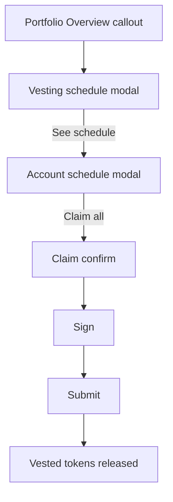

# Vesting claim

> Part of the [Feature Map](../README.md) — Last reviewed: 2026-07-09

## Overview

Lets a user see the vesting schedules held by their selected accounts and **claim** the tokens that have already vested,
turning `vesting.vest()` — an otherwise hidden extrinsic — into a first-class flow. Recipients of vested transfers (team
allocations, airdrops, crowdloan rewards) can now tell how much has unlocked and release it to their transferable
balance.

The feature surfaces as a callout inside the dashboard **Portfolio Overview** card (injected via
`portfolioVestingSlot`), opening a schedule modal → per-account modal → a standard confirm/sign/submit claim. Amounts
are token-first with fiat as the secondary value, consistent with the rest of the portfolio.

## Who can use it / when it applies

- Appears only when at least one selected account has an active vesting schedule on a **vesting-capable chain** —
  detected at runtime by the presence of `api.query.vesting.vesting` and `api.tx.vesting.vest` (this excludes
  `orml_vesting` chains, which use a different call and are out of scope).
- The callout is part of the Portfolio Overview card, which itself renders only while fiat display is enabled.
- **Claiming** requires a signable account from the current wallet (Vault, WalletConnect, multisig, proxy…). Watch-only
  accounts and contacts are shown for transparency but cannot be claimed. Multisig/proxy accounts are wrapped
  automatically; each claim is one `vesting.vest()` transaction per account.
- One address can back **several local accounts** — an imported wallet plus, say, a proxied wallet auto-discovered for
  the same key on another chain, or a WalletConnect wallet carrying one account per chain of its session. Vesting is
  read per key, so all of them show the same schedules, but the claim resolves the account that actually reaches a
  signer on that chain: an account that signs directly wins over one that routes through a signatory. This is what the
  confirm screen's **Wallet** row reflects.
- When no account reaches a signer, the account modal replaces "Claim all" with the reason, so the missing button is
  never silent: the key belongs to a contact (`no-local-account`), the wallet cannot act on this chain
  (`chain-unsupported` — most often a WalletConnect session paired before the chain existed, since its chain set is
  frozen at pairing), or nothing can sign for it (`no-signer` — watch-only, or a proxied account whose delegate is not
  local). Schedules stay visible in every case.

## States / scenarios

The unlock figures come from `domains/vesting` `vestingClaimService`, evaluated at the **timeline chain's** current
block:

- per schedule: `lockedNow = clamp(locked − perBlock·max(0, now − start), 0, locked)` (`perBlock` clamped to ≥1);
  `vestedSoFar = locked − lockedNow`.
- per account: `stillLocked = Σ lockedNow`; `claimable = max(0, vestingLock − stillLocked)`, where `vestingLock` is the
  on-chain vesting balance lock — so it stays correct after prior partial claims.
- per-schedule "ready now": the account `claimable` split proportionally to each schedule's `vestedSoFar` (flooring dust
  goes to the most-vested schedule). This is a **display-level attribution** — the pallet keeps one lock per account, so
  there is no on-chain per-schedule claimed amount.
- dates ("Fully unlocks 28 Feb 2026 · in 52d", "Cliff until 1 Mar 2026") are projected from the timeline chain's
  expected block time; while that block time is unknown the modal falls back to the plain "Vesting" / "In cliff" texts.

| State                     | When it appears                                                            | What the user sees                                                                                                                                                                                           |
| ------------------------- | -------------------------------------------------------------------------- | ------------------------------------------------------------------------------------------------------------------------------------------------------------------------------------------------------------ |
| No callout                | No active schedule on the selected accounts                                | Portfolio Overview looks unchanged                                                                                                                                                                           |
| Vested distribution slice | Any selected account has a vesting lock                                    | An indigo "Vested" bar in "Distribution by balance type"                                                                                                                                                     |
| Callout                   | ≥1 active schedule                                                         | "N active vesting schedules · fully unlocks by DATE", plus a "ready" pill when claimable                                                                                                                     |
| Schedule modal            | Callout clicked                                                            | Totals (vesting / schedules / ready-to-unlock), Day/Week/Month unlock-rate toggle, one row per account                                                                                                       |
| Account modal             | "See schedule" clicked                                                     | Account totals with "Claim all", an "Unlocking ≈ $X per day" line, and per-schedule cards: asset icon, "Schedule N · SYMBOL", per-schedule "≈ rate / day · fiat", progress bar, "Fully unlocks DATE · in Nd" |
| Schedule ready            | A schedule's attributed ready amount > 0                                   | Below a separator: "X TOKEN / $Y ready to claim" — informational only; claiming happens via the account-level "Claim all"                                                                                    |
| Fully unlocked schedule   | `lockedNow == 0` for a schedule                                            | "Fully unlocked" replaces the unlock-date text, in the same muted style                                                                                                                                      |
| Cliff                     | `vestedSoFar == 0` for a schedule                                          | "Cliff until DATE — nothing to unlock yet" (plain "In cliff…" while the date is unknown); no claim offered                                                                                                   |
| Claim unavailable         | Vested tokens are ready, but no local account signs for them on this chain | A muted reason where "Claim all" would sit ("Your wallet can't sign on this network"); schedules stay visible                                                                                                |
| Confirm                   | "Claim all" pressed                                                        | "Unlocks now" + "Keeps vesting" + network fee for the account, then Sign & submit                                                                                                                            |

## Lifecycle

Claiming is **per account**: a single `vesting.vest()` call releases every vested schedule for that account at once (the
pallet has no per-schedule claim), so there is one claim per account and no cross-account batch. The per-schedule "ready
now" figures are informational; the only claim entry point in the account modal is "Claim all".

The claim prepares the wrapped transaction for the account (resolving the multisig/proxy signing route and estimating
the fee), shows a confirm, then signs and submits. On submit the on-chain vesting lock drops and the freed amount
becomes transferable (unless a larger staking/vote lock still dominates `frozen`).

Once the submitted extrinsic lands with success, the **account modal ("Vesting details") closes automatically**. The
schedule figures behind it need no manual refresh: the schedules and their `VESTING` balance locks are **live
subscriptions** (`domains/vesting` `vestingSchedulesResource`, one pooled subscription per chain), so when the claim
lands on-chain — its lock drops, a fully-vested schedule is pruned — the schedule modal updates on its own. This also
keeps the figures correct for a multisig/proxy claim, whose `vesting.vest()` executes only when the final approval
lands, and for changes made from another device. On a failed submit both modals stay as they were.

## Related

- `domains/vesting` — the live schedule/lock subscription (`vestingSchedulesResource`) and the pure
  `vestingClaimService` math. The feature's `useVestingSchedules` hook drives one pooled subscription per
  vesting-capable chain.
- `dashboard-portfolio-overview` — hosts the callout slot and renders the new "Vested" allocation category.
- `vested-transfer` — the inverse operation (creating vesting); shares the `vesting` pallet and confirm/sign infra.
- `operations/OperationSign`, `operations/OperationSubmit`, `shared/transactions` — the reused signing/submission stack.
