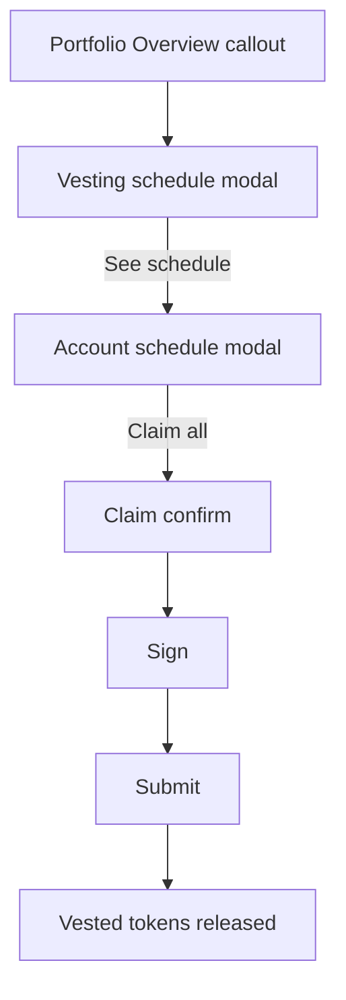

# Vesting claim

> Part of the [Feature Map](../README.md) — Last reviewed: 2026-07-20

## Overview

Lets a user see the vesting schedules held by their accounts and **claim** the tokens that have already vested, turning
`vesting.vest()` — an otherwise hidden extrinsic — into a first-class flow. Recipients of vested transfers (team
allocations, airdrops, crowdloan rewards) can now tell how much has unlocked and release it to their transferable
balance.

The feature surfaces as a callout inside the dashboard **Portfolio Overview** card (injected via
`portfolioVestingSlot`), opening a schedule modal → per-account modal → a standard confirm/sign/submit claim. Amounts
are token-first with fiat as the secondary value, consistent with the rest of the portfolio.

What is vesting, and whether that answer can be trusted yet, is decided by the
[`vesting-portfolio`](../../aggregates/vesting-portfolio/README.md) aggregate; this feature presents it and claims from
it.

## Who can use it / when it applies

- Follows the dashboard's **account filter** — the callout shows vesting for the accounts currently selected in the
  card, not the whole wallet. The selection is fed to the
  [`vesting-portfolio`](../../aggregates/vesting-portfolio/README.md) aggregate via `accountsScopeChanged`; the callout
  itself stays propless and reads the scoped result. Narrowing the selection is a filter over data already held, not a
  new lookup — see the aggregate's spec — so the row updates instantly instead of falling back to a loading state.
- A schedule counts when it sits on a **vesting-capable chain** — detected at runtime by the presence of
  `api.query.vesting.vesting` and `api.tx.vesting.vest` (this excludes `orml_vesting` chains, which use a different call
  and are out of scope).
- The callout is part of the Portfolio Overview card, which itself renders only while fiat display is enabled.
- **Claiming** requires a signable account from the current wallet (Vault, WalletConnect, multisig, proxy…). Watch-only
  accounts and contacts are shown for transparency but cannot be claimed. Multisig/proxy accounts are wrapped
  automatically; each claim is one `vesting.vest()` transaction per account.
- The **signing route** is seeded with the default path and can be changed on the confirm screen. It is not a cosmetic
  choice: the account at the end of the route is the one that pays the fee and reserves the multisig deposit, so it is
  never picked silently when the wallet offers more than one. Changing it re-wraps the transaction, re-estimates the fee
  and re-validates.
- One address can back **several local accounts** — an imported wallet plus, say, a proxied wallet auto-discovered for
  the same key on another chain, or a WalletConnect wallet carrying one account per chain of its session. Vesting is
  read per key, so all of them show the same schedules, but the claim resolves the account that actually reaches a
  signer on that chain: an account that signs directly wins over one that routes through a signatory. This is what the
  confirm screen's **Wallet** row reflects.
- When no account reaches a signer, the account modal replaces "Claim all" with the reason, so the missing button is
  never silent: the key belongs to a contact (`no-local-account`), the wallet cannot act on this chain
  (`chain-unsupported` — most often a WalletConnect session paired before the chain existed, since its chain set is
  frozen at pairing), or nothing can sign for it (`no-signer` — watch-only, or a proxied account whose delegate is not
  local). Schedules stay visible in every case.

## States / scenarios

The unlock figures come from `domains/vesting` `vestingClaimService`, evaluated at the **timeline chain's** current
block:

- per schedule: `lockedNow = clamp(locked − perBlock·max(0, now − start), 0, locked)` (`perBlock` clamped to ≥1);
  `vestedSoFar = locked − lockedNow`.
- per account: `stillLocked = Σ lockedNow`; `claimable = max(0, vestingLock − stillLocked)`, where `vestingLock` is the
  on-chain vesting balance lock — so it stays correct after prior partial claims.
- per-schedule "ready now": the account `claimable` split proportionally to each schedule's `vestedSoFar` (flooring dust
  goes to the most-vested schedule). This is a **display-level attribution** — the pallet keeps one lock per account, so
  there is no on-chain per-schedule claimed amount.
- **"unlocking per day" is what the next 24 hours actually release** — the schedule projected forward a day and
  subtracted from itself, not `perBlock × blocksPerDay`. The naive rate lies about anything shorter than a day: it
  reported a daily unlock many times the size of the entire vesting for a schedule finishing in an hour, and for a cliff
  — which pays out in one block — worst of all. A schedule whose start is more than a day out releases nothing, and none
  releases more than it still holds.
- dates ("Fully unlocks 13 Jul 2026, 15:04 · in 2h 10m") are projected from the timeline chain's expected block time. A
  **clock time is printed only within ~48 hours**, where the projection is good to the minute; months out it is worth a
  day at best and the date stands alone. The countdown is stated at the coarsest useful resolution ("3d 4h", "5h 20m",
  "12m") and ticks against the wall clock. While the block time is unknown the modal falls back to the plain "Vesting" /
  "In cliff" texts.

**The callout shows nothing until there is something to show.** It is an additive row under a card that carries its own
loading state, and most wallets have no vesting at all — a placeholder here would be a row that appears, holds for as
long as the slowest chain takes to answer, and then vanishes again, for every user who was never going to see it. So
"still looking" and "nothing found" look identical on screen: empty. The
[`vesting-portfolio`](../../aggregates/vesting-portfolio/README.md) readiness rule still decides _when_ content may
appear — a schedule that lands makes the row fade in, and the remaining chains report behind a small spinner — it just
no longer has a placeholder to govern. Any loading the user needs to see is the card's own, on the balance distribution
row.

| State                     | When it appears                                                            | What the user sees                                                                                                                                                                                               |
| ------------------------- | -------------------------------------------------------------------------- | ---------------------------------------------------------------------------------------------------------------------------------------------------------------------------------------------------------------- |
| Looking / no vesting      | Chains are still reporting, or all reported and none holds a schedule      | Nothing — the callout renders no row                                                                                                                                                                             |
| Vested distribution slice | Any account has a vesting lock                                             | An indigo "Vested" bar in "Distribution by balance type"                                                                                                                                                         |
| Callout                   | ≥1 active schedule                                                         | Fades in: "N active vesting schedules · fully unlocks by DATE", plus a "ready" pill when claimable, and a spinner while chains still report                                                                      |
| Schedule modal            | Callout clicked                                                            | Totals (vesting / schedules / ready-to-unlock), the average unlock rate per day, one row per account                                                                                                             |
| Account modal             | "See schedule" clicked                                                     | Account totals with "Claim all", an "Unlocking ≈ $X per day" line, and per-schedule cards: asset icon, "Schedule N · SYMBOL", per-schedule "≈ rate / day · fiat", progress bar, "Fully unlocks DATE · in 3h 20m" |
| Schedule ready            | A schedule's attributed ready amount > 0                                   | Below a separator: "X TOKEN / $Y ready to claim" — informational only; claiming happens via the account-level "Claim all"                                                                                        |
| Fully unlocked schedule   | `lockedNow == 0` for a schedule                                            | "Fully unlocked" replaces the unlock-date text, in the same muted style                                                                                                                                          |
| Cliff                     | `perBlock ≥ locked` — the schedule releases everything in a single block   | "In cliff", and below a separator "Cliff until DATE — nothing to unlock yet"; no per-day rate is shown (a lump sum has none) and no claim is offered                                                             |
| Not started               | `now < startingBlock` on a schedule that vests gradually                   | "Vesting starts DATE · in 2h 10m". **Not a cliff** — a gradual schedule that has yet to begin. Its "fully unlocks" date is shown as usual, since it is known                                                     |
| Claim unavailable         | Vested tokens are ready, but no local account signs for them on this chain | A muted reason where "Claim all" would sit ("Your wallet can't sign on this network"); schedules stay visible                                                                                                    |
| Confirm                   | "Claim all" pressed                                                        | Signing route, "Unlocks now" + "Keeps vesting", network fee (and multisig deposit), then Sign & submit                                                                                                           |
| Claim unaffordable        | The signer cannot cover the fee, or cannot reserve the multisig deposit    | The confirm explains which, and **Sign is blocked**. Switching the signing route re-checks it                                                                                                                    |

## Lifecycle

Claiming is **per account**: a single `vesting.vest()` call releases every vested schedule for that account at once (the
pallet has no per-schedule claim), so there is one claim per account and no cross-account batch. The per-schedule "ready
now" figures are informational; the only claim entry point in the account modal is "Claim all".

**Who signs.** A multisig or proxied account claims through its signing path, whose leaf is the signer. A **regular
account signs for itself** — `vesting.vest()` is a call an account makes on its own behalf — and for one the signing
path is empty by design, so the signatory falls back to the initiator. That fallback is load-bearing rather than
cosmetic: without a signatory the route is empty, the wrapping step refuses the transaction, and the confirm has no
transaction to price — it waits on a network fee that can never arrive, with Sign disabled and no error to explain why.

**The confirm opens on the click, not on the data.** Everything it leads with — the amount unlocking, the amount that
keeps vesting, the account, the chain — is already in hand when the button is pressed. The wrapped transaction, the fee
and the validation each cost a round trip to the node, so they are _not_ awaited: the modal opens immediately and they
stream in behind their own loaders, with the sign button disabled until they land. Changing the signing route re-runs
them in place. On submit the on-chain vesting lock drops and the freed amount becomes transferable (unless a larger
staking/vote lock still dominates `frozen`).

### Can the claim actually be paid for?

Worth spelling out, because a vesting account is the one account most likely to look like it cannot pay. On Polkadot and
Kusama `UnvestedFundsAllowedWithdrawReasons` is `except(TRANSFER | RESERVE)`, so pallet*vesting's lock blocks exactly
two things: **transfers and reserves**. It does \_not* block transaction payment. So an account whose entire balance is
still vesting can pay its own claim fee out of that locked balance, down to the existential deposit — no
chicken-and-egg.

Two cases do fail, and both are checked before signing:

- **The multisig deposit is a reserve**, which the vesting lock _does_ block. A signatory whose balance is
  vesting-locked cannot back a multisig claim, however large that balance is.
- **A co-existing staking or conviction-vote lock** carries `WithdrawReasons::all()`, which _does_ cover fees. Such an
  account can be unable to pay even though its vesting lock alone would have allowed it.

Both surface on the confirm screen and block the sign button rather than failing on-chain.

Once the submitted extrinsic lands with success, the **account modal ("Vesting details") closes automatically**. The
schedule figures behind it need no manual refresh: the schedules and their `VESTING` balance locks are **live
subscriptions** (`domains/vesting` `vestingSchedulesResource`, one pooled subscription per chain), so when the claim
lands on-chain — its lock drops, a fully-vested schedule is pruned — the schedule modal updates on its own. This also
keeps the figures correct for a multisig/proxy claim, whose `vesting.vest()` executes only when the final approval
lands, and for changes made from another device. On a failed submit both modals stay as they were.

## Related

- [`vesting-portfolio`](../../aggregates/vesting-portfolio/README.md) — what is vesting, and when that answer may be
  trusted; owns the live subscriptions this feature renders from.
- `domains/vesting` — the live schedule/lock subscription (`vestingSchedulesResource`) and the pure
  `vestingClaimService` math.
- `dashboard-portfolio-overview` — hosts the callout slot and renders the new "Vested" allocation category.
- `vested-transfer` — the inverse operation (creating vesting); shares the `vesting` pallet and confirm/sign infra.
- `operations/OperationSign`, `operations/OperationSubmit`, `shared/transactions` — the reused signing/submission stack.
