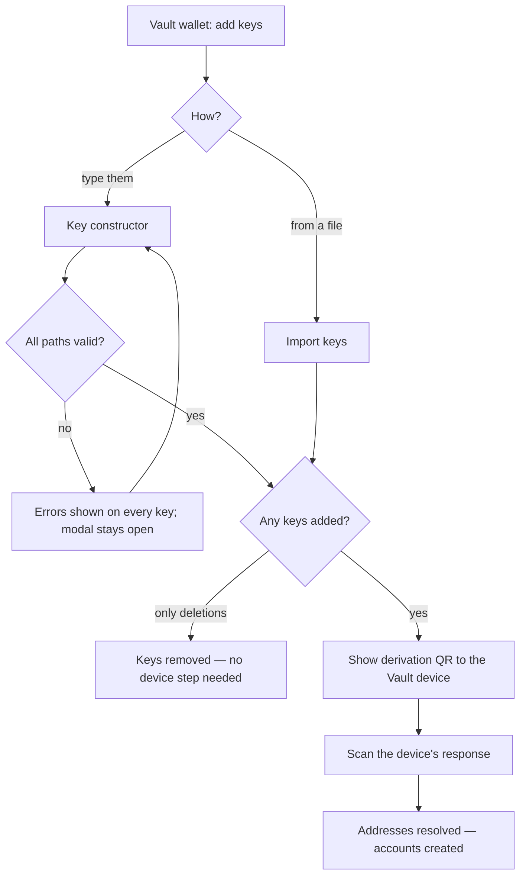

# Wallets

> Part of the [Feature Map](../README.md) — Last reviewed: 2026-07-14

## Overview

Wallet-management flows that act on a wallet the user already has (or is in the middle of pairing), as opposed to
pairing a new one. Two groups live here:

- **Dynamic derivations** — the Polkadot Vault key lifecycle: compose derivation paths, import/export them as a file,
  and round-trip them through the Vault device to turn paths into real accounts. This is the bulk of the module.
- **Wallet lifecycle & shell** — rename a wallet, forget/hide it, choose which Vault shards the Assets page shows, and
  guard the app shell against being entered with no wallet.

## Who can use it / when it applies

| Flow                     | Wallet types                          | Entered from                                                          |
| ------------------------ | ------------------------------------- | --------------------------------------------------------------------- |
| Key constructor          | Polkadot Vault only                   | Vault pairing (onboarding) and wallet details                          |
| Import / export keys     | Polkadot Vault only                   | Import: pairing + wallet details. **Export: wallet details only**      |
| Derivations address (QR) | Polkadot Vault only                   | Automatically, after keys are added by the constructor or the importer |
| Rename wallet            | All                                   | Wallet details — inline header field, or the dropdown's "Rename"       |
| Forget / hide wallet     | All except Proxied & Flexible Multisig | Wallet details dropdown                                                |
| Shard selector           | Polkadot Vault only                   | Assets page                                                            |
| Route guards             | n/a                                   | App shell and `/onboarding` routes                                     |

## Dynamic derivations

### What a key is

A key is a **chain plus a derivation path** — nothing else. The user never picks a "key type": the strings `main`,
`hot`, `public`, `sharded` offered as autocomplete chips are just text appended to the path, and every key the
constructor produces is stored as a custom key. Crypto type (Ethereum vs sr25519) follows from the chosen chain.

A path ending in a range token `0...N` is **sharded**: it expands into N+1 sibling keys (`//0`, `//1`, …) that stay
grouped for balance display and signing.

### Derivation path validation

Errors surface **when the user finishes editing a key**, not on every keystroke — a half-typed path is not an error
yet. The exception is a duplicate: because a collision is symmetric, it is flagged on **both** colliding keys as soon
as it exists, even if one of them has never been touched. Submitting force-reveals every error on every key, so nothing
invalid can slip through unseen. Only the first error of a key is displayed.

| Error                   | What the user sees                                                       |
| ----------------------- | ------------------------------------------------------------------------ |
| Empty                   | The derivation path cannot be empty                                       |
| Leading/trailing spaces | Remove spaces at the beginning or end of the path                         |
| Inner spaces            | The derivation path name can't contain spaces                             |
| Bad start / bad end     | Must start with `/` or `//`; cannot end with a slash                      |
| Password path           | `///password` derivations are not supported                               |
| Empty segment           | A segment between separators is missing (e.g. `//`)                       |
| Soft derivation on EVM  | Ethereum chains don't support soft derivations — `//` (hard) only         |
| Invalid shard range     | A shard range must produce at least 2 shards                              |
| Duplicate               | The path is already in use **on that same chain** — choose another        |

**Duplicates are scoped to the exact chain.** The same path on two different chains is legitimate and is not an error,
even when those chains share a relay chain. (This corrected an earlier rule that treated all chains under one relay
chain — and all EVM chains — as a single namespace, which rejected valid keys.)

> ⚠️ **Known inconsistency:** the constructor enforces only a lower bound on shard count (≥ 2, no maximum), while the
> file importer accepts 2–50. The `0...50` autocomplete chip expands to 51 shards — accepted by the constructor,
> rejected on re-import.

### States

The constructor is an **editor, not just an adder**: keys removed from the list are deleted from the wallet on save.
Deletions alone need no device confirmation and skip the QR step. Leaving the constructor with unsaved edits prompts
"Leave form without changes?".

### Import

Accepts a `.yaml` or a `.txt` file (a template is downloadable); the `.txt` form is exactly what Export writes, so
export → import round-trips. The file's root public key must match the wallet's, otherwise "The public key doesn't
match." Every bad path in the file is reported **together**, with the offending values listed, rather than one at a
time. Rows for chains the app doesn't know are silently skipped.

Imported keys are **merged, never replaced**: duplicates — both inside the file and against the wallet's existing keys
— are dropped and reported as a count. The success alert reads "{n} key(s) added for {m} network(s)".

### Export

Shows a QR for the Vault device to scan and offers a `{wallet name}.txt` download of the same key set (sharded groups
collapse back to a single `0...N` line). Export reads the wallet's **live** account list, so keys added earlier in the
same wallet-details session are included.

### Address round-trip

The app knows paths but cannot compute addresses — only the device holds the seed. So after keys are added, the app
shows a QR of the requested derivations, the user scans the device's reply, and the returned public keys are matched
back to their requests to become real accounts.

> ⚠️ A key the device does not return currently yields an account with an empty address rather than a visible error, so
> a partial scan can silently produce a broken account.

## Wallet lifecycle

### Rename

Available on every wallet type, inline in the details header or via a modal. The name must be non-empty and unique
across wallets, case-insensitively; re-submitting the wallet's own current name is a no-op. Renaming also **updates the
matching address-book contact** (creating a local one if none exists) — the UI states this. Polkadot Vault account
names are deliberately left untouched; other wallet types have their accounts renamed with the wallet.

### Forget / hide

Hidden for Proxied and Flexible Multisig wallets. Two different outcomes:

- **Regular multisig → "Hide."** Never deleted, restorable from Settings. If the multisig has pending operations, the
  confirmation says so explicitly — hiding does not cancel them.
- **Everything else → "Remove."** Permanent.

If the wallet is a signatory or proxy that other wallets depend on, a **"Linked wallets will be removed"** dialog is
shown first. Only wallets that would be left with no other reason to exist are taken down with it — a multisig with
other remaining signatories survives. Both confirmations offer "Do not show this again", after which the step is
skipped on later forgets.

> ⚠️ The linked-wallets copy says the related accounts will be "hidden", but they are **deleted**. Either the copy or
> the behaviour should change.

Removing the last wallet drops the user back to onboarding (see below).

## Shard selector

For Polkadot Vault wallets only; invisible for every other type. On the Assets page the user picks which derived
accounts contribute to the displayed balances ("Your assets on: N accounts"). Accounts are grouped by chain — with EVM
chains merged into one "EVM Compatible" group and parachains folded into their relay parent — each group showing a
`checked / total` count and a tri-state (checked / partial / unchecked) box. Search matches a derivation path or the
chain-formatted address, and filters only what is displayed: selections made outside the current query are preserved.
Everything is selected by default; the selection resets when the wallet or chain set changes and is **not persisted**.

## Route guards

Membership is decided purely by "does at least one wallet exist":

- **App shell** — with zero wallets, the user is redirected to onboarding. This is what catches the moment the last
  wallet is forgotten.
- **Onboarding** — with at least one wallet, the user is redirected to the dashboard, so onboarding cannot be
  re-entered.

## Related

- [`polkadot-vault-wallet-pairing`](../polkadot-vault-wallet-pairing/README.md) — hosts the constructor and importer
  while a Vault wallet is being paired; a Vault can be created with no derived keys at all (root account only).
- `wallet-details` — the surface every flow here except the shard selector is launched from.
- `hidden-wallets` — where hidden multisigs are restored.
- `assets` — consumes the shard selection.
