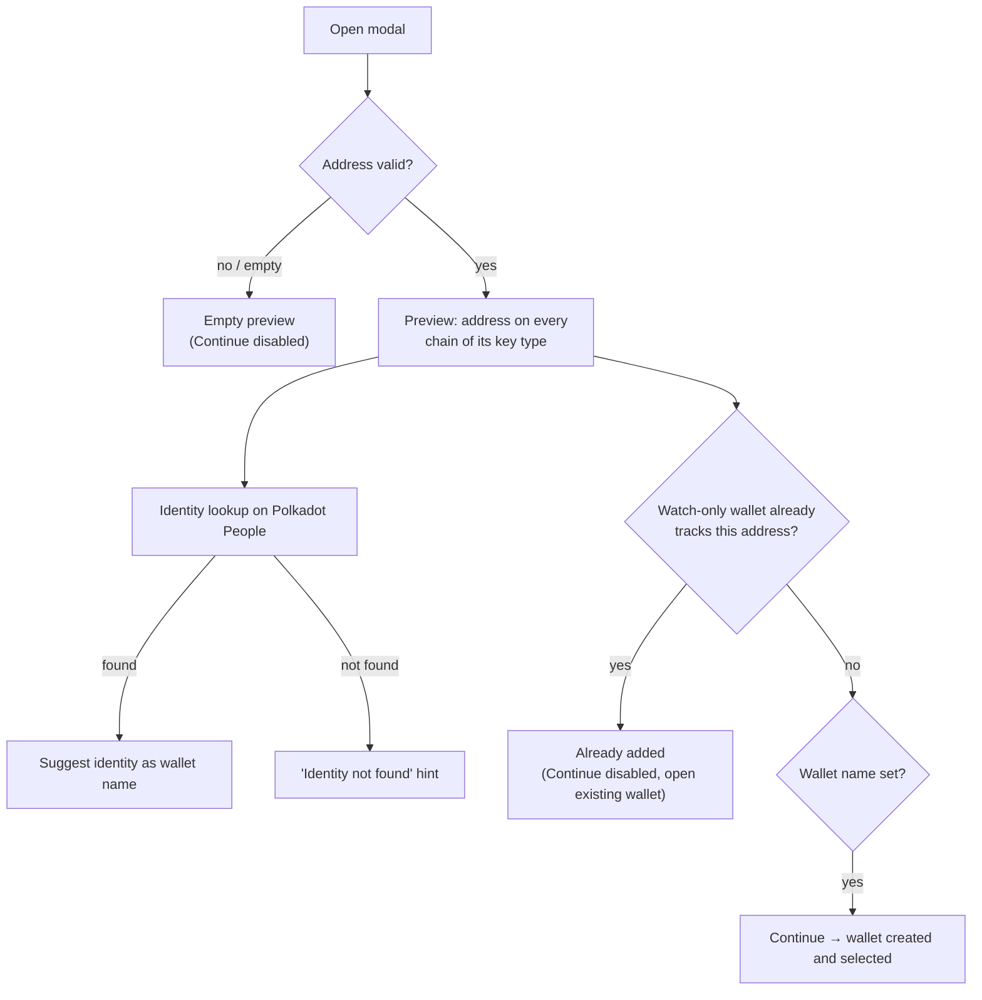

# Watch-Only Wallet Pairing

> Part of the [Feature Map](../README.md) — Last reviewed: 2026-08-28
>
> **Draft — pending author review.** Written from reading the code; needs sign-off from the feature owner before it is
> treated as the source of product truth.

## Overview

Adds a watch-only wallet from a single address typed (or pasted) by the user. The address is validated as you type, the
matching chains are previewed alongside, an on-chain identity is looked up to suggest a wallet name, and on Continue a
wallet with one universal watch-only account is created and selected. Nothing is signed — the wallet only tracks
balances and activity for that address.

## Who can use it / when it applies

Always available. Two entry points open the same modal:

- the onboarding welcome screen (first wallet in the app), and
- the "add wallet" dropdown available once at least one wallet exists.

## States / scenarios

| State               | When it appears                                                            | What the user sees                                                                                                                                                                               |
| ------------------- | -------------------------------------------------------------------------- | ------------------------------------------------------------------------------------------------------------------------------------------------------------------------------------------------ |
| **Empty**           | Address field is empty or does not parse as a Substrate / Ethereum address | Placeholder panel on the right; an error hint under the address once it has been edited; Continue disabled                                                                                       |
| **Preview**         | A valid address is entered                                                 | Identicon in the address field; the right panel lists the address on every chain matching its key type (Substrate chains for SS58 addresses, EVM chains for H160 ones)                           |
| **Identity lookup** | Every time the address becomes valid                                       | A spinner under the name field, then either a one-click chip with the on-chain identity name to fill the wallet name, or an "identity not found, use a custom name" hint                         |
| **Name validation** | Name is blank or longer than 256 characters                                | Inline error; Continue disabled                                                                                                                                                                  |
| **Already added**   | A watch-only wallet already contains an account with this address          | A warning naming the existing wallet above the address field; Continue is disabled; "Open existing wallet" selects that wallet and closes the modal (offered only when the wallet is not hidden) |

**Why "Already added" only counts watch-only wallets.** A second watch-only wallet on the same address would be a pure
duplicate. A signing wallet (Polkadot Vault, Ledger, WalletConnect, …) holding the same address is a different kind of
wallet, so it does not block: a user may legitimately want a read-only view next to a signing one. Symmetrically, the
Vault pairing flow ignores watch-only wallets when checking for duplicates.

## Lifecycle

1. User opens the modal from onboarding or the "add wallet" dropdown.
2. Typing a valid address renders the chain preview and fires the identity lookup; the user picks the suggested name or
   types their own.
3. Continue submits the form; it is accepted only when both fields are valid and no watch-only wallet already tracks the
   address.
4. The wallet and its single universal account are created, the new wallet becomes the active one, and the modal closes.
5. Closing the modal by any route (Back, ✕, success) resets the form.

## Related

- [`watch-only-wallet`](../watch-only-wallet/README.md) owns how the resulting wallet behaves once created.
- [`polkadot-vault-wallet-pairing`](../polkadot-vault-wallet-pairing/README.md) applies the same "already added" pattern
  for Vault devices; the two checks deliberately do not see each other's wallet types.
- Identity names are resolved on the Polkadot People chain regardless of which chains the address is previewed on.
