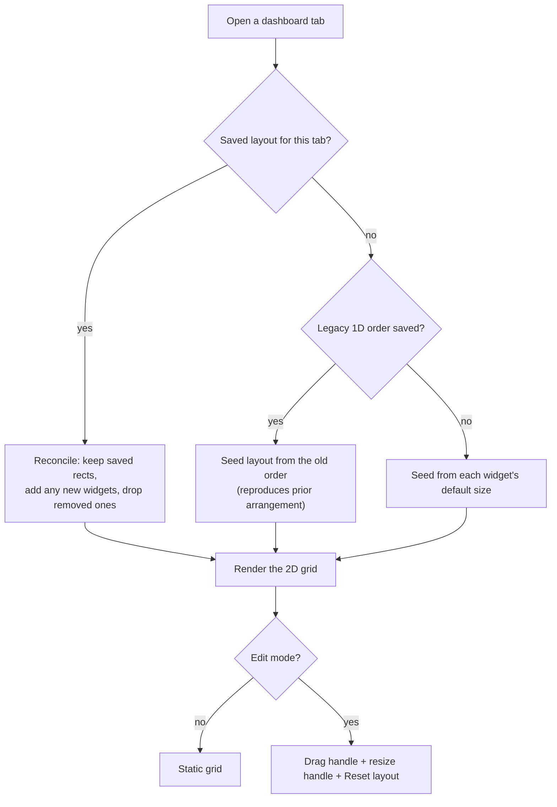

# Dashboard Widget Layout

> Scope: this spec covers the **widget layout & edit experience** of the dashboard —
> how widgets are placed, arranged, resized, and persisted. It does not cover the
> individual widgets' own behaviour (portfolio, staking, governance, operations
> queue), the account-preset selection, or the tab structure beyond how they relate
> to layout.

## Overview

Each dashboard tab (Overview, Staking, Governance) shows a set of widgets on a
**4-column grid**. In **edit mode** the user can drag widgets to new positions and
resize them on both axes; the layout is a **free 2D mesh** — a widget keeps the
column it is placed in — kept tidy by **vertical compaction** (widgets float up so
there are never vertical gaps). Each tab's arrangement is saved per browser and
restored on the next visit.

Widgets declare a **default size** and a **minimum size**; the grid uses these to
place new widgets and to bound resizing. Size is owned by the layout, not by the
widget — the same widget can be made larger or smaller by the user.

## Who / when

- Anyone using the dashboard. Layout is read-only until **edit mode** is toggled
  from the dashboard header (the pencil button).
- Editing affordances (drag handle, resize handle, reset) appear **only in edit
  mode**; outside it the grid is static.
- Requires at least one selected account for widgets to render (otherwise the tab
  shows its empty state).

## Model

A widget occupies a rectangle `{ x, y, w, h }` in grid units:

- `x` / `w` — column (0–3) and column span (1–4); `x + w` never exceeds 4.
- `y` / `h` — row and row span; each row is a fixed height. Content taller than the
  assigned height **scrolls inside** the widget.

Layout is stored per tab, per widget. Drag and resize update the moved/resized
widget, then **collisions are resolved** (overlapped widgets are pushed down) and the
whole tab is **vertically compacted**.

## States / scenarios

| Action | Trigger | Result |
| --- | --- | --- |
| **Move** | Drag a widget (by its handle) onto another's cell | The widget adopts that position (clamped to the grid); others are pushed down and the tab compacts upward |
| **Resize** | Drag the bottom-right handle | The widget grows/shrinks in column + row units, clamped to its minimum size and the grid edge; the change commits once on release |
| **Reset** | "Reset layout" button (edit mode) | The active tab returns to every widget's default size and position |
| **New widget appears** | A widget becomes available (e.g. a feature flag turns on) | It is placed at the bottom of the tab; existing widgets keep their positions |
| **Widget removed** | A widget becomes unavailable | Its rect is dropped; remaining widgets compact up |

## Lifecycle

1. On opening a tab, the saved layout (if any) is **reconciled** against the widgets
   currently available: known widgets keep their rects, newly-available widgets are
   placed, and rects for widgets that disappeared are removed.
2. First-time users (or a tab never arranged) are **migrated** from the old 1D widget
   order if present, otherwise seeded from default sizes — in both cases laid out
   left-to-right then compacted, matching the previous look.
3. Edits (move, resize, reset) update the stored layout, which **persists locally**
   and syncs across windows.

## Related

- **Widget injection** — each widget is injected into a tab's slot and declares its
  `defaultSize` / `minSize` there; the grid reads these to size and place it.
- **Account presets / selection** — drive which accounts the widgets show; unrelated
  to placement, but a tab with no selected accounts renders its empty state instead
  of the grid.
